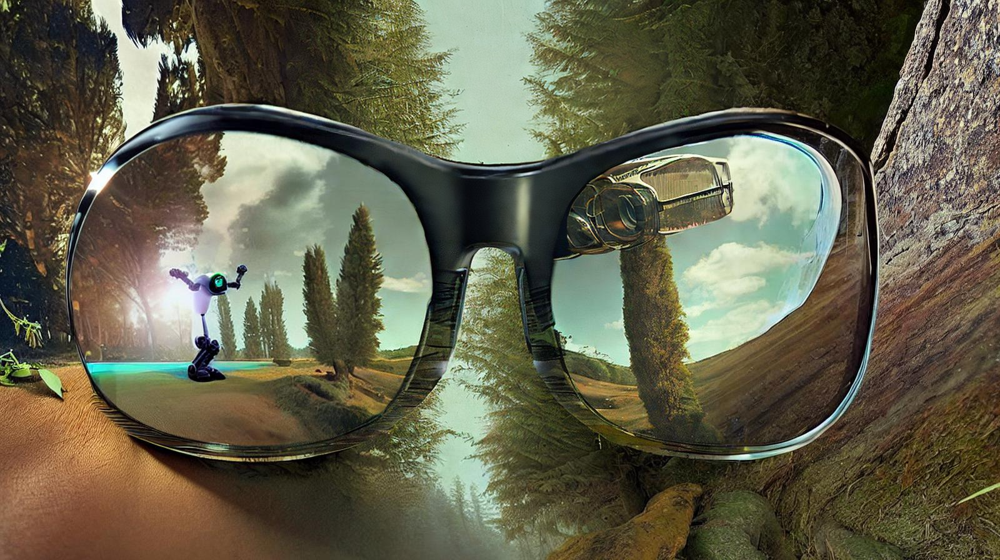

Since no one asked, I wanted to share some things I see coming this year. Some of these will be important to society broadly and some of these will be important to just me.

The most powerful ML systems released in 2023 will hopefully follow the path of the ChatGPT release. OpenAI did a lot of under-acknowledged work to mitigate reputational risk: they made it extremely challenging for the average user to generate harmful content. There are viral Twitter threads about \"jailbreaking\" ChatGPT, but they did an outstanding job on system engineering (I suspect very likely beyond [documented red teaming techniques](https://arxiv.org/abs/2209.07858)). This release was the exception, not the rule. The lack of negative press from harmful model outputs resulted in a compounding positive impression of its magic across popular culture. Hence, the biggest ML announcement maybe, ever?

I don\'t expect this trend to continue. As these systems move from toys to tools they\'ll begin shifting existing power structures. Companies used to rely on humans to generate text, now it\'s an ML model with poorly-measured biases. The conversations happening on hidden middle layers of the internet will increasingly be written by bots. These will be things that people often don\'t look closely at like chatbots for companies, news briefs, product reviews, etc. The human brain is incredibly flexible though, and this information will still be ingested.

These consumers primarily do not have training in computer science, and, more importantly, they do not have training in reasoning about the potential limitations of complex computational systems. Most researchers in the field also do not have this training. People are building super powerful tools without much speculation on how it impacts society because there is an extreme financial incentive for the first to market.

Before ML research includes broader stakeholders, people will start to catch onto how these AI models are influencing large portions of thought. One team won\'t be happy that primarily engineers on the other team made the tool. My biggest prediction for 2023 is that **AI systems are going to start entering the culture wars**. I don\'t expect this to be in the discussions we\'re seeing around social media platforms, but researchers starting to be the canaries in the coal mines. 2023 will be the point people point back to and say, *this is where it all started*.

------------------------------------------------------------------------

### My predictions

**I use my first self-driving ride**

I\'m actually really excited about this one. These things are here and are getting better, but the Tesla confounder and how long it took them to get here make people skeptical. Like most things, this technology will roll out in wealthy areas first, like San Francisco, but it is a breakthrough moment.

Your first truly autonomous vehicle ride is about as transformative as your first iPhone, so this deserves to be first.

In 2024, I suspect this same experience will come to a lot of other urban centers like Boston and New York. Predicting when they\'re competitive businesses and not just a novelty, yeesh, but in 2026 I say Uber starts to feel the pressure in SF.[1](#footnote-1){#footnote-anchor-1 .footnote-anchor component-name="FootnoteAnchorToDOM" target="_self"}

**Generative 3D AI is coming**

When building [🎢 Simulate](https://github.com/huggingface/simulate), the biggest goal we had was to enable ML agents with an AI-generated world. Unfortunately, we were a couple of breakthroughs away from realizing that. Though, my friends at [Common Sense Machines](https://csm.ai/) are taking a different approach to [3D-generated assets](https://csm.ai/commonsim-1-generating-3d-worlds/) and making huge progress. By the end of 2023, you\'ll be able to make compelling 3D assets and worlds with **text-to-world**. The biggest implication of this is going to be early proof of concept in video games and the metaverse.

The other 3D that everyone knew is coming is video. Runway.ml already has nearly a full suite of ML-first video editing tools. I bet they launch a clip-generation tool next year. The training problems and use cases are much more grandiose for **text-to-video**, but they\'re one step closer to the magic that I love technology for. It\'s the first step towards "*Hey Netflix, generate me a soap opera in the world of Lord of the Rings"*.

**GPT4 is less impactful than ChatGPT**

This is due to how influence and shock are derived from the delta in expectations versus reality. The GPT4 changes will hit researchers more than the general public. I expect them to have a moderately different architecture or a system that many people didn\'t expect to work (like a model with a [mixture of experts](https://ai.googleblog.com/2022/11/mixture-of-experts-with-expert-choice.html)) and some shocking improvements in new areas of text generation. Some things the model does will be extraordinary, but I don\'t think it\'ll be fast enough to run the ChatGPT interface.

This prediction is collating a meta-prediction for me about 2023: *ML wins of this year will be about the user interface, system engineering, and product, rather than research*. The research will continue to go at an astonishing rate, leaving some very interesting open opportunities in between these frontiers.

**RLHF best practices emerge**

Reinforcement learning from human feedback (RLHF) is a hot topic these days, but the initial building blocks people need to train with RLHF are not widely available. It is understood that to use RLHF effectively, one needs to start with a) an effective dialogue model for generating text and b) a detailed annotation dataset on the order of 10k samples. Right now, there are no great open-source alternatives for both of these. People hypothesize that instruction-tuned models like [T5](https://ai.googleblog.com/2020/02/exploring-transfer-learning-with-t5.html) or prompt datasets like [T0](https://huggingface.co/bigscience/T0pp) (funny namings) are places to start, but they don\'t seem good enough to do it out of the box. Anthropic, OpenAI, and DeepMind all do something different behind the scenes.

In 3-6 months, people will release new models or datasets and all of this will begin to change. This year, the best practices of RLHF will emerge. Things like PPO as an optimizer has only been made popular by OpenAI / ex-OpenAI people at Anthropic, which is extremely narrow and the tricks to do so have not been changed. New types of RL algorithms and communities will emerge to create a modus operandi for training RLHF models. There are rumors that DeepMind is doing this already with a new algorithm [Museli](https://arxiv.org/abs/2104.06159). Some of us in the open-source community are going to try and re-implement it, let us know if you are seriously interested in contributing.

**Deep RL continues quiet successes**

This year in RL was the year of the quadruped. It\'s at the point where large-scale RL pre-training in simulation should work for a quadruped. The systems rely on machine learning models to rapidly learn the differences between sim and real (among other things). The breakthrough of it was that there was an entirely new *vertical of applications* dominated by RL-first methods. Then came the RLHF craze with ChatGPT, and RL really had a great year!

The normal RL successes for years have been things like RL solved blank, where blank is a niche problem like one board game or one specific scientific application. These projects use tons of person-power to push the limits on one task. They prove that RL is useful, but maybe not *widely* useful. The quadruped revolution where one type of problem is solved with many different RL solutions is extremely promising for me!

In the next year, I see RL quietly dominating some other vertical. I\'m ready to continue my list from quadrupeds, RLHF, and \...?

*Note: I was planning on writing a blog post on RL progression for quadrupeds, and collated a lot of resources on* *[Twitter](https://twitter.com/natolambert/status/1592585709126569984). Let me know if you think I should write that post.*

**Diffusion models expand into a lot of ML**

Machine learning conferences release these memo\'s where they say what the most popular keywords were in all the papers; here is an example from [ICLR 2021](https://twitter.com/chrmanning/status/1332725903470706688?ref_src=twsrc%5Etfw%7Ctwcamp%5Etweetembed%7Ctwterm%5E1332725903470706688%7Ctwgr%5E359b710e8efcc06f695d01631827e6f276701307%7Ctwcon%5Es1_&ref_url=https%3A%2F%2Fwww.redditmedia.com%2Fmediaembed%2Fk2z6fz%3Fresponsive%3Dtrueis_nightmode%3Dfalse). Historically, these have been dominated by the likes of RL and graphs because the fields always use these keywords and the surrounding areas are quite popular (where language processing or vision papers may write about a sub-problem in their field). I\'m excited to see diffusion models move outside of just images and show up in all sorts of ML problems.

Diffusion models are a really fun area to study because of their links to thermodynamics and differential equations. It\'ll bring a different type of generative model to many subfields of ML and it\'ll cement itself as a top buzzwordy subfield of ML. I don\'t know if you all actually cared about this, but I think it\'s a notable development. It\'s rare that new tools in ML become this popular *and broadly useful*.

**More high-profile scientists stop submitting to conferences**

We are at the point where the most popular ML tools are not even going to have papers about them within \~6 months of release. Double this with the fact that reproducing a paper can take 6 months *with a paper*, we are entering a new phase of ML development. First-principled research still works, but rewards focus and long-term investment. Other open-source organizations are using the approach of giving compute to an army of hackers and following the path of shortest resistance to reproducing a system.

Both of these approaches are not really well suited to conference cycles for different reasons. Given the fact that some people are so over the hoop jumping to get an acceptance, ML conferences will start to see a decoupling of growth-rate relative to field size. This is mostly a second derivative change in my mind, so it\'ll be hard to quantify.

Wondering where I am in this? I\'ve partially removed myself from reviewing. I review a set number of papers per paper I submit to a conference/workshop/journal with a small baseline number I do each year. I want to create my success and validation by releasing tools that are easy to use and build on, rather than playing status games.

------------------------------------------------------------------------

### Plans for D.A. in 2023

This year, I\'ll try and channel my thoughts a bit more toward timely topics. My job at HuggingFace encourages me to participate in these types of discussions, which makes setting the time aside much easier. If you have anything you think I missed, you should reach out in whichever medium is best for you.

I\'ll aim for 20-25 articles in 2023, one every 1-3 weeks, with no set day, and no set time. I need the flexibility to do higher-quality work.

:::: {.footnote component-name="FootnoteToDOM"}
[1](#footnote-anchor-1){#footnote-1 .footnote-number contenteditable="false" target="_self"}

::: footnote-content
Tesla doesn\'t count, don\'t get in those because it is unclear if they are safe.
:::
::::
