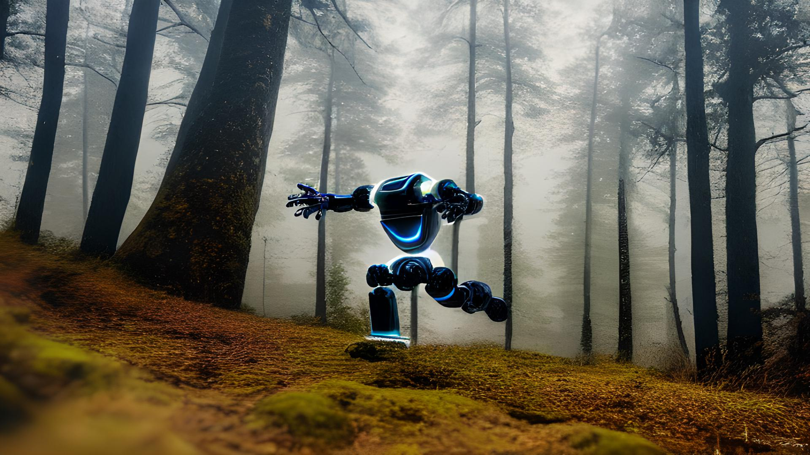
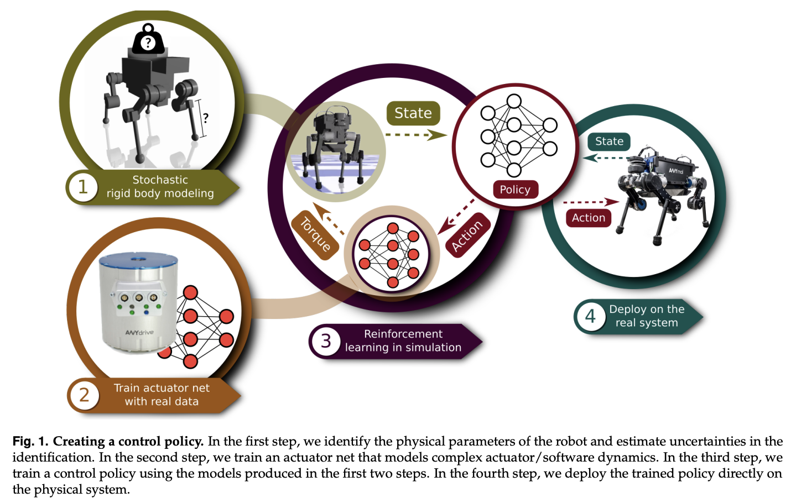
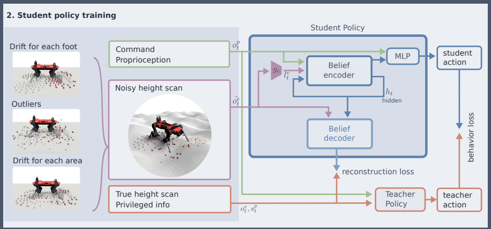
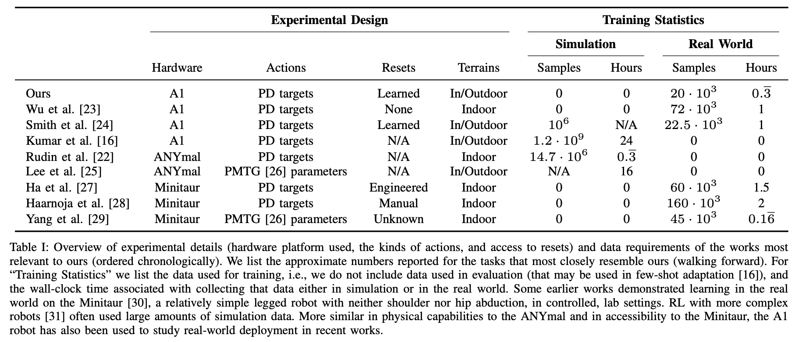

Reinforcement learning (RL) practitioners have always had a complicated discourse around the community's own notion of success. There seems to be never-ending Tweet threads and blog posts saying that RL research and practice need to wake up. Most of them, my own included, really are pretty lukewarm takes. Reinforcement learning is fine, it's not perfect, but it's not the next Titanic.

This article's goal is to try and shift the narrative around what success is in RL: how we don't need to be talking about AGI, how RL can be used to solve specific problems like robotic locomotion, and how we should react to future examples of RL's success.

The most compelling metric of success for a tool from an engineering perspective is taking over verticals. In cutting-edge technology, people will really only use tools that work \-- it\'s not worth wasting time when you\'re trying to make something work in the real world. Pretraining in simulation with reinforcement learning is taking over how quadrupedal robots walk around the world. It's the first *vertical* in the cap of RL.

------------------------------------------------------------------------

I talk about verticals a good amount on my blog, but I don't think I have defined it. A *vertical* is a specific application area. This is in contrast to horizontal efforts, like making one language model that is good at every task. Examples of verticals in ML could be a company that only does similar robotic grasping tasks or trains all of their models specifically to correct grammar.

As machine learning becomes increasingly product-driven, this notion of verticals will likely be more common. It can be an era where application-focused research serves as a bridge from the academic world to the user. I didn\'t really expect that this would happen in robotics so soon, but here we are.

Since its conception, RL has always been described as a *framework*. This is why I like studying it! The problem is, for a technology to be proven economically valuable, it probably needs to be used as a tool. Tools solve specific problems, not every problem. I am asking myself to let part of my intellectual dreams die --- that RL can be used as an open-ended framework on many problems --- in order to see it exist as a proven and worthwhile technology. Robotic locomotion and [reinforcement learning from human feedback](https://huggingface.co/blog/rlhf) (RLHF), have been significant steps towards RL being an accepted member of ML workflows. [1](#footnote-1){#footnote-anchor-1 .footnote-anchor component-name="FootnoteAnchorToDOM" target="_self"}

------------------------------------------------------------------------

**Aside: verticals, tools, and AGI**

I couldn't help but connect this conversation to the idea that RL is AGI.

AGI in common culture has always had a very different meaning than AGI to alignment researchers. To most people, an AGI is a program that can do everything or most things beyond the human level. In the alignment world, that is only the agent half of AGI. There is a subset of AGI that is referred to as tool AGI, to which my notions of success and development are closely linked to.

Mostly, it is interesting that as RL becomes more useful, it is becoming less of a framework and less directly linked to common notions of AGI. This makes sense to me because as something like AGI becomes more real, its form will be more specific. Take on the other hand large language models (LLMs), which are often touted as an important piece of the AGI puzzle, where their scope needs to be broadened in order to fulfill common notions of AGI.

------------------------------------------------------------------------

## The story of RL and quadrupedal locomotion

Let me walk you through the recent history of this field. I decided to start with this paper from 2019 because it was the first one that reinforcement learning was the primary contributor to success. The key missing factor was unlocking the optimization power of RL. *Note: I originally collated this version with a Twitter cliff-notes* *[version](https://twitter.com/natolambert/status/1592585709126569984)* / discussion.

**Jan. 2019** - *[Learning agile and dynamic motor skills for legged robots](https://arxiv.org/abs/1901.08652),* \[[video](https://www.youtube.com/watch?v=aTDkYFZFWug&t=155s)\]

This was the first major paper with [ANYmal](https://www.anybotics.com/anymal-autonomous-legged-robot/)[2](#footnote-2){#footnote-anchor-2 .footnote-anchor component-name="FootnoteAnchorToDOM" target="_self"} and reinforcement learning.

:::::::: {#youtube2-aTDkYFZFWug .youtube-wrap attrs="{\"videoId\":\"aTDkYFZFWug\",\"startTime\":\"9\",\"endTime\":null}" component-name="Youtube2ToDOM"}
::::::: youtube-inner
:::::: iframe
::: {#player}
:::

:::: player-unavailable
# An error occurred. {#an-error-occurred. .message}

::: submessage
[Try watching this video on www.youtube.com](https://www.youtube.com/watch?v=aTDkYFZFWug){target="_blank"}, or enable JavaScript if it is disabled in your browser.
:::
::::
::::::
:::::::
::::::::

The paper at its heart is a robotics paper. It is about the deep integration of systems knowledge, engineering principles, and a little bit of deep learning magic dust. Figure 1 (below) from their paper shows the high-level framework that all the papers are derived. Some papers change the robot, the algorithm, and other modules, but the core idea remains: use reinforcement learning in a diverse simulator to get a policy that works in the real world.

A common theme of these papers is how to use deep learning to learn the aspects of the real world that are too difficult to model by hand and integrate into simulators. Here, the authors start with a supervised model of the actuators. In future papers, you\'ll see much more complex systems (not that I detail all of them).

Just a few years later, a large part of the same team[3](#footnote-3){#footnote-anchor-3 .footnote-anchor component-name="FootnoteAnchorToDOM" target="_self"} had made an astounding amount of progress. The line of research generally proceeded in advancing these key areas: robustness, ability to adapt to the real world, and decreasing reliance on advanced engineering system knowledge.

------------------------------------------------------------------------

**Aside: hardware co-development**

I've heard mumblings that some roboticists are not as impressed by these works. I have a theory about the intersection of progress between the ML side and the hardware side, but only insiders can substantiate it.

The advancements in the work from Hutter et al. (these two papers, and more listed below) is likely largely in part due to RL advancements, but it should be noted that the researchers are also directly involved in the development of ANYmal.[4](#footnote-4){#footnote-anchor-4 .footnote-anchor component-name="FootnoteAnchorToDOM" target="_self"} It is likely that the robot has also been improved on the hardware side in order to mitigate some of the learning problems. As the field of quadrupedal locomotion grew, this lab in Zurich is the only one with direct ties to hardware development as well. In the future, this can be extremely important like any comment on the synergies between hardware and software in technology. Boston Dynamics is a prime candidate to enter this area, starting with an apparent advantage on the hardware side.

------------------------------------------------------------------------

**Jan. 2022** - *[Learning robust perceptive locomotion for quadrupedal robots in the wild](https://arxiv.org/abs/2201.08117)*

This is the one with the wild [video](https://www.youtube.com/watch?v=zXbb6KQ0xV8&t=204s) of the robot going for a hike in the Alps. One of many innovations in this paper added is an attention-based encoder that takes in proprioceptive measurements (legs, motors, etc.) and exteroceptive measurements (lidar, depths, etc.) to enable extremely robust real-world operation. In previous works, these types of measurement were separated, which creates complex interactions between multiple learned components (a problem I\'m too familiar with from my training in model-based RL).

:::::::: {#youtube2-zXbb6KQ0xV8 .youtube-wrap attrs="{\"videoId\":\"zXbb6KQ0xV8\",\"startTime\":null,\"endTime\":null}" component-name="Youtube2ToDOM"}
::::::: youtube-inner
:::::: iframe
::: {#player}
:::

:::: player-unavailable
# An error occurred. {#an-error-occurred. .message}

::: submessage
[Try watching this video on www.youtube.com](https://www.youtube.com/watch?v=zXbb6KQ0xV8){target="_blank"}, or enable JavaScript if it is disabled in your browser.
:::
::::
::::::
:::::::
::::::::

One of the things this paper does a good job explaining is how progress is made on the sim2real transfer component. To address the ever-present question of *how do you successfully craft a policy that works in a clairvoyant simulator to one of the partially-observable real world*, the paper uses techniques from generative modeling to have the student policy (partial information) reconstruct states that are close to the ground truth world where the teacher operates. Figure 5 from the paper shows us just that.

Just a year later, there were already multiple works translating these techniques to the real world. I chose the next one mostly because they have a nice review table, which sets me up for the last part of this section.

**Aug. 2022** - *[A Walk in the Park: Learning to Walk in 20 Minutes With Model-Free Reinforcement Learning](https://arxiv.org/abs/2208.07860)* \[[video](https://www.youtube.com/watch?v=YO1USfn6sHY)\]

Here the authors used a carefully tuned soft actor-critic algorithm in a highly-specific search space to enable the robot to learn in the real world in only 20 minutes. The authors did a lot of work to understand the robot and the environment, so the space of actions that can be taken by the RL algorithm is much safer. This safety of actions lets the robot learn on its own in the real world.

This paper includes a wonderful table comparing recent advancements, which I break down below (if I haven\'t already mentioned them above):

Here\'s the TLDR of each of the new papers mentioned, along with a video of training and/or evaluation.

-   Jun. 2022 - *[Daydreamer: World models for physical robot learning](https://arxiv.org/abs/2206.14176)*: Uses a version of Dreamer to learn in the real world. \[[video](https://www.youtube.com/watch?v=xAXvfVTgqr0)\]

-   Oct. 2021 - *[Legged robots that keep on learning: Fine-tuning locomotion policies in the real world](https://arxiv.org/abs/2110.05457)*: Showcase how to fine-tune locomotion policies learned in simulation in the real world. \[[video](https://www.youtube.com/watch?v=1EUQD7nYfLM)\]

-   Sep. 2021 - *[Learning to walk in minutes using massively parallel deep reinforcement learning](https://arxiv.org/abs/2109.11978)*: this is highlighted in [Marco\'s talk](https://www.youtube.com/watch?v=abdLIFOzdRo) where he has a robot learning in real-time during it. This really showcases how far RL infrastructure and usefulness have come. \[[video](https://www.youtube.com/watch?v=8sO7VS3q8d0&t=1s)\]

-   July 2021 - *[RMA: Rapid motor adaptation for legged robots](https://arxiv.org/abs/2107.04034):* Presents a modified RL algorithm with a policy and an adaptation module for real-world learning. \[[video](https://www.youtube.com/watch?v=nBy1piJrq1A&t=113s)\]

-   Oct. 2020 - *[Learning Quadrupedal Locomotion over Challenging Terrain](https://arxiv.org/abs/2010.11251)*: expanded on the robustness of their original work in 2019 and scales up the RL component. \[[video](https://www.youtube.com/watch?v=9j2a1oAHDL8)\]

-   Feb 2020 - *[Learning to Walk in the Real World with Minimal Human Effort](https://arxiv.org/abs/2002.08550)*: iterates on the safety of the policies to enable better real-world & automatic data collection for these systems. \[[video](https://www.youtube.com/watch?v=cwyiq6dCgOc)\]

-   July 2019 - *[Data Efficient Reinforcement Learning for Legged Robots](https://arxiv.org/abs/1907.03613)*: one of the only papers that used a model-based approach similarly to get safe data collection. I\'m sad this hasn\'t proliferated, but it is just so much slower to collect data in simulation. \[[video](https://youtu.be/oB9IXKmdGhc)\]

-   Dec 2018 - *[Learning to Walk via Deep Reinforcement Learning](https://arxiv.org/abs/1812.11103)*: ahead of its time \-- somehow fiddles with SAC in 2018 to get walking behavior to emerge in the lab. \[[video](https://www.youtube.com/watch?v=FmMPHL3TcrE&t=1s)\]

Take a second to **pause** here if you can. From *Learning to Walk\...*, take some time to watch a few of these videos. Watching one video per year, you can see how the movements go from forced to fluid and the experiments go from indoors to out. With this progress, it is easy to see how 2023 and 2024 will make quadrupedal navigation seem like a solved problem.

Okay, back to scheduled programming for the most recent breakthrough paper I found.

**Nov. 2022** - *[Legged Locomotion in Challenging Terrains using Egocentric Vision](https://arxiv.org/abs/2211.07638)* \[[video](https://www.youtube.com/watch?v=5sRqythe6TE)\]

This paper removed the use of elevation maps/foothold planning phases and went full end-to-end learning. This is really a stark transition of the bitter lesson: more simulated data let the authors remove hand-engineered pieces of the original engineering stack.

:::::::: {#youtube2-5sRqythe6TE .youtube-wrap attrs="{\"videoId\":\"5sRqythe6TE\",\"startTime\":null,\"endTime\":null}" component-name="Youtube2ToDOM"}
::::::: youtube-inner
:::::: iframe
::: {#player}
:::

:::: player-unavailable
# An error occurred. {#an-error-occurred. .message}

::: submessage
[Try watching this video on www.youtube.com](https://www.youtube.com/watch?v=5sRqythe6TE){target="_blank"}, or enable JavaScript if it is disabled in your browser.
:::
::::
::::::
:::::::
::::::::

It\'s wonderful to me seeing RL work so closely in a development loop that other areas of deep learning have seen regularly: scale, let the model act end-to-end, and get the best quality data.

It\'s important to remember that the origin of this work is in a robotics-focused lab. Most roboticists have a healthy skepticism of RL because it has never been proven. For example, Joonho Lee, an author of the first two papers I discussed above, responded on [Twitter](https://twitter.com/junja941/status/1593125897321660416) in a very fitting way \"I'm not a huge fan of RL, but the robustness we can gain from such a model-free method was incredible.\"

It\'ll be great to see how this trend continues for RL, gaining a bigger foothold of areas where it is the dominant tool.

The last question: **why did this emerge in quadrupeds and not other robotic platforms?** I have a couple theories on this, but the people who figure it out in depth have a huge opportunity ahead of them.

I think that quadrupeds happen to be a robot that\
a) has a large scope of impact (motivation),\
b) a stable platform for data collection (safe experimentation) and\
c) relatively model-able physics (to create the simulations).\
\
If these conditions are met elsewhere, will we see the same result?

## Re-defining success in the RL community

People really miss the boat when trying to keep track of questions like a) is RL as a field progressing with technical knowledge (yes) and b) what are the right examples to argue that RL is a worthwhile endeavor (no, not AlphaGo).

Every technology and tool that we take for granted as a total breakthrough is validated by multiple teams independently building or using similar techniques. Some examples that come to mind are the Transformer, LSTM, contrastive learning, etc. These sorts of successes are too big of targets to compare reinforcement learning to. Instead of saying that RL will be the core tool for all robotics, we need to see specific problems where it is repeatedly and independently successful. That's the start of a new type of success for RL.

Folks need to stop pointing to DeepMind as a reason that RL is working in the real world. There is no proof that other deep learning, or conventional engineering, techniques would not be just as successful for most of DeepMind\'s real-world breakthroughs. When was the last time 20 C.S. Ph.D.s tried to design an HVAC tool with anything other than Deep RL? No one wants to run the counterfactuals against DeepMind, for obvious financial reasons.

How does this relate to AlphaEtc? I see these highly specific, closed environment / scientific breakthroughs kind of being in their own bucket. They showcase that when you have the right problem, versions of deep RL can really solve open-ended problems. This makes it seem like RL is a useful tool when you have grand problems to solve, which is interesting, but I see them very rarely appearing in the real world.[5](#footnote-5){#footnote-anchor-5 .footnote-anchor component-name="FootnoteAnchorToDOM" target="_self"}

Does anyone at DeepMind have time to discuss the economics of this and some of the vision for where huge deep RL projects will fit into the long tail of economic progression? For a few years, I was interested in the idea that other companies can replicate the DeepMind model, but this is seemingly very little incentive (or else it would've happened already).

To end my rant, I'm stoked that DeepMind does some of the coolest work again, but I'm sad it's so hard to contextualize it!

### Next steps

Independent reproduction has always been the highest form of flattery in academia. For engineering in practice, independent reproductions are the indicators that show a method is a practical balance of cost and performance.

We are starting to get proof cases of this --- places where RL creates real economic value, which will add it to the list of ML technologies that can survive another AI winter.

It's important for the field of RL to tout the right wins as its core successes. A method that can train a robot to walk on one person's laptop, [while he is giving a talk](https://www.youtube.com/watch?v=abdLIFOzdRo), is way more important than a team with infinite money solving another video game. One of my goals going forward is to change some of the dialogue around reinforcement learning to make average people in ML more calibrated about the state of RL.

*Thanks to [Eugene Vinitsky](https://twitter.com/EugeneVinitsky) for helping me fine-tune an advanced copy of this post.*

:::: {.footnote component-name="FootnoteToDOM"}
[1](#footnote-anchor-1){#footnote-1 .footnote-number contenteditable="false" target="_self"}

::: footnote-content
[DreamerV3](https://twitter.com/danijarh/status/1613161946223677441) is a total magical breakthrough for RL, and one that I think would be a good centerpiece of a future blog post. It has the chance to revert community attention back to RL as a generalist tool in the toolbox.
:::
::::

:::: {.footnote component-name="FootnoteToDOM"}
[2](#footnote-anchor-2){#footnote-2 .footnote-number contenteditable="false" target="_self"}

::: footnote-content
ANYmal is made by the company ANYbotics, also co-founded by one of the professors leading this direction, Marco Hutter.
:::
::::

:::: {.footnote component-name="FootnoteToDOM"}
[3](#footnote-anchor-3){#footnote-3 .footnote-number contenteditable="false" target="_self"}

::: footnote-content
Hwangbo, Lee, Koltun, and Hutter are all on both papers.
:::
::::

:::: {.footnote component-name="FootnoteToDOM"}
[4](#footnote-anchor-4){#footnote-4 .footnote-number contenteditable="false" target="_self"}

::: footnote-content
I'm not sure at all if the other researchers work with [Unitree](https://m.unitree.com/) or [Ghost Robotics](https://www.ghostrobotics.io/).
:::
::::

:::: {.footnote component-name="FootnoteToDOM"}
[5](#footnote-anchor-5){#footnote-5 .footnote-number contenteditable="false" target="_self"}

::: footnote-content
I would love to see AlphaClimate for climate change (building off other [DeepMind work](https://arxiv.org/abs/2212.12794)), but I don't know if these methods would even scale to this! The trade-offs between expense, lack of interpretability, and more conflict from a decision-making point of view.
:::
::::
