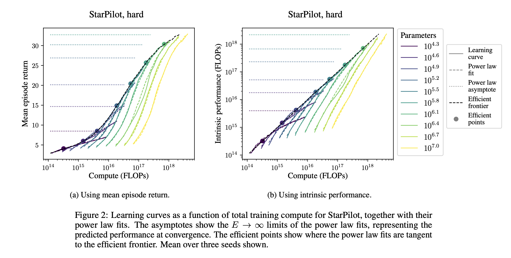

*Elsewhere from me:*

-   *Co-authored another blog post on dialog agents: [What Makes a Dialog Agent Useful](https://huggingface.co/blog/dialog-agents)?*

-   *Getting more involved in [Farama Foundation](https://farama.org/) as a technical adviser to build out open-source tools that solve the problems laid out in this article.*

------------------------------------------------------------------------

🚨 *New paper update* 🚨 *About 30minutes after publishing, I was alerted to this new paper: [Scaling Laws for Single-Agent Reinforcement Learning](https://arxiv.org/abs/2301.13442). It literally became available just hours before I posted; wild. I'll comment more soon, but this edited abstract & figure does a good job summarizing it:*

> In generative modeling, cross-entropy loss improves smoothly with model size and training compute, following a power law plus constant scaling law...We introduce *intrinsic performance*, a monotonic function of the return defined as the minimum compute required to achieve the given return across a family of models of different sizes. We find that, across a range of environments, intrinsic performance scales as a power law in model size and environment interactions. Consequently, as in generative modeling, the optimal model size scales as a power law in the training compute budget.
>
> 

*Ultimately, you'll see in this post how scaling RL in a single environment isn't that important to me, this paper mostly fits into that. Though, the environment they use (ProcGen) is much more of a complex exploration problem, so it's promising.*

------------------------------------------------------------------------

I\'ve been waiting for a while to see scaling laws come to fields related to reinforcement learning (RL). Once they started proving insightful and useful, it would encourage change in research dynamics in ways that can hopefully unlock unexpected behaviors and sustained success. In one of my recent [articles](https://robotic.substack.com/p/ml-moats), I talked about how emergent capabilities can be a moat for machine learning companies.

Here I lay out how RL can hopefully unlock some of those [emergent capabilities](https://arxiv.org/abs/2206.07682).

The three papers that motivated me to write this post are [Robotics Transformer (RT1)](https://ai.googleblog.com/2022/12/rt-1-robotics-transformer-for-real.html), [DreamerV3](https://danijar.com/project/dreamerv3/), and [Adaptive Agent (AdA a.k.a XLand 2-ish)](https://sites.google.com/view/adaptive-agent/)[1](#footnote-1){#footnote-anchor-1 .footnote-anchor component-name="FootnoteAnchorToDOM" target="_self"}.

To complement these, I [asked on Twitter](https://twitter.com/natolambert/status/1617584067012329473) what was happening in the space of scaling, robotics, and RL hoping to find a bunch of hidden gems and write a kick-ass article on how, yet again, RL is thriving. Unfortunately, even with tons of bias, I wasn\'t getting that article done. As I went deeper, most of the papers became somewhat orthogonal to scaling decision-making. It wasn\'t super clear to me why this was the case until I realized no one has tried to lay out an argument for **what scaling should look like in decision-making fields**.

At a first pass, scaling is most important when it\'s roughly **predictable** and **comes with emergent behavior** (true generalization). For RL, it is not clear if these papers even show that or how to get to it.[2](#footnote-2){#footnote-anchor-2 .footnote-anchor component-name="FootnoteAnchorToDOM" target="_self"}

### Recent work

This [post](https://1a3orn.com/sub/machine-learning-scaling-comes-for-rl.html) by an anonymous account (major props for that), actually does a quite good job breaking apart the interesting and concerning in these papers in terms of scaling and generalization (minus RT1). The author summarizes how DreamerV3 has compelling scaling laws with the world model in a single-environment setting. It generally reads to me as, *scaling up the model improved the overall performance of the algorithm*. This definitely is extremely useful, I am just not sure it is field-changing. I really, really want to see an RL algorithm that benefits from learning in multiple environments at once.

It\'ll be obvious that RL is successful when the dreaded OpenAI API has a \"policy\" you can use in all your tools. The closest thing to this now is actually just trying to train a foundation model for physics, such as [Mind\'s Eye](https://arxiv.org/abs/2210.05359) (where do people in AI come up with these names!). Iterating on Mind\'s Eye as a dynamics model makes one see how decision-making and world knowledge are integrated into every ML system of the future.

Next, the Adaptive Agent paper claims, among a ton of super interesting and impressive experiments, that sufficient environmental complexity is needed to see the scaling laws emerge. This is instantly in contradiction to DreamerV3, which got its benefit from pre-existing tasks. For example, this sentence from their conclusion matches pretty exactly what I have been hoping to happen in the RL field:

> AdA shows rapid and scalable adaptation of myriad kinds, from tool use to experimentation, from division of labour to navigation. Given scaling law trends, such models may in future become the default foundations for few-shot adaptation and fine-tuning on useful control problems in the real world.

They leave out the crucial part: any experiment showing how these central models can translate or not. Seems like we need to build expertise on what embeddings are in RL or some other common representation.

The paper not covered, RT1, shows the ability to include data at training from multiple robots, static Kuka arms, and mobile [Everyday Robots](https://everydayrobots.com/), to evaluate just Everyday Robots. They only have a brief comment on scaling in their paper (dataset sizes), but it seems more directionally useful as an indicator of scaling. If combining data is useful in robotics, this just looks somehow similar to the methods used in computer vision or language processing. I have previously talked about this idea under the banner of *[horizontal modularity](https://robotic.substack.com/p/robotics-take-two)*, but I think it doesn\'t need a clever name \-- it is just the next emergence of [the bitter lesson](http://www.incompleteideas.net/IncIdeas/BitterLesson.html). Those methods that scale are the methods that succeed in the early years of deep learning.

### Scaffolding for scalable decision making

Let\'s do a little brainstorming session, what type of scaling would make RL more economically viable and practically useful? To make this more fun, here\'s a rank-ordered list:

1.  **Avoid the \"games effect\"**: Papers must make clear the difference between solving a closed environment and getting closer to an indefinite goal (e.g. language has a conceivably infinite ceiling on performance, same with images or video). I would put Adaptive Agent in here, but there are some related problems as AdA is in a closed world.\
    \
    To me, it seems like as long as RL is trying to push the performance of games without precise real-world applications, it\'ll be improving methods without a proven runway. This is related to this [Tweet](https://twitter.com/_jasonwei/status/1526589104758042624?s=46&t=PI7m7w1T83ISMk-NQHSs_g) I found quite striking on forecasting impactful research \-- trajectory matters. This is related to all the benchmarking discussions in RL. Without more open-ended benchmarks, what type of scaling do we expect from academic work?

2.  **Integrating exploration**: Does a new method overcome the core limitation of [Gato](https://www.deepmind.com/publications/a-generalist-agent) \-- the need for experts to curate data in each training environment? For reference, the analysis of Gato on out-of-distribution tasks is extremely preliminary, with it being evaluated on only 3 hold out tasks (one of these being known to be super easy).\
    \
    The fundamental question for scaling something like Gato is: how do we get more data for the algorithm and clean it automatically.

3.  **Generalization first**: Demonstrating generalization before scaling should be done for any RL work that wants to make connections to the promise and wide-scale adoption of foundation models. This is perfectly demonstrated by my discussion of AdA above. It\'s work motivated by scaling or generalization when the tools for evaluating it are not yet built out.

Honestly, people have been saying some of these three things for years. We always need to remember that these problems still exist and claiming \"scaling\" won\'t get around them. Without true scaling via the points addressed above, RL will stay a tool in the toolbox rather than a central machine learning paradigm. This is fine and all, but I find it way less fun.

Where does this leave us? Environments, generalization, and exploration are still the central problems in RL\'s future \-- not scaling. Most of the smartest people I have worked with or met during my Ph.D. have been telling me this all along. We have to make progress on these before we can really do anything compelling with scaling.

RL researchers should keep plugging away at what they're doing, and if scaling is going to happen it will emerge from good work, not skipping ahead.

:::: {.footnote component-name="FootnoteToDOM"}
[1](#footnote-anchor-1){#footnote-1 .footnote-number contenteditable="false" target="_self"}

::: footnote-content
Did DeepMind think they were going to get scooped in their own environment? Why didn\'t they use the fancy DeepMind blog template?
:::
::::

:::: {.footnote component-name="FootnoteToDOM"}
[2](#footnote-anchor-2){#footnote-2 .footnote-number contenteditable="false" target="_self"}

::: footnote-content
Many of the papers are about scaling pre-training for robotic learning or something that is sidestepping the core questions of what type of scaling RL needs for its future.
:::
::::
