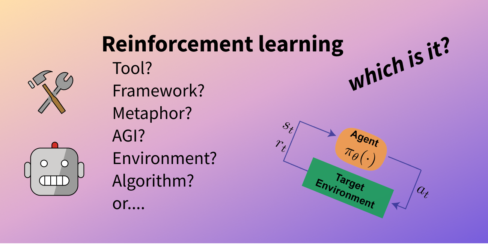
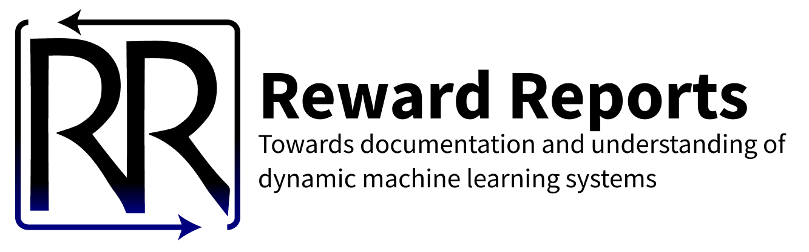

*I'm excited to have co-written this post with a friend and collaborator, [Thomas Krendl Gilbert](https://twitter.com/sociotiose). If you're into the political economy and sociotechnical questions of AI, you should really check out his work.*

------------------------------------------------------------------------

Whenever anyone communicates about reinforcement learning (RL) beyond the standard scientific responsibility of reporting results, they express a value system around the present and future of RL. That value system may be rooted in an underlying faith in RL's potential, sanguine predictions about its future, or contestable assumptions about its relationship to more classic ML methods. The tricky footsteps in this dance have made the broader ML community confused about whether there is actually substantial progress in RL, and if so, how to evaluate that progress in relation to professed value systems. 

We've seen different waves come for RL. In the years following the 2014 acquisition of DeepMind by Google, the reality of RL was far enough away that the media lauded it as the most likely path towards super intelligent agents. This led to RL's acceptance as a **metaphor** for general intelligence. 

Fast forward to 2023, and language models are progressing so quickly that many people see them as not only a necessary part of AGI, but the central path to it. At the heart of this shift in mindset (i.e. embracinglarge language models (LLMs) as [a potential](https://arxiv.org/abs/2108.07258) *[foundation](https://arxiv.org/abs/2108.07258)* [for future AI developments](https://arxiv.org/abs/2108.07258)) was accepting RL's use as a **tool**.

From here, there's a fork for embodied agents that'll determine the status of RL in the future: do our agents also adopt universal large scale pretraining? The successes of [Gato](https://www.deepmind.com/publications/a-generalist-agent) and [RT-1](https://ai.googleblog.com/2022/12/rt-1-robotics-transformer-for-real.html) may generate a near future scenario in which agents are pretrained on offline data from the Steam game catalog. In that case, online RL may no longer be trusted as the **framework** for developing agential behaviors.

Herein lies the critical technical question: can these supervised-learning based embodied agents demonstrate true generalization without any online data collection? My hypothesis is no.

## The power dynamics behind the scenes

In recent days, we have seen some really varied media on RL. On the one hand, you have glorified accounts of *[scaling coming to RL](https://jack-clark.net/2023/02/06/import-ai-317-deepmind-speeds-up-language-model-sampling-voice-cloning-tech-gets-abused-more-scaling-laws-for-rl/)*. The best RL researchers are now saying in interviews that RL is poised for more success in years ahead due to *[deeper technical understanding of existing methods](https://twimlai.com/podcast/twimlai/ai-trends-2023-reinforcement-learning-rlhf-robotic-pre-training-and-offline-rl/)*.

These opinions -- scale vs. understanding --  rely on different taxonomies from the three seasons of what RL represents. Start with the idea that RL is a powerful tool for optimizing systems to act strategically. This *strategic lens* may mean they take many actions in sequence, that actions help maximize a notion of reward over a very long time horizon, that the space of actions is poorly observable, or some combination of these. In settings where any of these conditions hold, such as language modeling or robotics, RL can find levers to improve performance where other methods have not.

Some examples of RL as a tool in recent years are its successes in [pretraining quadrupedal locomotion](https://robotic.substack.com/p/rl-quadrupeds) and [reinforcement learning from human feedback](https://robotic.substack.com/p/rlhf-chatgpt-data-moats).

On the other hand, RL is also a powerful metaphor for good and continued performance itself. David Silver and collaborators have argued that "[reward is enough](https://www.deepmind.com/publications/reward-is-enough)" to simulate intelligence in arbitrarily complex environments. The long-term promise of RL as a path to more general AI capabilities---whether or not this includes rarified concepts like sentience---is a major motivator for DeepMind, OpenAI, and Anthropic. At ICML 2016, David Silver gave a [talk](https://icml.cc/2016/tutorials/deep_rl_tutorial.pdf) where slide 5 just showed "DL + RL = AGI." Hundreds of millions of dollars are now being poured into these companies from larger tech corporations (Google, Microsoft) in an effort to pursue this metaphor and test its limits. 

The communications of their expensive successes reiterate the commitment to this journey. For example, see the communications of AlphaTensor:

> This game is incredibly challenging -- the number of possible algorithms to consider is much greater than the number of atoms in the universe, even for small cases of matrix multiplication. Compared to the game of Go, which remained a challenge for AI for decades, the number of possible moves at each step of our game is 30 orders of magnitude larger (above 1033 for one of the settings we consider).

When I interviewed for full-time roles with DeepMind, the first question I was asked was "*what are your views on AGI?*" This doesn't hold for every team, but there are also provisions written into the acquisition of DeepMind by Google that protect its ability to do research in this agenda via its technical AGI Safety team.

These are interesting developments, but separating the technical advancement from the metaphor is left to the reader.

Between these two perspectives is the notion of RL as a framework. This is the notion that is taught in all introduction to AI courses. Systems like the recommenders on TikTok or YouTube are sometimes spoken of as "reinforcing" human behaviors and dynamics. Sometimes this is a good thing, as it empowers designers to interpret static ML systems through the lens of RL and achieve new thresholds of performance. But it can also lead to pernicious outcomes. 

For [example](https://proceedings.mlr.press/v80/liu18c.html), interfaces for predictive policing and credit scoring have been observed to worsen or "feed into" structural racism, a pre-existing social dynamic that is exacerbated or translated into automated decision-making systems. With more expressive models engaged more broadly in our lives, these risks compound.

## Documenting dynamics

As the technical sophistication of RL advances, the potential for harm from miscommunication rises.  It is likely that the pre-built tensions from the last decade between RL as a tool, metaphor, and framework will heighten. This incongruence leads to different researchers applying different framings to different important problems. For example, when there is uncertainty on how to define a framework, calls for transparency can be evaded by saying the problem formulation itself is vague, rather than the approach.

One instance of mismatch in the modern machine learning ecosystem is the early attempts to document time varying or reinforcing systems. Consider using  [Model Cards](https://arxiv.org/abs/1810.03993) to document RL-focused domains. Model Cards are crucial tools to the development of transparent machine learning systems -- they motivate designers to document training practices, data curation techniques, and more. In particular, Model Cards struggle to capture critical aspects of the RL system performance: time evolution. 

It would seem important to include interpretable learning curves for a model trained with RL to showcase the path the agent took to get there, but this is far from common practice (maybe have never seen it). This question is particularly suited for the tool view of RL. 

Shifting to the framework view, where all *deployed* [machine learning becomes reinforcement learning](https://robotic.substack.com/p/ml-becomes-rl), there is a question on how to document these changes. The model card or datasheet equivalent for time varying techniques certainly has a lot of heavy lifting to do (in an era when machine learning is reshaping modern society). Tom and I (with collaborators) have worked on an initial solution to this problem, [Reward Reports](https://rewardreports.github.io/), but adoption of this documentation is likely locked in with the confusion over what RL is doing for modern ML. 

The key aspects we have figured out so far are all around encouraging the documentation of how time plays into a problem and updating at a consistent cadence. The *optimization intent* can often indicate which framework the designer is using w.r.t. RL. If the problem uses RL as a black box to fine-tune on some prompts, it's likely using RL as a tool. If the intent is to massage user behavior over time to be more okay with advertisements in a feed, that's a framework approach. Because all of these methods can be time varying directly or iteratively deployed, a Reward Report builds in an update cadence and a list of triggers for when documentation must be iterated on. An obvious example would be when ChatGPT is based on a new model, so users can monitor how the powerful dynamics change over time.

Thanks for reading!

------------------------------------------------------------------------

*Thanks to [Jordan Terry](https://twitter.com/j_k_terry?lang=en) for providing some feedback on an early draft.*
