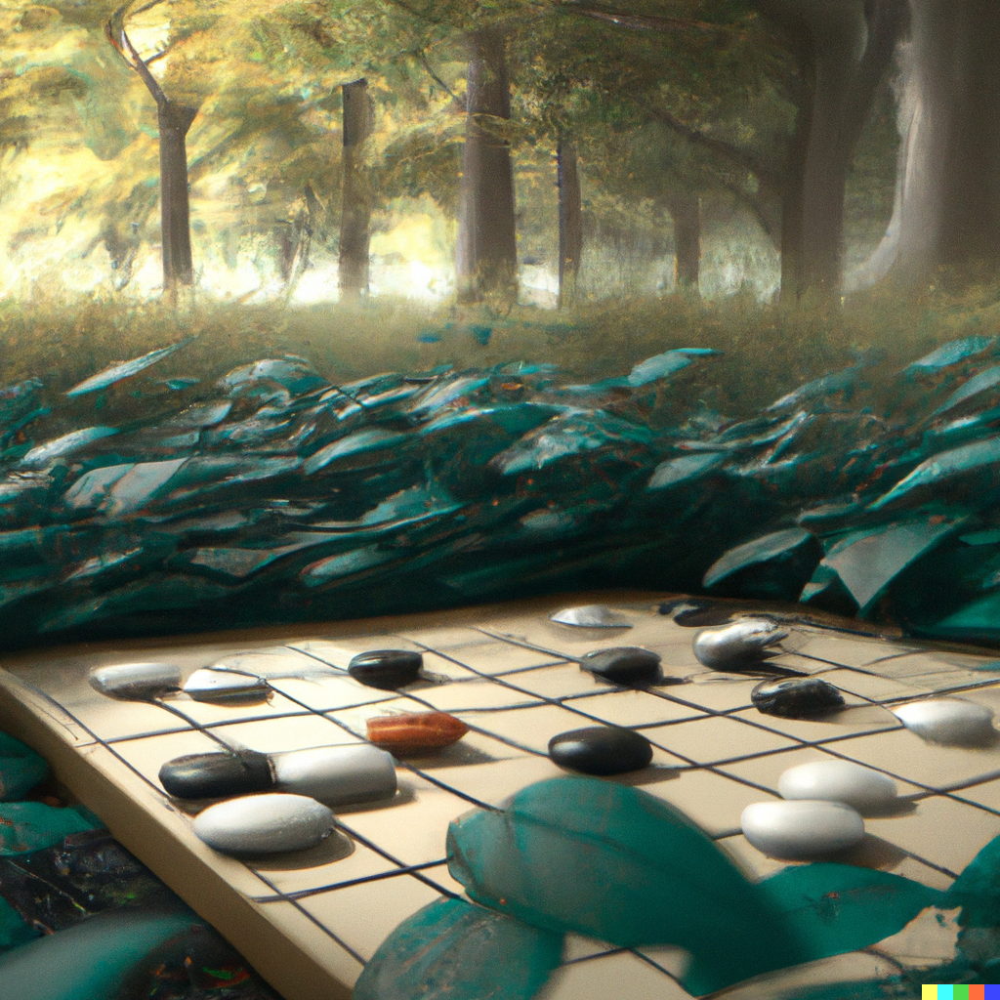
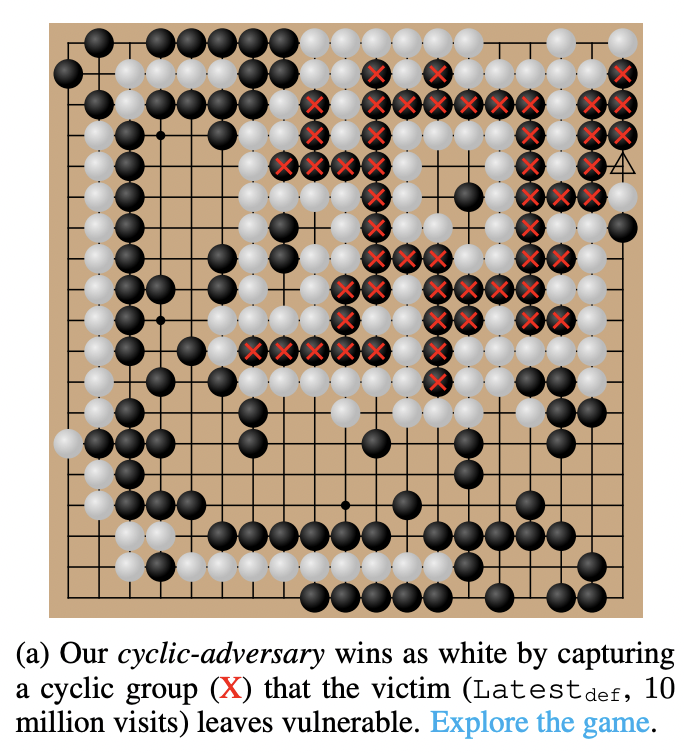

I\'m curious if some people are put off by these clear analogies of incremental progress toward AGI --- are they realistic? I\'m in the group of people who think AGI is on a spectrum, so it\'s a question of \"how AGI\[y\] is something\" not \"is it AGI\" (AGIy is read like funny, foggy, blurry, etc.). Forecasting the future of AI is much easier when AGI is a descriptor. With this view, we're progressing towards AGI.

To get started on this mini-journey, let's revisit Go and the AI programs that supposedly *solved* it.

### An asterisk on AI's Go championship

A recent [project](https://goattack.far.ai/pdfs/go_attack_paper.pdf?uuid=WgOkT29w1fP7rG7p1682) came out where researchers showed repeatable ways of defeating the best \"superhuman\" Go AIs (the paper is also [here](https://arxiv.org/abs/2211.00241)), so it got me thinking about weaknesses of current deep learning systems posited by some as the closest we've gotten to AGI.

Ultimately, every deep learning system will have minor errors encapsulated in the forward pass. The important question is if the representation, or how the states of the world are encoded, is sensitive to these errors. Many of these systems are attempting to capture recursive concepts with forward functions (e.g.\'s include physics in a dynamics model, concepts in language, or game rules of Go). An example of what is lacking in a Go-playing-AI is the knowledge of what a group of stones represents. Shapes in Go determine the score of the board. Without training a representation on shapes, the reward prediction (and all downstream training) can have substantial errors.

All the top Go programs studied in this paper failed to recognize this circular pattern which represents the "qualitative failure of these networks to generalize correctly," according to Stuart Russell (from a [podcast](https://www.samharris.org/podcasts/making-sense-episodes/312-the-trouble-with-ai) hosted by Sam Harris with Stuart and Gary Marcus[1](#footnote-1){#footnote-anchor-1 .footnote-anchor component-name="FootnoteAnchorToDOM" target="_self"}). This was not the case where one AI is sensitive to a play-style, but every top agent fails in a systematic and repeatable way by human Go players.

The specific pattern from the game is below \-- ultimately the human makes a small circle, *white*, that encourages the AI, *black*, to capture it. Then, the AI does nothing to defend its circle from white, because the AI computes that region of the board as being solved to stop white from scoring points. It triggers no response as it is about to lose its defensive area.

Figure 1.1 from the paper is below and the gameplay recording is [here](https://goattack.far.ai/adversarial-policy-katago?row=3#10mil_visits-board).

The crucial question of this is: why does this representation get embedded in many different training architectures? Is it due to the game of Go, the training process (varies across teams), or the ML modeling tool used (deep networks)? My hunch is that it is some interaction of the game of Go with the use of deep learning --- particularly how they handle the boundary of exploration and generalization.

In systems where the branching factor, the number of different directions the state could go based on actions, is extremely high, the challenges of finding the correct internal representation will be so hard that there is no single correct answer. This applies to language.

It seems likely that normal gameplay does not fully explore the game of Go due to the super high branching factor. This means a game like chess would not have these structural representation problems. Maybe, I am biased because chess is solvable with a deep search program, so my logic on how to apply deep learning is flawed. To understand this scaling law and trade-off, we need more data points on applications where these limitations emerge.

At the end of the day, the human brain also recreates a lossy representation of the world. Our vision is our imperfect representation used to live our life. Saying that *deep learning cannot succeed because the representation* is a bad argument. Saying *deep learning cannot be robust due to representation* problems is a reasonable argument.

### From narrow to general intelligence

AlphaGo and other Go agents are good examples of successful narrow AI. Until ChatGPT, most systems that achieved state-of-the-art (SOTA) in various ML subfields were pretty solidly in the camp of fully **narrow AI**. There are good arguments that ChatGPT changed this. For example, it was a perceived[2](#footnote-2){#footnote-anchor-2 .footnote-anchor component-name="FootnoteAnchorToDOM" target="_self"} step change in many subfields of NLP: summarization, dialogue, q&a, etc. When one AI comes in and joins multiple fields that previously operated independently that has to be in the conversation of progress toward AGI.

As most people are familiar with it now, chatbots are actually a good foray into not-that-narrow AI. It shows how one AI model can be used as a platform, improved by integrating other tasks, and become powerful beyond what was expected. In the case of ChatGPT, it is all but guaranteed that it will improve in a broad spectrum of tasks and potentially allow *customers to plug in their own sub-models* (squint a bit at [Toolformer](https://arxiv.org/abs/2302.04761) and think about a [mixture of experts model](https://ai.googleblog.com/2022/11/mixture-of-experts-with-expert-choice.html?m=1), which GPT4 is rumored to be).

If a user has a product-inspired model for some task, say diet analysis, that took in raw data like biometrics and nutrition information, ChatGPT could be the interface by which it communicates. Then, chat-bots could be the interface that allows startups to skip product-market-fit and some early tribulations of software startups. Instead of needing to set up the RLHF on their own data, an API-friendly model could consume the market need to do this. Plugging in a sub-model is a pretty assured path toward a moat too (and one I hadn\'t thought about in my article on *[Predicting machine learning moats](https://robotic.substack.com/p/ml-moats)*). It makes OpenAI a platform with an engineered interface that is not one-to-one swappable for another open-source alternative.

Business prospects aside, adding one more SOTA category to the model is a step towards any practical definition of AGI. I suspect the next few decades, we\'ll be going from narrow to general AI brick by brick, without people thinking about it.

The first one that you shouldn\'t be surprised by is **a near-future update to ChatGPT that directly integrates DALLE 2**. ChatGPT will very soon have interfaces for all of the popular models in their quiver. While I don\'t think it is the case, there\'s a chance that GPT4 is actually an image-text model in full that takes in images and text with every input (similar to [Flamingo](https://arxiv.org/abs/2204.14198) released by DeepMind). This would be a huge architectural change where OpenAI already seems to be making substantial progress without it. I suspect this update works by clever engineering tricks mapping from specific phrases/tokens to their image generation. Alternatively, they could just add buttons to the UX that the user needs to press to engage image mode. For anyone who\'s played with the text-to-image models released in the last couple of years, being able to provide rich text feedback to the model to edit an attempted generation really would be game-changing. I suspect we will be able to do this all in ChatGPT (or they add a ChatGPT window to other models on their website).

Roll out this process a few more times, then ChatGPT has access to many literal tools beyond just its large AI model peers: calculators, thesauruses, search engines (ahem, Bing), email accounts, and E-commerce. Some of these are way grander technical challenges, but you get the point. ChatBots are a *medium* that can enable obvious brick laying on this path towards AGI. This clarity of pathway was not present last year and has changed my views and predictions around the presence of \"AGI\".

*Business analysis footnote:* *ChatGPT is plugging away, but I expect this business journey to be super bumpy. Companies are likely paying to catch up with the hype cycle, giving OpenAI good terms on the sweetheart AI deals. Those may not make it in the second contract unless it's providing real value not found elsewhere (especially with the broad economic climate not being great).*

### Multimodality, grounding, and GPT4

When we think about the intersection of these two topics: Go agents and chat-bots, the common missing link in many features is grounding. Tools can ground some domains (like using a calculator), and rules can ground other domains (like Go agents). From there, we get into murkier territory. A long-time interest of mine is understanding how to ground robotic agents in our understanding of physics. There are some compelling initial ideas for integrating physics into a dynamics model (like a double integrator structure or conservation of energy-based models), but in reality, they\'re super difficult. My impression is, for some domains, the best we can do is constrain the representation of deep learning to make sense of it (e.g. convolutions for images), but this will limit full grounding in many domains (like physics, where the world is governed by too many intersecting rules).

If the behavior of a model needs to be completely accurate to warrant its use, it\'ll need to be grounded (good luck using this stuff for medical use cases). Thankfully, there are plenty of problems where *close enough* solutions still provide a ton of benefits. Creative agents need to be spontaneous, not perfect, to be entertaining!

I\'m excited for a language model to have a basic calculator in it, so people stop saying LLMs aren\'t impressive because they can\'t do 4-digit multiplication. Can you do 4-digit multiplication perfectly just by predicting each number one at a time from left to right? I didn\'t think so.

Next time, or soon, I want to keep discussing multimodality with regard to [PaLM-E: An Embodied Multimodal Language Model](https://palm-e.github.io/) from Google (read more on [Twitter](https://twitter.com/DannyDriess/status/1632904698108821505)). This paper showed early signs of life in one of my favorite robotic learning predictions \-- figuring out how to train multiple robots together to compound net performance. The paper calls it **positive transfer**. If positive transfer keeps appearing across more modalities, it\'ll be a common theme of the AGI road.

...While I was writing this, [news](https://www.heise.de/news/GPT-4-is-coming-next-week-and-it-will-be-multimodal-says-Microsoft-Germany-7540972.html) leaked (from Microsoft 🤔, article in German with an annoying pop-up) that GPT4 is being released "next week." The article talks about how it'll likely be multimodal and potentially work with video. I'm curious how this multimodality is handled --- that'll likely be the most interesting technical detail (with everything else being scaling and processing).

This is not anything new, but I wouldn't be surprised if the release is delayed. It has been pretty clear to me that OpenAI has been waiting for the hype to die down to announce GPT4. Some products may already be using it in Microsoft. When we learn more about it, I'll post a non-sensationalist view to save your feeds.

:::: {.footnote component-name="FootnoteToDOM"}
[1](#footnote-anchor-1){#footnote-1 .footnote-number contenteditable="false" target="_self"}

::: footnote-content
I fall between Stuart and Gary Marcus on the spectrum of risk (Gary gets too stuck in details in my opinion, but makes good points like medical risk).
:::
::::

:::: {.footnote component-name="FootnoteToDOM"}
[2](#footnote-anchor-2){#footnote-2 .footnote-number contenteditable="false" target="_self"}

::: footnote-content
Perceived because no measurements were released.
:::
::::
