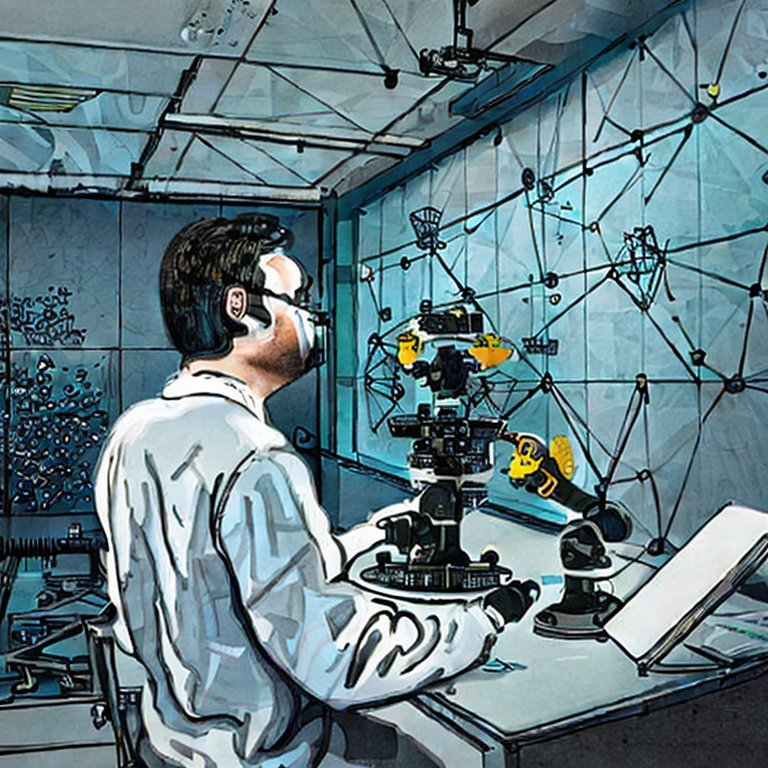

Every single person I know working in AI these days (in both the academy and industry) has been sparked by the ChatGPT moment. The *first* iPhone moment of AI. Working in this environment is extremely straining, for a plethora of reasons --- burnout, ambition, noise, influencers, financial upside, ethical worries, and more.

The ChatGPT spark has caused career changes, projects to be abandoned, and tons of people to try and start new companies in the area. The entire industry has been collectively shaken up --- it added a ton of energy into the system. We now have model and product announcements on an almost daily basis. Talking to a professor friend in NLP, it\'s to the point where all sorts of established researchers are ready to jump ship and join/build companies. This is not something that happens every day --- getting academics to stop wanting to do research is a hilarious accomplishment. Everything just feels so frothy.

Graduate students are competing with venture-backed companies. From a high-level technologist\'s perspective, it is awesome. From an engineer-on-the-ground's perspective, it leaves some stability and naps to be desired. Seeing all of the noise makes it very hard to keep one\'s head on straight and actually do the work.

It seems like everyone is simultaneously extremely motivated and extremely close to burning out. Given the density of people in all the project spaces of generative AI or chatbots, there is a serious *be the first or be the best* syndrome (with a third axis of success being *openness*). This keeps you on your toes, to say the least. In the end, these pressures shape the products people are building away from a thoroughness of engineering and documentation. Clickyness is the driving trend in the last few months, which has such a sour flavor.

To start, let\'s take a step back and state pretty clearly how my worldview has updated post-ChatGPT. I\'ve mostly accepted two assumptions to be true:

1.  **Large language models (LLMs) are here to stay as a part of the machine learning toolbox across most domains**. This is much like deep learning was viewed 6 years ago when I started my Ph.D. There are some domains where other techniques win out, but it won\'t be the norm.

2.  **AI Safety is a real problem that is entering the discourse as a public problem.** As someone who just started coming around to the first half of that, it is really exhausting to be thrust into the public portion right away.

These two assumptions make it pretty funny that the pace is so high. I\'ve just said that being safe is important and the tools we are using are here to stay, so for people focused on learning and doing good, some simple logic implies that there shouldn't be an AI race. The race dynamic is purely down to capitalistic incentives. Acknowledging these pressures and steering around them is the only way to do this work for a longer timeline.

This post flows as a deeper dive into the dynamics we have right now, **The State**, followed by some things I prioritize to make it easier to have a long-term impact, **The Solutions**.

# The State

**Prioritization is really hard these days**. If you\'re obsessed with being first, the goalposts will keep moving as the next models get released. The need to be better and different is really strong. For some companies that are already established, this is compounded by the question \"why wasn\'t this release/product/model you?" For researchers with freedom, it is extremely hard to balance goals between attainable, scoop-able, and impactful.

In the case of the recent zoo of instruction-tuned Llama models ([Alpaca](https://crfm.stanford.edu/2023/03/13/alpaca.html), [Vicuna](https://huggingface.co/lmsys/vicuna-13b-delta-v0), [Koala](https://bair.berkeley.edu/blog/2023/04/03/koala/), and [Baize](https://huggingface.co/project-baize)), this pace pressure generally comes at the cost of the evaluation. All these models (except Alpaca, because it was the first) come and go from the narrative quickly. There\'s a viral spike on Twitter, chatter on the streets for a couple of days, and then everything is back to baseline. These artifacts are not really full research productions. Without substantial evaluation, the claims are unvetted and *should* be mostly ignored by conference reviewers until their documentation improves (which I think they will, unlike GPT4).

Behind the scenes, there are surely many projects that get axed and shifted whenever one of these releases happens. Designing a playbook that\'s resilient to external changes is hard when the incentives are so motivated by markets.

Another symptom of the dynamics that make prioritization hard is that **leadership and vision are increasingly strained**. When AI was going slower, it was easier for researchers to sort of nod their heads and know what was coming next. Now so much of the progress comes from different mediums than research, so most prediction abilities are out the window. Many companies will try to make plans to please employees, but it is truly very challenging to come up with a plan that\'ll survive the next major open model release. Keeping up with the trends is an art, but the few who manage it best will enable their employees to have an easier time prioritizing. Long-term, I see this paying off for a few organizations that double-down as process-focused ML labs. Those focused on artifact production can easily be subject to higher employee turnover and other consequences.

Engineering teams are desperate for leadership to provide these strategies so they can come up with better tactics. I find the best plans are ones that don\'t really change when the next SOTA model comes up, but are rather reinforced.

While making long-term plans is hard, **being an ML influencer is easy right now** because there are so many eyes on the field. The paper posters have proliferated --- people tweeting out abstracts from new papers on Arxiv, in the style of [AK](https://twitter.com/_akhaliq). I\'ve found that anything that I think is remotely on-topic can be an easily successful tweet. Though, a lot of people doing this are mistaking reputation for following. In ML and tech broadly as industries, people are hired because of their reputation not because of their following. There\'s a correlation between the two, but there\'s a difference between having a megaphone for a general AI audience and having a megaphone for researchers/engineers at companies that will be your customers. Since studying my Substack stats (where I have \<10% overlap in subscribers with any publication) I\'ve come to think that people can curate a pretty specific audience to them. Posting all popular papers makes your audience and therefore reputational leverage more diffuse.

The algorithms we built as a community are pushing us to double down on these influencer dynamics. For a while, it felt like ML communities acted independently of them (e.g. on the chronological feed), but now the boundaries of our groups are blurred and the incentives of chronological feeds have changed people. Everyone wanted to leave Twitter when Elon took over, but not many of us did (props if you got out). This kind of has two effects that I see:

1.  The people who are the most focused on building AI have been pulling back from social engagements. This likely compounded the influencer dynamics, where there is a gap that people used to fill *and* the ballooning of general attention in the area. I try my best to use Twitter as a distribution network, but it really feels like that is where ML is unfolding. Not sure which way is best, it\'s just important to keep in touch with what your body and mind need.

2.  **Societal issues loom large**, so the people who are the most focused on designing ML systems with good societal outcomes feel obligated to engage. Doubly, when you realize ML has such a strong impact on societal structures, it makes the work more emotional and draining. Caring is hard!

Many of the issues regarding the responsible development of AI have transitioned from research to reality with 100million+ people using ChatGPT. Everyone along the distribution from theoretical AI safety to the ML fairness researcher just got the largest call-to-arms of their career so far. This often involves engaging with stakeholders from other backgrounds than AI research and responding to criticism of their ideas, which is very tiring.

For example, I see a ton of research and sociotechnical questions around RLHF that OpenAI / Anthropic likely won\'t engage with for primarily political or product reasons. It feels like the field is charging ahead with rapid progress on the technical side, where there is a down-the-line wall of safety and bias concerns that are very hard for small teams to comply with. Whether or not I am on the train going ahead, it seems obvious that the issues will become front of public perception in the coming months. For that reason, I have been deciding to keep going while discussing the sociotechnical issues openly. Eventually, safety concerns could easily trump my desire for technical progress. This sort of sociotechnical urgency is something I did not expect to feel in AI development for quite some time (or I expected the subjective feeling of it to approach much more gradually, like climate concerns rather than Ukraine concerns that happened overnight for me).

All of these low-level concerns make working in AI feel like the candle that **burns bright and short**. I\'m oscillating between the most motivated I\'ve ever been and some of the closest to burnt-out I\'ve ever felt. This whiplash effect is very exhausting. The discourse is motivating and pressuring for all of us in AI, so just try to remember to see the humanity in those you work with and those you compete with.

Underpinning all of this are **serious geopolitical overtones**, brought to the front of mind by the [Future of Life Institute\'s call to pause AI](https://futureoflife.org/open-letter/pause-giant-ai-experiments/). I don\'t really feel qualified to comment (or really want to comment) on all of these issues, but as AI becomes increasingly powerful, the calls for nationalization and comparison across borders will become stronger. There will be metaphors like \"The Manhattan Project for AI\" or \"The AI Bill of Rights\" that come with immense societal weight during an already fractured national and global world order. AI is expanding and will tap into all of the issues straining modern society. This zoomed-out perspective can also be extremely isolating for people working on AI.

# The Solutions

Most of the things I\'m trying to implement come down to being process rather than outcome-oriented. *This section is a work in process, so please leave a comment if you have something that works for you!*

**Taking solace in the scientific method** can make things easier. When your goals are about progress rather than virality, it is much easier to have equanimity with the constant model releases that could be seen as partial scoops of your current project.

Ambition for ambition\'s sake is not particularly interesting when there is so much obvious money to be made.[1](#footnote-1){#footnote-anchor-1 .footnote-anchor component-name="FootnoteAnchorToDOM" target="_self"} I don\'t fault anyone that decides it\'s time to leave a research career to try and obtain generational wealth right now. I do, though, extremely admire those people who want to stay put and get to the bottom of (and hopefully share) what is happening. I\'m not the only one trying to navigate these pressures on a daily basis. How do we balance trying to release the best model soon with building the best engineering infrastructure so we can build the best models in 3, 6, or 9 months? How do I balance writing for my smart and niche audience when I could make my posts more general and get a bigger audience? All of these are unknowns.

People tend to enjoy their research work most when they\'re obsessed with the details and figuring something out. Openly, it feels like the more AI-oriented my work has become through my career, the less process-oriented I have become. Wanting to "make it" shortens the time window of your optimization. It\'s really easy to be caught up in the wave of progress, hype, and prestige. All you can do is keep asking yourself, \"why\"?

To help address the plentiful competition (and to quote [Ted Lasso](https://www.youtube.com/watch?v=8PmX7zEUg_w)): **be a goldfish**. When things are moving so fast, it\'s good to remember that sometimes you\'ll waste a lot of effort or get scooped. The best thing you can do is to just accept it and keep going on your process. You\'re not alone in this one.

For individual contributors out there, it\'s the right time to **manage up** to help make these mini-scoops not seem like failures: ask your manger and skip-manager some of the questions posed in this article. If your company doesn\'t have a plan, your asking will at least make them realize it is not entirely your fault if you get scooped.

To end, I wanted to remember a common lesson from surfing: it takes a lot of paddling to catch a wave. That applies to how AI is going right now --- while it seems like a lot of people are surfing these giant waves of success, it normally takes a lot of boring consistent work (and luck) to get there.

------------------------------------------------------------------------

*Want more? You can read the [comments on HackerNews](https://news.ycombinator.com/item?id=35469908).*

------------------------------------------------------------------------

*Thanks to Nazneen Rajani for some brief feedback on the construction of this post. Thanks to Meg Mitchell for a typo fix.*

*Elsewhere from me:*

-   Another Ethics & Society blog post from my HuggingGroup, on [openness](https://huggingface.co/blog/ethics-soc-3).

:::: {.footnote component-name="FootnoteToDOM"}
[1](#footnote-anchor-1){#footnote-1 .footnote-number contenteditable="false" target="_self"}

::: footnote-content
This was discussed on a recent [Peter Attia podcast with Andrew Huberman](https://www.youtube.com/watch?v=OGe1bTccCyg).
:::
::::
