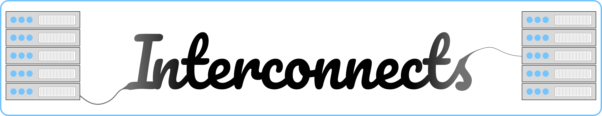

To start, let\'s remember what is on the [welcome page](https://www.interconnects.ai/welcome) of the blog and how I've been working to share knowledge from the inner workings of AI with the world. This message summarizes what I\'ve been doing best:

> Linking important ideas of AI.\
> The interface of systems and society.\
> The border between high-level and technical thinking.

I've long thought the previous name was both *not very good branding* and *not specific* to what I was building. To this end, I wanted to introduce the next phase of things, and what it means.

Welcome to **Interconnects**.

It's all about rapidly connecting the most important people and ideas of the AI world. That's the only way to solve all the challenges we're facing.

On a technical level, an *[interconnect](https://en.wikipedia.org/wiki/Interconnect_(integrated_circuits))* is a device used to pass information from one computer to another.

Barring the extreme technical details (the things that [less than 200 people in the world know](https://twitter.com/ericjang11/status/1627818245406461952?lang=en)), the tools that are used to link GPUs together in a cluster are these interconnects. Training bigger and bigger models requires linking more and more GPUs together. Depending on the setup, these links can pass around pieces of model weights, data batches, or pieces of a tensor in order to operate most of the computation in [parallel](https://huggingface.co/docs/transformers/v4.15.0/parallelism). This is often because the whole model or dataset is way too big to fit on a single machine. If you\'ve ever written bad code handing off data to a GPU from the CPU, you know how badly you can cripple yourself by moving data between pieces of computers.

When ML was dominated by small models trained via renting one GPU on the cloud, interconnects didn\'t matter. There was very little or even no cross-machine communication.

This is similar to how, in the past, subfields of AI could happily work on their domains alone. AI has gotten bigger, more connected, and more charged --- the **various subfields of AI research and development now must communicate** and work together on dynamic and interdisciplinary problems --- especially when they disagree.

A favorite cross-domain discussion I've been floating is how the field of NLP created the most capable action-taking models, so those working on them must connect with those steeped in reinforcement learning (RL) to learn about the dynamics and surprising properties that they'll encounter. A few years ago, these fields were only superficially linked (e.g. it was discussed as "interdisciplinary research", which is often shrugged off by some researchers).

When training super large models on state-of-the-art compute clusters, the software and hardware linking GPUs together, the interconnects, have frequently become a bottleneck. I\'m hoping to match this dynamic with my writing as the space for ideas and the people creating those ideas. AI is increasingly important, so the connections between different communities are imperative.

This bottleneck has gotten to the point where if you buy the machine learning engineer's beers at many startups setting up large clusters right now, you\'ll hear half of them complaining about the interconnects. They'll complain about how a given compute provider makes it impossible to train large models with them because the connection speeds are too low. This is serious business with contracts worth 10-100s of millions of dollars.

The interconnects are often the most crucial detail that no one sees. People outside of the inner circles of AI need to know these details. When everyone knows these things, the stakeholders actually get to have a say in how technology is built.

Thanks for supporting my writing to date, and I look forward to this next phase. I have some things brewing around hallucinations and at-scale robotic learning that I\'m excited to bring you soon (in addition to the regular RLHF coverage).

*For more on the technical background of interconnects, you can search this [Lesswrong post](https://www.lesswrong.com/posts/G4KHuYC3pHry6yMhi/compute-research-questions-and-metrics-transformative-ai-and#Interconnect)* *or skim this* *[technical paper](https://arxiv.org/abs/1903.04611).*

------------------------------------------------------------------------

I spent a lot of time on all this design, so there is not going to be a regularly scheduled issue this week. See you soon!
