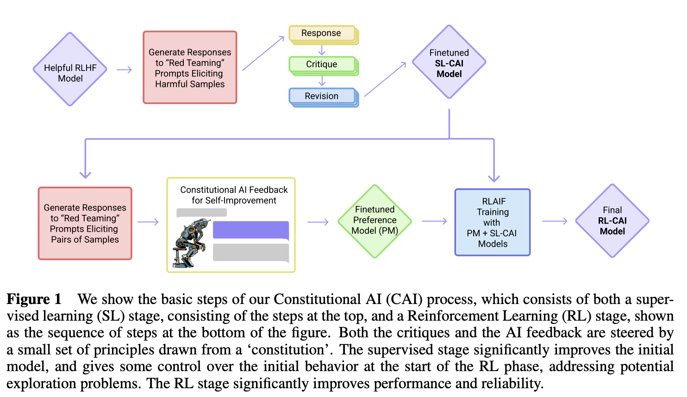

Reinforcement learning from AI feedback (RLAIF) is currently stuck with a *stigma of being too complex* or something similar stopping people from just trying it. In reality, I expect that **RLAIF can be extremely powerful, tractable for small teams, and work in many domains**. Why is it so stuck, it\'s because it doesn't fit in a cookie-cutter recipe like instruction-tuning or other popular techniques these days. Using synthetic instructions (e.g. generated by GPT4) instead of human instructions does fit the mold of known NLP techniques, which is why it took off and RLAIF remained quiet. The next phase of popular open-source this year is using RL, hopefully with some AI feedback.

RLAIF first emerged to the world in [this paper](https://arxiv.org/abs/2212.08073) from Anthropic in mid-December of 2022. At the time, there was a ton of discussion about how vanilla-RLHF (mostly the human feedback part) was dead. It quickly transitioned to if \"Constitutional AI\" was a reasonable name, then back to ChatGPT, and then to GPT4. The interest faded because the communications around the release actually ended were confusing by introducing two new terms at once that became synonymous with the same thing. Constitutional AI is about using RL with AI critiques to reduce the harmfulness of a large language model (LLM) --- RLAIF is a general method that can be a superset of it.

RLAIF is the general part of that paper and something that I could see being a descriptor for a large part of "RL research" in the post-RLHF world. It brings the lens of feedback and optimization to a ton more problem domains.

How did we get to this confusion? The fact that Anthropic is an AI Safety research organization and a startup in one has made it so this paper landed in an atypical way for most ideas. In the normal progression of AI, there would\'ve been an RLAIF feedback paper *and then* its application to LLMs via Constitutional AI. The point of the paper wasn\'t branding RLAIF, it was sharing research to make cutting-edge AI safer.

I suspect Anthropic has used these techniques on the models in their product quiver, but likely not all of them. This post is designed to get people thinking about RLAIF again, from a broader lens than just LLMs.

------------------------------------------------------------------------

#### **RLAIF technical summary** (can skip if you\'re familiar)

As is visible in the acronym, RLAIF is a descendent of [reinforcement learning from human feedback](https://huggingface.co/blog/rlhf) (RLHF), but instead of using human feedback to generate a score for a model generation, it uses another AI system. In a traditional RLHF pipeline, human preferences are used to create a reward model that labels any text with a score. In order to get around this, Anthropic needed to add two things (the latter is the actual RLAIF):

1.  A critique system on a set of red-teaming prompts, where a computer checks the outputs of a model against a set of rules, asking the model to update the response if one was violated (the rule list is the \"constitution\").

2.  Instead of a traditional reward model, the paper uses a model to decide which output is better and then trains a preference model for mapping from text to score.

In the end, the optimization ends up looking quite similar to the RLHF used in InstructGPT or earlier Anthropic papers (Bai et. al). The new part is that a rule set was written to guide the model\'s language and then they got the system to work without the preference model from human labelers.[1](#footnote-1){#footnote-anchor-1 .footnote-anchor component-name="FootnoteAnchorToDOM" target="_self"}

------------------------------------------------------------------------

### RLAIF's potential renaissance

As a practical method that can be used to eke out increased performance from a variety of machine learning models, RLAIF is brilliant. The AI feedback is actually very nuanced and tricky, but if we squint it is just another learned function. We can use any function as a score in place of the intricate AI-preference system.

The success of RLAIF showcases how fast LLM capabilities have snuck up on us; they\'re so good they enabled new ML methods to emerge in the applied space (rather than a long-term research track).

RLAIF requires no additional training data or human intervention and integrates complex signals that did not fit into the original training objective. This makes it easier to try than any human-in-the-loop optimization and potentially extremely valuable without being limited to any specific domain. RLAIF needs a rebrand to change the narrative around these two points: **RLAIF has fewer barriers to set up/deploy and it is not restricted to language**.

I'm proposing a broader term that encompasses what RLAIF's core essence is (feel free to iterate on my proposal). The core idea behind RLAIF is to use RL to optimize a signal based on a computed measure of success or feedback. In reality, this is just **RLCF --- reinforcement learning from computational feedback**. Training models with RL and a computed reward could be RLHF\'s younger sibling that gets 10x the market penetration.

When this is the lens, much more is possible. I\'m regularly surprised by how few attempts of this method I have seen. It seems like RLCF could be the method everyone is sleeping on, where, when they try it, it becomes extremely obvious that optimizing large ML models with RL is a valuable tool. Remove the human feedback part and the iteration speed is so much faster! Bring it!

Why haven't we seen this yet: **It seems like there is a lack of creativity around which signals can be used for RLCF**. The search problem is finding some function that maps from your application\'s state variable to a metric of quality or performance. Examples using RLHF libraries on non-preference models can and should be called RLCF, such as this [detoxification example](https://huggingface.co/docs/trl/detoxifying_a_lm) from HuggingFace. This is an example that isn\'t too surprising --- it\'s wrapping a standard task in language processing, sentiment classification, in an RL loop.

Given so much of the modern economy works on computers, I want to see people taking various key metrics in their filesystem or product lifecycle and throwing the RL hammer at it. In 9 of 10 cases, nothing will happen, but it could be free value in 10%!

There are so many potential options, but they\'re generally either hard to come up with or find a use for. There are examples I came up with that I don\'t know if they have any value --- rewarding long or short text sequences, images to have certain average colors, communication protocols for minimum network bandwidth, and more --- but the true monetary value will be when these objectives become linked to engineering tasks. A common one floated in this space is to use RL to optimize a code model so that it passes a set of unit tests in a library \[example [here](https://openreview.net/pdf?id=SaRj2ka1XZ3), pointed out to me by [Kawin Ethayarajh](https://twitter.com/ethayarajh)\]. It\'s a clear signal that can be computed offline and by assigning a reward to it (e.g. completion ratio), the model can optimize it!

The only [example](https://gretel.ai/blog/teaching-large-language-models-to-zip-their-lips) of RLCF I\'ve seen to date is from [Andrew Carr](https://twitter.com/andrew_n_carr), and it was reinforcement learning from privacy feedback (RLPF)[2](#footnote-2){#footnote-anchor-2 .footnote-anchor component-name="FootnoteAnchorToDOM" target="_self"}. It optimizes models to not disclose sensitive information with a named entity recognition (NER) system. I know Andrew, and he said it wasn\'t bad to get going (a couple weeks end-to-end), but was a little sensitive to temperature tuning (as all LLM+RL is these days). I suspect most of that issue is on the RL side and not the metric side. The field is just now recreating all best practices for doing RL on language (as opposed to continuous control).

### Evaluation & next steps for chat models

The core part of the original RLAIF paper, using a model rather than humans, for preference data is under-discussed in the current chatbot dynamics. If you looked at [Vicuna](https://vicuna.lmsys.org/), its core evaluation claim is asking GPT4 to rate its performance, which is directionally similar to creating preference models on AI language feedback. The first reason they didn\'t use this method to generate enough data for a full RLHF run (a few thousand prompts would probably get things going, which they're now [bootstraping](https://chat.lmsys.org/)) is the cost of the OpenAI API! It only really makes sense to use it for evaluation, rather than the full RLCF process.

As open models get better and human data stays expensive, all of these labs training chat/instruction models are more likely to do some form of RLCF. Human data providers are sort of like GPU providers right now --- you need status to start the conversation, they\'re expensive, and you normally cannot get as much as you want. The latency and bandwidth limitations of buying data are giving even more reason to try out these end-to-end computational methods.

For these reasons, RLAIF/RLCF is my guess at the next phase of the zoo of the releases we\'ve been seeing.

------------------------------------------------------------------------

There\'s been a lot of cool reads and developments in the RLHF space this week, here are some of them:

-   This great talk from [John Schulman](https://www.youtube.com/watch?v=hhiLw5Q_UFg) --- I'm surprised he's allowed to say so much, but he's the boss! This resulted in a popular and useful [follow-up](https://gist.github.com/yoavg/6bff0fecd65950898eba1bb321cfbd81) piece from Yoav (who is always a skeptic) on why it is reasonable.

-   ChatGPT also [generates images now](https://twitter.com/OfficialLoganK/status/1649439631350308866) (as I expected).

-   A great [little post](https://deliprao.substack.com/p/how-to-understand-the-post-llm-world) from Delip Rao on how LLMs can be a common software layer --- removing the need for writing code to connect apps together.

-   Some consumer articles on how LLMs are disrupting the information flow: [AI spam taking over Amazon reviews](https://www.vice.com/en/article/5d9bvn/ai-spam-is-already-flooding-the-internet-and-it-has-an-obvious-tell) (with obvious giveaways) and [Snapchat app store ratings tanking](https://techcrunch.com/2023/04/24/snapchat-sees-spike-in-1-star-reviews-as-users-pan-the-my-ai-feature-calling-for-its-removal/) because of their OpenAI-powered MyAI.

*Interconnects is free and reader supported. Feeling generous? [Buy me a coffee](https://www.buymeacoffee.com/natolambert).*

:::: {.footnote component-name="FootnoteToDOM"}
[1](#footnote-anchor-1){#footnote-1 .footnote-number contenteditable="false" target="_self"}

::: footnote-content
I'd LOVE to see the ablation studies of the human preferences reward model compared to the computer-generated reward model. We're working on this at H4.
:::
::::

:::: {.footnote component-name="FootnoteToDOM"}
[2](#footnote-anchor-2){#footnote-2 .footnote-number contenteditable="false" target="_self"}

::: footnote-content
I know other projects in development with RLAIF, but those are under NDA or asked not to be shared, so I'll share when I can!
:::
::::
