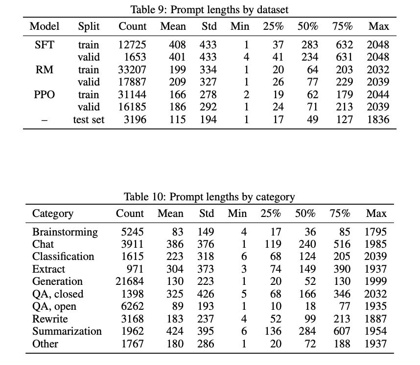

The companies that have users interacting with their models consistently have moats through data and habits. The models themselves are not a moat, as I discussed at the end of last year when I tried to [predict machine learning moats](https://www.interconnects.ai/p/ml-moats), but there are things in the modern large language model (LLM) space that open-source will really struggle to replicate. Concretely, that difference is access to quality and diverse training prompts for fine-tuning. While I want open-source to win out for personal philosophical and financial factors, this obviously is not a walk in the park for the open-source community. It\'ll be a siege of a castle with, you guessed it, a moat. We\'ll see if the moat holds.

To set the stage, in [that article](https://www.interconnects.ai/p/ml-moats) I explained what a moat is:

> In *old-school* technology companies, an important defining factor is how they can create a moat protecting investment from their (potential) competitors. Moats often involve technological advantages, users, data, and, most importantly, feedback loops. Feedback loops are what make users continue using the technology and give the companies the resources to make it an advantage more solid. Some modern examples include Office\'s incumbency for Microsoft, network effects at Facebook or Google, economies of scale at Amazon, branding and proprietary technology at Apple, etc.

At all points along the way, training a chatbot based on large language models is extremely data intensive. If you write out the steps in terms of major technical milestones, it'll include (simplified):

1.  Train a base multilingual multi-task language model.

2.  Fine-tune the model to answer instructions. People are hacking together solutions for this step (a classic in NLP)

3.  Fine-tune the model further with RLHF to match user values and interests. This is the fine-tuning step I refer to above, extremely new to NLP.

When you hear about recent developments in open source models, it is driven primarily by the release of a better base model (step 1) with a sprinkle of creativity in the initial fine-tuning to make the model answer questions (rather than just predicting the next token ad nauseam. From there, the second (and especially the third) component takes entirely new datasets, engineering infrastructures, and expertise. All three of these are expensive and have been primarily developed behind the closed doors of for-profit companies.

Some numerical rules of thumb that are discussed in this space (they\'re roughly based on the [InstructGPT](https://proceedings.neurips.cc/paper_files/paper/2022/file/b1efde53be364a73914f58805a001731-Paper-Conference.pdf) and [Anthropic](https://arxiv.org/abs/2204.05862) papers) are that step two takes at least 10k written responses for instruction tuning and step three takes at least 100k comparisons to train a useful reward model and run RLHF (the exact split between reward modeling and RLHF is not clear known). Essentially, once you have the pretrained language model, the next step is to make 6 dataset splits for training for a model with RLHF (see table below from InstructGPT, a now relatively old method). You\'ll have test+train splits for instruction tuning, reward model training, and RL optimization. The details of best practices for managing each of these distributions are very unknown and it\'s expected that the last two data subsets in the RL part should be continually updated as model use cases are understood.

While these numbers don\'t sound like a lot on the first pass when these models are trained on trillions of tokens of data from the internet. The challenge is that the distribution and quality of these must match a very narrow distribution and form. These prompts can almost never be scraped. For example, we\'ve examined some open-source datasets on prompts given to ChatGPT (e.g. from ShareGPT), and a generous interpretation of a \"useful\" prompt leads to only about a 50% acceptance rate from the source data. On top of the inherent quality challenge, some extremely open undocumented datasets like this are barely cracking the 100k training samples region when filtering out obvious not useful prompts.

Now, compare these orders of magnitude to how many queries places like Google and OpenAI are getting. I would posit that both of these organizations may get 100k prompts entered per day. Obviously, the filtering challenges still exist, but that is a huge advantage. Additionally, if OpenAI were to open source the prompt datasets alone, they have more information associated with it that they surely won\'t release: user behavior data. There will be buckets of prompts that are from \"extremely high-quality users\" and things that are likely way easier to filter or tune to be useful.

There are already some criticisms of this analysis, such as the [Open Assistant dataset](https://huggingface.co/datasets/OpenAssistant/oasst1). This dataset is very impressive --- it\'s the most performant for instruction tuning that we have found. The data distribution here is almost certainly very different from those used to successfully RLHF at scale. I suspect we will figure out some differences, and they\'re likely to be addressed, but I don\'t think the open-source data will be even 75% of the quality of the closed-source counterparts. There are controls in place for the data curation pipelines these companies are paying millions of dollars for --- it\'s not throwing money into the void.

Second, there is simply consumer bias and association moats. The general rule of thumb is that it takes an experience being about 10x better for the average user to switch away from their existing habit. Even if Bing was twice as good as Google, most people would not change. The consumer economy is not driven by tech workers in the hyper newsletter-obsessed news cycle. OpenAI is multiple steps along the path towards ChatGPT being the default word that people use to mean \"talk to an AI,\" much like \"Google it\" will still be said for decades after Google goes out of business. It amazes me how much people discount this.

------------------------------------------------------------------------

To really take my liberty in this refute, I wanted to do the rare \"line by line\" commentary on some excerpts from the leaked memo. I think while everyone heard about this piece, it\'s pretty clear few people read it in full. In general, the article makes some major issues along the lines of who will drive the most economic value from using these models and what their incentives are, what caused recent open source progress in LLMs, what a moat is (they never defined it), time gaps between launches of independent projects (long projects launched on the same day doesn\'t mean progress is accelerating), and more.

The article was pretty good at understanding trends in ML, but pretty lacking at understanding Google/OpenAI\'s position in all of it.

The article lists some clear challenges to Google\'s approach to deploying LLMs for users, listing:

> **LLMs on a Phone:** [People are running foundation models on a Pixel 6](https://twitter.com/thiteanish/status/1635678053853536256) at 5 tokens/sec.

I almost find all of these totally irrelevant to the question at hand. Which of these makes it harder for Google to realize the upside of its investment? People running LLMs on their phones doesn\'t mean they\'ll run another company\'s LLMs on their phone --- Google could ship API access to Palm2 in a new Android version and utilize phone tensor processing units for \"free\" computing. OpenAI is more at risk here, but not a big one.

> **Scalable Personal AI:** [You can finetune a personalized AI on your laptop in an evening.](https://github.com/tloen/alpaca-lora)

Google is the company that maximizes the quadrant of user data vs. AI capabilities by far. This means, with some simple prompting (in the style of the distributed Chrome user-grouping [FLoC](https://privacysandbox.com/proposals/floc)) Google will probably serve way more fine-tuned assistants than anything I train on my laptop. Think about how good ChatGPT would be if it knew your routines, schedule, and location in the world. Consumer behavior will default much more strongly to what is most useful, rather than what can be done.

> **Responsible Release:** This one isn't "solved" so much as "obviated". [There are entire websites full of art models with no restrictions whatsoever](https://civitai.com/), and text is [not far behind.](https://medium.com/geekculture/list-of-open-sourced-fine-tuned-large-language-models-llm-8d95a2e0dc76)

As the economy is driven almost entirely by corporate activity, all of the sketchily licensed datasets and models out there will be effectively irrelevant to the moat discussion.

> **Multimodality:** [The current multimodal ScienceQA SOTA was trained in an hour](https://arxiv.org/pdf/2303.16199.pdf).

This point is again irrelevant but reiterates how AI is moving fast. Velocity doesn\'t change the dynamics determining who was moats now, it could change those players later on.

The author then continues to point out the implications for Google:

> **We have no secret sauce.** Our best hope is to learn from and collaborate with what others are doing outside Google. We should prioritize enabling 3P integrations.

Most digital companies don\'t really have a secret sauce, they have very small permutations to the recipe that at scale create substantially different experiences. The general architecture for GPT4 has been mostly known since the week of its announcement (or even well before with respect to some pieces, like the mixture of experts), but that doesn\'t mean any models remotely close to it are available now. AI technologies combine the impact of small technological differences with huge capital requirements of scale. I suspect of the funding tsunami from the last 6 months, most of them will fail, but we\'ll see most of the AI players of the future entrenched for the next decade as the few startup successes + big tech.

> **People will not pay for a restricted model when free, unrestricted alternatives are comparable in quality.** We should consider where our value add really is.

This is why ChatGPT and Bard are free. This is the kind of point that made me think that people just didn\'t read the article.

> **Giant models are slowing us down.** In the long run, the best models are the ones which can be iterated upon quickly. We should make small variants more than an afterthought, now that we know what is possible in the \<20B parameter regime.

The author clearly didn\'t know that Palm2 was coming and was supposedly smaller than the original Palm and drastically more performant ([more leaked info on Palm2 here](https://www.cnbc.com/2023/05/16/googles-palm-2-uses-nearly-five-times-more-text-data-than-predecessor.html)). The key factor of Palm2 (recently announced at GoogleIO) is that it was trained for longer on high-quality data. Essentially, companies are trading off increased costs of data curation to save on the long-term costs of inference. This tradeoff didn\'t make as much sense when the business case of LLMs was unknown, but it\'ll be here to stay in the coming years.

On my third glance, I finally read the fine print at the top of the Semi Analysis piece, and I think it should\'ve been a big red banner go-to-jail, do-not-pass-go sign to prevent this mindset from locking into the entire technology workforce.

> We do not agree with what is written below, nor do other researchers we asked, but we will publish our opinions on this in a separate piece for subscribers. We simply are a vessel to share this document which raises some very interesting points.

The most brutal part of the article for Google is probably in the conclusion:

> But the fact of the matter is, we are already sharing everything with \[OpenAI\] in the form of the steady flow of poached senior researchers.

While not everything is easy at these companies, they have a lot of structural advantages. People have to remember that.

------------------------------------------------------------------------

### *Extras*

After the core points, the author goes on to make some more points that aren\'t too relevant to the article, but I thought would be fun to touch on for other readers, such as

> **LoRA is an incredibly powerful technique we should probably be paying more attention to** \
> \
> [LoRA](https://arxiv.org/abs/2106.09685) works by representing model updates as low-rank factorizations, which reduces the size of the update matrices by a factor of up to several thousand. This allows model fine-tuning at a fraction of the cost and time. Being able to personalize a language model in a few hours on consumer hardware is a big deal, *particularly* for [aspirations that involve incorporating new and diverse knowledge in near real-time](http://www.internalgooglesitescrubbedbyus.com/). The fact that this technology exists is underexploited inside Google, even though it directly impacts some of our most ambitious projects.

I agree entirely. LoRA is going to be huge going forward for the commercialization and democratization of AI. Check it out.

> **Data quality scales better than data size**\
> \
> Many of these projects are saving time by [training on small, highly curated datasets](https://bair.berkeley.edu/blog/2023/04/03/koala/). This suggests there is some flexibility in data scaling laws. The existence of such datasets follows from the line of thinking in [Data Doesn\'t Do What You Think](http://www.internalgooglesitescrubbedbyus.com/), and they are rapidly becoming the standard way to do training outside Google. These datasets are built using synthetic methods (e.g. filtering the best responses from an existing model) and scavenging from other projects, neither of which is dominant at Google. **Fortunately, these high quality datasets are open source, so they are free to use.**

You can\'t reiterate this enough.

> **We need them more than they need us** \
> \
> Keeping our technology secret was always a tenuous proposition. Google researchers are leaving for other companies on a regular cadence, so we can assume they know everything we know, and will continue to for as long as that pipeline is open.
>
> But holding on to a competitive advantage in technology becomes even harder now that cutting-edge research in LLMs is affordable. Research institutions all over the world are building on each other's work, exploring the solution space in a breadth-first way that far outstrips our own capacity. We can try to hold tightly to our secrets while outside innovation dilutes their value, or we can try to learn from each other.

Eh, what about the fact that the wave of open-source models the author is losing their shit on is collectively trained mostly on ChatGPT/GPT4 outputs? Seems like they needed \"us\" more than anything else. The targets for the future are also being set by OpenAI (mostly), which is pretty central to ecosystem development. Of course, I could go on and on about the value of open source for a long time.

------------------------------------------------------------------------

*Elsewhere from me and my network this week:*

-   *We launched a coding assistant language model, check it out [here](https://huggingface.co/blog/starchat-alpha).*

-   *We launched an [evaluation leaderboard](https://huggingface.co/spaces/HuggingFaceH4/open_llm_leaderboard) for open-source LLMs.*

-   *Another good [intro to RLHF post](https://huyenchip.com/2023/05/02/rlhf.html) from Chip Huyen (good to read multiple if you're trying to master it).*

-   *An [announcement from the White House](https://www.whitehouse.gov/briefing-room/statements-releases/2023/05/04/fact-sheet-biden-harris-administration-announces-new-actions-to-promote-responsible-ai-innovation-that-protects-americans-rights-and-safety/) about a red-teaming / generative AI workforce that I or colleagues from HuggingFace will help with!*

*Thanks [Ian](https://twitter.com/iandanforth) for finding a typo!*
