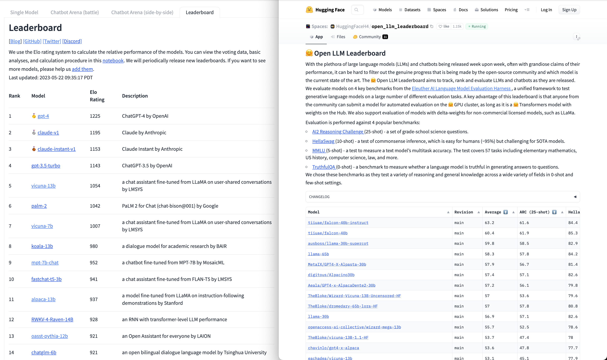
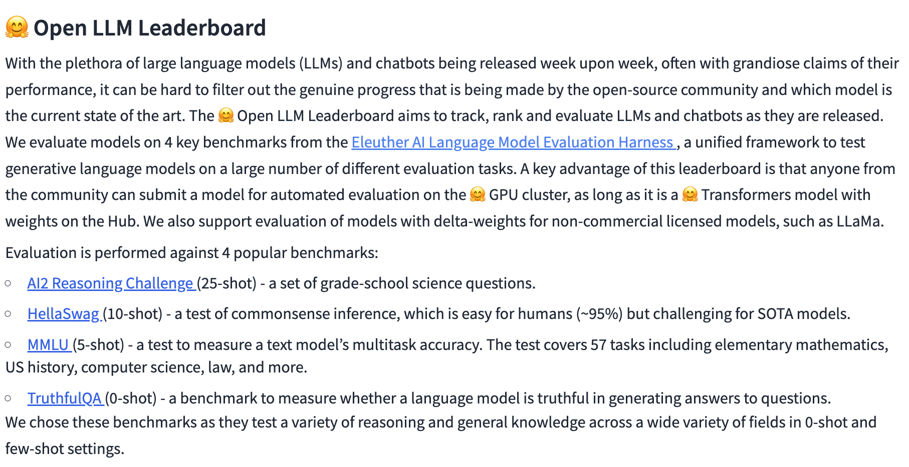
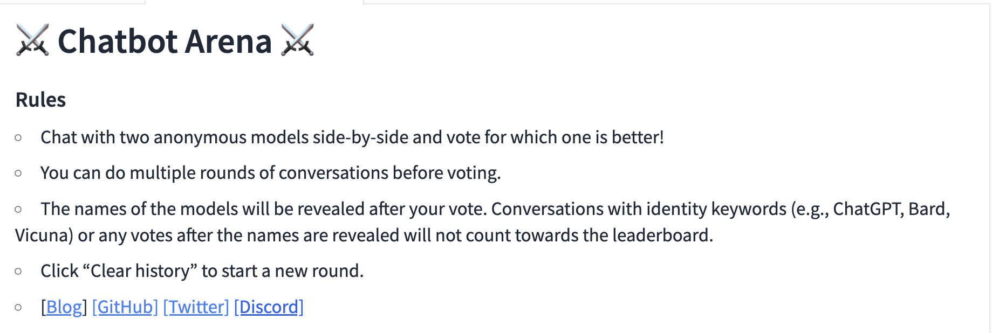
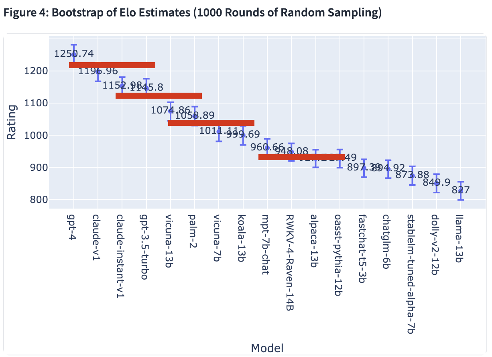

Evaluation is critical to ML systems. Every student is taught about the regimes of underfitting and overfitting during the training of a model --- this is our first encounter with evaluation via a validation set. Though, in modern ML systems, the training loss only serves as a *local evaluation*: ie, how well your setup functions. In reality, when using ML systems for any application, we care about *global evaluation*: ie, how well your model compares to its peers.

In the goal of making open-source models viable alternatives to central mega-models, evaluations will be a central piece. The hypothesis I put the most weight in is that **open source wins by offering a smaller, better model for each use-case/area**. The giant models are the best horizontal project, but there are very few technology solutions where you need your model to be able to solve many tasks *and they are inherently in lower margin applications* like chat. Understanding the types of tasks covered by these small models is still very much in its early, diamond-in-the-rough days, but as the capabilities overhang of LLMs changes, the market-model fit will change. To get an idea of things that different models could be good at, you can look at some task distributions from Vicuna model evaluations or high-quality annotation data:

-   Vicuna task examples (from the [blog post](https://lmsys.org/blog/2023-03-30-vicuna/#how-good-is-vicuna)): writing generation, role-play, common-sense, fermi, counterfactual, coding, math, generic, knowledge.

-   Annotated instruction category examples (see [InstructGPT paper](https://arxiv.org/pdf/2203.02155.pdf) for example): writing generation, question answering ([open and closed](https://arxiv.org/pdf/2203.02155.pdf)), brainstorming, chat, editing, summarization, etc.

These are huge lists! It helps make the picture a little clearer to say that you\'ll want a model to cover at max two or three tasks above (some tasks will synergize well). To do so, it will likely be a model fine-tuned on a curated dataset of examples, nothing crazy. I\'m sure people have started doing this.

That leads us to/at the point where there are tons of models being trained, but a lack of evaluation tools to create a map of strengths and weaknesses of all the models. Finding the right model to use on a specific task, e.g. mathematics, is just a little too hard still. It doesn\'t seem like a tractable job for a single employee at the long tail of companies that want to do this when they\'re tracked to improve the performance of some product and LLMs maybe could do that. This environment is suited to the mega-models getting market share because they work out of the box, but not because they\'re efficient or the best for the bottom line. Model tracking and searching are very likely to grow out of the environment where people realize there are models out there that likely can do their task very well, but they don\'t have a method to find it. The model you\'re looking for is probably on HuggingFace, but it will have no model card describing its training process or capabilities.

The rough outlines on this capabilities map of open-source models will correspond to general metrics and siloed forms of evaluation. Two contenders have entered the space for this. We have:

1.  The [Open LLM Leaderboard](https://huggingface.co/spaces/HuggingFaceH4/open_llm_leaderboard) from my team at HuggingFace. This leaderboard delivers an automatic evaluation of models on HuggingFace across a series of classic NLP benchmarks.

2.  The [ChatBotArena Leaderboard](https://chat.lmsys.org/?arena) from my friends at LMSys. This leaderboard derives Elo estimates from users interacting with models on the website.

Throughout this piece, I\'ll refer to them as the Open Leaderboard and ChatBot Leaderboard. They\'re wonderful tools for understanding the landscape, but they\'re extremely limited.

The Open LLM Leaderboard largely serves as the leaderboard for base model performance / simple instruction following performance. All of the benchmarks now are multiple-choice question and answering, hence the `random` baseline at the bottom (it would be a shame if a learned model did worse than random guessing). Soon, the leaderboard will also add human and GPT4 ratings across a secret validation set of tasks. Instruction following in my mind is a good starting point for understanding how well a model can work with human inputs.

The ChatBot Leaderboard addresses a different niche: how good are models at participating in open-ended conversations from a biased set of users? Getting a set of crowd-workers to label responses in the style that you want is extremely hard (take a look at the thoroughness of [InstructGPT\'s training document](https://docs.google.com/document/d/1MJCqDNjzD04UbcnVZ-LmeXJ04-TKEICDAepXyMCBUb8/edit)), so relying on the results of doing this should come with contextualization. Second, almost all the users of Chatbot Arena are very likely to be technical. Technical users ask the models questions that pertain to them (code, random trivia, etc.). Third, doing any type of demo like this get\'s you lots of similar questions. Similar prompts is not necessarily a problem if your evaluation accounts for it, but in open-ended side-to-side battles, I don\'t know. LMSys can tell us. Ultimately, it\'s important to remember that the ChatBot Leaderboard shows a specific signal very strongly.

Below are the operational rules for the ChatBot Leaderboard data sourcing:

These choose-which-is-better rankings roughly fall into a quadrant with three comparison types. For a given prompt, both models can either give a generally acceptable or poor response. From this, we can compare poor-poor responses, acceptable-poor pairs, or acceptable-acceptable. I bet **a lot of wins in the ChatBot Leaderboard are just selecting good over bad**. This is the foundation of the signal. When selecting between two answers that are close, really specific training is needed for tiebreaks to see which model is better. This could be one cause of some model clusters in their ranking.

Below is a modified version of the Elo rankings bucketing models by 95% percentile ranges. I added the red lines to show you which models you should assume are similar to chatbots. There are different tiers of models, but there are not very big differences between many.

These two leaderboards don\'t really give enough information for any company to make final decisions in my opinion. The specifics fall in the details of shortcomings and biases that are extremely hard to address.

## Paper results vs. reproduced results via prompting

It\'s come out that there are popular models where the results in the launch announcement/paper differ substantially from the Open Leaderboard or other reproductions ([e.g. for LLaMa](https://huggingface.co/spaces/HuggingFaceH4/open_llm_leaderboard/discussions/26), which was seconded in the Falcon model announcement). This is epitomized by the GPT4 launch and [questions around the Bar exam evaluation](https://twitter.com/mmitchell_ai/status/1663217329029939201) or [evaluation data leakage into the training set for code](https://www.reddit.com/r/MachineLearning/comments/122ppu0/d_gpt4_and_coding_problems/). There are two issues here: a) the training data corruption (easy to prevent and check for by looking at log-likelihoods over the sequence) and b) the sensitivity of evaluation to prompting (e.g. LLaMa evaluated on proprietary prompts that were not released). I don\'t think anyone knowingly corrupts their evaluation data, but when you\'re dealing with internet-scale scrapes, it\'s impossible to double-check everything. I think OpenAI "got got" by this, but there\'s little to gain by admitting to evaluation leaking.

Onto the system prompting discussion \-- this topic will come up a lot in the future. The difference here is that the setup is sensitive to the system prompt appended before every task in evaluation, which is very different from the traditional sense of prompt engineering. The most prolific prompt engineers, such as [Riley](https://twitter.com/goodside?lang=en), likely would be good at tuning the system prompt, but the scope of prompt engineering is normally much bigger: how to get any desirable or undesirable behavior out of a model by different sequences of prompts. Here\'s how the prompts fit together:

    === SAMPLE PROMPT ===
    <|system|> You are a language model, help me. I gave you this good system prompt. <|end|>
    <|user prompt|> Here's the normal prompt: what do you want to hear? <|end|>
    <|assistant|> 
    =====================
    RESPONSE: As a language model...

The Open LLM leaderboard currently uses an empty system prompt for all of the evaluations to avoid the problem of needing to fine-tune it for all models (there are hundreds on the leaderboard already). It\'s very likely that some models include examples of answering multiple choice questions in the prompts before soliciting a response to each question. There are very real technical problems around setting this up for evaluating hundreds of open-source models: Do you use the same prompt for every model? Who supplies the evaluation prompt? Do you allow users to submit code to run with it (security risk)?

The short-term solution is to implement a set of prompts in the leaderboard that users can choose from when selecting a model. This on its own is a good bit of work (took me a couple of days to get right for about 5 open source models). You can view an example of the complexity of prompting templates for conversation [in FastChat](https://github.com/lm-sys/FastChat/blob/main/fastchat/conversation.py). I won\'t get into the nitty gritty of needing to make sure that the tokenization scheme is correct at evaluation, but that\'s a second layer that follows a similar argument as the system prompt.

## Human evaluation vs. mega-model evaluation

A very common line in the announcement of new open-source models replicating ChatGPT is that *our model beats ChatGPT in binary comparisons N% of the time*. These evaluations are often done via GPT4 and rarely done with something like Amazon Mechanical Turk. It\'s clear to me that GPT4 will have a style of response that it likes that does not have to mirror what users want. I expect this style to roughly correspond to what the reward model was trained on / the RLHF process optimized for: some mix of higher quality human-written responses or human-preferred responses. This style is extremely hard to quantify, but many models are announcing their performance with the evaluation as a baseline. It\'s another case of the information they\'re providing is useful but with asterisks or contextualization.

It\'s all deeply related to the idea that you cannot easily imitate proprietary LLMs because you only have access to inference data and not the human preference or raw red-teaming data needed to fully extract information from the model (see a recent [paper](https://arxiv.org/abs/2305.15717) on it + [Reddit discussion](https://www.reddit.com/r/MachineLearning/comments/13s6pb7/r_the_false_promise_of_imitating_proprietary_llms/)). Models before RLHF and safety layers have the capability to produce a much larger distribution of information. When you train a model on these outputs, you\'re restricting your base model\'s outputs to the already filtered distribution the closed model provider decided on. This was also discussed in [John Schulman\'s recent talk](https://www.youtube.com/watch?v=hhiLw5Q_UFg) on maintaining truthfulness in LLMs (via RLHF).

In our experiments, we found that humans have a second position bias when rating between two responses, maybe a recency bias, and GPT4 has a first position bias when given the same data (not yet public, will share shortly). This comes back to the start of the article: we\'re using one-dimensional tools to make all the decisions for a complex piece of technology. I\'m really excited to see more variety in benchmarks emerge in the next few years. The core of them will be ways to measure offline how your user impressions can be improved online.

For example, we don\'t really care what happens with our models side by side with another model, we care if our model leaves the customer feeling satisfied with their task completed. Correlating these metrics between qualitative preference and downstream performance will become increasingly challenging as the minimum bar for a trained LLM improves. There is also a good chance that a specific language style emerges as preferred for language models\' generations that is very different from how humans speak --- sort of like how I can spam gibberish into my search bar knowing that Google will still get the right answer.

**The short term evaluation fix I see is curated held-out prompt sets for each task distribution with human evaluation**, which can evaluate your base, IFT, and RLHF models. By creating a new set of 100s of prompts (even with the help of models like GPT4), you're in control of the distribution of asks in the data and have a lot easier time comparing results on a per model basis. Then, you compare the generations of each response with suitable ordering randomization and control over the demographic distribution of your labelers. It certainly still has many of the same bias problems[1](#footnote-1){#footnote-anchor-1 .footnote-anchor component-name="FootnoteAnchorToDOM" target="_self"}, but having a control set of prompts is very different from the open-ended chat battles with constant distribution shift. I've done [this for code tasks](https://huggingface.co/datasets/HuggingFaceH4/code_evaluation_prompts) and expect to do the prompt generation again in the future.

At the end of the day, we should be striving for methods that are even *causal* to performance, but I think that may be too far-fetched. Until then, the companies with language models in the loop of products and services will likely need to do direct AB testing on their customers as the ground truth of evaluation. We\'ll keep these leaderboards and more in the quiver of training practices that help us get the model in the right ballpark before we run the online tests.

Thanks for reading!

*Thanks to [Vikram](https://www.vikrams.io/) for some early feedback on this post. Thanks [Elliot](https://elliottower.github.io/) for pointing out there is also [ChatArena](https://github.com/chatarena/chatarena) with ChatBotArena...*

:::: {.footnote component-name="FootnoteToDOM"}
[1](#footnote-anchor-1){#footnote-1 .footnote-number contenteditable="false" target="_self"}

::: footnote-content
When using human labeling companies, each labeler only provides data for 3-4 samples out of a batch of 1000, so you end up being pretty well diversified in that regard.
:::
::::
