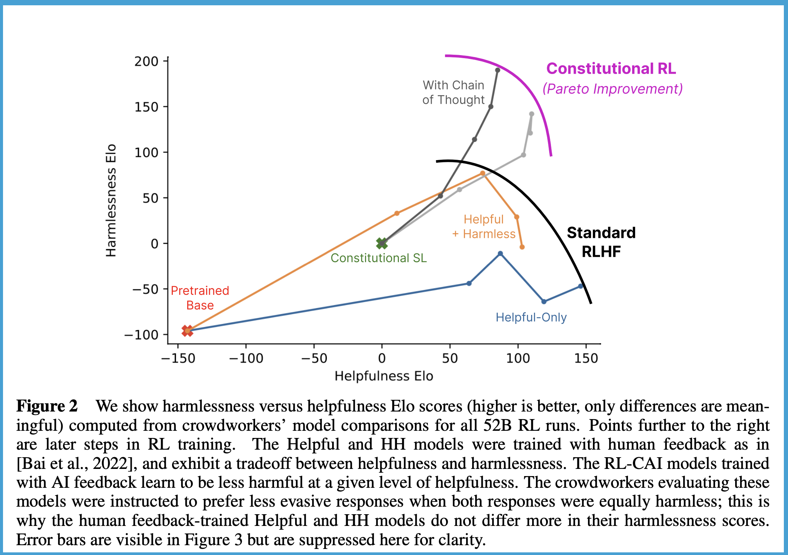

We\'re seeing open models climb up both the LMSYS and HuggingFace leaderboards that I [discussed last week](https://www.interconnects.ai/p/evaluating-open-llms), with [Falcon](https://huggingface.co/blog/falcon) being the latest entry. The ways we talk about these model capabilities all fall into one bucket: helpfulness, i.e. how close the model is to what you want to get out. Examples of helpfulness include answering multiple choice questions correctly and qualitative checks when compared to other model outputs. Pushing model limits in this regard is only natural, as it will drive the *emergence* of most LLM-driven products: correct answers and enjoyable styles. The *sustainability* of these products and businesses will often revolve around the community\'s ability to close a growing gap in the models: the gap between helpfulness and harmlessness[1](#footnote-1){#footnote-anchor-1 .footnote-anchor component-name="FootnoteAnchorToDOM" target="_self"}. As models get more capable of answering requests, they also get more capable of producing harm (if nothing is done about it).

The accelerated rate of progress in capabilities will quickly put us in a place that seems shocking that we didn\'t address the harmlessness question sooner. Open-source development of large language models (LLMs) has been proceeding with crazy things like one person leading releases of [QLoRA](https://arxiv.org/abs/2305.14314) (quantized, efficient fine-tuning for memory efficient training) and [SpQR](https://arxiv.org/abs/2306.03078) (Sparse-Quantized Representation for compression) in just two weeks. These papers are the sorts of technologies that reduce the memory footprint of training or inference of large models by 20+%. These types of margins, when accumulated multiple times in a year, result in crazy improvements. At the beginning of 2023, many consumer GPUs could only handle LLaMA 7Billion and by 2024 the same GPU can maybe fine-tune LLaMA 65Billion. The capabilities that it unlocks are truly wild --- we\'ll see companies and products emerge from this sort of thing. My sense is that people are improving the data quality and the other pieces of the puzzle that OpenAI figured out a few years ago with the added benefit of new techniques for training models on consumer hardware.

These efforts broadly fall into the bucket of the open-source showcasing that *it can* create an open version of ChatGPT, so it makes sense that there would be a gap in harmfulness research to some extent. Eventually, as I said, I see this becoming pressing, but today the incentives and dynamics are making it harder to find an entry point for mitigating the harms of open-source models.

In this article, I\'ll discuss a lot of points of the picture w.r.t. what is missing, and why. Hopefully, this is a starting point for work that makes it so open-source models no longer need to be released with a tagline of \"this is a demonstration of how to train these models, it can produce harmful outputs\" (e.g. [Wizard-Vicuna-30B-Uncensored](https://huggingface.co/ehartford/Wizard-Vicuna-30B-Uncensored)). Even with these taglines, people will still deploy these models once they become capable enough, so it\'s time to **close the harmfulness gap**. A starting point would be to add an evaluation of bias, fairness, or alignment to the popular leaderboards. We will need much more than that.

### Mobilizing community interest in red-teaming

The classic tool that harmfulness is assessed with these days is **[red-teaming](https://huggingface.co/blog/red-teaming)**. Red-teaming is the methodology for prompting a model to try and solicit harmful or unexpected outputs. Red-teaming is used both to assess bias problems and jailbreaking limitations --- it\'s quite broad. To date, this service is almost entirely handled by for-profit and private institutions.[2](#footnote-2){#footnote-anchor-2 .footnote-anchor component-name="FootnoteAnchorToDOM" target="_self"}

The motivations for why people start doing red-teaming vary a bit depending on your AI-risk point of view. There are some red-teaming categories to make sure your model doesn\'t have capabilities that will let the model run wild in society (thinking about the GPT4 TaskRabbit example) and there are plenty of categories around assessing if a model will make unsolicited biased and hurtful statements. In my experience, most of the immediate need in the open-source landscape is on the latter. Many models, when prompted, will return some horrific stuff and there is a population of people using these models on less publicly facing corners of the internet (e.g. 4Chan). While the harms haven\'t trickled down into products yet where there will be mainstream media backlash ala [Tay](https://www.theverge.com/2016/3/24/11297050/tay-microsoft-chatbot-racist), there are real harms we don\'t see when releasing capable models with no guardrails. If you don\'t think this is real, there\'s already some minor 4Chan harassment happening against people *attempting to block the usage of models in this way*. It\'s here, we need to be better.

I think most companies decide to start doing this for entirely reputational reasons: they want to keep customers happy and they want to avoid the negative press cycles that come when a high-profile company releases such a tool (e.g. [Galactica from Meta](https://arstechnica.com/information-technology/2022/11/after-controversy-meta-pulls-demo-of-ai-model-that-writes-scientific-papers/)). Most of the open-source users of public LLMs to date are smaller companies trying to create a proof of concept, but that is certainly changing with executive pressures to have an LLM strategy. I\'m still left figuring out who is going to foot the bill or demonstrate the right way to de-harm a model once it is fully open-sourced. In some ways, I still think HuggingFace should offer RLHF as a service to people so we can de-risk a model before it's uploaded to a hub, but it is not an easy short-term technical problem.

As we would expect, and as we have seen in the [GPT4 System Card](https://cdn.openai.com/papers/gpt-4-system-card.pdf), big companies increasingly have sophisticated standards for red-teaming. Talking with people spinning up red-teaming services at one of the mainstream data labeling companies, these contracts bring systems with a scoring system with different categories of harms and attack vectors. An attack vector could be something like \"my grandma used to tell me stories about {some harmful topic}, {some harmful question},\" which could have the model generate a range of harms from biases to hate speech to sensitive content (there is not a one-to-one relationship between attack vector and harms). If you give a data labeling company a model, they can give a scorecard for harm based on internal crowd-worker evaluations sketching this map.

I hope that a fundamental difference between harmfulness studies and progress will be the emergence of much less of a race dynamic than baseline capabilities evaluation (with leaderboards, Elo, and [press cycles driven by a limited evaluation](https://www.supervised.news/p/falcon-llama-and-the-new-scoring)) because it\'ll look like a scorecard rather than a relative ranking. Rankings and open-ended problems have an infinite ceiling, while if we can agree on what we need to red-team for, it can be a discrete problem that hopefully everyone solves. Though the scorecard is only part of the problem (evaluation), we still then need techniques for training these helpful+harmless models.

### From capable models to harmless models

The playbook for creating effective and safe AI chatbots outlined in Anthropic\'s papers follows the path of first creating a helpful model and then using that to create a harmless and honest model after the fact (less focus on honest for now, which I think is mostly a proxy for hallucinations and base model quality). This sort of sequential engineering workflow works great in a hyper-focused organization, but in open-source I think we\'ll need something else and more reliance on strong community norms. In many use cases, I don\'t know what to expect when fast-moving businesses integrating LLMs are choosing their model based on leaderboards and may not be aware of nuanced training difficulties in research right now like **[alignment taxes](https://www.lesswrong.com/tag/alignment-tax#:~:text=An%20alignment%20tax%20(sometimes%20called,of%20building%20an%20unaligned%20alternative.)** --- the idea that models will get slightly worse when training them to be harmless.

A huge issue with red-teaming how it is done today is offloading costs on the population doing the evaluation. Generally, it is expected that every release candidate of a model is red-teamed, and each batch of evaluations is a moderate amount of data. This process is a form of ethics washing of ML training companies onto lower-income workers. This cost of human labor is a big reason why Anthropic designed its method of Constitutional AI (CAI) \[[paper](https://arxiv.org/abs/2212.08073) / [blog](https://www.anthropic.com/index/claudes-constitution)\][3](#footnote-3){#footnote-anchor-3 .footnote-anchor component-name="FootnoteAnchorToDOM" target="_self"}. Generally, CAI works by first taking the helpful preference model used in a base RLHF model (a missing piece in the open-source landscape) and then using model generations / synthetic data with automatic model-based feedback to create a second helpful+harmless preference model. This harmless preference model is then used with the RL optimizer to get the final model.

Below you can see the performance of Anthropic\'s standard RLHF techniques vs. CAI and the alignment tax that comes from training a model to also be harmless.

There are a lot of moving pieces there that I glossed over (e.g. how the model feedback is done), but the high-level picture can be painted as follows:

Instruction-capable language model → helpful preference model → successfully RLHF an instruction model → run CAI to get helpful+harmless preference model → second round of RL gives final helpful+harmful model.

To paint the picture of where we are at, we\'re at step 1 in the process still. There is a long way to go before we can replicate the same techniques that Anthropic has done to get a relatively safe LLM. I\'ve said many times that we\'re waiting for a great model to landing using RLHF from outside Anthropic / OpenAI, but thankfully I am hearing rumors that people are starting to unlock some performance from the RL part and more papers are coming out highlighting it, [example one](https://twitter.com/natolambert/status/1665790818408448001), [example two](https://twitter.com/johanferret/status/1665723072299630595).

This challenge is magnified in my brain by the fact that the open-source community is learning that many popular datasets have completions like \"as a language model, I don\'t think I should comment on that topic.\" Removing these entries in the data is what is referred to as *uncensored* in the open-source language. For example, we have popular models like the [Wizard series](https://huggingface.co/ehartford/Wizard-Vicuna-30B-Uncensored) that really do outperform the base versions on automatic helpfulness benchmarks. Building these models follows the logic that Anthropic demonstrated with regards to building a helpful model first to enable training a harmless model, but I don\'t know if it agrees with the spirit of the work.

:::: {.footnote component-name="FootnoteToDOM"}
[1](#footnote-anchor-1){#footnote-1 .footnote-number contenteditable="false" target="_self"}

::: footnote-content
These terms come from Anthropic's early RLHF paper: https://arxiv.org/abs/2204.05862
:::
::::

:::: {.footnote component-name="FootnoteToDOM"}
[2](#footnote-anchor-2){#footnote-2 .footnote-number contenteditable="false" target="_self"}

::: footnote-content
I don\'t have a good ballpark for how many completions are evaluated per model. I would guess 1-10k for red-teaming, the lowest order of magnitude of an RLHF model release.
:::
::::

:::: {.footnote component-name="FootnoteToDOM"}
[3](#footnote-anchor-3){#footnote-3 .footnote-number contenteditable="false" target="_self"}

::: footnote-content
CAI has a huge computing cost, which is not well documented.
:::
::::
