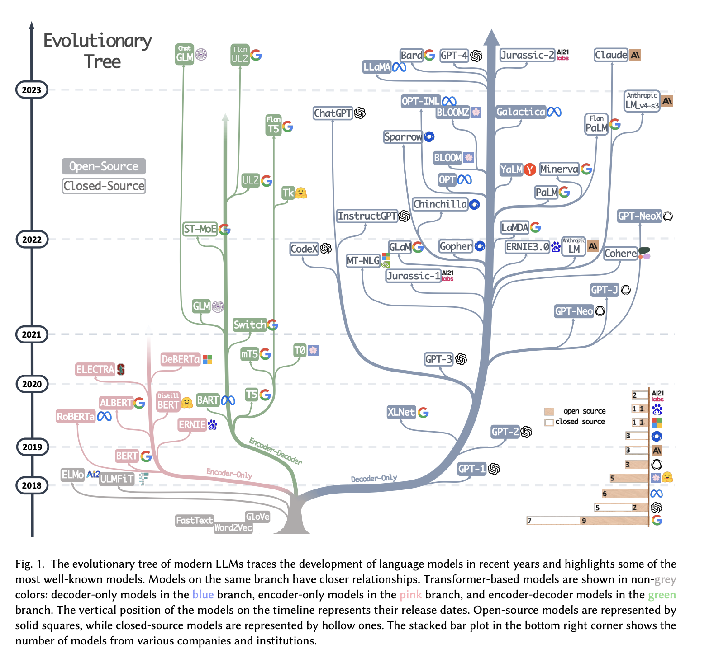

Before ChatGPT, most language models were accepted as being primarily research endeavors. In this landscape, you can get away with more rough edges on the models in terms of ease of use and cost scaling. In the immediate months around ChatGPT\'s launch, it actually seemed like **every large language model (LLM) of the future needed to be what ChatGPT was**, but this is turning out to be far from the case. Language models have a remarkable range of capabilities in terms of upfront costs, inference costs, prediction capabilities, amount of control, etc. We\'re early on in exploring these options. Given all of the opportunities, reproducing ChatGPT is more of a vibes goal for the open-source community rather than a real necessity because of how different open-source\'s stakeholders are. This article focuses on LLMs because they\'re timely, but I expect we see these dynamics play out for many other types of ML models in the future.

Open-source will develop LLMs that are mode capable over a specific set of needs, but less cumulatively capable. What this looks like is instead of taking the giant scorecard that GPT4 was touted on, you take 10-50% as the targets for an open-source model and beat GPT4. The other metrics will likely be behind, not equal. The language models coming out of the open-source community will also be substantially different for many reasons, including:

-   **Different model and data starting points**: GPT3 was still not open-sourced when the ChatGPT craze started, data standards are much higher now, and the RLHF existence proof exists. The NLP development progress for base models is heavily based on creating a smaller base model trained with your data + infrastructure, then iterating on many knobs to see how performance can be improved in this smaller domain. From there, the final biggest models are trained. Our models and infra are leading to different experiments than OpenAI would\'ve run years ago.[1](#footnote-1){#footnote-anchor-1 .footnote-anchor component-name="FootnoteAnchorToDOM" target="_self"}

-   **Different datasets and evaluations**: tons of open-source progress these days is being based on GPT4 evaluations of models, it\'s obvious that OpenAI didn\'t base its internal decision-making on how its in-progress language model worked, so the styles will diverge. With this, open-source teams get faster feedback (less pause between completion and launch) in a manner that is much more able to be translated to progress.

-   **Different teams**: OpenAI and Google are supposedly extremely modular with teams handling one part of the model. This results in a very narrow tree of development along the history of GPT models: each team continually iterates on their piece (much like other technology product life cycles). In open source, instead of big teams, there are many small teams reproducing every idea. This repetition makes the signal of what methods work reliably and which are dependent on luck much more clear. I would guess there are a couple of things OpenAI got lucky with that open-source may not. Something I\'ve learned deeply from working at HuggingFace: **An open-source community thrives when there are a plethora of options,** it removes any single point of failure and provides remarkable robustness to results.

In this worldview, if base models are rare, they\'ll be the cadence by which the wide trees of open models are \"reset\", giving open source opportunities to take jumps ahead (while companies will likely have much more consistent progress with regular improvements to the base model and fine-tuning). We\'ve seen this once with LLaMA, which was one of the most fun times to follow AI, and we\'re maybe going to see that again in the next few weeks if Falcon is notably better than LLaMA (I\'m not sure it is). If not, we eagerly await the next base model! The popular figure from an LLM survey after ChatGPT (below) is about to get much wider:

While we want to recreate ChatGPT, I think we\'re getting to the point where we should move on and accept we\'re getting something different. A big part of my thinking on this aligns with this [poignant thread](https://twitter.com/suchenzang/status/1667194733062656000) from Susan Zhang of Meta AI \-- the upfront costs to training models at the scale OpenAI operates is not going to be available to anyone except organizations that are committed to training the best models as their competitive advantage. Even in the company of startups with \$10s million to spend on computing, the actual compute you get (whether AWS GPUs vs. TPUs) can result in a 2-4x difference in training throughput. These differences are all things OpenAI and Google have almost surely worked through. There are extreme synergies that come when optimizing each point of the stack that will not be available soon to the long tail of people applying pressure to close this gap.

The cumulative spend of organizations/individuals committed to building in public could very well be higher than Google or OpenAI\'s, but this results in more options not one obviously better artifact.

------------------------------------------------------------------------

*Side note on if we should try to precisely reproduce ChatGPT / GPT4 or not: The power dynamics can dictate this conversation in a very different way, where if the things the OpenAI executives say are true about AGI + LLMs, then reproducing in nearly exact terms becomes much more pressing because of the political / power concerns. To me, the path to AGI via LLMs, if it exists, is very much not restricted to the path OpenAI is on, so we should be okay.*

------------------------------------------------------------------------

Within this worldview, we have a few buckets of players that\'ll contribute to which development direction of LLMs wins out most in the coming months. We\'re in the era of abundance, so how success is viewed by each of these groups really comes down to the relative margin to their peers. Generally, I think the buckets are most interesting to consider in a) how they train models, b) how they use them, and c) who uses them.

-   **Vertical big tech**: The first movers in the modern LLM movement, OpenAI, etc., train their models and use the artifacts themselves. Almost everything happens within their walled garden except for text outputs. This follows the most boring development path.

-   **Horizontal big tech**: The type of company that benefits from many people using a model. In this regime, a model is used on internal services but inference *can* be distributed (like users generating video, Meta, or on a user\'s device, Apple). These people want the open-source regime to proliferate and will build optimizations of popular systems into their ecosystems. I expect Meta to keep chucking ML models over their fence, but given how they\'re restricted on communications, the rate at which they iterate will be slower than full-on open-source.

-   **Open source**: The most distributed workflow. Tons of people train models, and even more, use them in a wide variety of commercial and non-commercial tasks. This will likely stay the central pulse of LLM development because updates are much more frequent (in things happening fast and more independent groups doing things).

-   **Academia**: I see this group returning to developing new ways of getting more out of less or getting a higher ceiling in performance.

*Of course, there are companies that fall at the border of these groups, but they then tend to demonstrate characteristics from both.*

The last three groups will mix and match advancements with each other making the development paths look mixed at first, but I think the trends will start to emerge in the long term. After the early years of AI research when things were chill and cushy, we need to re-establish the roles of each stakeholder creating AI artifacts.

Before the comments about Vicuna / Koala / etc. being academic and huge steps forward, I think these are results of the rapidly changing landscape rather than something we\'ll see sustainably from core academics. Most academics will be contributing demonstrations like new types of human feedback or fine-tuning techniques, rather than dropping the best models on a regular basis. We\'re at the stage where open model alternatives are transitioning from instruction fine-tuning (IFT) to full reinforcement learning from human feedback (RLHF) where the requirements on data costs and logistical management are easily 2-4x. The organizations that are successful with RLHF will likely be a strict subset of those releasing capable instruction/chat-tuned models.

At the same time, this academic angle is actually the one I\'m most uncertain about. The landscape of AI research had a solidly set equilibrium before this LLM-as-a-product phase kicked off. Now, I suspect the research where academics collaborate with industry continues to be quite similar, but those outside these privileged collaborations take a different approach (which is the majority of people, even if it is not the majority of work that you see). Supposedly, NLP research was already withering away to be just GPT3 fine-tunes before ChatGPT, so this craze may be nothing new, just an acceleration.

Where the majority of independent academic's work is likely to be fairly indicative of where developments in the field will emerge. The academic system, for all of its flaws, does regularly produce insight. People will start figuring out how to do LLM research other than fine-tuning OpenAI\'s APIs now that there is more industrial and open-source competition in that space, but it takes a bit for new research incentives (such as the tons of AI safety for LLM research money).

## Research reproduction as a hype mitigation factor

I\'ve been trying to come up with more reasons for the argument for open-sourcing language models and research other than the \"we\'ve always done it this way\" and \"accountability,\" two reasons that corporations are always going to be quick to fold on. The counterfactual I would love to run is: **does the release ChatGPT and GPT4 with full technical papers release the hype dynamics** endemic to society right now? When the process is obscure, it\'s easier for corporations and influencers to dictate communications trends that are based on vibes and not reality. Flipping the switch of both AI\'s capabilities and how AI is discussed in the public sector at the same time is unfortunate.

That comes to the increasingly rare topic of open reproduction. It\'s what we\'re trying to do at HuggingFace this year even though we\'re yet to release a paper. This type of work would hopefully inform the public about the little things needed to reproduce AI artifacts that are in the average-American discourse, even if has a 12-18 month delay.

The more the groups that are willing to be open about LLMs progress, the more grounded our society\'s communications could become, I hope.

------------------------------------------------------------------------

*Elsewhere:*

-   *My team published a [long post](https://huggingface.co/blog/llm-leaderboard) analyzing how GPT4 evals may compare to human preference evals.*

<!-- -->

-   *I enjoyed this Substack post on the nature of RL research. The thing is, this is happening in many other ML fields too.*

    ::::::::: {.embedded-post-wrap attrs="{\"id\":125187313,\"url\":\"https://proceduralia.substack.com/p/to-keep-doing-rl-research-stop-calling\",\"publication_id\":1701074,\"publication_name\":\"Pierluca’s Substack\",\"publication_logo_url\":\"https://substackcdn.com/image/fetch/f_auto,q_auto:good,fl_progressive:steep/https%3A%2F%2Fsubstack-post-media.s3.amazonaws.com%2Fpublic%2Fimages%2F34c469cf-fcf6-43a5-8442-1e8ea38e288a_2451x2450.jpeg\",\"title\":\"To keep doing RL research, stop calling yourself an RL researcher\",\"truncated_body_text\":\"An irrepressible, uncontainable, uncontrolled stream of papers proposing the use of pretrained Large Language Models (LLMs) for sequential decision-making is manifesting itself. Armed with hand-crafted representations of the world and pages and pages of carefully-engineered prompts, LLMs seem to show unprecedented abilities that allow them\",\"date\":\"2023-06-01T14:25:14.153Z\",\"like_count\":2,\"comment_count\":1,\"bylines\":[{\"id\":116317201,\"name\":\"Pierluca D'Oro\",\"handle\":\"proceduralia\",\"previous_name\":null,\"photo_url\":\"https://substack-post-media.s3.amazonaws.com/public/images/34c469cf-fcf6-43a5-8442-1e8ea38e288a_2451x2450.jpeg\",\"bio\":\"Machine learning researcher in Montreal.\",\"profile_set_up_at\":\"2023-06-01T02:13:52.302Z\",\"publicationUsers\":[{\"id\":1679386,\"user_id\":116317201,\"publication_id\":1701074,\"role\":\"admin\",\"public\":true,\"is_primary\":false,\"publication\":{\"id\":1701074,\"name\":\"Pierluca’s Substack\",\"subdomain\":\"proceduralia\",\"custom_domain\":null,\"custom_domain_optional\":false,\"hero_text\":\"My personal Substack\",\"logo_url\":\"https://substack-post-media.s3.amazonaws.com/public/images/34c469cf-fcf6-43a5-8442-1e8ea38e288a_2451x2450.jpeg\",\"author_id\":116317201,\"theme_var_background_pop\":\"#EA410B\",\"created_at\":\"2023-06-01T02:15:07.036Z\",\"rss_website_url\":null,\"email_from_name\":null,\"copyright\":\"Pierluca D'Oro\",\"founding_plan_name\":null,\"community_enabled\":true,\"invite_only\":false,\"payments_state\":\"disabled\"}}],\"is_guest\":false,\"bestseller_tier\":null}],\"utm_campaign\":null,\"belowTheFold\":true,\"type\":\"newsletter\",\"language\":\"en\"}" component-name="EmbeddedPostToDOM"}
    {.embedded-post native="true"}

    ::: embedded-post-header
    {.embedded-post-publication-logo loading="lazy"}[Pierluca's Substack]{.embedded-post-publication-name}
    :::

    :::: embedded-post-title-wrapper
    ::: embedded-post-title
    To keep doing RL research, stop calling yourself an RL researcher
    :::
    ::::

    ::: embedded-post-body
    An irrepressible, uncontainable, uncontrolled stream of papers proposing the use of pretrained Large Language Models (LLMs) for sequential decision-making is manifesting itself. Armed with hand-crafted representations of the world and pages and pages of carefully-engineered prompts, LLMs seem to show unprecedented abilities that allow them...
    :::

    ::: embedded-post-cta-wrapper
    [Read more]{.embedded-post-cta}
    :::

    ::: embedded-post-meta
    2 years ago · 2 likes · 1 comment · Pierluca D\'Oro
    :::
    :::::::::

:::: {.footnote component-name="FootnoteToDOM"}
[1](#footnote-anchor-1){#footnote-1 .footnote-number contenteditable="false" target="_self"}

::: footnote-content
Training tools for multi-parallel, large ML like [deepspeed](https://github.com/microsoft/DeepSpeed) and others for high throughput probably matter a lot too. Though, I am not an expert here.
:::
::::
