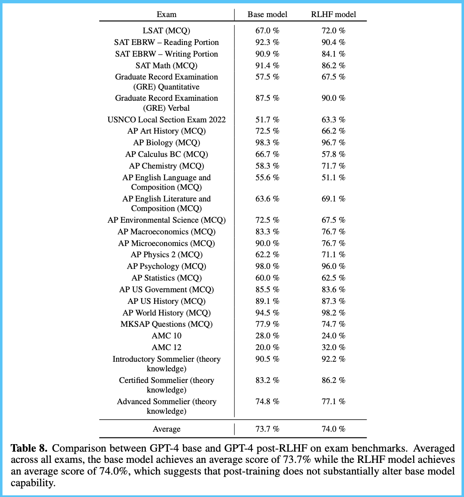
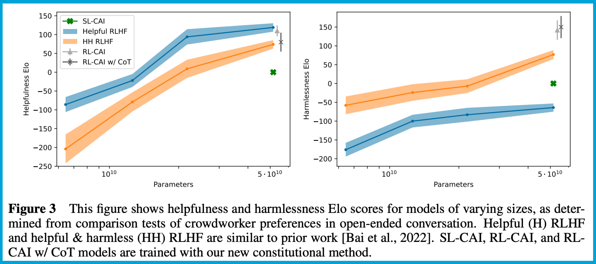

The question I still get the most is \"Why does reinforcement learning from human feedback (RLHF) work?\" Until last week, my answer was still \"no one knows.\" We are starting to get some answers.

RLHF ultimately will work in the long term (with language models and elsewhere) when two conditions are met. First, there needs to be some signal that applying vanilla supervised learning only does not work --- in this case the pairwise preference data. Second, the less important one, I suspect it also excels where there is a complex optimization landscape that needs to slowly change over time to achieve success (path dependency, best characterized by Anthropic\'s plot in the constitutional AI paper).

In this piece, I\'ll share the things we\'re learning on the data and optimization side that really makes sense for why RLHF can do awesome things, but the setup is so hard.

To get the story started around hard-to-measure impacts, there is a history of RLHF not being reported as *impactful on traditional benchmarks*. In this lens, RLHF is not about selecting correct answers, and this will be reported at the preference model stage. For example, see [Figure 8 from the GPT4 technical report](https://arxiv.org/abs/2303.08774) below (the communications say RLHF was helpful for toxicity, which isn't a clear metric):

The InstructGPT paper is known for showing that the RL step actually increased hallucinations over the base instruction-tuned model ([Figure 4](https://arxiv.org/abs/2203.02155)). Following in the [WebGPT](https://arxiv.org/abs/2112.09332) paper the RL optimization is lacklusterly compared to best-of-N sampling (choosing generation with the best score via reward model). The style of the outputs for WebGPT and InstructGPT is much less subjective to user behavior and needs less guidance in the form of preferences, hence RLHF\'s shortcomings. Dialogue is a different beast in terms of scope and complexity.

If we recall a common view of the pipeline for generating chat agents that are both helpful and not spewing toxic, harmful, or incorrect statements, it follows as first creating a helpful language large model (LLM) and second applying a combination of fine-tunings and systems engineering to achieve the harm reduction half. This seems to be well supported by Anthropic\'s line of capabilities work ([dialogue agents](https://arxiv.org/abs/2112.00861), [RLHF](https://arxiv.org/abs/2204.05862), then [CAI](https://arxiv.org/abs/2212.08073)) and John Schulman\'s communications on RLHF ([talk](https://www.youtube.com/watch?v=hhiLw5Q_UFg&t=4s), [podcast](https://www.talkrl.com/episodes/john-schulman)).

### **BASE MODEL**

The starting point for RLHF is very important. It seems to need a very capable base model that can follow instructions[1](#footnote-1){#footnote-anchor-1 .footnote-anchor component-name="FootnoteAnchorToDOM" target="_self"}. Both imitating proprietary models and using imperfect datasets can heavily tank a model's performance, contributing to a much harder initial optimization landscape for RLHF. Imitating models occurs when someone uses outputs from one of the best models on the market and throws that data into the autoregressive prediction loss of the transformer. The imperfect datasets come from people not being exactly sure how to collect this data in the past (e.g. not controlling prompt distributions enough of community sources) or from repeatedly copying datasets without sufficient inspection. Both of these techniques can introduce data that is avoiding answering questions or shifting conversations, in the theme of \"as a language model trained by\...\", which *tanks* helpfulness. Anthropic talks about this at length in their papers if you want to learn more.

This helpfulness drop is seen in models with the label `uncensored` moving up the leaderboards. I don\'t like the name or the fact that models are associated this way, as in reality, these models are so far from having controls on the distribution of topics they will generate that censorship is not really in the picture. For now, take the label `uncensored` to mean `filtered`. This filtering is a crucial step we\'ll see come up again and again.

There are a few common data practices that can result in this data being included. For example, Anthropic\'s [HH dataset on the Hub](https://huggingface.co/datasets/Anthropic/hh-rlhf) is one of the biggest resources out there for RLHF. Some people, expecting not to do a preference modeling and RLHF step, then can just use the entire dataset by taking the preferred entry of preference dataset pairs as an instruction. This seemingly innocuous task can include lots of muddled responses from the model reducing downstream capabilities.

### **PREFERENCES**

With a useful model, we can then easily use it to generate a large batch of responses and get a population to label pairs as preference pairs (chosen and rejected, is clear terminology that I use). This preference data is relatively straightforward until you zoom into it. At the nitty-gritty level, when really trying to eke out model performance at the state-of-the-art, these preference decisions are extremely hard to make. I\'ve done a batch every few months for calibration or experience on work projects, and the last one was very hard. The task amounts to reading two multi-paragraph responses to a question that are coherent and put together, then deciding which is better (normally based on style). For an added challenge, only a subset of any preference data (if any) is collected with fact-checking enabled. We\'re working with gut intuitions if the date for events is actually right. This is why papers like [InstructGPT](https://proceedings.neurips.cc/paper_files/paper/2022/hash/b1efde53be364a73914f58805a001731-Abstract-Conference.html) report a reward model only learning up to 60-70% agreement with the preference workers: that\'s the maximum amount of agreement you\'ll likely get on the raw data.

**HARMLESSNESS PREFERENCE DATA**

Collecting preference data for harmful prompts is actually quite simple. Now that we have a capable model that is steerable by prompting, all we need is a set of prompts that we want to eliminate any responses to. Then, we create a pair by matching any model response to a negative request with the canned, \"As a language model, I don\'t want to answer that.\" This preference data is now ready en-masse to be optimized. Here\'s the first nuanced part of why RLHF is not a cure-all approach and is still very useful: **with supervised learning, it\'s very hard to encode this pairwise nature into a text-generating model**. The reward model is trained by increasing the distance between the predicted reward of both the chosen and rejected sample (batched forward pass).

The balance of how many of these negative prompts can automatically be turned into preference data is extremely unclear. In practice, I\'m guessing it is not automatic and it falls into the same systems that are extremely backlogged at places like Surge and Scale (too many people want to do RLHF, and not enough people are willing to read model generations for a living). The source I suspect we see a lot of unfiltered preference data from is open-source-friendly APIs, like BlenderBot or OpenAssistant. I also suspect that data will not train great models out of the box or be constructed in a way that many companies are okay with whatever sense of \"preference\" is encoded in the model.

Another type of thing that is definitely caught in the preference model step is weird model outputs, which contributes to the confusing narrative that RLHF helps reduces [hallucinations](https://www.interconnects.ai/p/specifying-hallucinations-llms). In preference labeling, it is very easy for humans to catch things like silly formatting, repeated phrases, annoying writing styles, forgetting about the last message in a conversation, and more. I\'m narrowing my view of RLHF as a style transfer: **RLHF is a topic filter and adds a gentle bug squashing**. The topic filter is for harmfulness and the help reducing weird text fits into the giant underspecified space of \"hallucinations.\"

Encoding preferences in this model induces a substantially different way of changing the model behavior than instruction tuning, which I think is the core of RLHF. In this view, preference modeling is a core step of getting RLHF off the ground, and there are quite literally maybe zero good option source options (comment if you want to prove me wrong!).

### RL

Finally, with this model for guiding what to say, a remaining sensitive part of RLHF is knowing how to guide the model through the preference model. There are two core distribution checks in this phase. First, we need the preference model to cover all sorts of text we want the RLHF model to cover (even basic questions). Second, the list of *prompts* for RLHF needs to cover everything the preference model covers and not more. If the set of prompts for RLHF is incomplete, not all the benefits of the preference model and data will be extracted. Oh, of course, there are also out-of-distribution problems at each step, so if you try and RLHF a model on a preference model you don\'t really know, good luck.

This strong need for matching distributions is my best guess as to why we haven\'t seen that many preference models / RLHF\'d models released. The open-source community is likely to create smaller, more focused preference models (like the StackLLaMA project), rather than the well-generalizing and fairly complete ones that OpenAI / Anthropic definitely have. I would not be surprised if you also need to gently introduce prompt distributions (or something like that) for the RLHF part. On the face of the literature, RLHF is a very time-varying process. It\'s not as if you can simply look at the evaluation loss and see where it goes up on accuracy (while that is certainly one piece of it). With the training loss is a series of evaluations on automatic benchmarks (e.g. multiple choice questions) and preferences (human labelers, as the model learns from the preference model). I\'ve heard for a long time that RLHF *extracts the information from the preference model*, but what is not well documented is **how quickly/slowly RLHF integrates all of the preference data**. This process will vary with model size, dataset size, training setup, RL hyper-parameters, and so much more.

**SCALIN**

The underlying thread here that is hard to introduce, but happens implicitly in every line of the post, is scaling. Anthropic\'s RLHF papers (figure below), show *huge* benefits from scaling to 50B parameters. 50B parameters will be fairly accessible to train for open-source members and academia next year, for what it is worth. It\'s just very hard to *experiment* with way less access to compute. Additionally, Anthropic released another paper with preference models up to 200Billion showing a ton of improvement at that scale ([Figure 1, Ganguli et al. 2023](https://arxiv.org/abs/2302.07459)). With this, the flavor of RLHF that emerges as something a lot of people use is going to be different. These projects intertwine many types of scaling laws, and until we see more data, it\'ll make it hard to give a yes or no on the question of \"Will RLHF work for my problem space.\" If you\'re trying it at different scales and are open to discussing it, please leave a comment below.

For what it\'s worth, I\'ve corroborated this worldview with a couple of people at the often-named companies, and they said \"That checks out,\" so I think I\'m starting to wrap my head around how RLHF actually worked 6 months ago. Only took me 6-8 months of full-time focus, so don\'t feel bad if it is taking you a bit to catch up. I\'m sure companies have started extending this pipeline.

------------------------------------------------------------------------

### Loose ends

This article can quickly open up a lot of questions and pointers, which hopefully I can get ahead of a few.

By saying relatively completely how I view the current implementations of RLHF working, this means it does not do a crucial few things that people may think it does:

-   Subtle fact correction/truthfulness checks / fix typos.

-   Adding base capabilities to the model (e.g. learning intuitions about subjects, how to code, whatever you want).

Additionally, there are still some quite exciting papers coming out with full RLHF (e.g. from Allen AI on [different types of feedback](https://t.co/hQaopuG2QM)), [RLCF](https://arxiv.org/abs/2306.00186) (as I say when the human preferences are excluded), or different optimization techniques (e.g. [Direct Policy Optimization](https://arxiv.org/abs/2305.18290), which I hear is much easier to implement and uses the preference data directly rather than training a separate reward model for it and no RL). I\'m really excited to keep following these, especially DPO (as I think it could work well at smaller scales with more clearly defined data distributions).

I think the preference data, even with all of its demographic and structural problems, is the most central part of creating models that people love.

Beyond this, some questions I have are:

-   How sensitive the RLHF results are is unknown: how many seeds, trials, and babysitters can open-source or academic teams manage?

-   How large-scale dialogue datasets fit in: there are many new datasets being released (BlenderBot3 was a recent one) and they come with different feedback types, like thumbs up/down on a message, who will be the first one to integrate this robustly?

-   Major players not explicitly using RLHF: Google has ~~been careful to not say it is using this technology~~ very [carefully hid that it uses RLHF for Bard](https://ai.google/static/documents/google-about-bard.pdf) and Cohere didn\'t use it at all last I checked with them. What gives here?\
    *Credit to [Ryan Sullivan](https://twitter.com/RyanSullyvan) for the pointer to that line in the Bard report.*

The current RLHF stack is definitely a superpowered sledgehammer hammer, where we need a collection of finely tuned chisels. There are things I\'m still excited about for moving beyond this:

-   Outcome-based optimization (multi-reward objectives, where chatbots are rewarded for completing tasks the user wants): This can work by training a model on preferences, then adding a second fine-tuning / RLHF stage on outcomes (more traditional RL formulation).

-   Continued pruning of the expected stack: As we\'ve seen in Anthropic\'s work, some steps like context distillation are no longer needed in current models. Additionally, chain-of-thought reasoning (adding a system prompt before the user input secretly telling the model to explain its work) shows benefit in some cases. I suspect in the future all language models do not need instruction tuning after base training (more instruction data in the base model) and some level of chain-of-thought reasoning is built in.

-   Constitutional AI: While I don\'t agree that a company without oversight should choose which values are encoded in the model I use, it\'s only a matter of time before we get access to generation time controls over what is listed in the constitution. This would be awesome.

------------------------------------------------------------------------

*Want to support my work? Consider upgrading to paid. I have more things in the pipeline that you'll get early access to!*

*Elsewhere:*

-   [Slides](https://docs.google.com/presentation/d/1-SzKvrfqKpK8NbTrnlLwJL5IHohPoW-0X7G17hSVW-Y/edit#slide=id.g1e286d81f6f_0_0) from our FAccT Tutorial (with Anthropic) on *steering language models with reinforcement learning from human feedback and constitutional AI*.

-   *A [long piece in The Verge](https://www.theverge.com/features/23764584/ai-artificial-intelligence-data-notation-labor-scale-surge-remotasks-openai-chatbots) about the human engine driving recent advancements in LLMs --- it was fun to get to know Josh as this came together.*

:::: {.footnote component-name="FootnoteToDOM"}
[1](#footnote-anchor-1){#footnote-1 .footnote-number contenteditable="false" target="_self"}

::: footnote-content
open-source models that further surpass LLaMA will start to have this out of the box, as Anthropic's model does.
:::
::::
