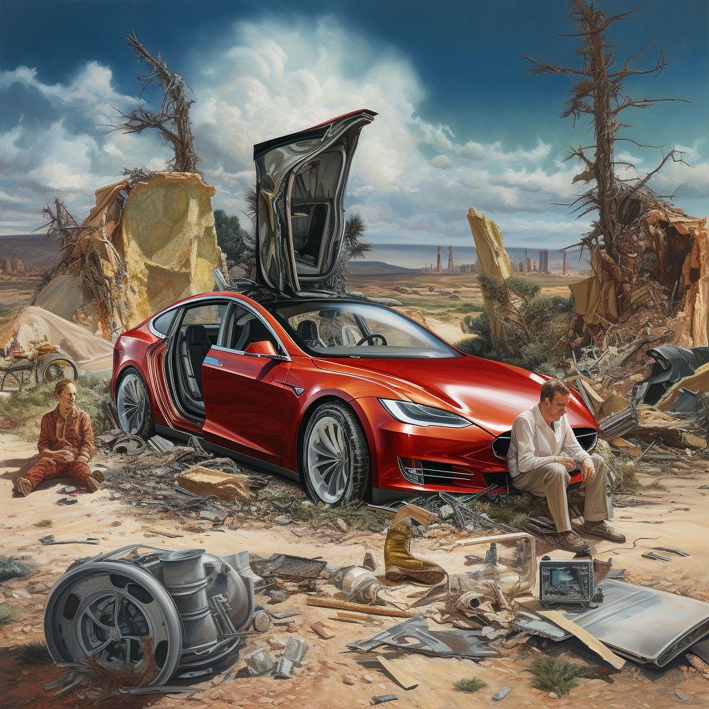

Tesla Autopilot is by far and away the most used self-driving solution to date (both consumer and real-world testing). The problem is, is it actually a self-driving solution, or a driving assistant? The marketing says one thing and the engineering reality says another. I've long been basing my own decisions around using it from an engineering point of view, and as they dig deeper into marketing, I wouldn't even pay the high price for the Autopilot hardware if I were to get one of their cars.

In an era where we have AI CEOs lobbying nations for controls on who can train models of a certain size, domain-specific case studies make it clear how ridiculous this is. The needs for regulation are often about how AI technology exists with known social dynamics, rather than its speculated capabilities. We should provide frameworks for safely running AI models, but we cannot miss the forest for the trees when asking for grand AI regulation --- not all useful AI needs to be networked with the entire internet.

------------------------------------------------------------------------

### Disclaimer and context

*I don't fault the engineers who decide to work there. They're given the opportunity to work with some of the biggest datasets and computers on a problem that'll define the century in terms of restructuring modern life. It's a compelling problem, and the engineers do not control the narrative around the technology they are building (most of the time). Doing some marginal good in a fraught and wide-scale consumer product could be enough motivation on its own. I don't want to go there because I couldn't help being vocal internally and externally, which would go over badly.*

With this strongly anti-Tesla Autopilot views among many members of the technical community, I'm always amazed that less negative press comes the company\'s way. In the last few months, there have been a couple of cracks in this narrative control ([example](https://prospect.org/justice/06-13-2023-elon-musk-tesla-self-driving-bloodbath/)), so it seems like the right time to open up my views on what mistakes they are making in managing this space. I really appreciate people like [Mark](https://twitter.com/mark_riedl/status/1671187721765658628?cxt=HHwWiICxzZ2YoLEuAAAA) speaking out against them. I tried this once and got dunk tweeted by a fan account with 300k+ followers. It really shows how being a meme company gives you tremendous power over the media landscape.

It's also worth noting, that as a research question, I'm thrilled to see how Tesla's Autopilot technological development plays out. They have an extremely lightweight team with an extremely opinionated engineering stack. In engineering-heavy technologies, it's normal to see many approaches converge. For Tesla to stand on their own relative to their peers is very interesting and rare in the development of technology.

For these reasons, this is my first post that is going into the paid experiment (comments). As I clear out my backlog of AI ideas I need to get off my chest and head into more recent events, I will likely touch on more sensitive topics. As the audience I have grows, the more sensitive the content, the more I'll control access to posts and comments. Comments go paid first, and full-article access second.

For fun timing, I also road in my first self-driving car this week (Waymo in AZ). It felt incredibly natural and like the future. Given how natural it feels, I suspect it could be easier to lull customers into complacency.

------------------------------------------------------------------------

Back to the center of the story. Generally, the Tesla issue comes down to two things:

1.  No regulatory requirements for how Tesla communicates autopilot issues.

2.  A risky technology approach (I would respect this if it was alone and not deployed in a consumer product often viewed as a utility).

## How safe is Tesla's Autopilot, really?

At the end of the day, Tesla markets its Autopilot as being safer than humans. This metric is mostly on fatalities per mile and does not make any judgment on if any fatalities are easier to prevent for humans than AI controllers. I agree that in most cases this safety is probably true, *but there is no regulatory body controlling which incidents are reported as Autopilot-caused*. If a human notices Autopilot is doing something dumb and disengages it, but there is still are crash, what happens then? How is this counter? Another less likely statistic useful for auditing is how many human interventions prevent Autopilot-caused accidents. In this space, external auditing and regulation seem to be the only way to have clear reporting. This takes time and is playing out.

With these uncertainties, there is the rumor mill that Tesla is the only autonomous vehicle company to not log its accidents with the California department that handles road safety. I believe you can find public records of what happened in incidents with Cruise, Waymo, Zoox, and more. While maybe not illegal, shrugging community norms is definitely not a good look.

Together, it at least adds substantial error bars to all their reports, and when safety is on the line, I just find it not worth relying on.

## Values implicit in removing radar

Can Tesla solve autonomous driving with only image data? This is one of my favorite debates in AI because it touches on a lot of core topics: scaling laws, robustness of deep learning, social values, and more. A few years ago, when Tesla removed radar they said it actually made the cars safer. I believe them, but what the data shows and what the values implicit to a decision mean, are not always the same.

If the answer to this question is yes, the following answer is when. If it is not within 10 or so years of when the lidar-based players do so, Tesla will start feeling the crunch of sunk-cost fallacy now. All of their cars could be equipped with technology that can solve the problem eventually, but continuing to face scrutiny in a regulatory environment where others have much safer self-driving will be extremely tricky. The only way for it to be an accepted solution socially is for it to remain close to other technological approaches (which seem to be improving rapidly, from an extremely biased view of observations and rides within San Francisco).

Roll back the clocks a bit. When removing sensors that all the other self-driving companies have committed to (either or both radar and lidar), there was definitely critiques. I suspect image-only learning will always have issues robustly detecting depth, while lidar gives it clearly. The type of failure mode this can give is quite dramatic.

A lidar-based sensor fusion system will almost certainly detect an object 1 meter in front of them and slam on the brakes. What Tesla cannot guarantee is preventing deaths like failing to break in quiet neighborhoods due to some adversarial image conditions. On average, the number of deaths from Tesla self-driving could be lower than a human driver, but failing to eliminate deaths than human drivers (or other self-driving cars for that matter) *would never* be the cause is a different story.

This leads to the argument over what is okay on the roads and what is not.

## Roads as a utility

Roads are one of the great public spaces of modern society. Communities and nations agree to certain norms of their use. Self-driving cars are re-writing what these mean both with low-level traffic flow and high-level routing changes.

If we accept this view, we arrive at quite a cruxy question: are we okay with Tesla self-driving being out there with 10x fewer overall fatalities but 2x more completely preventable fatalities? If a human driver would 100% of the time prevent certain accidents, is it morally acceptable to change that over to a self-driving car that crashes frequently there? For reference, I expect the other self-driving approaches to have an accident curve (with fictitious difficulty vs. frequency axes) to be better than humans in almost any area, while Tesla will be spikey and unclear.

Scale these numbers to whatever tipping point you like, but it becomes a moral question of which types of failures are acceptable in our technological systems.

On the other hand, if we do not want to accept roads as a public good, the behaviors of private companies like Tesla will always dictate uncertain dynamics in the best interest of their shareholders. It's not something I have a lot of personal stake in, other than my moral convictions, so I eagerly away watching the self-driving market grow.

This post is not really about solutions, but rather just painting a picture. With that in mind, to conclude, some things I would loosely like to be true (not sure how likely or legally permissible they are, they're vibes):

-   The FTC sues Tesla for false advertising of the name Autopilot,

-   The U.S. national committee that regulates vehicle safety inserts regulation defining reporting of self-driving incidents based on the time from which it was involved,

These are blunt instruments. As the underlying core technology, deep learning, is so opaque, we need to start with the regulatory measures we have to ensure some level of safety. General regulatory measures, about who can train models of a certain size, look absolutely absurd when you compare it to a case like this.

##### Thank you for reading and for your support of Interconnects, consider upgrading to paid if you can for access to all my work.
