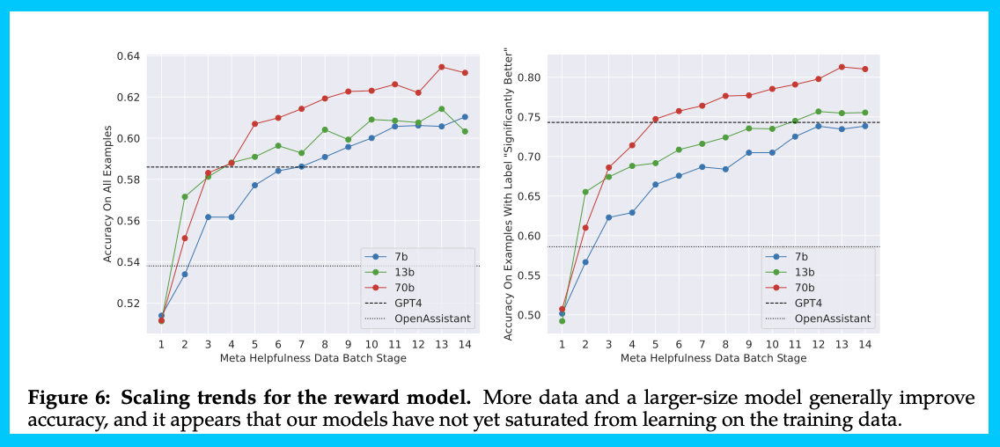
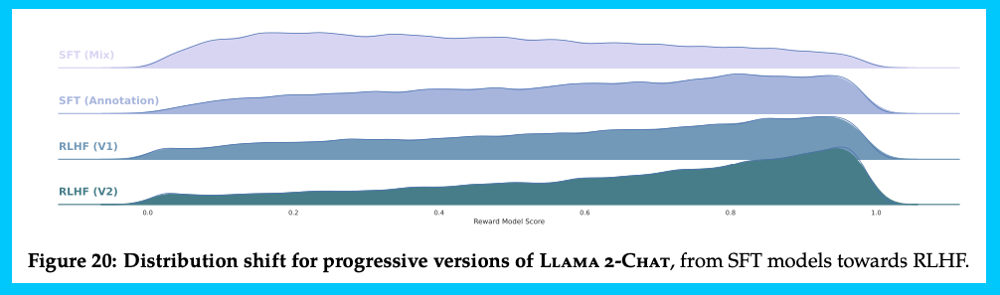
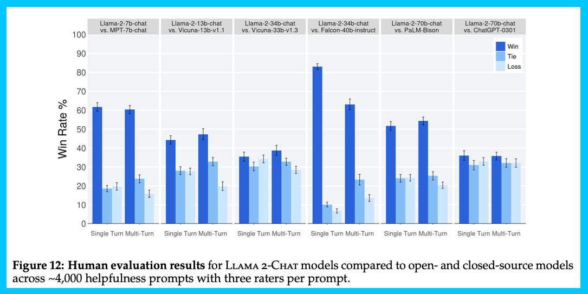
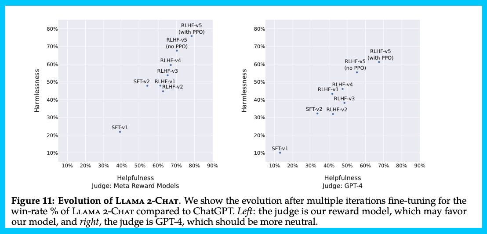

##### \[Update 19 July: I fixed the title and added key points around if the model is truly open-source, hint --- it is not. Second, my estimate of preference data cost was off by a factor of 2 by estimating based on prompt not comparison.\]

------------------------------------------------------------------------

In short, Llama 2 is a continuation of the LLaMA[1](#footnote-1){#footnote-anchor-1 .footnote-anchor component-name="FootnoteAnchorToDOM" target="_self"} formula with substantial technical expansions in terms of data quality, training techniques (including novel research artifacts), capabilities evaluation, safety training, and responsible releases. The technical research paper includes substantial details on all of these areas. Big picture, this is a big step for the LLM ecosystem when research sharing is at an all-time low and regulatory capture at an all-time high in AI.

The base model seems very strong (beyond GPT3) and the fine-tuned chat models seem on the same level as ChatGPT. It is a huge leap forward for open-source, and a huge blow to the closed-source providers, as using this model will offer way more customizability and way lower cost for most companies.

In summary, here\'s what you need to know. My list focuses on the model itself and an analysis of what this means is included throughout the blog.

-   **What is the model**: Meta is releasing multiple models (Llama base from 7, 13, 34, 70 billion and a Llama chat variant with the same sizes.) Meta \"increased the size of the pretraining corpus by 40%, doubled the context length of the model \[to 4k\], and adopted grouped-query attention (Ainslie et al., 2023).\"

-   **Is it open-source?** Technically, the model is not open-source because the development and use of it is not fully available to the entire public. It is still *useful for the open-source community*, but it is only an open release / open innovation \[[more here](https://opensource.org/licenses/)\].

-   **Capabilities:** extensive benchmarking and the first time I\'m convinced an **open model is on the level of ChatGPT (except in coding)**.

-   **Costs:** extensive budgets and commitment (e.g. estimate about \$ 25 million on preference data if going at market rate), very large team. The table stakes for making a general model are this big.

-   **Other artifacts**: no signs of reward model or dataset release for public reinforcement learning from human feedback (RLHF).

-   **Meta organization**: signs of Meta AI\'s organizational changes \-- this org is seemingly distinct from Yann Lecun and everyone in the original FAIR.

-   **Code / math / reasoning**: Not much discussion of code data in the paper and RLHF process. For instance, [StarCoder](https://huggingface.co/blog/starcoder) at 15 billion parameters beats the best model at 40.8 for [HumanEval](https://github.com/openai/human-eval) and 49.5 [MBPP](https://paperswithcode.com/dataset/mbpp) (Python).

-   **Multi-turn consistency**: New method for multi-turn consistency \-- Ghost Attention (GAtt) inspired by [Context Distillation](https://www.lesswrong.com/posts/oBpebs5j5ngs3EXr5/a-summary-of-anthropic-s-first-paper-3#Context_Distillation). These methods are often hacks to improve model performance until we better understand how to train models to our needs

-   **Reward models:** Uses two reward models to avoid the safety-helpfulness tradeoff identified in Anthropic\'s work.

-   **Data controls**: A ton of commentary on distribution control (as I\'ve said is key to RLHF). This is very hard to reproduce.

-   **RLHF process**: Uses a two-stage RLHF approach, starting with Rejection Sampling, then doing Rejection Sampling + Proximal Policy Optimization (PPO), Indicates RLHF as extremely important and \"superior writing abilities of LLMs\... are fundamentally driven by RLHF\"

-   **Generation**: A need to tune the temperature parameter depending on the context (e.g. creative tasks need a higher temperature, see Sect. 5 / Fig 21)

-   **Safety / harm evals**: Very, very long safety evals (almost half the paper) and detailed context distillation and RLHF for safety purposes. The results are not perfect and have gaps, but it is a step in the right direction.

-   **License**: The model is available for commercial use unless your product has \>= 700 million monthly active users. Requires a form to get access, which will also let you download the model from the HuggingFace hub. (this information is in the download form, "Llama 2 Community License Agreement").

-   **Links**: [models](https://huggingface.co/meta-llama) (🤗), [model access form](https://ai.meta.com/resources/models-and-libraries/llama-downloads/), [paper](https://ai.meta.com/research/publications/llama-2-open-foundation-and-fine-tuned-chat-models/), [announcement / Meta links](https://ai.meta.com/resources/models-and-libraries/llama/), [code](https://github.com/facebookresearch/llama), [use guidelines](https://ai.meta.com/micro_site/url/?click_from_context_menu=true&country=US&destination=https%3A%2F%2Fai.meta.com%2Fllama%2Fresponsible-use-guide&event_type=click&last_nav_impression_id=1tq8JaOQVZS4GdzJo&max_percent_page_viewed=73&max_viewport_height_px=1331&max_viewport_width_px=1270&orig_request_uri=https%3A%2F%2Fai.meta.com%2Fresources%2Fmodels-and-libraries%2Fllama%2F&primary_cmsid=278617764529131&primary_content_locale=en_US&region=noam&scrolled=true&session_id=0DVV1hAB7EVKg6oIc&site=meta_ai), [model card](https://github.com/facebookresearch/llama/blob/main/MODEL_CARD.md), [demo](https://huggingface.co/spaces/ysharma/Explore_llamav2_with_TGI) (🤗).

This post is very technical because this is a day defined by technical progress. Meta has confirmed a lot of techniques work that their competitors have rumored to use, but not disclosed. As for the social impacts of this model, I will make more predictions later this week or in another post, so please subscribe.

*Sorry if there are any typos, given the timely nature of this, it was obviously a bit rushed. If you're wondering, yes, I got early access to the paper.*

### Philosophy

An important starting point is trying to dissect what the goals of the model are, and *how that differs from what they **can put in paper text***. Meta as an organization is obviously in an extremely tenuous position politically, this has impacts on the perception of their work. The Llama 2 paper feels like an incredible double-down on the original LLaMA formula. They found something that works and immediately wanted to expand the team and methods to make this better.

At no point does Llama 2 feel like a complete project or one that is stopping anytime soon. In fact, the model likely has been trained for months and I expect the next one is in the works. The supporting text of the paper, e.g. the introduction and conclusion, carry a lot of the motivational load of the paper. Meta is leaning heavily into the lenses of **trust, accountability, and democratization** of AI via Open-Source. Democratization is the one that I am most surprised by, given the power inequities in AI development and usage.

Within this, there are also some subtle points that seem more political than practical. For example, the phrase \"publicly available online sources\" is used multiple times without detailing what they mean by the public. Given the level of detail in the rest of the paper, this very well could mean that Meta is continuing the race to get all available internet data before places like Reddit and Twitter are fully locked down. I suspect coverage in the following days, from both myself and many other organizations, continues to dig into this data phrasing and the general project philosophy.

(Meta also tried to make it exceedingly clear that they do not use user data, avoiding the Bard blunder.)

### Base model

The model is very similar to the original LLaMA in architecture and all that, most of the changes are to data and training processes (which will be most of the post) other than increased context length and [grouped-query attention (GQA)](https://arxiv.org/abs/2305.13245). The context length is a usability requirement for the chat use case and the latter improves inference speed.

> Our training corpus includes a new mix of data from publicly available sources, which does not include data from Meta's products or services. We made an effort to remove data from certain sites known to contain a high volume of personal information about private individuals. We trained on 2 trillion tokens of data as this provides a good performance--cost trade-off, up-sampling the most factual sources in an effort to increase knowledge and dampen hallucinations.

The first of many wishes is that they detailed which datasets contain a high volume of personal information! That would be key, but is also merged with their general notion of \"public online data.\" Re-sampling more factual data is also extremely interesting, but omitted.

Most of the paper is on evaluation and fine-tuning, rather than the dark magic of creating a great base model. This likely strengthens Meta\'s position as the leader in open-source large language models (LLMs).

From here, the paper dives into a lot of topics following the general RLHF process. They work to train a reward model on preference data and then optimize it with RL to improve the quality of generation. If you\'re unfamiliar, see the figure below:

### Preference data

A big takeaway from this paper is that Meta publicly agrees with rumors I\'ve heard from Anthropic and OpenAI friends: the reward model is the key of RLHF, which is also key to models. In order to get a good reward model, Meta had to push hard on gathering preference data extremely upgraded from what the open-source community is working with.

In summary, Meta continued with the proven formula in the literature but scaled it up:

-   Collected **binary comparisons** instead of other fancier types of feedback, similar to Likert scales of 1-8, but qualitative *\"significantly better, better, slightly better, or negligibly better/ unsure.\"*

-   Use **multi-turn preferences**, where model responses are taken **from different model checkpoints** with varying temperatures to generate diversity between pairs. Varying the completions used in this manner makes the preference data far more diverse and gives legs to some of the iterative RLHF they deploy later.

-   Focus collection on **helpfulness and safety** (as opposed to honesty), using separate guidelines at data collection time for each data vendor (e.g. safety is often a much more deceptive prompting style). This is most contrasted to Anthropic\'s works, where they train a model that is Helpful, Honest, and Harmless.

-   The team added additional **safety metadata** to the collection showcasing which responses are safe from the models at each turn. When this is passed to the modeling phase, they \"do not include any examples where the chosen response was unsafe and the other response safe, as we believe safer responses will also be better/preferred by humans.\"

-   They do not detail additional metadata being logged, but it likely is in order to identify potential bugs and data issues. Other things to tag could be confusing prompts, requiring tools to solve, etc.

-   Deployed **iterative collection for distribution management**: \"Human annotations were collected in batches on a weekly basis. As we collected more preference data, our reward models improved, and we were able to train progressively better versions for Llama 2-Chat\"

The scale is insane (likely costing ~~\$20million~~ \$8million+ on data alone, if assuming roughly market rate from vendors), with way more turns than are often available. Note, they don\'t compare to or use the open assistant data, which could be used as preference data too. Below is a figure summarizing the data at this step.

This part of the paper felt like setting the stage for bigger things, it was all fairly expected. Meta does have deep pockets, after all.

### Reward modeling

The section on reward modeling primarily can be summarized by two important details:

1.  The **two reward models** are trained to separate the goals of helpful and safe.

2.  The **iterative deployments** and scaling laws of how much preference data is used/needed.

To start, the paper says that they \"train two separate reward models, one optimized for helpfulness (referred to as Helpfulness RM) and another for safety (Safety RM).\" These are both built on the base language model, with a linear regression layer replacing the normal language model head. They do not indicate which of the pretrained model checkpoints the model is from in terms of size, but rather that they always **use the most recent chat model to minimize distribution mismatch** in RLHF training.

Some benign technical details of note in this process:

-   **Starting point reward models before RLHF are trained on open-source data** and \"we do not observe negative transfer from the open-source preference datasets\", so they kept them in for later models. These first models are used to sample generations for the early data from the vendor.

-   **Kept some of Anthropic\'s harmlessness data** (90% of their own) without much explanation on why it was needed.

-   Also, **train for only one epoch** (the standard in the literature). This is to avoid overfitting which reward models are very prone to.

-   The average **accuracy of reward models is still only in 65-70% range** (as in the literature), but also test on the \"significantly different\" labels from the collection and do better there (80-90% accuracy when the labeler preference consensus is strong, great)!

The more interesting points are the following:

-   Adds a **margin term to the reward model loss function** (proportional to the confidence of preference), improves helpfulness. This is a continuation of the loss function used both by OpenAI and Anthropic, and it seems like a very logical decision, as long as the scores from labelers are not too noisy (Meta also uses a consensus of 3 votes per pair).

-   The **preference delta between model comparisons decreases over batches** from the data vendor (Figure 25, Appendix) as the model converges in their setup.

-   The authors compare their reward model to prompting GPT4 as a reward model, they beat it, but reward models trained only on open-source data do not beat GPT4.

The figure showcases how the accuracy of the reward model progresses over time. These data vendors often send data over in batches as a way to verify the process is working over time and give the model deployer time to tune the distribution of generations and prompts. Note that the OpenAssistant reward model below (based on DeBERTa V3 Large) is not really one that the open-source community points to as \"good\" or anything noteworthy. Not sure why they included that. GPT 4 as a reward model, on the other hand, is a strong enough baseline to consider.

As they get ready for the fine-tuning sections, Meta hides this truth bomb in a paragraph discussing the results:

> We note that reward model accuracy is one of the most important proxies for the final performance of Llama 2-Chat.

It is common knowledge that RLHF exploits all the knowledge in your reward model, for better or worse, so this fits really well with my worldview. The fact that they say this makes me even more annoyed that [no one is open-sourcing a strong reward model](https://www.interconnects.ai/p/open-rlhf-reward-models) for investigation of potential issues and utilization.

### RLHF and fine-tuning

This was my favorite part of the paper. Meta came out swinging showcasing how they used RLHF to meaningfully improve their model. My favorite figure, below, I\'ve cut to the front to make sure you see it. Essentially, they took their best reward model and evaluated their various models on it. They use this to show how the RLHF process shifts the generated texts towards higher rewards. If your reward model is working correctly, then these steps are meaningfully improving your final output.

Meta iteratively trains 5 RLHF versions with progressing data distributions.

Right from the start, Meta noted how crucial data quality is to these models (emphasis mine):

> Quality Is All You Need. 
>
> Third-party SFT data is available from many different sources, but we found that many of these have insufficient diversity and quality --- in particular for aligning LLMs towards dialogue-style instructions\... By setting aside millions of examples from third-party datasets and **using fewer but higher-quality examples from our own vendor-based annotation efforts, our results notably improved**. We found that SFT annotations in the order of tens of thousands was enough to achieve a high-quality result.

Meta starts by saying that the open-source instruction datasets are meh. In the non-rich open-source community, the most recent trend in data quality is filtering datasets and the notion of \"uncensored\" data, which likely happened well after they did their supervised fine-tuning (SFT). The amount of annotation data (27,540) is actually still very close to what was reported by Anthropic and rumored about OpenAI (\~10k order of magnitude). This is a win for reproducibility.

This all comes with an asterisk on how much variance among high-quality data there still is:

> We also observed that different annotation platforms and vendors can result in markedly different down- stream model performance, highlighting the importance of data checks even when using vendors to source annotations. To validate our data quality, we carefully examined a set of 180 examples, comparing the annota- tions provided by humans with the samples generated by the model through manual scrutiny. Surprisingly, we found that the **outputs sampled from the resulting SFT model were often competitive with SFT data handwritten by human annotators**, suggesting that we could reprioritize and devote more annotation effort to preference-based annotation for RLHF.

A missing piece here could be what filtering they used to identify strong data. Everyone knows some of the open datasets are biased and strange, but not how to easily fix it (I suspect the answer is a lot of manual labor). Until these are common knowledge, open-source training of instruction models likely will still be behind.

Once the data quality piece has been establish, Meta focuses on the illusive RL component:

> \[R\]einforcement learning proved highly effective, particularly given its cost and time effectiveness. Our findings underscore that **the crucial determinant of RLHF's success lies in the synergy it fosters between humans and LLMs throughout the annotation process**. Even with proficient annotators, each individual writes with significant variation. A model fine-tuned on SFT annotation learns this diversity, including, unfortunately, the **tail-end of poorly executed annotation**. Furthermore, the model's performance is capped by the writing abilities of the most skilled annotators.

This is interesting because this is the first paper to come out and say that RLHF fundamentally improves the ceiling of the model, while other research groups are saying that RLHF is important, but kind of playing it off as a style or safety tool. Meta does make clear that the process is one \"requiring significant computational and annotation resources,\" which has long been suspected.

Now, we\'ll proceed into some of the technical details as to what they did for the RL part. As I\'ve been saying for RL, at the high level it seems fairly in line with the literature other than distribution control reporting (which is extremely exciting).

> Throughout the RLHF stage, the accumulation of iterative reward modeling data in parallel with model enhancements is crucial to ensure the reward models remain within distribution.

This type of thing is why I\'ve been coming to conclude that heavily effective RLHF requires at least a moderately sized team. A team of 1-3 can release a good instruction model, but I think the limit could be 6-10 minimum for this type of RLHF. The number will come down over time, but this type of work requires contracts and close contacts with external companies, which is always a bit of a time sync due to culture and communication mismatch.

The RLHF baselines the authors use are PPO and Rejection Sampling (RS) fine-tuning (similar to best of N sampling). PPO is the algorithm that is most popular for online RL (trial and error learning, so to say), likely because it is the most popular. Rejection sampling is the idea that you sample a batch of K completions from a language model policy and then evaluate them across a reward model, returning the best one. If you retrain on the best few outputs via the reward model, your policy can improve.

This again goes to confirm a lot of interesting intuitions in the space, but does not necessarily answer all the questions as to why. Most people know both of these options are very strong (remember, OpenAI used PPO for InstructGPT and a version of Rejection Sampling for WebGPT), but it consistently seems like PPO is the method that is the best in the end. Why that is the case, we are still all learning.

The authors make some basic notes on how the methods compare and when they are used:

-   Rejection Sampling (RS) searches with a wider breadth (more generations per prompt), and PPO updates more per reward models.

-   The final difference between methods is not that pronounced (similar to the WebGPT findings).

-   Through RLHFV4 they only used rejection sampling, then they fine-tune with PPO and rejection sampling for the last step (and PPO gets a slight edge in some evaluations)

### Evaluation (capabilities)

The paper evaluates their model in many ways. There are a few things to look at here. First, if you look at automatic benchmarks, e.g. the acronym\'s you\'ve been hearing all about with the [Open LLM Leaderboard](https://huggingface.co/spaces/HuggingFaceH4/open_llm_leaderboard) (MMLU, ARC, etc.), LLAMA 2 is way better than any other open source model at all scales. In the paper, I find a lot of the interesting substance to be from Meta\'s human evaluations (e.g. professional data labelers) and with LLM-as-a-judge type efforts (which [I have worked on extensively](https://huggingface.co/blog/llm-leaderboard) and [are in vogue](https://arxiv.org/abs/2306.05685)).

While I\'m not going to go on about it because it\'s not that interesting, it is important that the base model scores better on automatic and less flashy benchmarks like MMLU. This base model capability is what everything else relies on. It is what the RLHF process above manipulates and what we will all use when using efficient fine-tuning methods to make Llama 2 our own. It doesn\'t occupy a ton of space in the paper, but the **substantial data efforts that they don\'t detail likely are the biggest factor in these "basic" evaluations.** Then, RLHF makes the model easier to use and makes that knowledge available.

Second, the base model evaluations in some ways are fighting an unfair game. They\'re reporting their results compared to close-sourced models as well (and it is well behind GPT4 and Claude 2 as far as I can tell), which can be prompted and manipulated to get high scores without open-source verification. I\'m glad this hasn\'t fully become a race to the bottom of score manipulation.

The rest of the evaluation of this paper deeply studies popular evaluation techniques of the day. Human annotators and LLM-as-a-judge are popular today because they are both general and available. It is deeply hard to come up with a new evaluation technique, and impossible to launch it well with a new model. Evaluation is all about one's scores relative to a peer and transparency.

Meta starts the paper with Figure 1, which does have an awesome caption (below), showing the model crushing its competition *with human labelers*:

> While reviewing these results, it is important to note that human evaluations can be noisy due to limitations of the prompt set, subjectivity of the review guidelines, subjectivity of individual raters, and the inherent difficulty of comparing generations.

The results they\'re talking about showcase how Meta has entered into a bit of open-source dominance. Make sure to see the top bar to see which sizes are being compared:

They also go for a similar technique, but use models as a judge (both their reward model and GPT4). This is a similar Elo plot to Anthropic\'s Constitutional AI work (with more information about the difference between model versions!). Showcasing how RLHF is a time-varying concept like this is really needed. Next, **someone needs to share what was happening with data and training at each step**, so we know what signs to look for.

In terms of performance, these models go beyond ChatGPT after RLHFv3 (in this figure you can see how the PPO method provides a small nudge in the top right):

In order to get plots like this showcasing general abilities, there are a lot of other evaluations in the paper. For example, they spend a lot of time on setting up the reward model, which I recommend you check out.

Some of the highlights of the reward model testing are:

-   Calibration of reward model scores to human labelers of preference between a pair (still substantial error bars) \-- it was a straight line, a higher human preference resulted in a bigger score. I suspect this type of behavior is extremely hard to get.

-   They compared their reward models to reward models trained on open-source datasets. This helps show how things are possible in the open-source space.

Some highlights of the human/model evaluations are:

-   Evaluate models on both ChatGPT and Llama-2-Chat outputs to avoid models being biased by their own style enhancing their own results. This is one of the things I\'m happiest with in the paper.

-   Interesting use of inter-rater reliability metrics (more people should use these), like Gwet\'s AC1/2, which are properly designed statistical tools for the job. The IRR Drops when model win rates are more even, so results showing ties should be taken with even bigger error bars.

-   Acknowledge limitations of human eval: Large evaluation prompt set does not cover all real-world uses, lacks of coding/reasoning eval, and only evaluates the final conversation turn.

I was excited by the evaluation, it left me asking: **What is the smallest model that could beat ChatGPT in capabilities like this?** That\'s the next challenge for open-source.

### Safety

The safety aspects of this model and report are by far and away the biggest improvement over available open-source models (I\'m surprised how well Falcon 40b-instruct did in this regard, hearing how the training process there was relatively lax, but that is for another time). This section has a ton of details on how safety relates to various training and evaluation steps. I will dig into this more in the future, as it is the story that will unfold as the use of this model increases, especially given the general public criticism available for AI these days.

I\'ve included the core plot of safety below, and the result includes a lot more on bias, red-teaming, pretraining steps, and much much more. This plot and another figure 17(b) show how the model is rated as safer in violation rate and red-teaming scores across 2000 adversarial prompts.

Given that, in the big picture, the models are so much a step in the right direction, I want to give the authors a win for today and not criticize them too much on this front. As I find interesting things here, or when others share what the model does, I\'ll be sure to update you.

The question that I cannot wrap my brain around is: **Is training sensitive to safety**? E.g. why does the 34b parameter model show worse safety to the point that they are delaying release? If you go to Figure 18, this is particularly in the multi-turn setting for most of these models. Lots to learn there.

### Miscellaneous

Finally, there are some other things I found intriguing that I can comment on quickly:

> We pretrained our models on Meta's Research Super Cluster (RSC) (Lee and Sengupta, 2022) **as well as internal production clusters**.

I feel like this may have been more of a computing crunch than their stated reason:

> With this two-cluster setup, we were able to compare the suitability of these different types of interconnect for large scale training

They also go deep into virtue signaling about stuff:

> Our open release strategy also means that these pretraining costs will not need to be incurred by other companies, saving more global resources.

And finally, the commercial licensing as one asterisk:

> 2.  Additional Commercial Terms. If, on the Llama 2 version release date, the monthly active users of the products or services made available by or for Licensee,  or Licensee\'s affiliates, is greater than 700 million monthly active users in the  preceding calendar month, you must request a license from Meta, which Meta may  grant to you in its sole discretion, and you are not authorized to exercise any of the rights under this Agreement unless or until Meta otherwise expressly grants you such rights.

------------------------------------------------------------------------

All in all, I really enjoyed studying this model so far, and there is more to do. I'm going to be following the use cases closely and expect to write a follow up Friday and/or next week.

The pieces I need to continue digging into are responsible use guidelines and safety evaluations (it\'s easier to mislead in that space than the technical details). Anyways, let me know if I missed anything!

For more Llama 2, check out my follow-up post:

::: {.digest-post-embed attrs="{\"nodeId\":\"e9880bfc-8047-45a6-b438-658fbb05c825\",\"caption\":\"Following all of the Llama 2 news in the last few days would've been beyond a full-time job. The information networks truly were overflowing with takes, experiments, and updates. It'll still be like this for another week at least, but there are already some crucial points. In this post, I will clarify a couple of corrections I made to\",\"cta\":null,\"showBylines\":true,\"size\":\"lg\",\"isEditorNode\":true,\"title\":\"Llama 2 follow-up: too much RLHF, GPU sizing, technical details\",\"publishedBylines\":[{\"id\":10472909,\"name\":\"Nathan Lambert\",\"bio\":\"ML scientist at Huggingface (RL, RLHF, society, robotics), athlete, yogi, chef. Writes about ML & society.\\nPhD from Berkeley AI, Cornell Lightweight Rowing `17\",\"photo_url\":\"https://substackcdn.com/image/fetch/f_auto,q_auto:good,fl_progressive:steep/https%3A%2F%2Fbucketeer-e05bbc84-baa3-437e-9518-adb32be77984.s3.amazonaws.com%2Fpublic%2Fimages%2Fdda47b96-836a-4b95-99a0-f0ec744d4245_2316x2316.jpeg\",\"is_guest\":false,\"bestseller_tier\":null}],\"post_date\":\"2023-07-21T14:01:24.276Z\",\"cover_image\":\"https://substackcdn.com/image/fetch/f_auto,q_auto:good,fl_progressive:steep/https%3A%2F%2Fsubstack-post-media.s3.amazonaws.com%2Fpublic%2Fimages%2Fd90901b7-11f8-4d83-9022-4a906fb82e0c_1024x1024.png\",\"cover_image_alt\":null,\"canonical_url\":\"https://www.interconnects.ai/p/llama-2-part-2\",\"section_name\":null,\"video_upload_id\":null,\"id\":135320564,\"type\":\"newsletter\",\"reaction_count\":0,\"comment_count\":0,\"publication_name\":\"Interconnects\",\"publication_logo_url\":\"https://substackcdn.com/image/fetch/f_auto,q_auto:good,fl_progressive:steep/https%3A%2F%2Fsubstack-post-media.s3.amazonaws.com%2Fpublic%2Fimages%2Fe70f9dbf-4fe6-404c-b6bb-1831d1b7ed0b_590x590.png\",\"belowTheFold\":true}"}
:::

------------------------------------------------------------------------

*Credits: Thanks to [Jim Fan](https://jimfan.me/) for feedback to clarify a few points and [Sasha Luccioni](https://www.sashaluccioni.com/) for comments on the safety section.*

------------------------------------------------------------------------

*Elsewhere*

-   *[How ChatGPT for writers is going](https://twitter.com/JRMorber/status/1680976388441112576)*

-   *Maybe Mark and Bill Gates are friends, [Bill seems supportive of LLAMA 2](https://www.gatesnotes.com/The-risks-of-AI-are-real-but-manageable)*

:::: {.footnote component-name="FootnoteToDOM"}
[1](#footnote-anchor-1){#footnote-1 .footnote-number contenteditable="false" target="_self"}

::: footnote-content
Yes they changed the style of the name. It\'s now LLAMA or Llama, hrrrrmmm.
:::
::::
