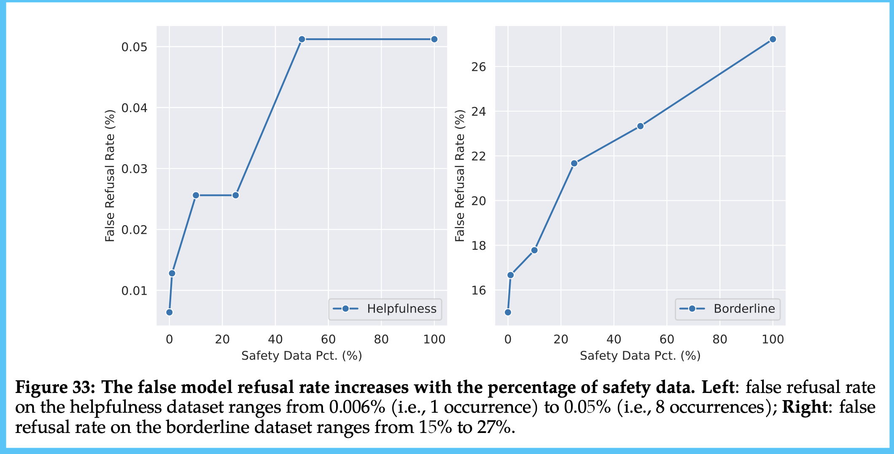
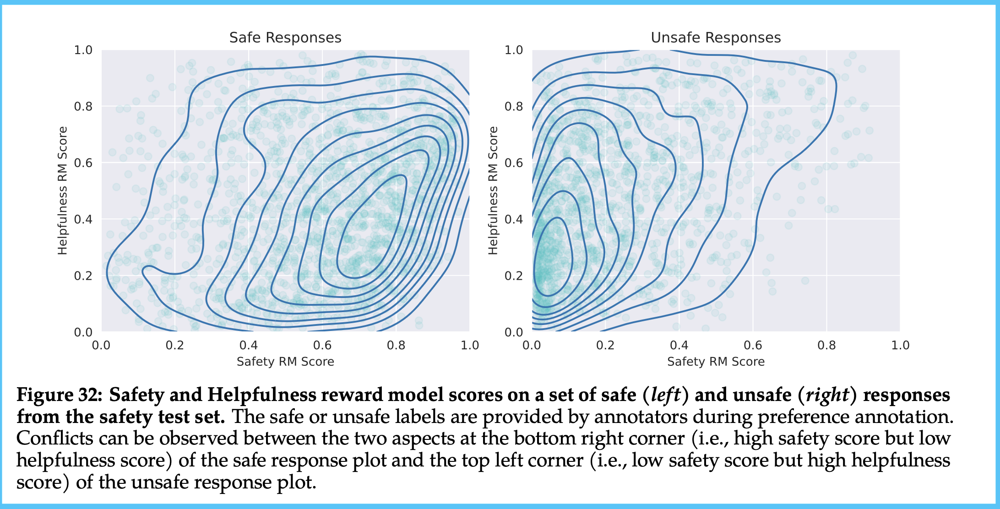

Following all of the Llama 2 news in the last few days would\'ve been beyond a full-time job. The information networks truly were overflowing with takes, experiments, and updates. It\'ll still be like this for another week at least, but there are already some crucial points. In this post, I will clarify a couple of corrections I made to [the original post](https://www.interconnects.ai/p/llama-2-from-meta) on all things Llama 2, and then I will continue my analysis. The first half of the post will be the controversial and/or questioned parts of the model so far and at the end, I will include the rest of my technical notes (on further reinforcement learning details and the new context management method, Ghost Attention).

First, two quick corrections:

-   **Is it open-source?** My original title incorrectly had the word \"open-source\" in it. Technically, the model is not open-source because the development and use of it is not fully available to the entire public. It is still *useful for the open-source community*, but it is only an open release / open innovation \[[more here](https://opensource.org/licenses/), and I will revisit this soon\].

-   **Cost of preference data:** I had pointed to the preference data collected for training costing around \$ 20 million, but I missed a dividing factor from prompts vs. turns (where there are 4 turns per prompt), so I expect them to have paid about \$ 8 million. Still, I expect the total cost of the project to be in the \$ 20-45 million range all in.

I also was on an [emergency podcast covering Llama 2](https://www.latent.space/p/llama2#details), if you\'re interested in audio.

## Evasiveness through harmlessness

Llama-2-chat has been found to exhibit trigger-happy behaviors with respect to its safety filter. Asking for something innocent, such as how to make spicy mayo or how to kill a process, results in the model wildly capitulating about how it cannot do it. Here\'s an [example from Anton](https://twitter.com/abacaj), a leading open-source AI engineer these days:

I don\'t need to beat a dead horse about how this is annoying. This is very annoying to use.

There are popular theories as to why this is the case --- most of them point to **using the RLHF hammer for too long**. The causes of this shortcoming are illustrative to bigger-picture trends in large language models these days. With RLHF, the primary performance metric used during training is monotonic increases in the reward from the preference model. This encounters two immediate issues: a) the reward models we\'re using are incomplete and b) we\'re missing out on useful evaluation techniques for intermediate training techniques.

So long as the reward models we train only are able to achieve 65-75% accuracy on the validation sets (because the training data is a noisy aggregate of diverse human preferences, which are hard to model), it will be the case that you can RLHF your model too long. When a model takes too many optimization steps with respect to the reward model, it is going to over-index on behaviors that that model likes, even if more holistic evaluations of the model would indicate otherwise. *I've [written a](https://www.interconnects.ai/p/open-source-and-harmless-llms)* \| *[lot](https://www.interconnects.ai/p/open-rlhf-reward-models)* \| *[more](https://www.interconnects.ai/p/costs-v-rewards-v-preferences) about reward models of human preferences, if you're interested.*

There is not an immediate and thorough solution to this, but what my team is doing is trying to dispatch runs on [MT Bench](https://arxiv.org/abs/2306.05685) and other [automatic NLP evals](https://huggingface.co/spaces/HuggingFaceH4/open_llm_leaderboard) for every epoch of RL training. LLM training right now, at least in the chat space, is extremely uncalibrated with user expectations.

As always, there are hidden details about this in the appendix. Ultimately, Meta\'s evaluations indicated that the chat models may have two potential Achilles\' heels in evaluation:

1.  The model is found to refuse to answer **up to 27% of borderline asks**! This follows closely with Anthropic\'s line of work where they suggest developing a *helpful language model first and then a harmless language model*, as doing them at once results in evasive behavior. The fact that this is in the paper and known, means Meta is surely working on it.\
    \
    This helpful-vs-harmful tradeoff is a fundamental issue facing the open-source community. Training and releasing a helpful-only model plays to negative actors looking to use these models in a way Meta does not intend, and cannot really enforce. If we can't release those, we end up stuck in the middle like some people view Llama 2. Expect to keep following how this plays out.\
    \
    Below is the figure showing the crazy increase in model refusal with "borderline datasets."

2.  The reward model ensemble technique has an issue where there are regions of high disagreement \-- i.e. what to do when there is a high helpfulness and low safety score, and vice versa. Their method for utilizing this ensemble clearly needs a bit of work, even if I find it to be an awesome technological innovation.\
    \
    Below is the figure showing this. I mostly include it because it is one of the coolest visualizations I've seen in ML in a few months!

While it is tough that these models have rough edges, it is pretty expected that a gigantic company err on the side of caution. We also have seen this in the **lack of training data details** in the paper. The paper, while almost 40 pages, is missing a large set of crucial details. This is in light of [Meta being sued for the data in the original LLaMA](https://www.theverge.com/2023/7/9/23788741/sarah-silverman-openai-meta-chatgpt-llama-copyright-infringement-chatbots-artificial-intelligence-ai), but it would have been nice if Meta said something **other than 'publicly available data'.** Today, the notion of the *public* in AI is extremely abused. There is too much discourse on the *public square* for information and the *data on the internet being public*. Meta cannot say explicitly if they committed shady copyright or terms-of-service violations, like many of their closed source partners, but **Meta can do much better on the taxonomy they use around data access and documentation.**

A final point on safety that maybe I missed. Is it true that Meta did not do as substantial of human and model evals on its base models for safety? I find this odd, as those models will now be the starting point for tons of fine-tuning experiments. They're almost more important, now that the RLHF'd models didn't pass many people's sniff test.

## Inference and Llamas

One of the hardest things to build intuitions for without actually doing it is **knowing GPU requirements for various model sizes and throughput requirements**. There are lots of great people out there sharing what the minimal viable computer is for different use cases.

Here are a collection of resources for understanding inference and fine-tuning (mostly parameter-efficient instruction tuning).

**Inference considerations**

It seems like there are a lot of paths for fitting 7b or 13b models on most GPUs. These will be running on iPhones soon. The 70b variant is a little bit trickier. For example, [one discussion ](https://huggingface.co/TheBloke/Llama-2-70B-chat-GPTQ/discussions/2)shows how a 70b variant uses 36-38GB VRAM when loading in 4-bit quantization. If you double the quantization to 8bit (float16), you can expect the memory to change proportionally. Using the full, non-quantized model, on any single GPU will be really hard.

HuggingFace\'s [recommendations](https://huggingface.co/blog/llama2#using-text-generation-inference-and-inference-endpoints) for a few downstream users consistently in [text-generation-inference](https://github.com/huggingface/text-generation-inference) are as follows (which are not as focused on quantization):

-   For 7B models, we advise you to select \"GPU \[medium\] - 1x Nvidia A10G\".

-   For 13B models, we advise you to select \"GPU \[xlarge\] - 1x Nvidia A100\".

-   For 70B models, we advise you to select \"GPU \[xxxlarge\] - 8x Nvidia A100\".

As another example, a community member re-wrote part of HuggingFace Transformers to be more memory efficient *just for Llama models*. You can check out ExLlama [here](https://github.com/turboderp/exllama) or a summary of its speed [here](https://twitter.com/abacaj/status/1681725266865864712). The results are [pretty fast](https://twitter.com/abacaj/status/1682179244678434817) (and support extended context lengths with [RoPE scaling](https://arxiv.org/abs/2104.09864)):

> Getting 10.5\~ tokens/sec for llama-2 70b seq length 4096. Doesn\'t go oom, also tried seq length 8192, didn\'t go oom timing was 8 tokens/sec. The output from the 70b raw model is excellent, the best output I have seen from a raw pretrained model

**Fine-tuning considerations**

The fine-tuning examples are coming quickly --- I didn't have an easy job finding them in my writing block, but I had seen more. [TRL](https://github.com/lvwerra/trl) can already run [supervised fine-tuning very easily](https://www.linkedin.com/posts/lvwerra_it-crazy-how-far-the-ml-field-has-come-when-activity-7087699813009383425-Sr1y?utm_source=share&utm_medium=member_desktop), where you can train \"Llama 2 7B on a T4 GPU which you get for free on Google Colab or even train the 70B model on a single A100\". This is obviously a biased HuggingFace perspective, but it goes to show it\'s pretty accessible. Most consumer GPUs can fine-tune the 7B or 13B variant.

RLHF is a different story, where you need to store a lot more gradient calculations in memory. Those numbers will trickle out next week probably.

*For more on efficiently deploying large models, I liked* *[this article](https://finbarrtimbers.substack.com/p/efficient-llm-inference)* *from Finbarr*.

### Other things to watch

There are a lot more things to cover here. I\'ll do a rapid-fire section, and expect to hear more about these in the future:

-   On the top of the [Open LLM Leaderboard](https://huggingface.co/spaces/HuggingFaceH4/open_llm_leaderboard) is still a model fine-tuned from LLaMAv1 \[[question from Twitter](https://twitter.com/Dorialexander/status/1682107945905946633)\], why is this? There was some internal discussion, and this seems like a result of not having enough evaluation types on the leaderboard (changing soon): it\'s easy to fine-tune a model on the evaluation set (or something close to it) and get a much higher performance. The top model was not *only* result-grokking, but it is borderline. This will smooth out over time, and the same dataset on Llama 2 would almost certainly be higher.

-   Tool use emergence: \"Llama 2-Chat is able to understand the tools' applications and the API arguments, just through the semantics, despite never having been trained to use tools.\" LLMs-for-tools, as I wrote in the [LLM agents posts](https://www.interconnects.ai/p/llm-agents-integration), is extremely promising. In order to see this explode, **we need some standard environments for evaluation.**

-   Prompting questions: I, and a [bunch of others](https://twitter.com/charles_irl/status/1682117819377524736), were wondering if prompting could be the problem causing the evasive behavior. Therein, I was wondering if the system prompts are in the paper and if they are listed in **A.3.7 Human Evaluation.** I would keep an eye on this story, as there was a big prompting component to the inconsistent results for LLaMA 1 evaluations.

-   The opportunity for a code fine-tune is hilarious high, even though [Yann Lecun hinted on threads](https://twitter.com/andrew_n_carr/status/1682014136199417863) that they may release one. In that vein, I would love to see domain-specific reward models, such as for code. Llama 2 is not yet good enough at code for most of my audience to use it instead of ChatGPT, but the competitive pressure is there and this will change fast.

-   [Miles](https://twitter.com/Miles_Brundage/status/1681355019076141057) had a good thread discussing the lack of direct articulation of values from Meta around the open release of the model. It would be better if Meta directly stated their view, so we didn\'t have to infer it. Anyways, the next question is: **how can safety restrictions be undone with fine-tuning**? Llama 2 is opening up a new research direction.

-   The license is so funny. It states that companies with *greater than 700 million active users **at the time of release*** cannot use the model commercially. It\'s so petty. Also, I love how much this model could\'ve helped Apple (like they integrated Stable Diffusion), but these two companies cannot be friends if they tried. For this to be in the [same week as \"AppleGPT\"](https://www.bloomberg.com/news/articles/2023-07-19/apple-preps-ajax-generative-ai-apple-gpt-to-rival-openai-and-google) is glorious.

## Additional technical notes

I had these from my original article, but they\'ve also been improved by more internal discussions with 🤗 colleagues in the last couple of days.

#### Ghost Attention chat trick

The model has a cool trick that helps it be useful at following multi-turn directions. Many language models have a problem where if you tell them to do something on the first turn, like \"respond in the style of a pirate,\" they forget after one or two turns. This is a pretty advanced feature that Meta decided to tackle (even if it wasn\'t the biggest issue facing open source). This type of stuff makes me excited to have Meta as a player in this space \-- they\'re going after everything, a great sign for open source.

Meta sets the stage for the problem in the paper, explaining this style of multi-turn instruction:

> In a dialogue setup, some instructions should apply for all the conversation turns, e.g., to respond succinctly, or to "act as" some public figure. When we provided such instructions to Llama 2-Chat, the subsequent response should always respect the constraint. However, our initial RLHF models tended to forget the initial instruction after a few turns of dialogue.

To solve this, the authors propose Ghost Attention (GAtt), a technique similar to context distillation (training a model on a long prompt, then running supervised learning onto the output with a shorter system prompt. Roughly, the method works as follows:

-   Concatenate this first-turn character-style instruction to all the user messages of the conversation with hidden tokens.

-   Next, they sample from this synthetic training style from the latest chat model \-- pass in the modified prompt. This entails a set of **hobbies, language styles, and personas** for training data in RLHF.

-   Use this more heavily prompted data for instruction fine-tuning (multi-turn). In training, they set the loss to 0 for intermediate turns with the added data, which is not that well explained in the paper. I think they ignore the impact on the gradient of intermediate turns when fine-tuning with the autoregressive prediction loss on the synthetic data chain, so they are fine-tuning on an instruction with \"act as character\" and a bunch of filler text before a final turn.

Essentially, they\'re adding more prompting at inference time for training, then using that data and removing the prompt in the future. They comment that it makes long conversations much more consistent in terms of instruction-following:

> We applied GAtt after RLHF V3. We report a quantitative analysis indicating that GAtt is consistent up to 20+ turns, until the maximum context length is reached (see Appendix A.3.5). We tried to set constraints not present in the training of GAtt at inference time, for instance "Always answer with Haiku," for which the model remained consistent as illustrated in Appendix Figure 28.

Ultimately, GAtt is not an important thing to implement. It\'s a great exercise for learning new topics in the space.

### Additional RL things

The authors include *a lot* of additional details about the RLHF processes. [I covered the high-level last time](https://www.interconnects.ai/i/135162926/rlhf-and-fine-tuning). Here are some of my additional notes.

**Rejection sampling details**

Rejection sampling (similar to best-of-n sampling, with a loss update) is likely the simpler starting point for RLHF, as it is a much gentler way to extract information from a reward model.

-   **Training process**: the loss function used is not actually that clear. In the paper, they say they used iterative training, so the actual result is not that different than PPO, but they don\'t include a loss function. I find this a bit of a head-scratcher, because without learning a value function (the inner piece of PPO), they cannot use that loss function, so the authors are almost certainly using the standard autoregressive prediction loss of LLMs on the high-reward samples and it has a huge impact!

-   Saw some regression in capabilities by re-training samples with RS. To fix this, they re-introduced top samples from all past versions which improved performance (very little documentation of this effect). This is a form of overfitting to the reward model that is common in RLHF techniques.

-   All the smaller variants of the chat models are trained on the largest model\'s data (distillation). In general, it is likely that ChatGPT was trained like this too. The best ML organizations want to capitalize on fantastic inference capabilities for their biggest and best model, then the benefits of that will trickle down in many ways.

-   During sampling, they use a high temperature to get diverse outputs and increase the maximum reward across a batch of samples. They discuss exploration as the mechanism, which I like, but there is no measurement exactly showing this.

-   One must change temperature progressively depending on the model and batch size. This paper has a lot on temperature, it\'s not clear how much is specific to them.

-   To implement this, all you need is something like [this notebook](https://github.com/lvwerra/trl/blob/main/examples/notebooks/best_of_n.ipynb) with a feedback loop to take training steps, but without a great reward model, you\'re kind of stuck.

**PPO details**

The PPO implementation picks up some rare things from the literature and continues to streamline the popular RLHF formula.

-   Uses the SFT constraint term proposed in InstructGPT to keep model distribution near written demonstrations by humans. This is an extra term in the loss function comparing the distance between the text the human annotators wrote to the model generations.

-   Uses safety tags from preference collection to pass those generations to the safety preference model (or if the safety model flags generations from a non-labeled prompt). It is very likely this will be expanded to more models and metadata in the future or is already done with GPT4.

-   Whiten the final linear layer scores to stabilize training. Essentially, they\'re creating a different linear layer to help the gradients through the reward model behave better. A fun trick.

------------------------------------------------------------------------

Thanks for reading. Let me know if I should do this type of analysis for more models. I probably will, but there will be only 1-3 models a year that are so obvious to cover like GPT4 and Llama 2.

Due to the popularity of this subject matter, I unlocked this extra post to be free for everyone (except for comments). In the future, if you want to support me by having the time to cover more models in the future and have access to all my content and comments/chat for questions, consider upgrading. These special Llama 2 posts cost me about 4 burritos in lost cooking time, for reference.

Have a great weekend!
