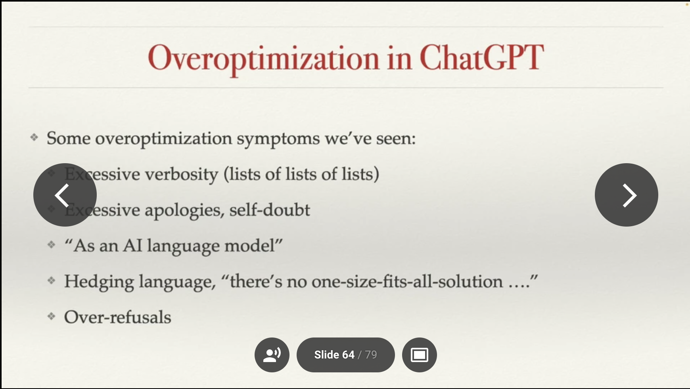
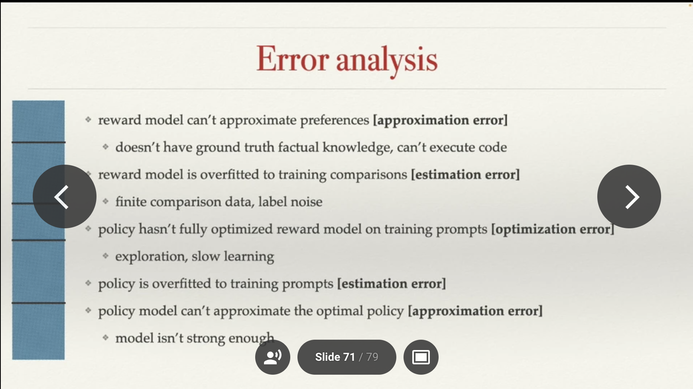
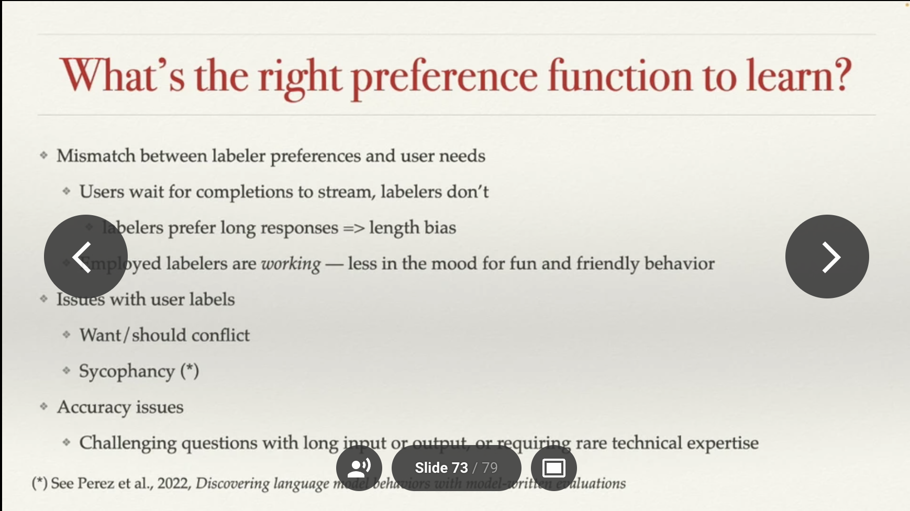

The reinforcement learning from human feedback (RLHF) narrative evolving through 2023 makes for great content --- it is technically not fully described, it is extremely nuanced to implement even with a clear outline, has had many ups and downs, and it is part of the core trends and metaphors of the evolution of machine learning from a research practice to a revenue driver. On Interconnects, I started this journey primarily covering what RLHF and RL mean because we were lacking information proving that RLHF / [RLCF](https://www.interconnects.ai/p/beyond-human-data-rlaif) is actually useful. Now, the content is fully on describing [how it works as a framework](https://www.interconnects.ai/p/how-rlhf-works) and [in specific models](https://www.interconnects.ai/p/llama-2-from-meta). Soon, I expect to shift back into the metaphors, and *what it means from a multi-stakeholder perspective that RLHF seems to be catching on*.

The content in this post is a reflection from 3 technical pieces of content, both old and new: the [Direct Policy Optimization](https://arxiv.org/abs/2305.18290) (DPO) paper (and poster at ICML), John Schulman\'s talk at ICML (paywalled by conference), and a [new paper](https://arxiv.org/abs/2307.15217) on *Open Problems and Fundamental Limitations of RLHF.*

My analysis centers on disconnects between the communities using RLHF (mismatch between metaphors used and reality) and disconnects within the optimization process itself (mismatch between objectives). The idea of RLHF is at the forefront of success in the \"deep learning is alchemy camp.\"

The biggest thing you need to know about RLHF at ICML was how many companies telling you how they can\'t tell you that clever reward function design on specific domains is driving many high-performance applications of the technology. If you\'re one of them and want to change your comment from off-the-record to on, please comment below.

## Directly optimizing proxy objectives

The thing about RLHF that should be more obvious is that we don\'t have a good reward function for chatbots. RLHF has been driven into the forefront because of its impressive performance at making chatbots a bit better to use (from both eliminating bad stuff and a bit of adding capabilities), which is entirely governed by a proxy objective --- thinking that the rewards measured from human labelers in a controlled setting mirror those desires of downstream users.

John\'s talk focused on this issue. It was not very technical, which makes it useful for understanding the bigger picture of the method itself. It has two core theses:

1.  Explaining the idea of a proxy objective in machine learning and RLHF (which nerd-snipes me [due to my Ph.D. work](https://arxiv.org/abs/2002.04523)),

2.  Explaining some ways that [over-optimization](https://arxiv.org/abs/2210.10760) of a proxy objective can occur.[1](#footnote-1){#footnote-anchor-1 .footnote-anchor component-name="FootnoteAnchorToDOM" target="_self"}

The proxy reward in RLHF is the score returned by a trained reward model to the RL algorithm itself because it is known to only be *at best* correlated with chatbot performance. Therefore, it\'s been shown that applying too much optimization power to the RL part of the algorithm will actually decrease the usefulness of the final language model. And over-optimization, put simply by John, is \"when optimizing the proxy objective causes the true objective to get better, then get worse.\" A curve where **the training loss** goes up, slowly levels off, then goes down. This is different from overfitting, where the model accuracy keeps getting better on the training distribution. Over-optimization of a proxy reward is much more subtle (and linked to the current [evaluation fog](https://www.interconnects.ai/publish/posts/detail/124670054?referrer=%2Fpublish%2Fposts) in NLP, where it\'s hard to know which models are actually good).

To motivate this from a high, non-technical perspective, the talk started with the idea of [Goodhart\'s Law](https://en.wikipedia.org/wiki/Goodhart%27s_law) (which comes from economics): once an objective is optimized, it is no longer useful. The insight here builds on the fact that we have optimizations we are probably incorrectly using ML losses as ground truths in these complex systems. In reality, the loss functions we use are designed (and theoretically motivated for) local optimizations. The global use of them is resulting in challenges with the RLHF proxy objective.

With this framing, skipping over a fun technical introduction of PPO as the inner loop optimizer, human data as outer loop optimization, and casting RLHF as contrived model-based RL in bandits, the talk proceeded to some new ideas in the RLHF space and brief insights on ChatGPT. A sign of over-optimization included in the talk is repetitive samples, but human preferences will likely reject this in the outer loop, so models can work this out in the end. This sort of RL algorithm problem, then fixed in the preference model\'s next iteration (often called iterative RLHF), is hinted at in a lot of papers, but seemingly new to come from OpenAI.

Some interesting over-optimization symptoms in ChatGPT were shared:

Personally, I am still frustrated that reward model over-optimization is studied in simulated reward models (at least in public). How it works is a \"gold\" reward model is trained on human data, then it is queried to generate simulated models. Those simulated models are used to generate scaling laws, so they\'re never going to be as good as the actual reward models used to train things like GPT4 and Claude.[2](#footnote-2){#footnote-anchor-2 .footnote-anchor component-name="FootnoteAnchorToDOM" target="_self"}

The core metric that OpenAI is reported to use in measuring over-optimization is the KL distributional distance from the base instruction model. I take this as a proxy measurement tool on top of the proxy training objective. Is KL actually a useful measure of how much the model has changed? John\'s intuition of the over-optimization work is that RL optimizers (like PPO) spend this KL distance less efficiently when compared to [best-of-N sampling](https://huggingface.co/docs/trl/main/en/best_of_n). Generally, this means PPO is a more powerful tool but needs to be used more carefully. On the other hand, academics and smaller groups should probably be starting with best-of-N / rejection sampling techniques (like those used in Llama 2).

Put simply, the solution that will most likely play out is to use bigger models. Bigger models have more room for change in the very under-parametrized setting of a reward model (sample efficient part of the equation), so are less impacted. DPO may not benefit from this as much, the direct optimization will likely change sample efficiency one way or another.

When you take this framing to the full RLHF loop, there are lots of places where different errors impact this proxy learning:

To solve all of these issues, John suggests we think about the right objective function for training these models. A bunch of problems with the current preference model training objective and data collection user interface are below:

Looking at this, it seems like using [implicit user feedback](https://scholarcommons.sc.edu/libsci_facpub/111/) to train these models, is much like how recommender systems are done today (the same goes for feedback on sales or customer service outcomes). Implicit feedback is actions taken by the user, such as re-rolling an output, closing the tab, or writing an angry message that indicates the quality of the previous response. The challenge here, and with most optimization changes to RLHF, is that there\'s a strong risk of losing stability when making the reward function more specific. RL, as a strong optimizer, is increasingly likely to exploit the reward function when it is a smooth surface (and not just pairwise human values). The expected solution to this is that **future RLHF will be trained with both pairwise preference data and additional steering loss functions**. There are also a bunch of different loss functions that can be used to better handle pairwise data, such as Mallow\'s model or Placket-Luce, but I\'ll get to these later.

The conclusion of John\'s talk points to solutions that are starting to become common among AI alignment researchers \-- using AI to assist human labelers to enhance both the quality and rate of labeling data. We\'re going to see [a lot more RLAIF and Constitutional AI next year](https://www.interconnects.ai/p/beyond-human-data-rlaif). We should continue to exploit one of the core reasons that John points to for RLHF\'s surprising capabilities: \"It is harder for people to write high-quality thought-out responses than it is to compare them.\"[3](#footnote-3){#footnote-anchor-3 .footnote-anchor component-name="FootnoteAnchorToDOM" target="_self"}

Figuring out the intuition of how this proxy objective impacts things is why I haven\'t talked about Direct Policy Optimization (DPO) yet. There\'s been a mental hurdle I couldn\'t get over, where the results in the DPO paper had not yet convinced me that they can do better than our weird proxy optimization (downstream RL) on our weird proxy reward measurement. There was deep uncertainty about scaling here in general domains, not about the technical legitimacy of the method. My uncertainty about where it fits into the RLHF framework as a whole was increased by rumors that the PPO comparison was weakly implemented --- this doesn\'t matter, especially since [DPO has been reimplemented in TRL](https://github.com/lvwerra/trl/blob/main/trl/trainer/dpo_trainer.py) and more comparisons will be made to PPO, the method will find some uses (or derivative work).

How DPO works roughly is that they run a change of variables in the reward model loss function, combine it with the language model pretraining objective, and solve the new equations with convex optimization techniques. This solution returns an optimal loss function for maximizing the reward of binary preference data \-- it\'s very neat, I recommend skimming [the paper](https://arxiv.org/abs/2305.18290) if you\'ve considered it. My question is: does optimizing a proxy objective more directly somehow cause performance issues? If you rephrase the question differently to, do only certain gradient updates result in useful downstream models when trained on a proxy objective, there could be a compelling case to be made. These models are substantially over-parametrized relative to the reward data being integrated into them, so there are a lot of ways for them to absorb the data.

DPO also will have a very different experimentation pathway \-- instead of training a reward model and then running a bunch of RL experiments on it to fine-tune your understanding of reward models and the system at hand, DPO will always result in a final policy. This changes the intuitive space we all work in, which matters in subtle ways. The comparisons to PPO along with more scaling laws of DPO will give us a crucial data point on the factors pointing to the reward model being the most important part of RLHF. Maybe the trend breaks, but I believe in the status quo here, for the time being.

I\'ve got some more cooking in this space, such as nice diagrams explaining how RLHF compares in feedback loops to normal agentic RL, contextual bandits, and model-based RL.

------------------------------------------------------------------------

## RLHF\'s problems and limitations

There was a new paper from a lot of my friends at Berkeley on the big picture of RLHF. *[Open Problems and Fundamental Limitations of Reinforcement Learning from Human Feedback](https://arxiv.org/abs/2307.15217)* definitely bites off a lot. RLHF encompasses many areas, so this is an important paper for bringing more research areas to RLHF. Given what is involved in RLHF, huge models, human training data, human evaluation data, state-of-the-art RL algorithms, etc. --- RLHF needs to be a multi-stakeholder area of study. I\'m invested in this and have my own academic work in this direction.

If you\'ve been paying attention to RLHF, many of the issues listed are not entirely new, but having them all in one place is very important to the discourse. The authors attempt to label each issue as \"fundamental\" or \"tractable,\" which is bold given everything we\'ve seen in machine learning in 2023. I\'m thinking the fundamental vs. tractable labels are written from a very specific field of reference, but I couldn\'t place what the tone was exactly (maybe this happens with giant author papers). In my RL and technically focused perspective, I end up thinking a lot of them are flipped.

In the end, I\'m really happy this exists. It will be the starting point for lots of graduate students in the next few years (and policymakers), but there are some frustrations. To an expert, it's generally **written as if the listed problems are future problems, but they're actually just problems with the current technical setup and not about what RLHF means in the big picture**. So, this paper will cause some questions when people look back in 6-12 months. I encourage you to skim it, let me know which you find most obvious or controversial \-- my favorite is *optimal RL agents tend to accumulate power*.

When a technology is both so important to progress and capabilities, these types of holistic checks should be done on a regular cadence, so they don\'t become stale. What RLHF means as a metaphor is increasingly important in the context of alignment, especially because lots of industry uses RLCF with careful reward engineering --- similar issues, but hard to fit into the framework written here because the critique is at a lower level.

------------------------------------------------------------------------

*Elsewhere:*

-   *This is a [paper worth knowing about](https://twitter.com/andyzou_jiaming/status/1684766170766004224) --- something common in the pre-training data of most LLMs exposes them to an adversarial attack. I chatted with one of the authors, and they think it\'s also not a sequence that appears directly in the data, but a result of some strange repeated sequence. We have a lot to learn.*

:::: {.footnote component-name="FootnoteToDOM"}
[1](#footnote-anchor-1){#footnote-1 .footnote-number contenteditable="false" target="_self"}

::: footnote-content
John is pretty convinced by the scaling laws they ended up with, which surprised me.
:::
::::

:::: {.footnote component-name="FootnoteToDOM"}
[2](#footnote-anchor-2){#footnote-2 .footnote-number contenteditable="false" target="_self"}

::: footnote-content
[AlpacaFarm](https://crfm.stanford.edu/2023/05/22/alpaca-farm.html) (simulated RLHF framework) got a pointer as another way to study this.
:::
::::

:::: {.footnote component-name="FootnoteToDOM"}
[3](#footnote-anchor-3){#footnote-3 .footnote-number contenteditable="false" target="_self"}

::: footnote-content
I was also lucky to chat with John for an hour or so at the conference. He\'s a wonderful genuine human, doesn\'t really have some of the strong views that others at OpenAI are constantly pushing on the world (or he holds them in).
:::
::::
