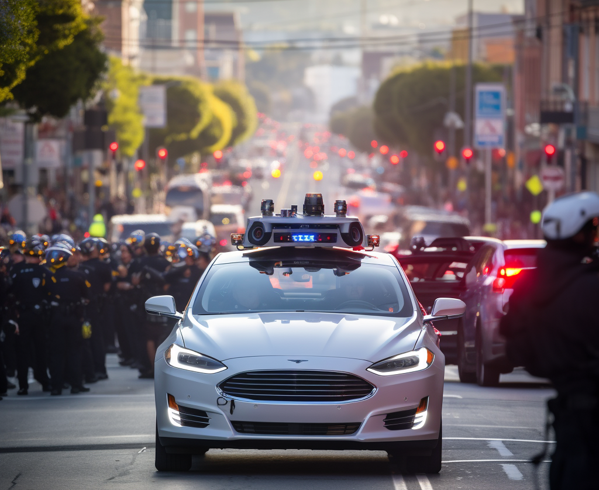

Just days after [San Francisco approved all-day, paid driverless taxi operations](https://www.cpuc.ca.gov/news-and-updates/all-news/cpuc-approves-permits-for-cruise-and-waymo-to-charge-fares-for-passenger-service-in-sf-2023#:~:text=Cruise%20was%20authorized%20to%20offer,at%20any%20time%20without%20a) of the two leading self-driving firms, a [collision between a Cruise taxi and an emergency vehicle](https://www.theverge.com/2023/8/18/23837217/cruise-robotaxi-driverless-crash-fire-truck-san-francisco) thrust the discussion of the viability of autonomous vehicles (AVs) in our current cities to the forefront. While large language models (LLMs) are moving faster than AVs, as they\'re the current AI technology of interest, the adoption of self-driving cars is a wonderful canvas for painting pictures of the common issues we\'re facing in all at-scale AI products interfacing with normal humans outside of an AI obsessed lab. Self-driving cars capture many of the trends in full color, with them charging straight into existing infrastructure and norms not designed for them, them not being clear about what parts are AI and what are not, and them being extremely visible to the public.

The collision with an emergency vehicle is obviously extremely unfortunate due to the potential downstream issues of the emergency to attend to. The media narrative about this is impacted more by timing than the specific occurrence, but that\'s okay because that\'s how most of the economy works. I say this with some evidence this time, as there is a [long-standing investigation of Tesla Autopilot\'s colliding with emergency vehicles too](https://www.theverge.com/2022/6/9/23161365/tesla-autopilot-nhtsa-crash-investigation-emergency-vehicle) (I\'ve covered my thoughts on why you shouldn\'t trust Tesla Autopilot [here](https://www.interconnects.ai/p/tesla-autopilot-negligence)). This isn\'t moving fast and changing things, but rather puttering away in the background.

When it comes to self-driving cars and many other types of AI, **we need to stop singularly comparing them to humans that they are going to replace once they\'re in use**. We should evaluate AI\'s usefulness (or lack thereof) as independent tools as well as human analogies. The human analogies are helpful for understanding the context of the work, but once economic incentives kick in at the scale of investment in AVs, we have lost some of the ground in the Overton window in how they\'ll be perceived.

Analyzing the collision itself will provide hints as to why. Two things I was worried this would be about didn\'t seem to be true: 1) longer time for human-operator intervention due to more vehicles on the road, or 2) the AVs developing left turn abilities (lots of my friends have been reporting them as being more impressive and confident in recent weeks at pulling these off).

While there is no video of the incident, there are lots of hints as to what happened. You can read the [thread](https://twitter.com/Cruise/status/1692491370642997444) Cruise quickly posted, stating two key facts from the control point of view: First, the Cruise slowed down due to auditory sensors indicating an emergency vehicle and entered the green light at this slower speed. What I suspect happened is a normal failure mode for AVs other than Tesla: it slammed on the brakes when it noticed something a little weird. When designing any control stack, it\'s obvious to try and inversely correlate velocity and situational uncertainty.

*Sidenote: When I first heard this, I thought maybe it was one of the screwy huge-turn steep-hill corners in SF, where visibility is occluded by the roadway and the Earth, but it wasn\'t quite the case. Here\'s the* *[Google Street View](https://www.google.com/maps/@37.7821391,-122.4189334,3a,90y,351.15h,72.29t/data=!3m7!1e1!3m5!1sfKbAKqfZMIqok-FXgjVXHw!2e0!6shttps:%2F%2Fstreetviewpixels-pa.googleapis.com%2Fv1%2Fthumbnail%3Fpanoid%3DfKbAKqfZMIqok-FXgjVXHw%26cb_client%3Dmaps_sv.tactile.gps%26w%3D203%26h%3D100%26yaw%3D230.55746%26pitch%3D0%26thumbfov%3D100!7i16384!8i8192?entry=ttu)* *of Polk and Turk.*

Here\'s a [video](https://twitter.com/miss_elenius/status/1692733759823446131) of a **separate, but similar incident**, where you can see the \"deer in the headlights\" behavior from a cruise car. In this video, the Cruise was not at fault, the other car blatantly attempted to run a very red light \-- it\'s hard to know with limited evidence and reporting alone exactly what the nature of the fault is.

The media narrative around AVs is making them seem like everything that goes wrong is entirely their fault. Modern self-driving cars are being built in one of the most complex social and regulatory domains of modern life, so we should just tell people that. **The failure modes for self-driving cars will be different than the failure modes of humans we are trying to replace**. The next phase of the development of transit will be developing a new set of norms around lower drunk and distracted driving and adapting to a new mode of transportation.

In a lot of ways, human nature is not set up to perceive these changes as beneficial. Most people won\'t notice a decline in drunk driving, as you only hear about the worst cases, and everyone will notice when their morning routine is interrupted by a rogue self-driving car. This is the price of progress \-- AVs will shift the issues we care about in cities to ones that are strictly lower cost and lower fatalities. I\'m not saying that\'s the case now, as self-driving cars could cause a short-term setback in safety, but we\'re close to it, and they\'re improving fast. If we could measure this setback, it would make the moral decision around deployment much grayer, but I don\'t think we can.

For this matter, we shouldn\'t be so upset about change. Most American generations have had major transit changes in their lifetime. At the end of the 19th century, folks had to deal with lunatics riding bikes with no brakes, then public cars started to hit the road in the early 20th century, the U.S. interstate system boomed in the 1950s, and so on. It was really my parent's generation who hadn\'t lived through one of these changes. Autonomous vehicles changing transit in cities also will not be the last one.

### Practicality vs. ideology

Some people seem to think self-driving cars should behave like strictly better humans. I find this impractical, given the level of investment in the technology and the societal pressure to ship a functional product. The way it will be is that AVs will be *good enough at the task**.***

I was particularly nerd-sniped by another Tweet from prominent robotics/AI leaders saying otherwise. I\'m not sure if it was 100% serious, but Rodney Brooks cited [the mistakes Cruises are making in SF](https://www.sfchronicle.com/sf/article/robotaxi-cruise-waymo-uber-lyft-18307041.php) as the substance for \"[comparing them to teenagers](https://twitter.com/rodneyabrooks/status/1695093009644401136).\" This is crazy! The mistakes aren\'t anything close to what teenagers are known for, e.g. bad judgment and distraction. These mistakes are entirely their new category, mostly around being in out-of-distribution data. The articles say the cars cannot improvise, which is exactly the opposite of teenagers, and more importantly, **exactly what I want from an AV, boring.**

As the technology gets close to the big leagues, e.g. running in most major cities, we have very limited time to get the narrative right here. We have to choose if we sell these as something practical or better versions of humans themselves. If choose a narrative around an ideology of solving only the current problems of the road, AVs will be met with more resistance. We need leaders in the space to be saying how we\'re going to get both a huge solution and small new problems. AVs we deploy are not going to be drunk or sleepy and they are going to fail in new ways we don\'t expect.

There are already some regulatory tactics for understanding what is happening with AVs., which hopefully can be used to assure the public. There is a history of [disengagement reports](https://www.dmv.ca.gov/portal/vehicle-industry-services/autonomous-vehicles/disengagement-reports/) from the California DMV, which hopefully counts incidents as well. The next report will be 2023, which as the technology goes mainstream, is not a high enough cadence. A second step is to move beyond the incident reports and provide ways for the AV companies to share different ways they incorporate incidents into their stack (a nerd can dream).

As expectations around AVs and AIs more generally become more practical, **increased social value will be placed on systems where the design can incorporate specific tuning or explain parts of a failure**. The Cruise data will be able to tell us exactly when the emergency vehicle was detected, what planning modules were switched to, and what other actions were considered. Tesla seems unlikely to be the same.

Across many domains of AI, I\'m going to have more faith in companies improving if their stack is auditable like this. Some domains may get specific regulations mandating it, but that\'s far out. Ideologically, things like end-to-end deep learning solutions may have conceptual benefits in certain domains, but practically speaking a modular approach may be the only way to make consistent engineering progress. This type of nuanced take is really hard to get across to the general public.

### Where we're left

At the end of the day, it feels like people are rewarded for going against something changing society. We have the LLM critiques from both safety and social harms getting their time in the sun and the NIMBYs of SF in full force. They're at least easier positions to hold in algorithmically ranked feeds. I would love to talk with folks who know the history and philosophy of science with respect to how this technological transition compares. I think AI will be an accelerant, but we don't know how a minor acceleration could translate into extremely different dynamics. In the end, it's more motivation to continue this project!

In the normal process of figuring out if my ideas are crazy or based on facts, I was chatting with [Bryan Offutt](https://twitter.com/BryanOffutt) about LLM agents and I was surprised at how closely his thoughts there mirror my outlook in AVs. Quoting Bryan:

> B\) Automating the end to end thing goes against human nature. People are not super comfortable with black boxes. I think you generally have to show them what you are going to do and allow them to say yes a few times before doing it automatically.

We\'re in the phase where people still need to say yes a few times to autonomous vehicles. Until they\'ve tried it, many people will be skeptical because change is hard and it is exceedingly foreign to think about. AI in the wild is not going to be logical. Here\'s to adjusting, and even less of a need to own a car.

------------------------------------------------------------------------

*Elsewhere:*

-   I was on a podcast about evaluating LLMs. \[[YouTube](https://www.youtube.com/watch?v=mqsT2Y8Rxfs) / [Apple](https://podcasts.apple.com/us/podcast/e4-evaluating-large-language-models-with-nathan-lambert/id1678774315?i=1000624678851)\]

-   This interview with the Anthropic CEO Dario Amodei was really great at getting to know how he leads Anthropic and views ML developments. I wish I was an earlier adopter of scaling laws like him.

    ::::::::::: {.embedded-post-wrap attrs="{\"id\":135814349,\"url\":\"https://www.dwarkeshpatel.com/p/dario-amodei\",\"publication_id\":69345,\"publication_name\":\"Dwarkesh Podcast\",\"publication_logo_url\":\"https://substackcdn.com/image/fetch/f_auto,q_auto:good,fl_progressive:steep/https%3A%2F%2Fbucketeer-e05bbc84-baa3-437e-9518-adb32be77984.s3.amazonaws.com%2Fpublic%2Fimages%2F90fa9666-5b8b-4685-a8fb-4b64cb7e0333_1080x1080.png\",\"title\":\"Dario Amodei (Anthropic CEO) - Scaling, Alignment, & AI Progress\",\"truncated_body_text\":\"Listen now (119 mins) | Here is my conversation with Dario Amodei, CEO of Anthropic. Dario is hilarious and has fascinating takes on what these models are doing, why they scale so well, and what it will take to align them. Watch on YouTube. Listen on Apple Podcasts, Spotify\",\"date\":\"2023-08-08T13:40:07.841Z\",\"like_count\":14,\"comment_count\":0,\"bylines\":[{\"id\":4281466,\"name\":\"Dwarkesh Patel\",\"handle\":\"dwarkesh\",\"previous_name\":null,\"photo_url\":\"https://substack-post-media.s3.amazonaws.com/public/images/b715ffd1-f7d7-4755-af88-c48efe647f5b_400x400.jpeg\",\"bio\":\"I host the Lunar Society Podcast.\",\"profile_set_up_at\":\"2021-06-09T22:58:10.864Z\",\"publicationUsers\":[{\"id\":246192,\"user_id\":4281466,\"publication_id\":69345,\"role\":\"admin\",\"public\":true,\"is_primary\":false,\"publication\":{\"id\":69345,\"name\":\"Dwarkesh Podcast\",\"subdomain\":\"dwarkesh\",\"custom_domain\":\"www.dwarkeshpatel.com\",\"custom_domain_optional\":false,\"hero_text\":\"I ask the most interesting people the most interesting questions\",\"logo_url\":\"https://bucketeer-e05bbc84-baa3-437e-9518-adb32be77984.s3.amazonaws.com/public/images/90fa9666-5b8b-4685-a8fb-4b64cb7e0333_1080x1080.png\",\"author_id\":4281466,\"theme_var_background_pop\":\"#D10000\",\"created_at\":\"2020-07-18T16:36:25.723Z\",\"rss_website_url\":null,\"email_from_name\":null,\"copyright\":\"Dwarkesh Patel\",\"founding_plan_name\":\"Founding Member\",\"community_enabled\":true,\"invite_only\":false,\"payments_state\":\"paused\"}}],\"twitter_screen_name\":\"dwarkesh_sp\",\"is_guest\":false,\"bestseller_tier\":null}],\"utm_campaign\":null,\"belowTheFold\":true,\"type\":\"podcast\",\"language\":\"en\"}" component-name="EmbeddedPostToDOM"}
    {.embedded-post native="true"}

    ::: embedded-post-header
    {.embedded-post-publication-logo loading="lazy"}[Dwarkesh Podcast]{.embedded-post-publication-name}
    :::

    ::::: embedded-post-title-wrapper
    ::: embedded-post-title-icon
    ![](data:image/svg+xml;base64,PHN2ZyBmaWxsPSJub25lIiBoZWlnaHQ9IjE5IiB2aWV3Ym94PSIwIDAgMjQgMjQiIHdpZHRoPSIxOSIgeG1sbnM9Imh0dHA6Ly93d3cudzMub3JnLzIwMDAvc3ZnIj4KPHBhdGggZD0iTTMgMThWMTJDMyA5LjYxMzA1IDMuOTQ4MjEgNy4zMjM4NyA1LjYzNjA0IDUuNjM2MDRDNy4zMjM4NyAzLjk0ODIxIDkuNjEzMDUgMyAxMiAzQzE0LjM4NjkgMyAxNi42NzYxIDMuOTQ4MjEgMTguMzY0IDUuNjM2MDRDMjAuMDUxOCA3LjMyMzg3IDIxIDkuNjEzMDUgMjEgMTJWMTgiIHN0cm9rZS1saW5lY2FwPSJyb3VuZCIgc3Ryb2tlLWxpbmVqb2luPSJyb3VuZCIgLz4KPHBhdGggZD0iTTIxIDE5QzIxIDE5LjUzMDQgMjAuNzg5MyAyMC4wMzkxIDIwLjQxNDIgMjAuNDE0MkMyMC4wMzkxIDIwLjc4OTMgMTkuNTMwNCAyMSAxOSAyMUgxOEMxNy40Njk2IDIxIDE2Ljk2MDkgMjAuNzg5MyAxNi41ODU4IDIwLjQxNDJDMTYuMjEwNyAyMC4wMzkxIDE2IDE5LjUzMDQgMTYgMTlWMTZDMTYgMTUuNDY5NiAxNi4yMTA3IDE0Ljk2MDkgMTYuNTg1OCAxNC41ODU4QzE2Ljk2MDkgMTQuMjEwNyAxNy40Njk2IDE0IDE4IDE0SDIxVjE5Wk0zIDE5QzMgMTkuNTMwNCAzLjIxMDcxIDIwLjAzOTEgMy41ODU3OSAyMC40MTQyQzMuOTYwODYgMjAuNzg5MyA0LjQ2OTU3IDIxIDUgMjFINkM2LjUzMDQzIDIxIDcuMDM5MTQgMjAuNzg5MyA3LjQxNDIxIDIwLjQxNDJDNy43ODkyOSAyMC4wMzkxIDggMTkuNTMwNCA4IDE5VjE2QzggMTUuNDY5NiA3Ljc4OTI5IDE0Ljk2MDkgNy40MTQyMSAxNC41ODU4QzcuMDM5MTQgMTQuMjEwNyA2LjUzMDQzIDE0IDYgMTRIM1YxOVoiIHN0cm9rZS1saW5lY2FwPSJyb3VuZCIgc3Ryb2tlLWxpbmVqb2luPSJyb3VuZCIgLz4KPC9zdmc+)
    :::

    ::: embedded-post-title
    Dario Amodei (Anthropic CEO) - Scaling, Alignment, & AI Progress
    :::
    :::::

    ::: embedded-post-body
    Listen now (119 mins) \| Here is my conversation with Dario Amodei, CEO of Anthropic. Dario is hilarious and has fascinating takes on what these models are doing, why they scale so well, and what it will take to align them. Watch on YouTube. Listen on Apple Podcasts, Spotify...
    :::

    :::: embedded-post-cta-wrapper
    ::: embedded-post-cta-icon
    
    :::

    [Listen now]{.embedded-post-cta}
    ::::

    ::: embedded-post-meta
    2 years ago · 14 likes · Dwarkesh Patel
    :::
    :::::::::::

-   This TalkRL podcast on practical developments in RL is really good for illustrating how the field is progressing pre- and post-ChatGPT.

:::::: {.apple-podcast-container component-name="ApplePodcastToDom"}
::::: iframe
:::: {role="main" aria-label="Apple Podcasts Web Embed"}
::: embed-loader
![](data:image/svg+xml;base64,PHN2ZyB4bWxucz0iaHR0cDovL3d3dy53My5vcmcvMjAwMC9zdmciIHdpZHRoPSI1MCIgaGVpZ2h0PSI1MyIgdmlld2JveD0iMCAwIDUwIDUzIiBhcmlhLXJvbGU9InByZXNlbnRhdGlvbiIgZm9jdXNhYmxlPSJmYWxzZSI+IDxwYXRoIGQ9Ik0zMy4yMSA0Ny4zOEEyNC4xNyAyNC4xNyAwIDAwMjQuOTQuNWEyNC4xNyAyNC4xNyAwIDAwLTguMyA0Ni44OGwtLjQ3LTMuNzhBMjAuNyAyMC43IDAgMDE0LjA1IDI0LjcgMjAuOCAyMC44IDAgMDEyNC45NCAzLjggMjAuNzcgMjAuNzcgMCAwMTQ1LjggMjQuNjRjMCA4LjQ2LTQuOTUgMTUuNjgtMTIuMSAxOC45NGwtLjQ5IDMuOHptMS4yLTkuNjRhMTYuMTUgMTYuMTUgMCAwMDYuNy0xMy4wNWMwLTguOTMtNy4yOS0xNi4yLTE2LjE3LTE2LjJhMTYuMiAxNi4yIDAgMDAtMTYuMiAxNi4xNWMwIDUuNCAyLjY1IDEwLjE3IDYuNzMgMTMuMDhsLS4xLS41OWMtLjE2LTEuMjQgMC0yLjQzLjQtMy40NGExMi42IDEyLjYgMCAwMS0zLjctOWMwLTcuMTUgNS42LTEyLjg3IDEyLjg3LTEyLjg3IDcuMjQgMCAxMi44NiA1LjcyIDEyLjg2IDEyLjg3IDAgMy41Ni0xLjQyIDYuNzUtMy43NSA5IC40MyAxLjAzLjYgMi4yLjQzIDMuNDdsLS4wNy41OHptLTkuNDctOS40YTUuNiA1LjYgMCAwMDUuNi01LjYgNS42MSA1LjYxIDAgMTAtNS42IDUuNnptMCAyNC4zOGMyLjY3IDAgNC42LTEuNTUgNC45NC00LjQzbDEuNC0xMS40NmMuNDUtMy41OS0yLjQ1LTUuODYtNi4zNC01Ljg2LTMuOTIgMC02Ljg1IDIuMjUtNi4zOCA1Ljg2bDEuNCAxMS40NmMuMzYgMi44OCAyLjI4IDQuNDMgNC45OCA0LjQzeiIgLz4gPC9zdmc+)
:::
::::
:::::
::::::
