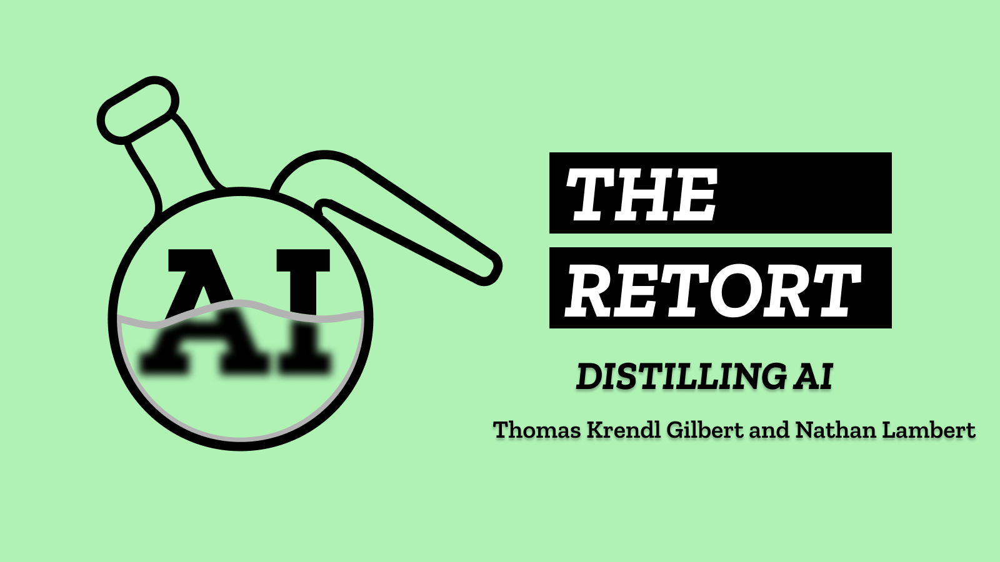

[The Retort](https://retortai.com/) is co-hosted by Nathan and [Thomas Krendl Gilbert](https://twitter.com/sociotiose) (who co-authored an earlier Interconnects post on the [seasons of RL](https://www.interconnects.ai/p/rl-tool-or-framework-or-agi)). The point of this post is to answer the question: Why do we need another AI podcast?

We need a space to discuss the dynamics of the field and the markets that define those dynamics. There are crucial debates and schisms defining AI, but many people don't feel like they have a space to ask critical questions. Or, even more simply, people feel like there are strange things happening, but they can't put their finger on it.

We want to create a space where you don't need to be just on the side of safety or ethics. AI is increasingly led by powerful figures who have spent decades cultivating agendas and successful careers, but the field is changing and more voices should be represented in the narratives.

The primary goal is to make sense of the chaos and charlatans, yet we'll discuss new papers when we need to. The balance between Tom's philosophical and historical lens and Nathan's on-the-ground perspectives should be fun.

Some topics you can expect us to cover in the coming weeks:

-   Oppenheimer and the nuclear analogies of LLMs,

-   The politics and power of a technology like Reinforcement Learning from Human Feedback,

-   Where AI Safety and AI Ethics researchers are leading people astray, where they should work together,

And all of the drama we're encountering on our way to the public use of AI. We're open to bringing guests on, but that won't be in every episode --- shoot us a message or comment if there's someone you want to hear from.

The teaser can be found [here](https://retortai.com/episodes/teaser-welcome-to-the-retort) (or listened to directly below), where you can easily subscribe on your platform of choice!

::: {.native-audio-embed attrs="{\"label\":null,\"mediaUploadId\":\"34a3603c-115b-4574-b64f-30745b3f9a19\",\"duration\":331.70285,\"isEditorNode\":true}" component-name="AudioPlaceholder"}
:::

------------------------------------------------------------------------

*Note: Some of the share buttons are still populating, but Apple, Spotify, Overcast, and more are already going!*

------------------------------------------------------------------------

## Continuing with Interconnects

Long-time followers and fans have known that I\'ve been planning to start a podcast for a long time, that day is finally here with [The Retort](https://retortai.com/). Some of my favorite posts to write are those covering *vibe checks* in the AI industry, with a couple of examples included below.

::: {.digest-post-embed attrs="{\"nodeId\":\"cf03d7d0-e4f6-4279-aa0f-aff1a0c209ab\",\"caption\":\"Every single person I know working in AI these days (in both the academy and industry) has been sparked by the ChatGPT moment. The first iPhone moment of AI. Working in this environment is extremely straining, for a plethora of reasons — burnout, ambition, noise, influencers, financial upside, ethical worries, and more.\",\"cta\":null,\"showBylines\":true,\"size\":\"lg\",\"isEditorNode\":true,\"title\":\"Behind the curtain: what it feels like to work in AI right now\",\"publishedBylines\":[{\"id\":10472909,\"name\":\"Nathan Lambert\",\"bio\":\"ML scientist at Huggingface (RL, RLHF, society, robotics), athlete, yogi, chef. Writes about ML & society.\\nPhD from Berkeley AI, Cornell Lightweight Rowing `17\",\"photo_url\":\"https://substackcdn.com/image/fetch/f_auto,q_auto:good,fl_progressive:steep/https%3A%2F%2Fbucketeer-e05bbc84-baa3-437e-9518-adb32be77984.s3.amazonaws.com%2Fpublic%2Fimages%2Fdda47b96-836a-4b95-99a0-f0ec744d4245_2316x2316.jpeg\",\"is_guest\":false,\"bestseller_tier\":null}],\"post_date\":\"2023-04-05T23:01:39.782Z\",\"cover_image\":\"https://substackcdn.com/image/fetch/f_auto,q_auto:good,fl_progressive:steep/https%3A%2F%2Fsubstack-post-media.s3.amazonaws.com%2Fpublic%2Fimages%2F3a2cfd20-1fe6-4a63-aa56-db90fd4cf888_768x768.jpeg\",\"cover_image_alt\":null,\"canonical_url\":\"https://www.interconnects.ai/p/behind-the-curtain-ai\",\"section_name\":null,\"video_upload_id\":null,\"id\":112453991,\"type\":\"newsletter\",\"reaction_count\":91,\"comment_count\":21,\"publication_name\":\"Interconnects\",\"publication_logo_url\":\"https://substackcdn.com/image/fetch/f_auto,q_auto:good,fl_progressive:steep/https%3A%2F%2Fsubstack-post-media.s3.amazonaws.com%2Fpublic%2Fimages%2Fe70f9dbf-4fe6-404c-b6bb-1831d1b7ed0b_590x590.png\",\"belowTheFold\":true}"}
:::

::: {.digest-post-embed attrs="{\"nodeId\":\"e17ef39c-9a24-40b2-b4c8-e95f8afbf2d0\",\"caption\":\"The pressures on the AI community, especially the so-called \\\"top\\\" labs, to compare themselves to the Manhattan Engineering District (a.k.a. the Manhattan Project) largely contribute to making an already tense moment in time for AI and those distributing large language models even more confusing. Some of the analogies people use really miss for direct te…\",\"cta\":null,\"showBylines\":true,\"size\":\"lg\",\"isEditorNode\":true,\"title\":\"AI researchers' challenges: atomic analogies and strained institutions\",\"publishedBylines\":[{\"id\":10472909,\"name\":\"Nathan Lambert\",\"bio\":\"ML scientist at Huggingface (RL, RLHF, society, robotics), athlete, yogi, chef. Writes about ML & society.\\nPhD from Berkeley AI, Cornell Lightweight Rowing `17\",\"photo_url\":\"https://substackcdn.com/image/fetch/f_auto,q_auto:good,fl_progressive:steep/https%3A%2F%2Fbucketeer-e05bbc84-baa3-437e-9518-adb32be77984.s3.amazonaws.com%2Fpublic%2Fimages%2Fdda47b96-836a-4b95-99a0-f0ec744d4245_2316x2316.jpeg\",\"is_guest\":false,\"bestseller_tier\":null}],\"post_date\":\"2023-09-06T14:00:38.642Z\",\"cover_image\":\"https://substackcdn.com/image/fetch/f_auto,q_auto:good,fl_progressive:steep/https%3A%2F%2Fsubstack-post-media.s3.amazonaws.com%2Fpublic%2Fimages%2Fc29bec1b-9000-4a3f-993c-76972b0750bf_1024x1024.png\",\"cover_image_alt\":null,\"canonical_url\":\"https://www.interconnects.ai/p/ai-research-tensions-oppenheimer\",\"section_name\":null,\"video_upload_id\":null,\"id\":136724907,\"type\":\"newsletter\",\"reaction_count\":2,\"comment_count\":0,\"publication_name\":\"Interconnects\",\"publication_logo_url\":\"https://substackcdn.com/image/fetch/f_auto,q_auto:good,fl_progressive:steep/https%3A%2F%2Fsubstack-post-media.s3.amazonaws.com%2Fpublic%2Fimages%2Fe70f9dbf-4fe6-404c-b6bb-1831d1b7ed0b_590x590.png\",\"belowTheFold\":true}"}
:::

------------------------------------------------------------------------

I\'ve also found that these issues are often hard to distill down into concise writing when compared to my technical trends posts. The audio format lends itself nicely as a compliment.

With that all said, my publishing plans are not changing! Communicating these issues and solutions is the most important work I can do these days. Thank you all for your continued support and engagement --- it's going to be an exciting fall!
