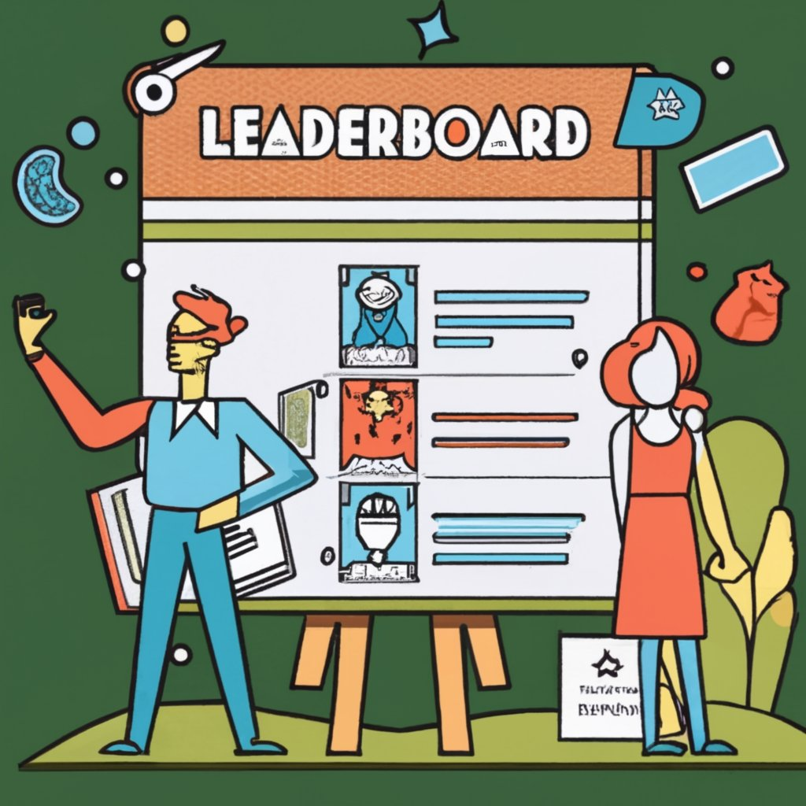

There was a [popular piece](https://www.semianalysis.com/p/google-gemini-eats-the-world-gemini) recently from Dylan and the SemiAnalysis team (a.k.a. *[that semianalysis guy](https://twitter.com/sama/status/1696340377098453440)*) that had many things right, pioneered an obviously catchy description of GPU-rich/poor, but really missed the beat on some of the smaller companies. I wasn\'t planning on writing this piece, but hearing him repeat these short-winded arguments on [Stratechery Interviews](https://t.co/fRhlEq8Fgp) (\$) --- especially with their discussion of how important it is to shoot from the hip with takes when building your blog --- made it clear the record needed to be set straight. Let's talk, again, about how companies actually get started with and build with open-source large language models (LLMS).

------------------------------------------------------------------------

*Author\'s note: This article is definitely with some bias, as the leaderboard is a project I contributed to and follow closely. I think its story is worth telling and sheds a lot of light on how the open-source AI economy will grow in the coming month. The folks leading the leaderboard now (Clementine and another Nathan) are doing a great job balancing community wants with engineering/product practicality, and the leaderboard is building a lot of value beyond HuggingFace.*

------------------------------------------------------------------------

Let\'s start with the SemiAnalysis article, in the *GPU Poor* section:

> HuggingFace's leaderboards show how truly blind they are because they actively hurting the open source movement by tricking it into creating a bunch of models that are useless for real usage.

The argument is that the leaderboard shows a combination of metrics (MMLU, ARC, TruthfulQA, etc.) that aren't useful for how people actually use language models and not enough of them. While at first glance this definitely has pieces of truth, the vibe of total uselessness is damaging. I\'ll take this spot to explain how people in the AI space actually use the leaderboard, then we can get back to the hotter parts of the take later in the post.

The leaderboard of interest, the [Open LLM Leaderboard](https://huggingface.co/spaces/HuggingFaceH4/open_llm_leaderboard), is something I was involved in, in the early days. It started as an internal evaluation tool, hopefully one we could automatically push our experiment results to, and it evolved into a **discovery tool**. There are a lot of different people who use the tool, but I\'m not sure any of them are being meaningfully misled. Some groups of interest and relevance to this piece:

1.  AI-first companies pre-training their own large language models.

2.  Companies that have a moderate AI footprint with smaller teams playing with models, but not training many on their own beyond a bit of fine-tuning.

3.  More independent ML practitioners and researchers trying to play around in the space.

4.  Companies that don\'t have an AI department that want to dabble in getting some of their own models rolling.

5.  Other random people that think machine learning is cool, but don\'t engage.

The challenges to the leaderboard come when you\'re assuming motivations and use cases of these groups cross boundaries. We can agree that the outside of this list, groups 1 and 5 really just will check the leaderboard to keep an eye on what\'s happening (for different reasons). Groups 2-4 are the core bread and butter of HuggingFace and the open-source ecosystem.

For example, the [Massive Text Embedding Benchmark (MTEB) Leaderboard](https://huggingface.co/spaces/mteb/leaderboard) is definitely closely monitored by companies. There\'s a ton of interesting data to dig into there, as the evaluation covers a large area. Leaderboards for text generation are inherently harder, given that [evaluation techniques are much more sparse and tricky to interpret](https://www.interconnects.ai/p/evaluating-open-llms).

The biggest way that the leaderboard helps the middle groups is by discovery. Like any internet platform, HuggingFace has a discovery challenge for content. In our case, the content is just usable artifacts, so it makes sense to do some basic evaluations for folks (burning moderate amount of GPU hours to do so, something small startups cannot do that easily). Without the leaderboard, how else do you find a model on HuggingFace when it has almost 0 downloads? It\'s really hard unless it\'s from an organization you know of beforehand. **Giving organizations a fair way to introduce their models to the world is extremely valuable**.

Now, companies interested in AI have a starting point. Independent practitioners also have a way to get their work known, I see many wins. Companies in Group 2) are definitely aware that the evaluations won\'t be perfect, but they have the tools to test them out. I think the most practical folks looking at the leaderboard will **look at pretrained models for their own fine-tuning needs**, which eliminates a ton of the noise in the instruction-tuning variants. The *instruction-tuning variants on 100k synthetic OpenAI samples show what\'s capable*, not the starting point.

Any for-profit organization on the planet will take the moment to toot its AI horn given the pressure on boards to come up with \"AI Strategies.\" This can come at the cost of reputation, but I don\'t know if they care.

The companies that are really shooting themselves in the foot here are those that are saying their model is unequivocally good by just nudging out the top spot on the leaderboard. This is going to happen in AI a lot, not just with leaderboards, because it\'s [hard for untrained people to think about AI](https://www.interconnects.ai/p/cruise-collisions-self-driving)! The populations who are experts in ML know that a small win on benchmarks probably means something, but evaluating the uses of a pretrained model requires a broad, broad approach.

[Falcon 180b ](https://huggingface.co/blog/falcon-180b)is the most recent model to get caught in this pickle. Talking with the authors, they know a much more complex picture of this model: it matters due to its size, its training isn\'t well suited to the benchmarks at hand, really doesn\'t have much code/math training (so fine-tuning for that will be hard), scores higher on unused benchmarks like Winograde and PIQA (paper coming soon, not out at time of writing), and is really good at chat (without RL / much instruction tuning, my evaluation). Putting all of this into an automatic leaderboard is an insane amount of work, especially on chat, where we don\'t really know the best ways to evaluate it beyond MT Bench.

*Note: When the Falcon180b paper is released, I am hoping to add more! Tons happening in the model space these days.*

Compare the first link I included, from my colleagues at HuggingFace to the [post from TII](https://falconllm.tii.ae/falcon.html)(owners of the model). The subtle change from \"really good model\" to \"our past models were the best in category and this one is betterer\" is not really a leaderboard problem, but a messaging one.

The follow-up take, in the podcast interview, was the following:

> For those folks, especially Hugging Face, they are doing what's exactly the opposite of what they should be doing. Hugging Face, the rallying call, the GitHub of models, if you will, has the idea you can spawn and do inference from there, you can fine-tune from there, that's sort of the dream, I guess. They have this leaderboard of all the models on specific tasks.
>
> The problem is those tasks that you're looking at don't actually measure the model well. Natural language processing tasks is very hard. I mean we've collectively agreed as a society, at least colleges have, that SAT might not even be a good metric. But, hey, the tests that we're doing for models are significantly worse and more uni-dimensional than an SAT score is. Instead, it's things [like TruthfulQA](https://github.com/sylinrl/TruthfulQA) that people just are fine-tuning on the answers of the test and then saying, "Hey, we won." Then people are sticking it out there, making this, "Oh, my God, GPT 3.5 is dead, GPT 4 is matched", and then they're not actually anywhere close to usable.
>
> \...
>
> My opinion is Hugging Face needs to just either take down the leaderboards or significantly raise the bar in terms of what evaluations are used, because otherwise they're just hurting the general community.

Let\'s get into the details of how the leaderboard actually works a bit more. There is actually very close moderation of the leaderboard (mostly by the community, with employees double-checking things) through two mechanisms:

1.  All the actual evaluation data is publicly stored ([example here](https://huggingface.co/datasets/open-llm-leaderboard/details_uni-tianyan__Uni-TianYan)),

2.  Users [report models with fishy results](https://huggingface.co/spaces/HuggingFaceH4/open_llm_leaderboard/discussions/213) (e.g. by training on the evaluation data), shown below:

Don\'t underestimate the HuggingFace users, they\'re literally been plotting standard deviations of MMLU scores per model size to spot outliers (though, this doesn't stop people from [coming up with different inference techniques to improve benchmarks](https://twitter.com/johnjnay/status/1701664953160159524)).

Given this and how closed models are known to game some of these evaluations with special prompting and/or subtly different techniques (like RLHF\'ing on chain-of-thought data that is in distribution, more on this soon), the leaderboard is now one of multiple information channels on evaluation quality. I\'ve been saying this independent of HuggingFace since LLMs became all the rage: independent evaluation of models is crucial to the transparent progress of technology. Whether or not the Open LLM Leaderboard is exactly aligned with your views of how LLMs should be evaluated, it is also **a useful tool for oversight of language models**, independently tracking progress.

An interesting evaluation nuance that I learned from the recent Adept model release is about how answers are \"selected\":

> Consider the following multiple choice question from the common HellaSwag eval set. The goal is to pick which of the four answers best continues the "question." \*A woman is outside with a bucket and a dog. The dog is running around trying to avoid a bath. She...
>
> a\) rinses the bucket off with soap and blow dries the dog's head.
>
> b\) uses a hose to keep it from getting soapy.
>
> c\) gets the dog wet, then it runs away again.
>
> d\) gets into a bathtub with the dog.\* One way to evaluate the model is to simply ask it to answer the question and then see which choice it makes -- (a), (b), (c), or (d). This mimics the experience of how people actually interact with language models -- they ask questions and expect answers. This is analogous to e.g. [HELM](https://crfm.stanford.edu/helm/latest/).
>
> A more common practice in ML is instead to use the implicit probabilities that the language model assigns to each choice.

This approach that the LLM leaderboard does is this cumulative probability calculation, but folks seem to think larger models do better when just returning characters like A. The reason the evaluation is built with probabilities is that poor models really struggle to even return in the right format when asking something like this (even ChatGPT can make a bunch of errors when asking for output formatting), so doing so would lead to kind of wild results. Anyways, it is important to know that **multiple-choice benchmarks are often scored with word probabilities!**

------------------------------------------------------------------------

This article had a lot in it, but really the story for evaluation is to not let the perfect be the enemy of the good. Even if the leaderboard just provided a little place to focus some of the open-source community\'s efforts that would be good enough. It\'ll help the builders find each other and align on future work. I\'ve been impressed by the open-source community\'s ability to fine-tune models for math and code, leveraging a [lot of synthetic data](https://arxiv.org/abs/2306.08568), [even some new RLHF techniques](https://arxiv.org/abs/2308.09583), tons of [RoPE Scaling](https://www.similarweb.com/blog/insights/ai-news/character-ai-engagement/) to extend the context length of base models, and [lots of quantization](https://huggingface.co/TheBloke) / local development. While it may seem like the open-source community has been a bit chaotic, those are some clear areas where they\'ve made progress.

I asked [publicly](https://twitter.com/natolambert/status/1699813583239229587) and privately (many open-source LLM creators are anonymous Twitter accounts) if this covered everything and another narrative on what people actually use these models for is roleplaying. This makes sense as something that synthetic instruction tuning could do very, very well with --- easily generate tons of dialogue data for a type of character and push it into a decent smaller model. This theory is [validated by other economic data on Character AI](https://www.similarweb.com/blog/insights/ai-news/character-ai-engagement/), which has astonishing usage numbers (think hours, rather than minutes per user) and very little hype surrounding it.

Before we move on to other open-source LLM news, you can check out this *shiny new* HuggingFace **[collection](https://huggingface.co/collections/open-llm-leaderboard/the-big-benchmarks-collection-64faca6335a7fc7d4ffe974a)** with all the various leaderboards \-- hopefully a community member can make a meta-leaderboard with all the ranks, maybe kidding maybe not.

If I were looking to find out which models are generally the best in the open-source space right now, I would compare the results on the Open LLM Leaderboard with the LMSYS [Chatbot Arena Leaderboard](https://huggingface.co/spaces/lmsys/chatbot-arena-leaderboard). The LMSYS leaderboard has many fewer models, but the capabilities are definitely correlated, so you should be able to ballpark models. As the Open LLM Leaderboard adds more evaluation columns, these should converge.

## Open source pretraining happenings

We\'re gearing up for a big fall of open-source LLMs. This is where we start with the rest of the critiques for SemiAnalysis. The SemiAnalysis authors state:

> The few hundred million that HuggingFace and Together have raised collectively means they will remain GPU-poor, getting left in the dust as they will be unable to train N-1 LLMs that can serve as the base to fine tune for customers.

These two organizations are blatantly not carrying the entire open-source ecosystem. It\'s far from the truth, open-source currently lays on the shoulders of Meta, with Llama 3 either coming in November or January 2024 (my predictions, lots more good details in this [Reddit post](https://www.reddit.com/r/LocalLLaMA/comments/16b18tj/inside_metas_ai_drama_internal_feuds_over_compute/)). More on how open-source diversifies from Meta in a second.

Before that, it's worth noting that not investing in the scale of GPUs required to keep up with pretraining companies may be an existentially correct question. Depending on the rate of product innovation, we could see the majority of the LLM API companies out of business by the time their initial GPU contracts are up (usually 2-4 years) **because the order of investment needed will only increase**.

The next criticism is for Databricks (from SemiAnalysis again):

> Databricks (MosaicML) could at least maybe catch up, due to their data and enterprise connections. The issue is they need to accelerate spend by multiple times \[of the \$1.3Billion acquisition\] if they want to have hopes of serving their over 7,000 customers.

The missing piece here is that the authors enter with the frame that everyone should be pretraining general models. A lot of medium-sized companies, especially building on open-source, succeed by being the best at fine-tuning models for their customers. We\'re going to see the wave of synthetic data companies transition into the wave of RLHF companies.

The crucial point here is that there are enough entities with open-source values that engage in pretraining. Ultimately, governments could also play in this space if they got their act together and paid real tech salaries. There are many, many stories to unfold before the GPU rich and GPU poor split is settled.

Just last week [Adept AI](https://www.adept.ai/blog/persimmon-8b) released what I assume is an older checkpoint of one of their multi-modal experiments. The blog post is short and to the point, or you can read a good [summary here](https://twitter.com/suchenzang/status/1700214177091264758). One of my favorite points is the following, which points to more action in multimodal LLMs soon:

> The model has 70k unused embeddings for multimodal extensions and has sparse activations.

Finally, for the coming soon section. I\'ve heard rumors that both [Deci](https://deci.ai/) and [Mistral](https://mistral.ai/) are planning to enter the open-source LLM landscape this fall with models in the 5-20 billion parameter range. It\'s going to be a fun few months!

------------------------------------------------------------------------

Housekeeping:

-   **Interconnects referrals:** If you're one of my lovely loyal fans, I'll give you free paid posts if you use a referral link you find on the [Interconnects Leaderboard](https://www.interconnects.ai/leaderboard). Sharing really helps me continue to publish and engage with fresh ideas.

-   **Student discounts:** If you're a student and want a large paid discount, check out the [About page](https://www.interconnects.ai/about).

Elsewhere:

-   A talk from Rich Sutton (founder of RL) on how humans should prepare for succession to AI, with many historical connections. It sounds crazy, but it is well reasoned and worth watching:

    :::::::: {#youtube2-NgHFMolXs3U .youtube-wrap attrs="{\"videoId\":\"NgHFMolXs3U\",\"startTime\":\"6s\",\"endTime\":null}" component-name="Youtube2ToDOM"}
    ::::::: youtube-inner
    :::::: iframe
    ::: {#player}
    :::

    :::: player-unavailable
    # An error occurred. {#an-error-occurred. .message}

    ::: submessage
    [Try watching this video on www.youtube.com](https://www.youtube.com/watch?v=NgHFMolXs3U){target="_blank"}, or enable JavaScript if it is disabled in your browser.
    :::
    ::::
    ::::::
    :::::::
    ::::::::

-   My most recent podcast appearance on RLHF and RLAIF --- I think people are starting to come around to RLAIF being the next frontier!

    :::::::: {#youtube2-u8xxEkH3a5g .youtube-wrap attrs="{\"videoId\":\"u8xxEkH3a5g\",\"startTime\":null,\"endTime\":null}" component-name="Youtube2ToDOM"}
    ::::::: youtube-inner
    :::::: iframe
    ::: {#player}
    :::

    :::: player-unavailable
    # An error occurred. {#an-error-occurred. .message}

    ::: submessage
    [Try watching this video on www.youtube.com](https://www.youtube.com/watch?v=u8xxEkH3a5g){target="_blank"}, or enable JavaScript if it is disabled in your browser.
    :::
    ::::
    ::::::
    :::::::
    ::::::::

<!-- -->

-   Cool [visualization](https://perplexity.vercel.app/) of the probability of text generated by an LLM (I think more tools are needed to build intuitions of attention mechanisms). This one is fun because it runs in your browser!
