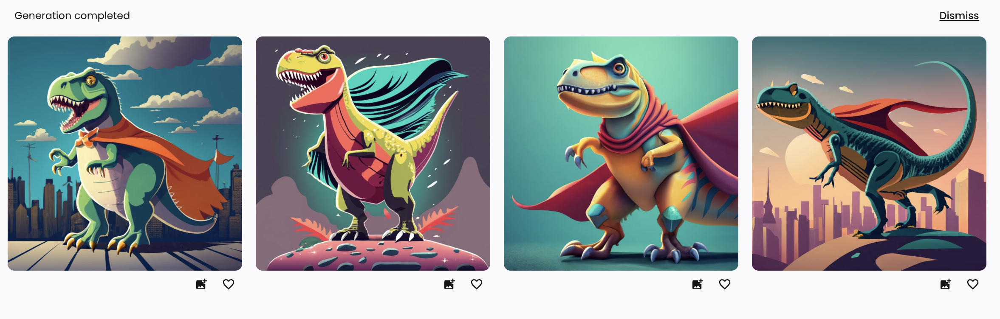

*On the* *[first episode of The Retort last week](https://retortai.com/episodes/alchemy-oppenheimer-and-the-quest-for-agi), Tom and I discussed the alchemic roots of machine learning, Oppenheimer & AGI, and what is to come in the podcast from us.*

------------------------------------------------------------------------

Midjourney seems like it was the first ML-powered startup to emerge with a stable and solid following and business in the last few years. Recently, it [passed \$ 200 million in annualized revenue](https://www.theinformation.com/briefings/ai-startup-midjourney-expects-200-million-in-revenue) and got some competition from [Ideogram](https://ideogram.ai/launch).

Midjourney is now pioneering a different way of building an **ML company by organic, self-serve paid users** and not getting enough credit for it, given the level of VC investment in the last 12 months. Most people know that Midjourney built its network by piggybacking on top of Discord, but fewer people know that\'s how they enable a community with over 15 million members (1.5million online when writing this, tons of active voice channels), share major product updates ([new image editing tools](https://discord.com/channels/662267976984297473/952771221915840552/1143249522974261382)), infrastructure ([cluster upgrades and how much speedup to expected](https://discord.com/channels/662267976984297473/952771221915840552/1139337907618988152)) updates, and more. Discord now [has some deal where they skim off the profits of Midjourney](https://www.theinformation.com/articles/discords-midjourney-deal-could-supercharge-its-revenue), forging a strong relationship. This is just all highly unusual, a company where the extreme inference costs are in all likelihood actually profitable already! Before even digging into the ML, all indicators are that Midjourney is doing very well.

Midjourney represents a new way for building indie software companies in the era of AI. Build something that people enjoy using and keep iterating. No claims of foundation models, AGI, or the usual distractions.

Now, Ideogram from the [Imagen](https://imagen.research.google/) team at Google is here to provide a competitor with some VC acceleration. I\'ve happily used Midjourney for the last few months to generate images for the blog, which is just scratching the surface of the ways people will use these productively, but having a free competitor in the space will be a fantastic **opportunity to study the power of network effects, price, and AI quality** all looped together. The burden is on us to follow and see if folks switch away from Midjourney and for which of the above reasons.

The best place to start when analyzing ML companies these days is often the GPUs. Rolling back the clocks a bit, we have some context on this for Midjourney in the public record. Here\'s an exchange from an interview last fall by Ben Thompson (BT) with [David Holz](https://twitter.com/DavidSHolz) (DH) on [Stratechery](https://stratechery.com/2022/an-interview-with-midjourney-founder-david-holz-about-generative-ai-vr-and-silicon-valley/) (\$) that gave this great foresight when asked about \"The Oncoming GPU Crunch\" we\'re now living through:

> **BT**: So how does the cost structure work on this? So on one hand V4 just came, out nine months training a model. Training at least, to a layman like me is going to be very expensive. But then you have all these people in there actually generating the images, running these inference models, which I understand are running on GPUs. So in this case, I'm guessing your marginal cost per image generated is a much bigger chunk than the training? How does your cost structure work?
>
> **DH:** I would say about **10% of our cloud costs are going into the training, and 90% is the inference to the users making images**. So it's almost all the cost is making the image.
>
> **BT:** And that making of the image is running on GPUs?
>
> **DH:** Yes, yes. I'm not very sure whether to say the exact numbers that we're using...
>
> **BT:** You're using thousands and thousands and thousands of GPUs.
>
> **DH:** More than thousands. Or **usually more than 10,000 GPUs**.
>
> **BT: Are you the largest GPU user in the world?**
>
> **DH:** No, but **we are one of them**.

As a private company, we don\'t have full insight into these numbers, but it is safe to say that inference spending is only increasing and Midjourney is likely complicit in the ludicrous GPU deals going around the valley \-- without having to forge over part of their company in shares. Even with this, I bet people leave Midjourney out of the conversations/plots of who has the most compute.

Let\'s cover the actual products for a bit, then I\'ll return to the GPU comments. Ultimately, having more types of companies operating at this scale of inference costs is an important validation for the scale of investment into ML infrastructure broadly these days. It is a hint towards the question of *what happens to AI if the LLM bubble bursts.*

## Midjourney vs. Ideogram

I spent a bit of time playing with the models and browsing the respective [Midjourney](https://www.midjourney.com/app/feed/) and [Ideogram libraries](https://ideogram.ai/) \-- pretty quickly you can see differences in style. Just browsing, not even generating, these and getting a sense of the character of AI-generated images is a good exercise for anyone trying to have a coherent worldview on AI.

Ideogram was also a bit faster in generation time when I first tested and then slower a few days later (even saying not available once), we\'ll see how inference changes when the waitlist opens. How many GPUs have they claimed? Surely not 10,000+.

Summary of capabilities between the two:

-   **Detail**: Midjourney is the clear winner here \-- most of the prompts return feature-rich and complex scenes for the prompt. It\'s almost like constantly living in a video game world. Ideogram does this sometimes, but most of the time the style is more in the realm of *digital design*, or something you\'d find on a software product blog.

-   **Artistic flavor**: Again, Midjourney comes up with many more wild creations on a regular basis. I find this fun to play with, and sometimes I remove words from my prompt to let the model have a go at something funny.

-   **Text:** Ideogram's claim to fame is its ability to easily add text. This is actually a huge difference, and it can do some fun things like word art (look at the [library](https://ideogram.ai/)), which is a huge value-delivering addition for thumbnails and the type of content I use these services for. Without the text feature, launching a competitor to Midjourney would've been much harder.

-   **Consistency:** Ideogram seems to fall in this \"simple\" style more consistently. Midjourney has a much bigger wow factor, but it is sometimes nicer to work with a tool that returns something you expect.

In reality, I think this is because of *my own limited prompting abilities*. The real test is if you have a consistent modifier at the end of your prompt, like \"photorealistic, modern sci-fi film, muted blue tone\" how often do the models nail it? This is the sort of thing I\'m trying to nail down for Interconnects, where having a consistent style supports readers' interests and habits.

With the above clause in mind, the features I did not really test, but are important to these products:

-   **Steerability**: How well do the models respond to prompts? Can you do negative prompts \-- e.g. \"not red\" and other things. With RLHF coming to image models, this will surely evolve rapidly in the next few years.

-   **Safety**: How well do the sites block harmful use? In generating images for self-driving articles, I\'ve hit this barrier. If one of them ends up with too many false positives on the safety filter, users will probably leave en masse.

-   **Other editing features**: Midjourney has a lot of features around zoom, re-rolling a certain image with varying strength, crop-and-regenerate, and more. How much do these matter?

I\'m openly using both for my thumbnails, we\'ll see which wins out. I need to keep pumping effort into these \-- one of the most important parts of sharing content on the internet. This leads to the last real split between them: the intended audience and how you access them.

Midjourney's Discord server is immense and lends itself to that culture of gamers and internet culture. Ideogram is fairly neutral now with just a simple web interface, which will evolve as their market clarifies.

Indirectly, both these companies compete with open source models and direct integration into operating systems like Apple did with Stable Diffusion (does anyone know if it is easy for Apple to update to new versions of the model?). The access point versus style spectrums here make the space exciting to follow. I haven't even tried Adobe's offerings!

------------------------------------------------------------------------

### Midjourney vs. Ideogram examples

While writing this, I was playing with many more side-by-side examples --- it is only natural that I share a few!

::: pullquote
**Prompt**: *A dramatic dinosaur with a cape that is a mascot for a new billion dollar startup, digital art.*
:::

Midjourney

Ideogram

::: pullquote
**Prompt:** A showdown between two language models
:::

Midjourney

Ideogram

::: pullquote
**Prompt:** The new AI artist on the block, colorful, creative
:::

Midjourney

Ideogram

The thing that is hard to get across is that being used to Midjourney, I am expecting these *loud* pieces from the model. Ideogram is really hit or miss here. It can do this impressive, artistic quality, but I also find a lot of the outputs are more subdued concept art. The things that look like drafts or movie planning boards. Midjourney, even if the content doesn\'t look right, looks like a final digital product.

The question that the founders need to answer is about market size \-- **which is a bigger user, those creating digital worlds, or those using this in product design.**

Midjourney may be doing its own thing (coupled with the network effects of Discord) while Ideogram goes off to compete with Adobe. We'll see, and let me know if I missed anyone in this space.

Some last little things to know from the user perspective:

-   **Interface and feedback**: Midjourney's UX / workflow is much better suited to collect feedback data. It makes you select an image to upscale it, and utilizes its network to directly compare user-generated images from two different prompts, setting up the stage for RLHF:

-   **Text continued**: Handling text is very important in a way that's not entirely easy to describe. Another tidbit is that the text it can handle is restricted to real words, Ideogram couldn't generate "Midjourney" or "Ideogram" for me. I suspect Midjourney is well underway in fixing this.

-   **Realism**: Midjourney is able to make things look much, much more realistic.

-   **Prompting**: Both, and likely all models in the text-to-image bracket from internet data are very sensitive to hyper-specific prompting to get a scene just right. I suspect this will change as RLHF / steerability techniques trickle down.

------------------------------------------------------------------------

### Preventing an AI winter

While the world of LLMs burns so bright, it is easy to overlook other categories like image generation. As an AI aficionado and employee, these separate entities could be categorically our most important asset. For us, the biggest potential for another AI winter lies in the LLM investment coming at the wrong time.

LLM technologies will find productive homes, but if this either happens at a small scale or in a decade, we'll have the casualties of many model-performing companies that can't sustain their GPU bills. The timing of LLMs adoption will determine how many go up --- at this rate of investment, unless the rate of progress continues like 2022-2023, I suspect about half of the new organizations of the likes of Mistral, Inflection, Contextual, Imbue, Adept, etc. could be dead or acquired for cheap whenever their next GPU contract is needed (I suspect a lot are three years). This is not to say these places don't do good work, it's entirely around market timing.

When this culling occurs, the burden of public perception around AI balances on whether people still use ChatGPT and the other AI products in the ecosystem. I see Midjourney and Ideogram as being strong pillars in this transition. Incidentally, these image-based companies with extreme inference compute budgets would benefit from pretraining being less in vogue, as overall demand for computing would collapse.

If you are invested in AIs' continued flourishing, these companies diversifying our portfolio to hedge against another AI winter should be a fan favorite. If there is nothing but LLMs, the entire industry and the academic-industry complex (how the industry funds so many academics) could collapse. The scale of investment initiated cannot be sustained with true product-market fit, especially as scaling laws are a core component of progress. This is ok stark comparison to autonomous vehicle companies, where the ride-sharing and transport markets are relatively clearly defined and targetable.

Doubly, when there are so many eyes in the LLM space, it's a less competitive space to play in. I'm the case of Midjourney and Ideogram, I expect them both to thrive. They should specialize in different use cases and tool integrations.

------------------------------------------------------------------------

### DALL·E 3 announcement

Soon after the launch of this post, as it always goes, [OpenAI launched DALL·E 3](https://openai.com/dall-e-3). There are some curious product decisions that I will follow up on soon, but it feels somewhat orthogonal from this post, as the model is not even easily accessible. I'm sure the **quality is extremely high**, but the comparisons will come later (unless you want to pay for my blog, so I can funnel that money into a ChatGPT+ subscription for market research).

There are tons of strategic plays unfolding in the space of multimodality now. This The Information piece on "[OpenAI hustling](https://www.theinformation.com/articles/openai-hustles-to-beat-google-to-launch-multimodal-llm)" kicked it off. Google is teasing Gemini, OpenAI is making DALLE available through ChatGPT first, GPT4 multimodality has not been released (probably for safety reasons), Adept's new model has visual connections/features/vocabulary that aren't used, HuggingFace released [IDEFICS](https://huggingface.co/docs/transformers/model_doc/idefics) and more. Exciting times, I'll loop back on this soon.

------------------------------------------------------------------------

Elsewhere:

-   [Casey from Platformer had a good summary of the state of Substack](https://open.substack.com/pub/platformer/p/what-i-learned-in-year-three-of-platformer?r=68gy5&utm_medium=ios&utm_campaign=post) and this writing journey I\'m early into. A good read if you\'re interested in the ecosystem.

-   [VentureBeat covered](https://venturebeat.com/business/todays-ai-is-not-science-its-alchemy-what-that-means-and-why-that-matters-the-ai-beat/) the core theme of The Retort podcast: *Alchemy!*

-   A good post from my friends at Generating Conversation about the [journey from a rejected AI paper to a test-of-time award systems paper](https://generatingconversation.substack.com/p/how-our-test-of-time-paper-almost-wasnt?utm_source=post-email-title&publication_id=1881004&post_id=137171755&utm_campaign=email-post-title&isFreemail=true&r=68gy5&utm_medium=email).

Housekeeping:

-   **Interconnects referrals:** If you're one of my lovely loyal fans, I'll give you free paid posts if you use a referral link you find on the [Interconnects Leaderboard](https://www.interconnects.ai/leaderboard). Sharing really helps me continue to publish and engage with fresh ideas.

-   **Student discounts:** If you're a student and want a large paid discount, check out the [About page](https://www.interconnects.ai/about).
