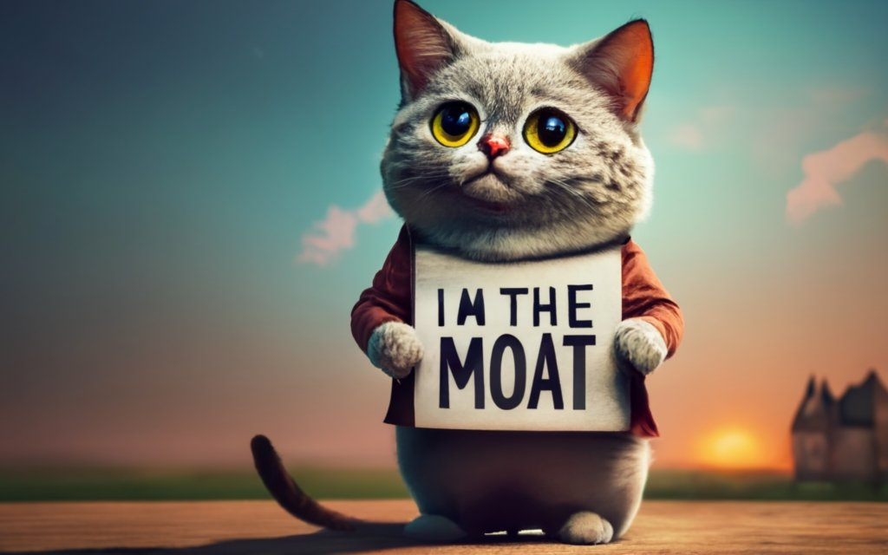

*On the* *[second episode of The Retort last week](https://retortai.com/episodes/ai-in-public-education-roads-and-institutions), Tom and I discussed how AI will transform most public institutions, such as education and the road network.*

------------------------------------------------------------------------

Moats are important to technology companies, they\'re core to why big tech is often regarded to as some of the most successful companies ever. They\'re a primary factor in how they maintain their stranglehold on demand that creates the profit factories we know of today. Given their importance, people always try and have takes on them, but most of them in ML wildly miss the mark. The most famous take on moats was the [Google Memo](https://www.semianalysis.com/p/google-we-have-no-moat-and-neither), which [was pretty nonsensical](https://www.interconnects.ai/p/openai-google-llm-moats) (here\'s my earliest writing on predicting [ML moats](https://www.interconnects.ai/p/ml-moats) if you\'re curious).

[OpenAI launched DALL·E 3](https://openai.com/dall-e-3) last week, and it was a moat play more than a standalone product play. You can do the same analyses for DALL·E 3 as[ I did for Midjourney and Ideogram](https://www.interconnects.ai/p/midjourney-vs-ideogram) last week, but as long as the model is solid, the bigger picture matters more. It\'s clear that DALL·E 3 is a very good model, sort of the wow factor of Midjourney with the text capabilities of Ideogram. The main problem DALL·E 3 was facing is the lack of consumer habits surrounding its use relative to Midjourney (also the biggest problem for Ideogram). To solve this, OpenAI had a huge card to play: its 100 million+ ChatGPT users.

*Note: you can look at some* *[example DALLE3 photos here](https://twitter.com/openai/status/1704545442749628695?s=46&t=iSzqyeqjxAsShT6lTSyBFw), comparisons of Midjourney to the prompts used in OpenAI\'s dataset* *[here](https://twitter.com/bio_bootloader/status/1704549892004397391?s=20), or a* *[challenge prompt](https://twitter.com/willdepue/status/1704575904775815651) by a prominent voice in the text-to-image community. Midjourney fares quite well on the prompts that OpenAI cherry-picked.*

To be clear, many people predicted this type of integration and expected them to use other models like [Whisper](https://openai.com/research/whisper) for audio integration. I was one of them, quoting my piece on [AGI & Multimodality](https://www.interconnects.ai/i/107276247/multimodality-grounding-and-gpt) from before the GPT4 launch:

> The first one that you shouldn\'t be surprised by is **a near-future update to ChatGPT that directly integrates DALLE 2**. ChatGPT will very soon have interfaces for all of the popular models in their quiver.

ChatGPT is the name brand. People outside of ML associate all recent ML progress with ChatGPT. It\'s a once-in-a-technology cycle opportunity to coin a term like \"Google it.\" OpenAI can become synonymous with AI like Google is synonymous with the internet. The key question was, how is OpenAI going to build a defensible business around sustaining this? The answer was already pretty apparent months ago for anyone in the space. Again, quoting my article:

> For anyone who\'s played with the text-to-image models released in the last couple of years, being able to provide rich text feedback to the model to edit an attempted generation really would be game-changing. I suspect we will be able to do this all in ChatGPT (or they add a ChatGPT window to other models on their website).

Now, let\'s look at the launch video for DALL·E 3, it is an elegant way of doing this:

::: {.native-video-embed attrs="{\"mediaUploadId\":\"49a82f9c-8f57-426a-82a6-5fc4021bb279\",\"duration\":null}" component-name="VideoPlaceholder"}
:::

The DALL·E 3 launch is a big commitment to OpenAI showing that the ChatGPT interface and app will be it\'s moat. We\'re at the point where event Karpathy is [teasing it](https://twitter.com/karpathy/status/1704556904213791033?s=20)! Most ML-focused companies are frantically trying to find their footing, so OpenAI has a huge opportunity to really nail this and double down, it\'ll be fun to watch. Anthropic, which has similar quality models, can\'t play this exact same card because of how big of a footprint ChatGPT already has. Taking market share from an incumbent requires dramatically better products, while OpenAI got it for being first.

Outside of consumer habits, ChatGPT fulfills the other part of being a moat, e.g. it is a feedback loop that enables invested capital to result in predictable returns, because of the user data they will collect. That data is used to train and evaluate all of their future models.

Just the next week after DALL·E 3, OpenAI also added the ability to use [GPT4 to reason with images into ChatGPT](https://openai.com/blog/chatgpt-can-now-see-hear-and-speak). This practically simultaneous launch of image capabilities is the perfect execution for building a moat around your primary touchpoint. Having image-\>text pipelines makes working with text-\>image a lot easier. The reports from [The Information that OpenAI is \"hustling\" ahead of Gemini](https://www.theinformation.com/articles/openai-hustles-to-beat-google-to-launch-multimodal-llm) really seem to be true. I\'ve heard that Gemini has a similar amount of engineering talent on the project as OpenAI has in employees total (800-1k). Google is invested, but the open question is **how it integrates this mega model into products!**

If we look at the initial integrations, Google is doing the right thing. [Google is making it so Bard can search your email and files and answer questions about it](https://www.platformer.news/p/how-google-taught-ai-to-doubt-itself). The problem is, that the model performance is only meh. The core question for Gemini is how to 10x the performance and lock in users. Microsoft is playing in this space too, but the expensive monthly fee for their CoPilot will restrict a lot of the usage to start with the enterprise. Everyone that I haven\'t mentioned: Cohere, Inflection, Mistral, whoever, they\'re all in a way harder place when it comes to moats. They have enterprise integrations, but when the enterprise customers realize they can\'t waste money on GenAI anymore, that space will collapse, and the moats will be tested.

## Bad moat takes

TheSequence was the most recent article to have [some moat takes really miss](https://open.substack.com/pub/thesequence/p/do-amazon-and-apple-have-any-moats?r=68gy5&utm_campaign=post&utm_medium=web). Correcting this will be illustrative of what moats are and are not.

> Many tech incumbents have established clear moats in generative AI:
>
> -   OpenAI\'s moat is undoubtedly the GPT-x family of models.
>
> -   Microsoft\'s moat lies in its alliance with OpenAI and extensive distribution channels such as Office, Windows, GitHub, and LinkedIn.
>
> -   NVIDIA\'s moat is its dominance in GPU computing.
>
> -   Google\'s moat encompasses the PaLM and DeepMind family of models, combined with its vast distribution through search.
>
> -   Meta\'s moat appears to be leaning towards open-source distribution.
>
> \...Amazon seems to be banking on partnerships with startups like Hugging Face to enable generative AI capabilities in AWS. However, this approach appears vulnerable and could potentially allow Microsoft and Google to gain more cloud market share. While Apple\'s distribution moat is robust due to the iPhone, their apparent lack of a clear vision and roadmap for generative AI is surprising.

**Models are not moats**. The directors of the Llama team at Meta are on the record saying they want to release a GPT-4 caliber model next year. If you\'re training models that aren\'t on that level, your moat would be destroyed. What fuels good models, is definitely a moat. User data can be used as both training and evaluation data, which everyone model provider is running out of. That\'s the central opportunity for someone like OpenAI.

The article is right about Microsoft\'s enterprise software moat and NVIDIA\'s moat in having the best chips.

Google\'s real moat is not distribution via search, but demand via its search business. People will go to Google because it is a habit and has paid off in the past. That enabled them to create vast internet businesses like Gmail and Google Maps which are other vectors to provide unique AI experiences that their competitors cannot. It is much easier for Google to add AI assistants to email than for Microsoft to figure out a partnership.

Meta\'s moat is likely the most nuanced so far. Meta\'s moats are the aggregation of demand on their brilliant social media applications. I don\'t see their AI strategy being orthogonal to that, as in something like ChatGPT. Meta\'s strategy and sustaining advantages in ML are by getting immediate access on their platforms to the swaths of content created by ML. To do this, they need to enable the community to succeed with AI, hence, open-source LLMs. This can be seen through how Google already [cut a deal with them to host Llama models on GCP](https://cloud.google.com/blog/topics/google-cloud-next/welcome-to-google-cloud-next-23), but the strategy may shift a bit when [Meta launches AI personalities in their apps](https://www.theverge.com/2023/9/24/23887773/meta-ai-chatbots-gen-ai-personas-young) (hint, it's coming very soon after this post).

**Partnerships themselves are also not moats**. Amazon seems to have very little GenAI strategy nor any semblance of a moat. The deals they\'ve been a part of are entirely related to other businesses, like cloud computing, but even there, their reputation is not great (e.g. their clusters are known to be very hard to use/slow for training LLMs). A race to spend more money is not a moat --- big tech companies will ruthlessly try to stop paying you large sums of money if they can. This is like saying that Google paying Apple to make Google the default entry on iPhones is a moat. It is not, it\'s an advantage of having a ton of money.

Apple\'s moat is still the iPhone. I would also argue they have a clear GenAI roadmap: avoid the hype and integrate technologies that are ready for on-device learning. They should act faster in supporting open-source models like Llama, but Apple is building models into their operating systems and will continue to do so. The lack of noise around Siri and LLMs is a failure in my opinion, but not one that will sway consumers.

------------------------------------------------------------------------

# Added thoughts on multimodality

#### Multimodality as moats

We\'ve seen it many times before, humans like consuming visual content more than text. This is exactly why your Instagram feed looks the way it does and why Twitter has always been a small company. The next evolution of this reality on the internet could be a beachhead for LLM companies to get larger consumer footprints. We\'ve already seen models begin to interface with the text-based chats we have, but multimodality opens up a lot of doors and imagination.

If Midjourney was on the VC grow-or-die cycle, I could see a high-profile partnership between them and someone like Anthropic or Inflection happening to patch over the moat plays that OpenAI is dropping. To be clear, this sort of partnership would do very little to change the situation, but it would be good to appease the board that\'s worried about OpenAI\'s dominance.

I don\'t see this balance being as needed on the enterprise side of things. In that vein, we know that Meta is surely training models in all the modalities we have discussed: text, speech, image, etc., so it\'ll be interesting to see how they tie everything together. Without a focal point like ChatGPT, it\'s hard to create impact multiples. The integration of ChatGPT can probably enable more magic workflows than most AI agents that startups are building.

If Gemini doesn\'t have the same modalities as ChatGPT (text, text-\>image, image-\>text), Google will be sweating.

#### Some more text-to-image technicals

There was a lot of interesting discussion around the DALL·E 3 regarding the technical details of implementing text-to-image models and how steerable the models are. The OpenAI blog post had interesting details on the need for prompting:

> Modern text-to-image systems have a tendency to ignore words or descriptions, forcing users to learn prompt engineering. DALL·E 3 represents a leap forward in our ability to generate images that exactly adhere to the text you provide.

These improvements likely come from building a substantially better text encoder into the model, and who would have something better than what OpenAI has? Here\'s an example photo with the caption, it\'s quite cool:

In this vein, many open-source vision models are based on the [clip encoder](https://github.com/mlfoundations/open_clip) (an open reproduction of one of OpenAI\'s models with good results), which is why their reasoning and word-attribution capabilities may have been similar. Midjourney and OpenAI are surely doing their own thing now.

In researching these recent articles, there was some interesting discussion on how the choice of encoder impacts performance.

> CLIP seems to degrade the performance on text, because the original Latent Diffusion model (prior to Stable Diffusion) that does not use CLIP conditioning is also decent at spelling!
>
> Text rendering ability mostly comes from large text encoder that have character understanding. It's explored in this [paper](https://arxiv.org/abs/2212.10562). According to it, character-aware models are important for high quality text rendering. Ideogram most likely uses ByT5 + T5.

Given that the encoder is generally fixed, outsourcing the fine-tuning to a language model is quite a good idea. I don\'t think Midjourney is focusing on reasoning now, which requires strong attribution within the text (you can read about its shortcomings in [this blog post](https://metastable.org/draw.html)) and that\'s probably OpenAI\'s biggest advantage if they can use parts of their LLMs in the encoder.

------------------------------------------------------------------------

Elsewhere:

-   Another seemingly solid open-source model released from Alibaba, [Qwen](https://huggingface.co/Qwen/Qwen-14B), with RLHF used for the chat portion.

-   It was a big week for multimodality. Genmo, another startup in the image model space from pioneers in diffusion models, launched a [text-to-video product](https://blog.genmo.ai/log/replay-ai-video). All that we have left is Runway making a major announcement.

-   Multimodality is a good source for added scaling data after the text on the internet. Here\'s a good [lecture introducing multimodality in LLMs](https://www.youtube.com/watch?v=5vfIT5LOkR0).

-   This a reminder that HuggingFace recently released a [multimodal model](https://huggingface.co/docs/transformers/model_doc/idefics), Adept\'s new model has hints of visual components, and Contextual hinted they\'ll train a multimodal model too! More is coming.

Housekeeping:

-   **Interconnects referrals:** If you're one of my lovely loyal fans, I'll give you free paid sub if you use a referral link you find on the [Interconnects Leaderboard](https://www.interconnects.ai/leaderboard). Sharing really helps me continue to publish and engage with fresh ideas.

-   **Student discounts:** If you're a student and want a large paid discount, check out the [About page](https://www.interconnects.ai/about).

##### Still reading? A like or comment really does help!
