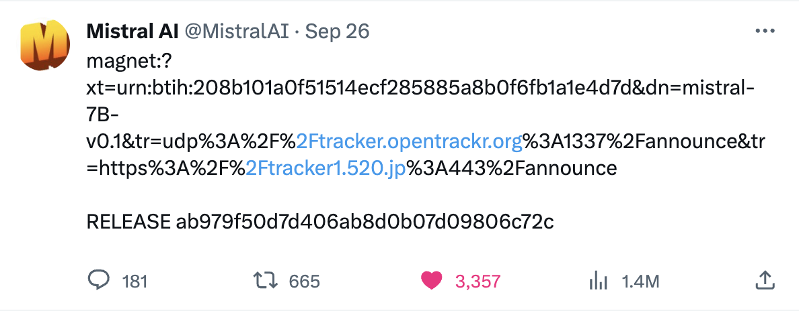
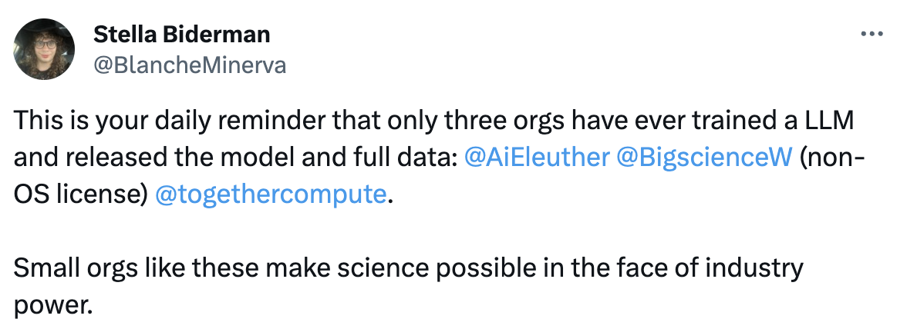

There are tons of companies playing in the open-source LLM space these days --- they're on the clock. Releasing an open LLM of some sort is becoming table stakes for proving you're a capable ML company. The most recent company to make the transition from funding to artifact is [Mistral AI](https://mistral.ai/); they released a strong [7 billion parameter model](https://huggingface.co/mistralai/Mistral-7B-v0.1).

While it is obviously great to have more participants in the open-source ML ecosystem, some would argue even existentially important, it\'s time to shift the narrative from overhyping every open release to pushing open ML companies to figure out their long-term business strategies and moats. These companies need two things: 1) a way to keep up with the competition that has deeper pockets and 2) a moat that enables products to build and maintain meaningful traction. Neither of these factors have yet kicked in.

This article focuses on the first point, and asks the question: **if we maintain the status quo, can open LLM companies actually close a gap to Google or OpenAI?**

This is for companies like Mistral and Stability burning all of their fundraising on compute without a product, not Meta. This is also from someone that believes openness is the better direction for LLMs to lean today.

## Short term: torrents, froth, experimentation

To play fun at the original Llama leak on BitTorrent, [Mistral released their first model via a Tweet with a torrent link](https://twitter.com/MistralAI/status/1706877320844509405) (below). This is extremely entertaining and captures the zeitgeist of the moment.

This year and likely next will be the glory days of open LLMs. Meta is charging ahead, Llama 2 is very useful as it can be fine-tuned easily on most tasks of interest, tons of smaller players are supporting them by rounding out an ecosystem, many people are playing with LLMs on a daily basis, Llama 3/4 is targeting GPT4 capabilities.

This is how we get to Llama 2 being hosted in both [GCP](https://cloud.google.com/blog/products/ai-machine-learning/vertex-ai-next-2023-announcements) and [AWS Bedrock](https://www.aboutamazon.com/news/aws/aws-amazon-bedrock-general-availability-generative-ai-innovations#:~:text=Amazon%20Bedrock%20is%20the%20first,LLM%2C%20through%20a%20managed%20API.): Meta\'s play of Llama becoming a platform for computing is being realized. The distribution cycle here looks like Meta releasing the model, lots of developers playing with the model, they tell their managers they should use it in their experimental products, and then finally the business deciders put pressure on cloud providers to host it. Google and Amazon likely agreed to revenue share deals with Meta to host the model. For all the criticism of the license Meta got, this was a win.

Extrapolating, how many models can apply the amount of leverage that Meta does with Llama? It seems mostly a factor of being in the right place at the right time. Llama 2 is the best general open LLM. Only one can wear that hat. The best code model would likely also get hosted, then add a few more for good measure. That count would still be well below the number of providers releasing models today.

The axis of sustainability for the hype is figuring out how many people are playing with Llama and open LLMs because they\'re told by higher-ups that the company is encouraging LLM products and experiments. Figuring out the infrastructure and limits by which an open LLM can be used for your specific use case is crucial to technological development. The details of those products not being useful yet are not too important when money is cheap). This is why everything feels so frothy.

Llama is the launchpad for figuring out if LLMs products can gain any traction. This is an extremely valuable position, but leads to the natural question: will it ever be anyone other than Meta that operates here?

## Medium-term: sharing, data, competition

Most of the open-leaning LLM providers have announced their intentions. Now we sit back and enjoy watching the development cycles. We get new releases every few months as the picture takes shape for who is the best at this. The problem is that all of these people using the open-LLM-as-a-platform play are not leaning into their stated qualities of openness.

Given that an [LLM is not truly open-source without the data and training codebase](https://www.interconnects.ai/p/if-its-not-fully-closed-ml-its-open), it\'s time to take action and convince people to open up. This [tweet](https://twitter.com/BlancheMinerva/status/1707749591196598632) below, and some offline discussions I was having after the Mistral release, made me realize that the lack of data transparency may quickly become an existential question for the open-source half of the LLM ecosystem.

*Note: a lot of the data release details actually could be hinging on the litigation against OpenAI and Meta for documenting the use of* *[non-permissively licensed book datasets](https://huggingface.co/datasets/the_pile_books3). If model providers are cleared here, we could be in the clear.*

A primary argument for open-source technology is that everyone can benefit and progress can be faster by having engagement from more stakeholders. This goes for security (even [the Pentagon agrees](https://www.bloomberg.com/news/articles/2023-09-29/pentagon-urges-ai-companies-to-share-more-about-their-technology)!), safety, and capabilities. Given that modern LLM pretraining can generally be simplified as gathering the best data possible and ramming it efficiently through a model, it\'s obvious that the data is the primary differentiator between all of the models we\'re playing with in the open: Llama, Adept\'s, Mistral\'s, Stability\'s, whatever.

There are fundamental capital constraints to this argument. Each small open-source outfit\'s research organization is likely at biggest 1/20th of the size of OpenAI\'s, Google\'s, or Meta\'s teams. With each team roughly trying to accomplish similar goals with different methods, having more people really does let you do more. The way that open-source could benefit is by sharing the most obvious details with each other, then open-source players will actually probably have 20x the amount of people to contribute by integrating (especially with the unpaid community debugging and tinkering). This will save each organization a day or week here and there. While not giving any one player a huge advantage, it'll give the ecosystem a chance.

**Organizations need to accept that the current models they\'re sending out into the world are not really monetizable artifacts[1](#footnote-1){#footnote-anchor-1 .footnote-anchor component-name="FootnoteAnchorToDOM" target="_self"}**. They\'re primarily recruiting and PR tools for the next few years of building LLMs into the modern economy. While LLMs are rapidly closing the gap to OpenAI, given the likelihood that a model 3months down the line will be state-of-the-art, each release matters only until the next model is released.

While it seems like these players can accumulate an advantage by not sharing data, they\'re digging their own collective grave. They\'re competing with each other in the open-source space and OpenAI can come along and swallow all of their lunch by progressing faster. Mistral and whoever\'s only business model is being open in the LLM space needs to double down on openness until they figure out a product, or they\'re just going to reinforce all of our reliance on Meta\'s deep pockets to give a semblance of parity between open and closed language models.

The fact that it makes no real business strategy sense for someone like Mistral (or any company with their whole premise being \"train good LLMs in the open\") may just mean that, astonishingly, just training a good LLM and releasing it with no product is not a viable business strategy.

If there was never a plan to make a product there was never a plan to be a real business, so at least do the world a favor and share your model details. For someone like Meta with so much extra cash, open-source LLMs don\'t really matter at the bottom line. For the smaller players, this could quickly turn into an acquisition or bust strategy.

This is the first chapter of a long story of open vs. closed development of language models. These early mistakes are laying the seeds of tragedy and the conclusion of the story with a significant consolidation of LLM-providing companies.

If we\'re serious about a future where open-source thrives in its original principles, increased pressure needs to land at the feet of decision-makers deciding what is and what is not shared in the data world. What else should these companies be doing to direct the community?

If we loop back to the Tweet I started with, very few organizations will be able to join that list due to liability reasons (now that authors and copywriters are paying attention), but there is much more to say about data that can be included. Mistral, for example, trained on data including some of 2023[2](#footnote-2){#footnote-anchor-2 .footnote-anchor component-name="FootnoteAnchorToDOM" target="_self"}. This means they didn\'t just download The Pile or commonly used Common Crawl checkpoints. They could tell us things like their own web scraper or any of the many data processing scripts used. It\'s time for a spectrum of pre-training data releases to exist. While we're here, credit to Stability for releasing [some information on data for the new 3 billion parameter StableLM](https://stability.wandb.io/stability-llm/stable-lm/reports/StableLM-3B-4E1T--VmlldzoyMjU4?accessToken=u3zujipenkx5g7rtcj9qojjgxpconyjktjkli2po09nffrffdhhchq045vp0wyfo#training-data), even though the word on the street is their business is really struggling*.*

The complexity of this situation gets even worse with RLHF. I\'m not sure anyone knows how to communicate the necessary constraints to recollect RLHF data. The iterative training and collection with an external vendor has a substantial complexity step up from pretraining. Open source is still far behind in reproducing the behaviors that OpenAI and Google solicit from RLHF when the mixed bag of results in Llama 2 is the only artifact.

I see two of many futures for open-source LLMs:

1.  **Open companies start sharing more**, we collectively solve many problems extremely fast, and they take over the economy. This gives them all the time to figure out products.

2.  **The status quo continues**, which leads to falling behind. The open providers sort of end up playing musical chairs where they start getting acquired one by one in about 18 months by running out of money unless they have a side project to collect revenue and effectively use their huge GPU farms. The only open-source players that continue are those with large product use cases, where open-source helps them learn about their models.

**For everyone in the LLM space, it\'s time to get more serious about openness and transparency, rather than just using it as a PR tool when all eyes are on the open-vs-closed debate.**

The facts are pointing to most reasonable folks becoming more bearish on the organization raising money to train open models and figure it out later. This phase of LLM development is all about products. Progress with the underlying technology will continue, but that matters in how it enables new products. This is the economic cycle we are in and we have seen it before.

If we don\'t think hard and early here, it\'ll just be a lot of people wasting their lunch money. A hell of a lot of lunch money. We\'ll get this:

## Long term: specialized models, scaling, challenge

While the sharing picture is dim, the scaling laws predictions are bleak for capital requirements. Open companies need to be able to raise this money or it doesn't matter.

There is one crucial axis that changes this: **open companies being by far and away the best at the one niche that serves their product focuses**. Then, they can release models, collect community feedback in their area of expertise, and hasten the feedback loop between iterations. This can look like Adept releasing multimodal models that show they can learn from all the YouTube tutorials. This means Mistral has to figure out a product solution (not easy).

As I discussed in my [article on the development paths of LLMs](https://www.interconnects.ai/p/llm-development-paths):

> Open-source will develop LLMs that are mode capable over a specific set of needs, but less cumulatively capable. What this looks like is instead of taking the giant scorecard that GPT4 was touted on, you take 10-50% as the targets for an open-source model and beat GPT4. The other metrics will likely be behind, not equal.

Competing head-to-head is not a viable short-term or long-term strategy. I suspect most companies actually know this, i.e. that they are on the clock to figure something out, but many people on Twitter don\'t know that. On Twitter, we can\'t just have victory laps whenever a model is released. There\'s more to it.

It\'s also expected that the cost of training a state-of-the-art language model to increase by about 5x per year for the next 5-10 years. By 2028, it could easily cost \$10-100 billion+ to train one model. I didn\'t even incorporate this much into my argument, but this doubles down on the fact *that* smaller companies need to specialize to compete.

This is the way that every individual gets a smaller and local model for their task of interest. Personalization and security: two tenets of open-source we need to return to.

------------------------------------------------------------------------

We still have more companies to hear from in this space. xAI is expected to open-source models, and we\'ll see how committed Mosaic is to releasing powerful models, Contextual will probably drop something solid, and that\'s not even getting to companies working in stealth. The next question, in addition to the data details, is how the dynamics unfold as the models get increasingly capable. We\'ve seen large trends across the industry where the most powerful model providers become increasingly closed. For the open ecosystem to thrive, we need to get positive momentum and push across the board. We haven\'t seen that yet.

------------------------------------------------------------------------

*Credit to* *[Vikram Sreekanti](https://www.vikrams.io/)* *for helping shape this through a short conversation. Thanks to Dylan Patel of SemiAnalysis for catching a typo.*

Elsewhere:

-   I wrote a short essay on some practical and ethical challenges in developing RLHF in the open:

    ::: {.digest-post-embed attrs="{\"nodeId\":\"4a9ccfd8-5088-4d3b-9dba-1fecdb2395be\",\"caption\":\"Note: this post is in support of the HuggingFace Ethics & Society group’s seasonal newsletter (issue #5 is here). You can find the previous entries here. As a scientist, there’s great value in being able to share anecdotes like this publicly, very few companies would permit, let alone encourage, this type of discourse.\",\"cta\":null,\"showBylines\":true,\"size\":\"sm\",\"isEditorNode\":true,\"title\":\"Challenges operationalizing responsible AI in open RLHF research\",\"publishedBylines\":[{\"id\":10472909,\"name\":\"Nathan Lambert\",\"bio\":\"ML scientist at Huggingface (RL, RLHF, society, robotics), athlete, yogi, chef. Writes about ML & society.\\nPhD from Berkeley AI, Cornell Lightweight Rowing `17\",\"photo_url\":\"https://substackcdn.com/image/fetch/f_auto,q_auto:good,fl_progressive:steep/https%3A%2F%2Fbucketeer-e05bbc84-baa3-437e-9518-adb32be77984.s3.amazonaws.com%2Fpublic%2Fimages%2Fdda47b96-836a-4b95-99a0-f0ec744d4245_2316x2316.jpeg\",\"is_guest\":false,\"bestseller_tier\":null}],\"post_date\":\"2023-09-25T21:50:52.865Z\",\"cover_image\":\"https://substack-post-media.s3.amazonaws.com/public/images/086e21ea-be77-42a7-81e9-50723d313f37_1376x864.png\",\"cover_image_alt\":null,\"canonical_url\":\"https://www.interconnects.ai/p/operationalizing-responsible-rlhf\",\"section_name\":null,\"video_upload_id\":null,\"id\":137397307,\"type\":\"newsletter\",\"reaction_count\":1,\"comment_count\":0,\"publication_name\":\"Interconnects\",\"publication_logo_url\":\"https://substackcdn.com/image/fetch/f_auto,q_auto:good,fl_progressive:steep/https%3A%2F%2Fsubstack-post-media.s3.amazonaws.com%2Fpublic%2Fimages%2Fe70f9dbf-4fe6-404c-b6bb-1831d1b7ed0b_590x590.png\",\"belowTheFold\":true}"}
    :::

-   🎤 On the [3rd episode of The Retort](https://retortai.com/episodes/as-above-so-below-alchemy-ai-safety-and-rlhf), Tom and I went into RLHF and AI Safety's strange positions within the literature and society.

Housekeeping:

-   **Interconnects referrals:** I'll give you a free paid sub if you use a referral link you find on the [Interconnects Leaderboard](https://www.interconnects.ai/leaderboard). Sharing really helps the blog.

-   **Student discounts:** want a large paid student discount, go to the [About page](https://www.interconnects.ai/about).

-   **Like this?** A comment or like helps Interconnects grow!

:::: {.footnote component-name="FootnoteToDOM"}
[1](#footnote-anchor-1){#footnote-1 .footnote-number contenteditable="false" target="_self"}

::: footnote-content
Meta is borderline. Meta stands to make more from using this in their products than it does from licensing it.
:::
::::

:::: {.footnote component-name="FootnoteToDOM"}
[2](#footnote-anchor-2){#footnote-2 .footnote-number contenteditable="false" target="_self"}

::: footnote-content
I couldn't find the Tweets with screenshots of models answering recent questions!
:::
::::
