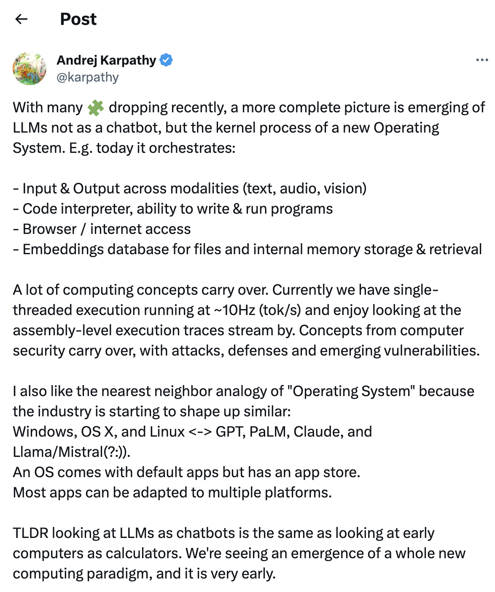
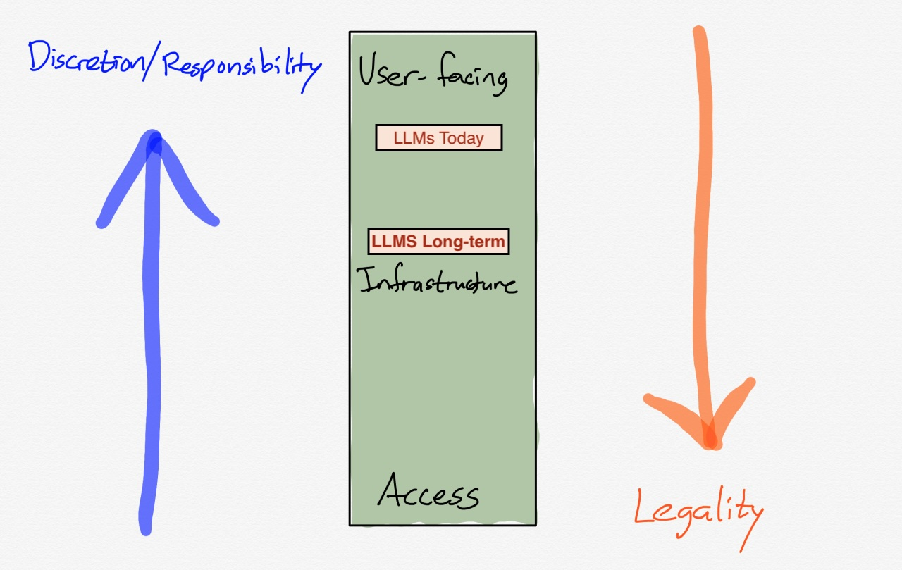

##### This week on The Retort (our best episode yet), [Tom and I got deep into the debate around if LLMs should be developed in the open, covering loads of topics and torpedoing the notion of \"Democratic AI\"](https://retortai.com/episodes/developing-llms-open-closed-or-democratic).

------------------------------------------------------------------------

To start, let\'s visit this [Tweet](https://twitter.com/karpathy/status/1707437820045062561) from Karpathy that made this idea finally click. LLMs represent way more than tools for predicting text. LLMs are a new type of computation, a platform for building different types of software applications and hardware tools in the coming decades. What is not clear is if we should be comparing them to computers, operating systems, mini-internets, or something new:

ChatGPT is a new type of software, an abstraction above and between you and the rest of the internet. GPT-N is the platform that enables this. The same GPT-N model could empower virtual assistants that see what you see and hear what you hear, answering your real-world questions. Meta has seemingly stumbled into success with its VR/AR investments, as smart glasses are the simplest way to share what you experience with an AI. Modern LLMs give any piece of software the ability to effectively communicate with humans.[1](#footnote-1){#footnote-anchor-1 .footnote-anchor component-name="FootnoteAnchorToDOM" target="_self"}

This last week we had Reka AI launch its first model, which [can read, see, hear, and more](https://twitter.com/RekaAILabs/status/1709262992771346692). On the other hand, there was a new round of coverage from the self-driving startup [Wayve demonstrating synthetic data generation for driving](https://twitter.com/rowancheung/status/1709946692882370955). Finally, we had [RT-X from Google ](https://www.deepmind.com/blog/scaling-up-learning-across-many-different-robot-types)*[and many collaborators](https://www.deepmind.com/blog/scaling-up-learning-across-many-different-robot-types)* showing that cross-domain transfer works for robotics and releasing the data. LLMs specifically, or autoregressive transformers generally, are showing time and time again that they can work with all sorts of data, when the cleaned data is available, and they generally can work with multiple types of data when you figure out how to interweave them.

The type that the *intelligence* from these AIs comes in the form of next-token prediction, even across long sequences and tasks of hundreds of steps, is astounding and entirely reflective of the profound power of these tools. These tools work in spite of having no feedback at prediction (open-loop control, for the roboticists in the room).

As the modalities, capabilities, and availability expand, various LLMs are going to be integrated into all sorts of products we use on a daily basis. I fully believe that the next spot at the table of entrenched technology super giants is OpenAI\'s to lose simply by being the first company everyone will think of trying when deploying AI.

Over the course of the next few years, this is the single most important mental model to refine and test: **what are the key factors of LLMs as a platform?** In what ways do they aggregate demand \-- i.e. how does using the same base model with multiple of your company's endpoints improve synergy (maybe by data sharing for more [in-context learning](https://towardsdatascience.com/in-context-learning-approaches-in-large-language-models-9c0c53b116a1))? We\'re very early on this journey, so it feels like something fuzzy that is starting to take shape.

I\'ve been forced into putting this together by considering the future of moderating LLMs. If an LLM is accepted as a platform that has very different societal obligations around moderation. The challenge is that while the long-term likelihood is that the most powerful LLMs will be viewed as platforms, many of the most powerful open-source models will be domain-specific and viewed more like tools.

There\'s great tension here, with connections to how easy it is to access LLMs, who is responsible, and whether is there really anything we can do about unsafe models.

# Should LLMs have safety filters?

The latest rendition of this argument started with the Mistral 7B model release and a [social values in LLMs researcher Tweeting about the potential harms of its generations](https://twitter.com/paul_rottger/status/1707430998600831424). This set off one of those entire-feed-spanning debates..

There were lots of examples here, including [comparisons to the \"kill a process prompt\"](https://twitter.com/AravSrinivas/status/1707988903788187850) that showcases the [too much RLHF of Llama 2](https://www.interconnects.ai/p/llama-2-part-2), comparisons [between LLMs and power tools](https://twitter.com/deliprao/status/1707838567626772951), comments from [Yann](https://twitter.com/ylecun/status/1708149902784799121), Meta\'s new [dungeon master not talking about weapons](https://twitter.com/willknight/status/1708206611980771409), and really whatever you wanted to look for. It\'s clear that my network and scientific leaders I look up to think that LLMs should be released totally unaltered. As the capabilities and integrations of LLMs expand, I\'m not sure this is true. I\'m less worried about some accelerationist hacker generating hate speech on their GPU than I am seeing a model deployed in a context with children where they end up prompting it to say random awful things.

This is going to be one of the recurring debates of LLM releases: who\'s responsible for the model being safe? I\'m on the record saying that open-source was [willfully turning a blind eye to engaging with safety](https://www.interconnects.ai/p/open-source-and-harmless-llms), which I was pretty upset about at the time. While it is definitely true that the open-source community didn\'t care enough about the safety of LLMs, the question is *where should they put that attention*. It is not well established who uses most of the open-source models that are released and what the most prevalent harms they propagate are.

Given the indeterminacy of the original problem, I\'ve moved on, and now I\'m much more stuck in trying to place the LLM into the context of the modern technological stack. Creating a better grounding for what an LLM represents as a platform will make prioritizing certain guardrails much clearer. We\'re in a wild phase where LLMs are both emerging platforms enabling a broader technological revolution and tools that users play with on a daily basis.

There\'s an argument to be made that **the person who deploys the model should be responsible for safely filtering any outputs**. This is okay for now, but as LLMs become a central way by which everyone interacts with the internet, there will be pressure to commoditize access. The base model being available in its raw form is more required to be a computational platform than to be a chatbot \-- if one makes the mistake of moderating their center point, another company will eat their lunch by offering a more \"helpful\" model.

So at least for now, I agree with the current batch of models being acceptable to release with no filter. Llama, Mistral\'s model, and probably even GPT4 don\'t pose a risk to society in their current form. We don't have the infrastructure ready. Meta should still research effective safety filters for the chat models that they\'re using with their apps, and sharing those chat models gives vast and immediate feedback on where the filter is too strong.

### LLMs in a framework for moderation

Take a look at this diagram from [Stratechery](https://stratechery.com/2019/a-framework-for-moderation/)\'s framework for moderation with my additions of the LLM views --- discretion means corporations decide on control and legality means it should be legislated:

For example, YouTube is something \"user-facing\", AWS would be in the middle, with access being at the electricity grid/internet service provider level. This chart was central to arguments about *who can restrict apps like Parlor*. It was deemed okay for Apple and Google to remove it from the app stores, but AWS turning off the lights would be deemed too far.

In my read, the base LLM is in the infrastructure zone, but distinctly above AWS. LLMs are slightly curated forms of the internet. Further up are the user-facing models, e.g. chat variants come with more restrictions. This shows my [agreement with Delip on how safety work should be motivated](https://twitter.com/deliprao/status/1707947789819191305):

> I am suggesting safety work should happen in the context of the application where it is possible to foresee gotchas better.

From there, a lot of my views with the community diverge (e.g. [comparing the safety of an LLM to a powertool](https://twitter.com/deliprao/status/1707838567626772951) is not useful, the same could be said with the internet, which we like moderated), as this does not solve what to do with the base models. **The nature and scope of "serving" an LLM is going to only increase in complexity.**

There\'s a substantial access conundrum to solve with respect to base models. It may get solved by models getting exponentially bigger and making decentralized/individualized inference prohibitively hard. If not, it will be *very easy* to deploy a language model in the coming years. On HuggingFace I already believe it is only a few clicks. We need to assume that the distribution cost of most models goes to zero, which both makes motivating safety important and harder to police.

While \"[If you are capable of making an inference on an LLM, it is your responsibility to use it safely](https://twitter.com/deliprao/status/1707838567626772951),\" applies today, I think we\'re quickly getting to a future where people disagree. If LLMs are a computing platform with unfathomable power to extract and provide information, maybe even actions, the argument quickly breaks down. Tools today, something way more than that tomorrow. How important this conversation really depends on the ratio of harm to cost of deployment throughout the exponential we are on for the next few years.

Taking what I\'ve written and extrapolating, it leaves us at a place where:

-   The strongest base LLMs are provided via API only, as they need to be unfiltered but we may not be able to release them safely, and

-   Chat LLMs are released in their raw-weight form with moderately heavy filters.

I wouldn't have set out for this conclusion, but it is where the argument took me.

While this future is not the one that is best for rapid and transparent technological progress, it reflects a reality of how different technologies tend to be viewed by policymakers and social norms alike. The key question is how long until these take effect. I see this being at minimum years away.

This conclusion fits with my hunch about releasing powerful models. I\'m not entirely convinced that the raw weights of a GPT-5 base model should be available to everyone in the public. If this is more a reflection of a lack of trust or some growing technical AI safety concerns, we\'ll see in future posts as I go deeper into the ideas.

The most power models of the future should definitely always be available to non-affiliated researchers, but then you get a biased vetting problem. As technology becomes more powerful, we as a society need to build more systems to support the trust and transparency of AI.

While I\'m a proponent of openness, the need to build systems to accommodate transparency is a big arrow in the quiver of the closed model providers. They don\'t have to wait for public institutions to move to use their technologies safely and as intended.

------------------------------------------------------------------------

This is one of my posts where I am most torn between two realities: LLMs are maybe the most powerful tool humans have created, yet they are growing into a new, undetermined role in the modern internet that warrants a basis of caution.

With anything around AI and LLMs, **we** **need to rely on the reality we have today rather than the one we are forecasting**. In that reality, most LLMs people are training are fine to release. If OpenAI creates something vastly more powerful, such that it is a new type of computer, we most likely won\'t have access anyway. Thanks for reading!

:::: {.footnote component-name="FootnoteToDOM"}
[1](#footnote-anchor-1){#footnote-1 .footnote-number contenteditable="false" target="_self"}

::: footnote-content
For more on VR/ AR, you need to [read Ben Thompson's work here](https://stratechery.com/2023/ai-hardware-and-virtual-reality/).
:::
::::
