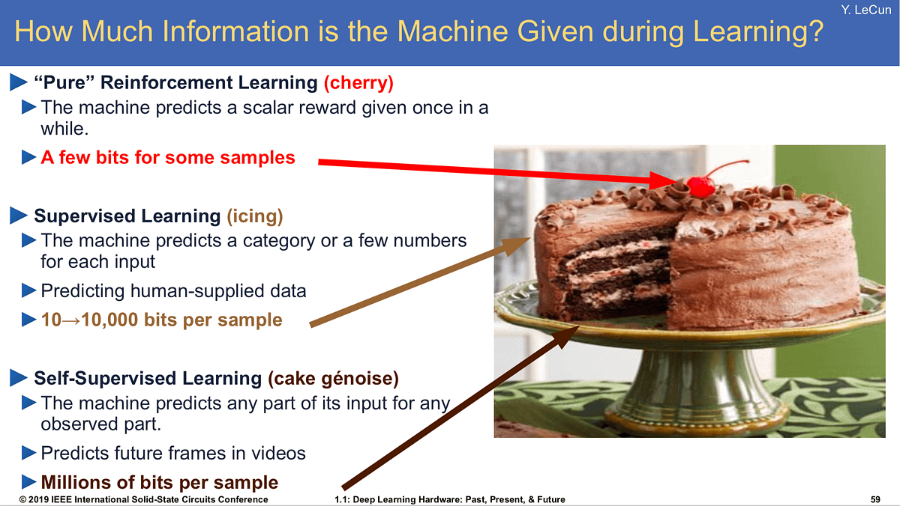

Back at the end of 2016, [Yann LeCun first shared his now famous cake analogy](https://youtu.be/Ount2Y4qxQo?si=E-EWt7IWv-kk-wmY&t=1202) (pictured below) that dictated how various types of machine learning will be used to process the world. At the time, this was mostly controversial because of how little weight he put on the \"pure\" reinforcement learning section, given the immense recent successes of tools like [AlphaGo](https://en.wikipedia.org/wiki/AlphaGo). Yann has long given his stance that the trial and error layer processes information too slowly compared to the vast quantities of internet data that unsupervised / self-supervised learning can churn through.

This slide got more right about the evolution of AI and how that mirrors the political processes surrounding it than anyone could predict.

Start with the slide here:

Today, the slide is remarkably accurate for how various types of machine learning are driving success in applied large language models (LLMs). The self-supervised learning is the base generative transformer, the supervised learning is the instruction training that provides high-quality reference styles to the model, and the sprinkle of RL is what completes the dish and makes the technology ready for use.

Reinforcement learning from human feedback (RLHF) is the technology that transitioned LLM technology from research to reality. **RLHF of some form is now a necessary component of any LLM stack that you intend to serve to users**.

At the same time, RLHF is the technology that provides the most leeway in manipulating the reality of the technology in the media. RLHF, given the strength of its metaphor, allows people to cast lofty stories about the coming waves of AI disruption, innovation, chaos, and danger.

RLHF is the smiling face of the [Shoggoth Monster](https://en.wikipedia.org/wiki/Shoggoth). RLHF is what hides the Lovecraftian creature representing the horrors underneath society as embodied through internet-scale data and vast computing resources. Take this popular meme in comparison to Yann's slide earlier:

In many ways, the true operating conditions of AI are becoming a Shoggoth. With the first OpenAI developer conference, they fully decoupled their researchers from the product face of the company. OpenAI is a consumer company driving the public face of AI being ChatGPT, which they rightfully are trying to capitalize on as a marketplace, but the true reality is that the **power driving them (and the rest of the industry) forward is secretive and vast research engineering practices**. When chatting with people at OpenAI, the vibe of the interface between research and product from my friends on the research side is \"why would we talk to them?\"[1](#footnote-1){#footnote-anchor-1 .footnote-anchor component-name="FootnoteAnchorToDOM" target="_self"}

RLHF was the technology that birthed this product team. ChatGPT was the application that birthed this divide between the reality of implementations and the distortion of coverage and predictions. The idea that we\'re seeing something on the surface that is deeply different from reality has carried over into the policy domain.

# Overt politics with open letters and executive orders

On the surface, the Biden Administration\'s executive order sets out to define and standardize a rapidly growing technology, but underneath lays complex motivations and agendas to lodge hooks of relevance and power onto a force largely out of the government\'s control. The single most opaque factor of the executive order from last week is whether or not the U.S. government has found specific risks that LLMs pose to national security. Aside from brief rumors that Anthropic was \"trying to initialize cross-lab communications to share national security concerns,\" I\'ve heard no rumors or evidence to indicate that. The recurring themes of security concerns seem to be specific (but nonexistent) bioterrorism concerns and general open-source dangers.

These two concerns seem to be holdovers from other policies rather than presenting the true culprits.

-   The bioterrorism concerns are the rekindled fire of people\'s permanently unverifiable worries over the lab leak hypothesis and the general concern of bio-security that COVID made us reckon with.

-   The open-source squashing is the next step of the chip ban and a crackdown on China\'s AI capabilities.

The between-the-lines message from the executive order is that \"releasing open source LLMs is bad for the world,\" which is likely due to the hypothesis that such releases benefit China. Yes, China has a large and healthy open-source machine learning economy and yes Llama models contribute to that, but no that doesn\'t mean it is an existential threat to an administration that pulled a lot of international political levers to get the chip ban in place.

If China were to use LLMs for national security apparatuses, they wouldn\'t use Llama, they would build their own secure solution. The U.S. government would do the same thing. This process would still require them to train their own models and the chips would hurt them.

If China were a threat to the power of their economy by having open-source models for popular techniques like AI feedback, distillation, fine-tuning, etc., the U.S. government is going to have a really hard time banning everything to stop that. The next logical artifact would be that they then need to ban all the cutting-edge LLM output datasets on HuggingFace because they\'re one of the last sources of high-quality training data on the internet. This would be totally nonsensical.

There are many, many factors that contribute to AI development. China\'s rate of improvement will never get multiplied by 0 with one of the U.S. government\'s policies, and banning model releases would just be grasping at straws to slow them down further and come back to bite us.

Two pieces continue this line of inquiry: 1) 1a3orn\'s [technical analysis of the references often touted supporting LLMs as a bioterrorism risk by studying the papers that Anthropic\'s work references](https://1a3orn.com/sub/essays-propaganda-or-science.html) and 2) another [open letter from open-source leaders](https://twitter.com/martin_casado/status/1720517026538778657) and the author of the Techno-Optimist Manifesto himself.

1a3orn states summarizing the bioterrorism claims:

> I examined all the biorisk-relevant citations from a policy paper arguing that we should ban powerful open source LLMs.
>
> None of them provide good evidence for the paper\'s conclusion. The best of the set is evidence from statements from Anthropic--which rest upon data that no one outside of Anthropic can even see, *and* on Anthropic\'s interpretation of that data. The rest of the evidence cited in this paper ultimately rests on a single extremely questionable \"experiment\" without a control group.
>
> In all, citations in the paper provide an illusion of evidence (\"look at all these citations\") rather than actual evidence (\"these experiments are how we know open source LLMs are dangerous and could contribute to biorisk\").

The sort of behavior seen here can be summarized as follows:

> For an example of stretched claims: As support for the claim that foundation models could *reduce* the human expertise required to make dangerous pathogens, the \"Open Sourcing\" paper offers as evidence that GPT-4 could re-engineer \"known harmful biochemical compounds,\" (p13-14) and cites the GPT-4 system card.

The letter highlights how early it is to generally declare large swaths of LLMs \"dual-use technologies.\" Generally, as we don\'t know how to use LLMs for even silly tech products yet, the idea that the military is using them is speculative at best. The part of the letter generally centers on an argument for \"keeping the AI innovation centered in the U.S.\" that I strongly agree with. If the open-source community is expelled from the U.S., it is still such early days that it will come up elsewhere. This will likely challenge the U.S. as being the primary provider of infrastructure to run and deploy machine learning applications.

Given a vast majority of machine learning models will be reproducible in public, casting broad definitions is going to bog down the economy at large. This is bad for the U.S.\'s global interests.

------------------------------------------------------------------------

## RLHF as an adjective and other nonsense

We still have respected professionals totally abusing the face of the monster, RLHF, as a tool for narratives that people buy into. [Gavin Baker says that](https://twitter.com/GavinSBaker/status/1720819375517716610) all of \"\[ChatGPT, Grok, Gemini\] will win by virtue of RLHF\" and other nonsense, even though the impacts of RLHF are deeply hidden in both those products and the scientific literature. Using references to confusing technology to advance your argument solely by adding complexity is the sort of thing that is adding so much strain to the AI media landscape.

On the other hand, the open vs. closed debate has reached such a fervor that Meredith Whittaker, deeply embedded in the community that generally supports openness as the president at the Signal Foundation (the open-source messaging app), is [saying](https://twitter.com/mer__edith/status/1720121462814556473) that the open letter from Mozilla (that I signed, which is very plain in its language about openness as a method to build understanding) is not phrased right because she \"can\'t endorse its premise that *openness* alone will *mitigate current+future harms from AI.*\" I have a lot of general respect for Meredith and her work, so this data point is poignant as to how far the open vs. closed narratives have been soured at the well.

There is no more engaging in the complex issues of AI without taking at least a subliminal political tone. We have many new frameworks to define at once, where any one of the issues would be a challenging debate in the community at once.

At the end of the day, the same goes for RLHF as goes for the rest of AI policy right now. We don\'t know how it works, so we need to collect more information before we set the rules of engagement. I hope this week represents that nadir of the curve, and it really feels like it *should* given the general tension of the discourse, but only time will tell. Let\'s at least be clear that a deep underbelly is driving the products and policies we\'re obsessing over.

For further reading on this political front, I recommend reading:

-   The [open letter from Mozilla](https://open.mozilla.org/letter/) calling for openness which I signed.

-   The [polemic article from Ben Thompson on Stratechery](https://stratechery.com/2023/attenuating-innovation-ai/) argues the case that we are seeing extreme regulatory capture play out in front of us.

-   The [special issue of The Batch](https://www.deeplearning.ai/the-batch/issue-220/) from Deeplearning.ai rebukes some common AI fears.

------------------------------------------------------------------------

Elsewhere from me:

-   \[talk\] I gave a talk on \"Bridging RLHF from LLMs back to control\"-- i.e. what the LLM community should learn from roboticists, and how we can all RLHF better together. Watch it [here](https://www.youtube.com/live/ThgGAZF4hgI?si=2fM-bYOrM2ETmtm5&t=8848) ([slides](https://docs.google.com/presentation/d/15i_7iqyUJwDMtyzzzSn83JLETET4Lz2Y7e4sDCAZhfM/edit#slide=id.g82736d3e0d_0_26)).

-   \[podcast\] On [Episode 8 of The Retort](https://retortai.com/episodes/executive-orders-safety-summits-and-open-letters-oh-my), we discussed the information covered in this post in much more detail!

-   More on OpenAI Developer Day and DPO at 70B parameters soon!

Models of note:

-   01.ai [released Yi-34B](https://huggingface.co/01-ai/Yi-34B), which is a language model trained on English and Chinese data which has very strong performance (top pretrained on Open LLM Leaderboard ahead of Llama 2 70b). I haven\'t heard much about fine-tunes yet, but I will let you know!

Cool finds:

-   \[prompting\] This hilarious [detail from Arstechnica](https://arstechnica.com/information-technology/2023/10/thanks-to-ai-the-future-of-programming-may-involve-yelling-in-all-caps/) how ChatGPT uses ALL CAPS prompts to help tune DALLE 3 for the user.

-   \[random\] Grokked was one of my final blog name candidates. Given the [release of xAI](https://x.ai/model-card/), I\'m really glad this didn\'t happen.

-   \[self-driving\] [Rough days for Cruise](https://www.nytimes.com/2023/11/03/technology/cruise-general-motors-self-driving-cars.html) \-- all of us who felt \"Waymo just seems better\" were right for reasons we didn\'t want to see.

-   \[high profile dunk\] [Yann LeCun dunked hard](https://twitter.com/ylecun/status/1721625058114682987) on Gary Marcus for [this totally backward take on OpenAI Developer Day](https://twitter.com/GaryMarcus/status/1721601593412325546). I agree.

Housekeeping:

-   **Interconnects referrals:** You'll accumulate a free paid sub if you use a referral link from the [Interconnects Leaderboard](https://www.interconnects.ai/leaderboard).

-   **Student discounts:** Want a large paid student discount, go to the [About page](https://www.interconnects.ai/about).

-   **Like this?** A comment or like helps Interconnects grow!

:::: {.footnote component-name="FootnoteToDOM"}
[1](#footnote-anchor-1){#footnote-1 .footnote-number contenteditable="false" target="_self"}

::: footnote-content
*the developer conference was a good keynote, but I\'m not focusing on it as much as it is mostly a product concern rather than details of the underlying technology. I want to touch on AI interfaces (and app stores) soon.*
:::
::::
