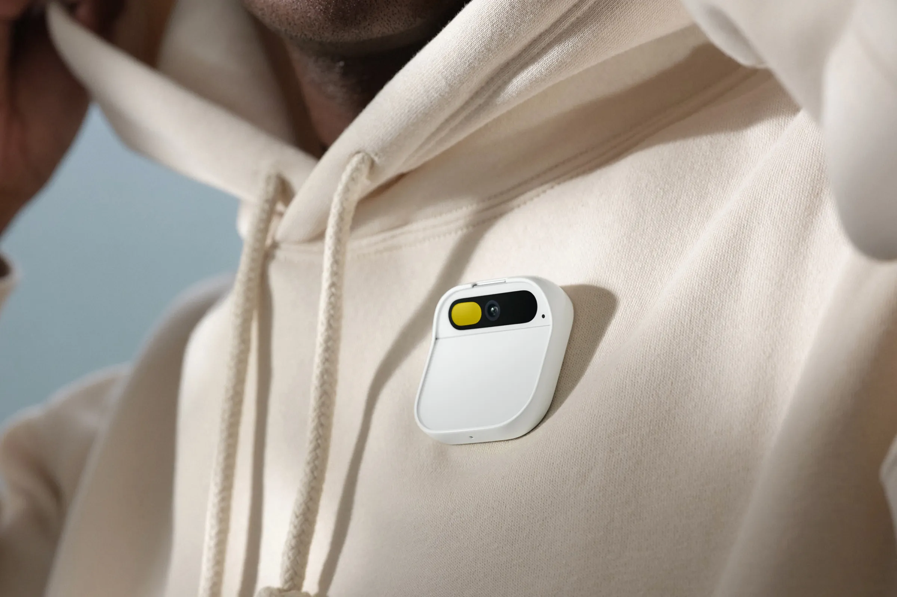

As a researcher, it\'s easy to fall into the trap of just trying to make the evaluation numbers go up on your LLM experiments. MMLU, TruthfulQA, AlpacaEval: whatever your focal point is these days, it can be gamed. Evaluation is about the collective abilities now, which can only be truly tested in real open-ended use. This is even true for relatively specialized LLMs, such as the Open Language Model ([OLMo](https://allenai.org/olmo)) that AI2 is building for scientific understanding/feedback, where the specialization of your model cannot shine through unless it passes basic interaction tests in real time. People want to enjoy using the model \-- it reminds them how exciting today\'s AI developments are.

This is all the reason why so many top researchers discuss \"vibes-based evals\" or have their own set of secret prompts to test on new models (such as [Jack Clark\'s \"how many helicopters can a human eat in one sitting\"](https://importai.substack.com/p/import-ai-320-facebooks-ai-lab-leak)). The workflow of *running a training job, deploying the model, and chatting with it* is central to recent developments. Jonathan Frankle\'s method for it was mentioned on the [Latent Space podcast](https://www.latent.space/p/mosaic-mpt-7b#details) (34min.), and still rings true 6 months later, emphasis mine:

> The vibe-based eval cannot be underrated. ... One of our evals was just having a bunch of prompts and watching the answers as the models trained and see if they change. Honestly, **I don't really believe that any of these eval metrics capture what we care about**. One of our prompts was "suggest games for a 3-year-old and a 7-year-old to play" and that was a lot more valuable to see how the answer changed during the course of training. --- Jonathan Frankle

The primary proxies folks use for vibes evals are [MT Bench](https://huggingface.co/spaces/lmsys/mt-bench) and [AlpacaEval](https://tatsu-lab.github.io/alpaca_eval/), the popular LLM-as-a-judge benchmarks. The good thing about these is that they scale nicely for any model size. For general vibes-based evals, the current hardware landscape makes it disproportionately easy to play with a 7B model compared to a 70B counterpart. This access gap is a further compounding factor on the rate of progress of small models, especially as it is not yet super clear which type of chats do better on a good 70B model compared with a great 7B peer.

Moving institutions was the forcing function for this crystalizing in my mind as a prerequisite to good work. It\'s a thing that some places have figured out and some are not really doing yet (with a balance of more academics lagging behind, because it is not cheap or easy). On the HuggingFace H4 team, our training scripts would save a checkpoint that we could instantly spin up a [Text Generation Inference (TGI)](https://huggingface.co/docs/text-generation-inference/index) endpoint (or [Inference Endpoints](https://huggingface.co/inference-endpoints) on prod. resources) for and chat within a Space. All of this was really resting on a few things: obvious free usage, a good hacker culture, and access to prod A100s that easily gave stable compute to demos like [Zephyr Chat](https://huggingface.co/spaces/HuggingFaceH4/zephyr-chat) (which is actually on a Space with dedicated GPUs) or [StarChat Playground](https://huggingface.co/spaces/HuggingFaceH4/starchat-playground). For long-lasting demos, shifting them away from quickly spun-up endpoints makes sense.

I\'d love to hear what toolings people enjoy using to do this in the comments:

Being at AI2, I now need to figure out how much all of these costs relative to peer services (which there are many of) and push people to host their models after a promising experiment. Add this stuff to your engineering quickstart guide to onboarding if you\'re a technical manager.

The change in workflow can be reflected below, which showcases why better engineering prowess is so important to research these days \-- the new connections are engineering-heavy. **Deployment** is the prerequisite step to do the vibes-based evaluation, and actually chatting with the models is when people realize both what **new capabilities we want it to do** and what **new capabilities unexpectedly showed up in training**:

In this world, doing clear, high-velocity ML, and impactful research is harder because you have to balance more. Clarity is hard because vibes-based evals are by definition best suited to an individual or a small close group. High velocity is hard because there are more steps and resources you should be using along the way. Impact is hard because it is easy to get trapped in worldviews that don\'t matter, such as the string of papers from Microsoft that read as marketing brochures for GPT4 (the most prominent one was the [Sparks of AGI](https://arxiv.org/abs/2303.12712) paper).

While the string of papers from Microsoft Research (MSR) are totally unscientific in how they\'re formulating claims and experiments, they\'re doing the right thing in **playing with the models in the form they\'ll be used.** It won\'t save MSR from a bit of a [reputational death as a has-been pillar of avoiding hype AI](https://twitter.com/xiao_ted/status/1724273920524890467), but it can still be a useful signal for people trying to get their footing in a new era of AI research. In reality, most of MSR is probably similar to before, but visibility in research is changing, so people are over-indexing on the controversial papers (please confirm if you have insider details).

This is obviously a very model-centric view of ML research. If you want to be relevant today, that's where you'll end up. **If you're in a production focused role, the rule of needing to chat with your models is even stronger** --- it's what you are selling (rather than the ideas and tools that lead to your final model).

------------------------------------------------------------------------

### Chat eats search

ChatGPT vs. Google Search is the first battleground, or laboratory, of true AI interface timelines. **Search is a learned ability, while chat more closely mirrors innate human activities**, so I still see chat winning out over time.

Search has obvious advantages in the simplicity of monetizing, but chat will catch up. I see OpenAI or other model providers selling high-cost ad tiers that literally integrate product recommendations into instruction tuning of the model on monthly deployments (or, something with [RAG + in-context learning of ads](https://twitter.com/karpathy/status/1724465184209514654), which actually sounds smatter). People will trust the ads coming out of their assistants more than the shuffling of results that Google does to make money.

Google is running this experiment for all of us: balancing the cost on the top line that comes with less direct advertising through chat rather than search versus the potential growth that comes from being a chat website.

OpenAI\'s foray into the GPT Store at their first developer conference last week has launched them into the broader battle for being the chatbot home base with both Meta\'s characters and Character.ai. A few years ago, who would\'ve thought that Meta could regain some of the valuable young users through a chatbot, but here we are.

Search in a few years will look like one of the many tools that our chatbots use beneath a [Universal Interface (UI, thanks Ben Thompson)](https://stratechery.com/2023/the-openai-keynote/). Slightly further out, these chatbots will be the central fixture of a new era of hardware devices we\'re welcoming into the world.

------------------------------------------------------------------------

### Novel hardware interfaces

This fall we\'re starting to see the first data points on the trends of *how ML systems will be used in the future*, and honestly, they\'re not what most people are expecting. Some stories that people loved or disagreed with for various reasons, but are the early days of something huge:

-   [OpenAI considering raising money from SoftBank and working with Jony Ives to design an \"AI first device.\"](https://www.ft.com/content/4c64ffc1-f57b-4e22-a4a5-f9f90a7419b7) Ives is the right person for a job like this \-- conjuring first principles for new types of interactions.

-   [Ben Thompson having another shocked experience with ChatGPT through voice chat](https://stratechery.com/2023/ai-hardware-and-virtual-reality/) (and a [prominent researcher there having a similar experience](https://twitter.com/lilianweng/status/1706544602906530000), which was more controversial).

-   Casey Newton, and others, are [shocked about how much better GPT4 is to use](https://www.platformer.news/p/how-to-use-future-ai-interfaces-today).

-   Mark Zuckerberg admitted that Meta got lucky with the smart glasses investments before the LLM revolution. From [The Verge](https://www.theverge.com/23889057/mark-zuckerberg-meta-ai-elon-musk-threads-quest-interview-decoder):

> **Do you think the advent of these AI personas that are way more intelligent will accelerate interest in the metaverse and in VR?** I think that all this stuff makes it more compelling. It's probably an even bigger deal for smart glasses than for VR.

The last step change in the technological interface was this famous moment with Steve Jobs:

We\'re going to witness one of these moments soon, and likely not know it was the one until a few years later because of all the froth and oscillations in AI markets.

From Meta\'s smart glasses to [Humane\'s AI pin](https://www.wired.com/story/humane-ai-pin-700-dollar-smartphone-alternative-wearable/), we are going to see a lot of devices emerge akin to this. I expect new types of headphones, smart speakers, talking vacuums, and more.

The AI pin is exciting even though it will obviously fail. It is too big of a step in the 2020s to get someone to forgo the immense benefits of a smartphone. The AI-powered devices people use will synergize with, rather than fight, the smartphone. This is a chicken and egg problem with startups, though, as they cannot get the rich data and compute permissions they want from a smartphone. Regardless, I am happy to see them try --- **the smart pin will start to push the limits of chatbots doing normal smartphone tasks and social norms of how we should allow this**.

Ultimately, OpenAI wants to get ChatGPT into this conversation of hardware interfaces (as was rumored with Jony Ives), but until then it is a stark outlier that is prone to the whims of hardware platforms alike:

The AI era arriving about at the same time as the custom silicon era will enable a growth of capabilities most people did not expect. With phones as the anchor of compute for all of these peripherals, we have a lot of runway for experimentation.

The key features I see defining the success of hardware devices are:

-   Being minimally invasive to life \-- a question of how to get the information of the world to the AI discretely.

-   Building from channels we\'re used to using, from either software tools or hardware devices.

Given this, I\'m still bullish on Apple\'s abilities here. It seems pretty obvious at this point that it is easier to build a solid chatbot than it is to build a solid smartphone. For this reason, I expect some versions of **AirPods with cameras** to be the version of Meta\'s smart glasses that way more people use even though the AI is about half as good.

Apple shipping this is much easier than OpenAI breaking out of the Apple / Google duopoly of App Stores that sandboxes their app permissions and makes the user experience onerous to quickly chat with GPT4 through voice.

Getting this post out the door, finally, is likely linked to my listening to the Steve Jobs biography by Walter Isaacson. It makes it abundantly clear that transformative experiences like this take something truly special behind the scenes. In order to build the AI-first devices of the future, folks need to be thinking about what it means to have a much clearer information processing engine than ever before. It\'s a story everyone should be following.

------------------------------------------------------------------------

## Newsletter stuff

#### Elsewhere from me:

-   On [episode 9 of The Retort](https://retortai.com/episodes/openai-developers-hegemons-and-origins), we discuss all things OpenAI from DevDay to origins and gossip.

-   I updated my [RLHF literature](https://www.craft.me/s/NHvR6dsCVNNW8L) page a bunch.

-   I made a [small list of reward models](https://huggingface.co/collections/natolambert/reward-models-on-the-hub-654d2210f5297ada0b84a19f) on the HuggingFace hub. We need more!

#### Cool finds:

-   \[Advising\] An [article](https://www.technologyreview.com/2023/10/24/1081478/manuel-blum-theoretical-computer-science-turing-award-academic-advisor/) from my friend Sheon on a heartfelt story of a Turing Award winner still being a great advisor!

-   \[[Details on GPT4V training](https://twitter.com/SanhEstPasMoi/status/1722290892998939109)\] From Victor Sanh of HuggingFace.

-   \[[Galactica release postmortem](https://twitter.com/natolambert/status/1724554612576043349)\] Details from the Galactica release controversy have been coming out of Meta and I stand by what they did (Twitter just got it wrong, which happens)

-   \[RLHF Jobs\] Scale launched the [RLHF lab](https://scale.com/blog/safety-evaluations-analysis-lab) I was considering a little bit back, SEAL.

-   \[ML efficiency discussion\] A [cool thought experiment](https://twitter.com/marksaroufim/status/1722386684975984950) and post from Mark Sarouafim on if it is efficient enough to run transformers in Python.

-   \[Long-context models\] [Why I hate on long context](https://twitter.com/goodside/status/1722418728481030244) and don\'t think everyone needs it \-- it\'ll be handled at a system level in my opinion.

-   \[Evaluations\] The [HuggingFace Open LLM Leaderboard](https://huggingface.co/spaces/HuggingFaceH4/open_llm_leaderboard) added more tasks making it much harder to game! My take is [here](https://twitter.com/natolambert/status/1722649102130020819).

-   \[Open Models\] Another [large model with good scores](https://huggingface.co/Xwin-LM/Xwin-LM-7B-V0.2) is on the hub \"trained with RLHF\". I hope the XWin team can actually release a paper soon!

-   \[Open Models\] Another European LLM entered the chat, [Poro-34B](https://huggingface.co/LumiOpen/Poro-34B), this time interesting because it is much closer to open source than any other recent model by releasing checkpoints and data. Let\'s hope its training goes well!

#### Housekeeping:

-   **Interconnects referrals:** You'll accumulate a free paid sub if you use a referral link from the [Interconnects Leaderboard](https://www.interconnects.ai/leaderboard).

-   **Student discounts:** Want a large paid student discount, go to the [About page](https://www.interconnects.ai/about).

-   **Like this?** A comment or like helps Interconnects grow!
