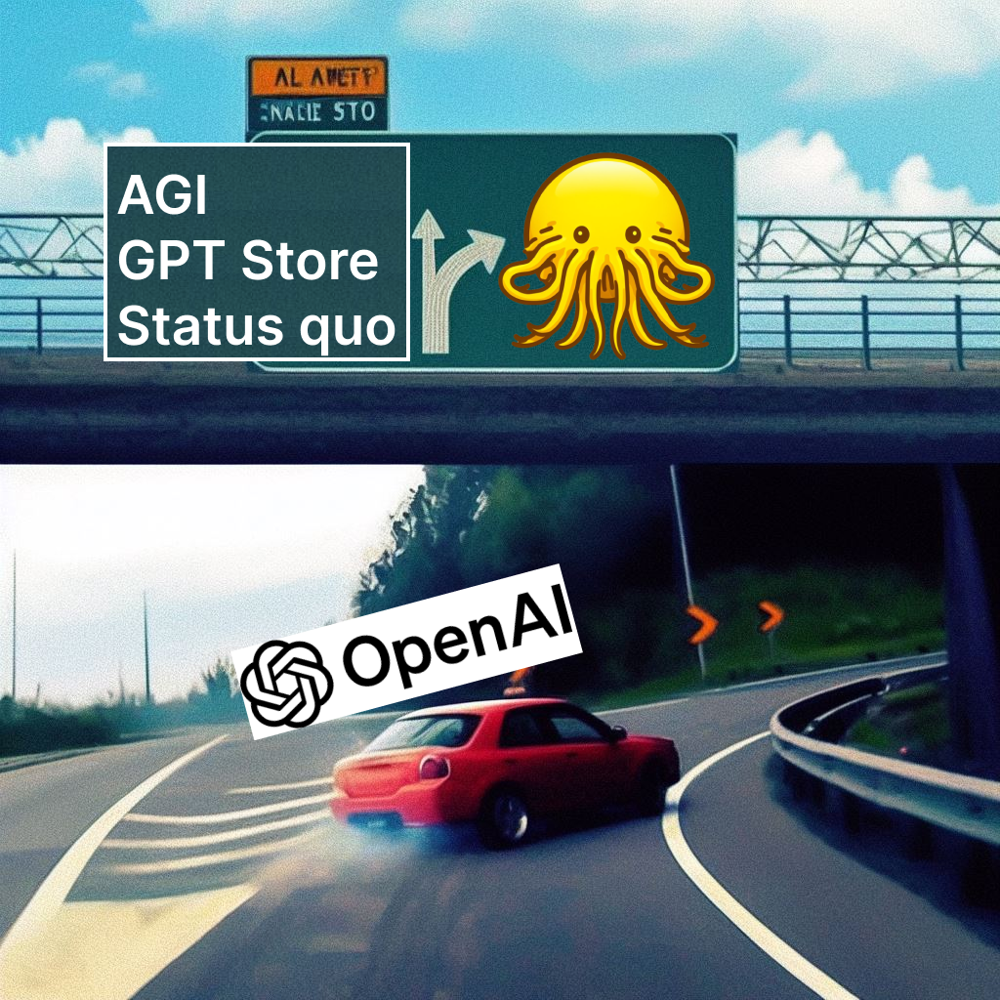

This year has been about the rapid evolution of the [Overton window](https://en.wikipedia.org/wiki/Overton_window#:~:text=The%20Overton%20window%20is%20an,public%20to%20expand%20the%20window.) of AI outcomes. [OpenAI\'s board firing Sam Altman as CEO](https://openai.com/blog/openai-announces-leadership-transition) (which may be temporary) has given teeth to the uncertainties over their odd corporate structure and how that complicates their future. Sam Altman has been the face of AI to the broader world, appearing in Congress and abroad. Through Sam, OpenAI has pushed a narrative around AI safety and a defense of its closed approach to research --- in the face of substantial criticism from other prominent tech and AI figures that AI should be open for all to control and audit. Danger to his position puts their narratives at risk.

Until the drama with Sam Altman\'s firing and everything that has followed, Llama 2 was obviously the biggest event in AI this year. Llama 2 made debates about safety that ChatGPT started real for some people in power, whether or not you think the issues they were discussing actually apply to that model. The narrative control that OpenAI exerted over the window of possibilities that the entire world viewed for AI was astounding \-- this applied to powerful governments, rich individuals, and a long tail of researchers and developers alike. Regardless of the final settling of the company structure, the cracks in OpenAI, at this specific point in time, dramatically shift how the landscape will unfold in the next few years. While motivated by the broader discourse of AI and regulatory appetite, it applies to developers in the space who determine the true power of the future --- profit.

First, there are huge somber tones of this debacle. We have friends who have dedicated their lives to this place being ripped apart. Greg Brockman [famously got married in the OpenAI office](https://twitter.com/gdb/status/1194293326452625408) that he quit and maybe rejoined. I\'m not really going to comment on the obvious political jousting happening as this was written during Sam Altman\'s return discussions and a potential ousting of the current board. For the AI community, this is a painful and memorable event that will test the wills of people. I was witnessing this firsthand being with some OpenAI employees when the news broke.

The reason why it is so striking is that OpenAI deserves all their success to date. They have been speaking consistently and earnestly about their view of large language models while driving the raw capabilities forward. Whitepapers like [Frontier AI Regulation](https://arxiv.org/abs/2307.03718) present very compelling views that are largely unchallenged. I\'ve gotten multiple requests to start writing more whitepapers targeting policy folk so that there is at least an alternative to the worldview OpenAI is presenting.

In presenting alternatives to OpenAI's regulatory approach, the goal was to paint a picture that is stronger than their arguments --- based on how openness can produce transparency, inclusion, and eventually accountability for AI. Now, the critique of AI Safety that I most often thought, the "trust me bro" argument, will be based on boardroom politics rather than systematic human blindspots. This argument follows that even if well-run companies care about AI Safety, it is unlikely that they can do it alone, and relying on their word that they're doing everything safely (as opposed to with external verification and involvement) is likely to result in pitfalls like leaks and cybersecurity vulnerabilities.

Now, the "trust me bro" argument, which I felt was one of the strongest cases in the open vs. closed debate, will be complicated with the souring of boardroom drama and politics. The point about not trusting closed and powerful companies is one about incentives and repeated human blindspots technically/strategically. Almost any technical approach to safety and harm reduction can be mitigated by stupidity and ego, so that isn't new. Openness advocates have already started saying [openness is the solution to corporate incompetence](https://twitter.com/EMostaque/status/1726070804918550569), but it is inevitable they also fall trap to this. Open infrastructure is different, but it is not immune to all forms of malfeasance.

The substance of the lack of trust I have for these big organizations to do it alone is compounded by how intense it is to work at places like OpenAI or Anthropic right now. Everyone on both the product and research side has too much to do. They're as slammed as any startup you may imagine and they are not exhaustive in their approaches or understanding of the technology. From the communications we see, it may seem like OpenAI is the master of all aspects of reinforcement learning from human feedback (RLHF), the technology attributed to making language models ready for something like ChatGPT, when in reality they have to solve problems by throwing more compute at it and are exploiting a recipe that works, as opposed to one that is motivated by first principles.

The underresourced nature of these companies relative to the scope of their ambition and technical challenge makes what they accomplish all the more impressive. It is just clear that things can slip through the cracks at some point.

The OpenAI brain drain followed by this event will have a meaningful impact on their training capabilities. Combine this likely exodus with the fact that **the median seniority OpenAI employee right now joined in April of this year,** and the runway on their coherent culture is running out.

### Opportunity for openness and others

The intrinsic deceleration shows all global parties that we don\'t need to commit to AI Safety regulations or policies immediately. This is the time when people with other views need to make the case for them and build momentum. We need to explain why openness is the right ecosystem \-- at least an ecosystem that is more open than we are now --- based on the most cutting-edge ideas like how [API model providers will have liability problems given how easy it is to fine-tune the safety away](https://www.interconnects.ai/i/137911702/moderation-training-infrastructure-liability). Stories capture mindshare, and **currently, it feels like the openness side is more focused on fighting back than telling a cohesive narrative (myself included)**.

For anyone who thinks openness offers the most reliable path to good AI systems, this is a total softball. There are a lot of details to unfold with the extent to which OpenAI is set back from this, but there is no timeline where it just pulls them ahead further (in the short term, the long term is always odd). In this, the pressure on the race between the top LLM players has alleviated substantially. The race dynamic was deeply coupled with closing off in industry research.

Anthropic has always kind of rationalized their position in the space as not being problematic because "they will never pass OpenAI, so OpenAI isn't racing them," which is fairly nonsensical. With the pace AI was going, you either need to be all in or you'll lose relevance. With the previous LLM status quo, Anthropic needs to leverage its relevance and skills to raise the capital to train the next models and survive. Now, if OpenAI is actually meaningfully decelerated, they don't have to worry about any of these games.

This is not to say the entire LLM industry will slow down. It will not given the breadth of investment and early integration, but the perception of AI in the general public is driven by the cutting edge advances and the media that follows, which OpenAI has long been the center of.

There are obvious other corporate winners and losers. Microsoft is extremely exposed and rumored trying to remedy the situation, Cohere is given a lifeline by being stable, Google may have an insurmountable lead in resources if they figure out how to ship anything, Apple gets more time to make their plans, and lots from there.

### OpenAI's culture risk

Prior to this whole dilemma, I had actually heard that Greg was more invested in others in making the company the next big tech giant through ChatGPT or another platform play. This now tracks with the unfolding events we have seen but represents a bigger cultural clash that extends from the low-level employees through the founders and through the board. It's a complicated place to work where lots of stated goals exist when you look in, and the previous driving force used to be a culty environment of research and engineering.

To all my friends at OpenAI, I hope this resolves soon. Wishing you well.

------------------------------------------------------------------------

More reading on the topic (not news links):

-   An article I was interviewed [on OpenAI's corporate structure](https://www.forbes.com/sites/timabansal/2023/10/13/does-openais-non-profit-ownership-structure-actually-matter/?sh=1673fbd17d18), and if it matters.

-   More on OpenAI's [weird board structure and the legal implications](https://sharongoldman.substack.com/p/i-spent-last-weekend-writing-about).

-   More on the [impact on the AI developer economy](https://www.latent.space/p/the-end-of-openai).

Good Tweets and memes:

-   [Foreboding MSFT stock on Monday](https://twitter.com/benthompson/status/1725913316558574004).

-   The [origins of the Laundry Buddy GPT cult following](https://twitter.com/jeremyphoward/status/1725712222629081547).

-   Jeremy Howard [foretelling challenges at OpenAI with their corporate structure](https://twitter.com/jeremyphoward/status/1725714720400068752).

-   Clear quotes from one of the external board members on how becoming a big tech company [was not possible for OpenAI](https://twitter.com/jeremyphoward/status/1725968386902147243) (before this).
