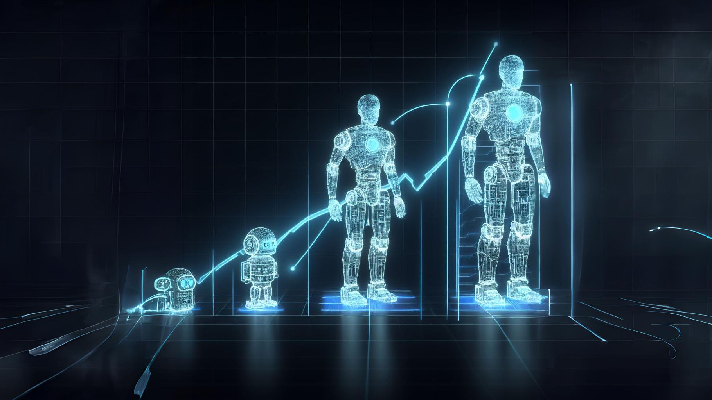
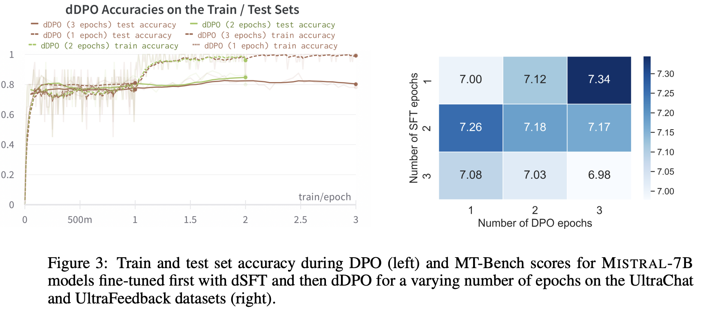
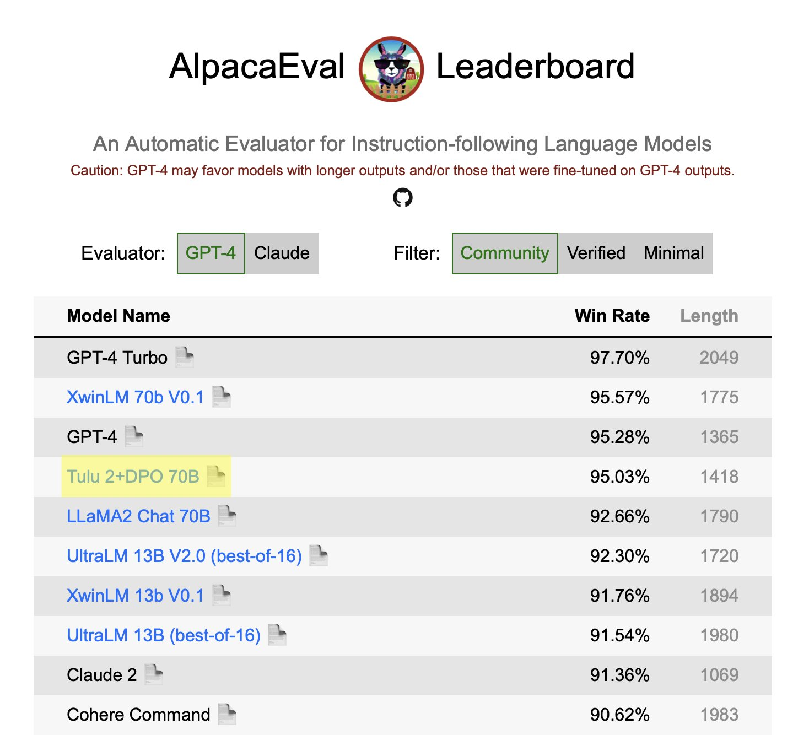
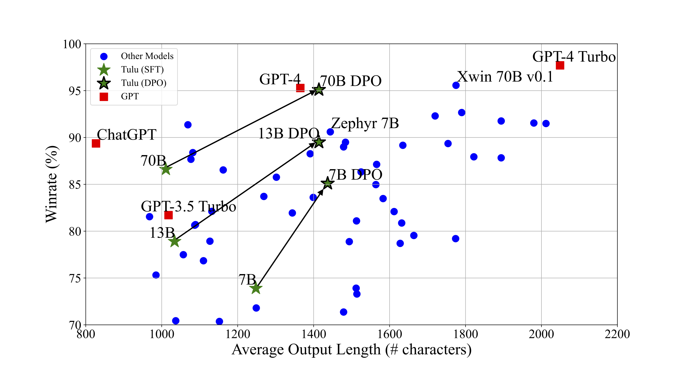
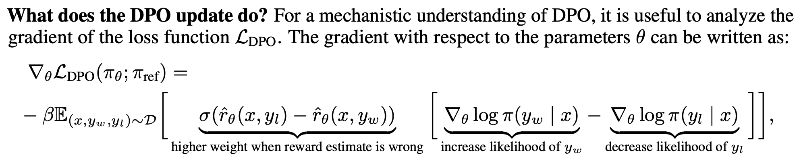
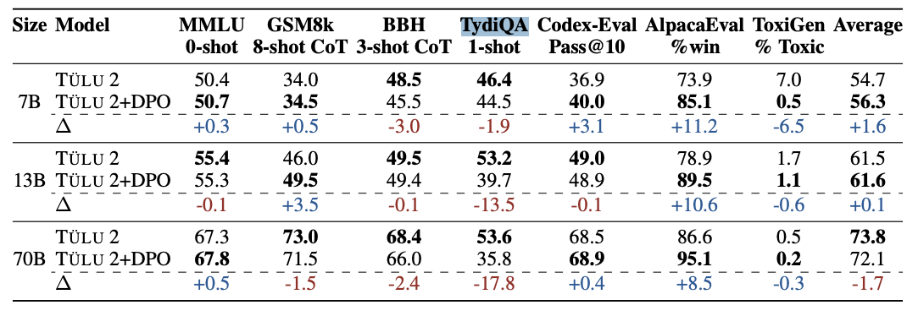
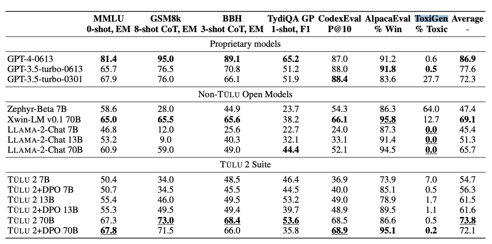

Reinforcement learning from human feedback (RLHF), the technology that emerged to make ChatGPT feasible, is still extremely unknown and undocumented. Employees at Anthropic and OpenAI (rip) rely on methods of empirical exploration to get strong results, rather than clear recipes. Even the few things that people do understand are generally not shared.

One of the longest-standing debates since June of this year has been around a new, simple, algorithm called [Direct Preference Optimization](https://arxiv.org/abs/2305.18290) (DPO) from Stanford. DPO's implementation largely slots into existing large language model (LLM) training infrastructure like HuggingFace Transformers by adding 4-6 lines of code for the loss function (with some more logging changes, but those are secondary). The core insight is to derive a loss function that directly solves the policy optimization and reward modeling steps simultaneously. Since the algorithm is so simple, we've all been asking "**When is DPO going to be used in a large-scale model of note?**" This question, about scaling, has finally been answered, with our new model suite from the Allen Institute of AI, [Tulu 2](https://huggingface.co/collections/allenai/tulu-v2-suite-6551b56e743e6349aab45101). The [paper is here](https://arxiv.org/abs/2311.10702).

It took the community longer than expected to get here. There are still many more questions about DPO's best practices and its long-term viability. If you want to know when I first tapped into the energy of DPO confusion, check out my post from this summer on [objective design in RLHF](https://www.interconnects.ai/p/specifying-objectives-in-rlhf) or my position paper on the long-term [objective mismatch in RLHF](https://arxiv.org/abs/2311.00168). Before the questions, we\'ll start with the early answers.

### Scaling DPO

To make the whole story weirder, the [Tulu-2-DPO model](https://huggingface.co/allenai/tulu-2-dpo-70b) was **our first 70B parameter run that converged and showed super strong performance**, with direct hyperparameters copied from the [Zephyr](https://huggingface.co/HuggingFaceH4/zephyr-7b-beta) recipe. This is the first time it has happened in my ML career \-- our first run yielding success.

Zephyr was the first model to really make a splash with DPO, by using the benefits of the Mistral base model and new higher quality data. Zephyr represented the point where I could finally start to chill and understand how many different parties can use the benefits of RLHF, not just the biggest labs, who are surely doing something more nuanced.

It seems like a large part of getting DPO to take a big step forward was to just use a lower learning rate. The learning rate of Zephyr and Tulu was 5e-7, which is low to the extent of confusion for many ML practitioners (3e-4 is generally the default). Getting the learning rate right was clearly a necessary part of scaling DPO, but I also suspect there is something about the UltraFeedback data that nudges DPO along.

#### Potential overfitting

After the release of Zephyr, I saw a few community members labeling as `overfitting` in their evaluation tables. Ultimately, this is a little premature and odd to me, but it isn\'t without reason. It\'s a reasonable way to describe the behavior, where training specifically on DPO with UltraFeedback really does continue to boost vibey evals like AlpacaEval.

The results showing the grid search the Zephyr team did, along with the learning curves for 3 epochs of DPO are shown below (from the [technical report](https://arxiv.org/abs/2310.16944)):

It's not clear here that training longer for DPO or SFT really changes the model. Score variations of MT Bench at this level are often thought to be within the noise margin. This type of decision, going with the highest score quickly, is commonplace in research labs.

As a quick reminder, MT Bench prompts GPT4 to rate responses from 1-10 and AlpacaEval asks GPT4 which model response "won" between the new models like Tulu 2 and a base set of GPT3.5 completions. Both of these have clear issues, but they provide the best proxy to the question of "Do you like this model" right now.

We did see training dynamics very similar for Tulu 2 70B. From the SFT model to the end of the first epoch, the AlpacaEval win rate increased by 5 points, and to the second epoch, it increased by another 4. The third epoch, which we went with for mostly vibes reasons, was marginally higher. It's not clear if such small eval scores that are biased by GPT4 evaluators are changing the models as we want.

Ultimately, given we really only ran one run that took multiple weeks, we'll need some time to do more ablations.

#### Verbosity

The results showing that the Tulu 2 model is much less verbose than its open-weight peers is something we immediately noticed, but didn't have a causal understanding of that was strong enough to include in the paper. Pretty soon after release, two of our colleagues agreed it was interesting, which is always validating ([Tweet1](https://twitter.com/ericmitchellai/status/1726703476242329676), [Tweet2](https://twitter.com/yanndubs/status/1726724875187044367)).

Given that length bias in both [RLHF training](https://arxiv.org/abs/2310.03716) (likely due to the challenges of not leaning on preferences as a last resort tiebreak) and [LLM judges](https://arxiv.org/abs/2306.05685), many people suspect that longer answers are responsible for a lot of vibes-based evaluations or tools like AlpacaEval and MT Bench (proxies where GPT4 chooses the best answer). Given these biases, a lot of the community believes that a model with equal win rates and lower average length is stronger. This has gotten to the point where AlpacaEval has added an official disclaimer, see below:

You can see the effect of DPO training, relative to win rate and verbosity below for the Tulu sweet and important peer models. We were working on this before the release of GPT4-Turbo, which has a much longer response length than we were expecting. I really think that GPT4-Turbo is something like GPT 4.5 in the old naming convention.

LMSYS is going to deploy Tulu 2 70B in [their leaderboard](https://huggingface.co/spaces/lmsys/chatbot-arena-leaderboard) for a week or two to get a solid signal of where it ranks relative to the models you see above 🤞.

### Improving instruction data

Tulu 2 represents an effort to collect the highest quality data to improve instruction following across a variety of tasks, from scientific reasoning to coding. It's a guide to what happens when you combine all the best SFT datasets out there (from old-school instructions like FLAN to community-generated conversations in Open Assistant to highly-filtered synthetic data in LIMA to specialized science data). The most interesting parts to me are:

-   **Upsampling the Chain of Thought** (CoT) examples from Google's FLAN dataset --- this helps with reasoning capabilities.

-   The size of the dataset: The Tulu 2 mix is smaller than the original, **maximizing performance per size by downsampling datasets selectively**. Given that most of the sampling is random, lots of opportunities in data filtering techniques.

Some next things to explore here are:

1.  Maintaining performance while decreasing the dataset.

2.  Better dataset filtering, especially when it comes to the "as a language model" phrases, can tank scoring on multiple-choice and other instruction benchmarks.

3.  The performance of professional human instruction data on all we've seen here, like this [new one from HuggingFace H4](https://huggingface.co/datasets/HuggingFaceH4/no_robots?p=0).

See the paper, *[Camels in a Changing Climate: Enhancing LM Adaptation with TÜLU 2](https://arxiv.org/abs/2311.10702)* for more information on instruction tuning with QLoRA, experiments with CodeLlama, and full details.

------------------------------------------------------------------------

### DPO's open questions and futures

It's safe to say that tons of parties wanted DPO to just work better. Removing the complexity of having to train a reward model first and then optimize by directly integrating the data would have been a huge win. For comparison, Proximal Policy Optimization (PPO) succeeds by training what should be a slightly underfit and general reward model, and then optimizing it with RL. Underfitting helps prevent the reward hacking known to RL, but most of this is not replicated in the open because the process of getting a general enough dataset is a big investment (order of millions of dollars).

The core idea of critiques of DPO is that it is not strong in general-use situations due to the lack of explicitly learning a reward model before optimizing the policy. Essentially the DPO optimization is taking the optimal policy update step as if the reward model is known, so it jointly learns the reward and the policy at once. Other RLHF methods first learn a reward model, then use a different distribution to extract policy signals and learn a value function that guides the gradient updates.

In practice this doesn't sound like a huge leap, but many experts I've discussed it with agree that there's a fundamental limitation in the math that conflicts with the realities of doing RLHF at scale. Here's a figure from the DPO paper that shows the intuition for how it learns the reward model and updates the policy at the same time:

To glean into the problem where it is argued that coupling the reward model learning with the policy optimization causes problems, we could try a two-phase DPO more akin to the original RLHF, where you copy the model after the first phase and use the reward estimate from that one when updating the policy. In scenarios like model-based RL, where an agent iteratively learns a dynamics model, this would seem odd. The problem is, that in RLHF, we don't have any exploration, so iterative learning may make things harder.

The core evaluations of Zephyr and Tulu 2 DPO are with tools that are evaluated with GPT4. Given that UltraFeedback is a data consisting of synthetic data pairs rated by GPT4, it seems like it could be counted as a hard-to-measure form of eval contamination.

I'm yet to hear of any industrial API models being trained with DPO, and have heard of at least one company that tried it and it wasn't for them. To wrap up on this topic, there's a [new paper from DeepMind](https://arxiv.org/abs/2310.12036) on the theory underpinning DPO, which clearly states a theoretical manner by which this separation can appear in practice:

> The prevalent deployment of learning from human preferences through reinforcement learning (RLHF) relies on two important approximations: the first assumes that pairwise preferences can be substituted with pointwise rewards. The second assumes that a reward model trained on these pointwise rewards can generalize from collected data to out-of-distribution data sampled by the policy. Recently, Direct Preference Optimisation (DPO) has been proposed as an approach that bypasses the second approximation and learn directly a policy from collected data without the reward modelling stage. However, this method still heavily relies on the first approximation.

I will be doing a separate post in my RLHF Literature series on the recent updates to methods for optimization, which has many more equations.

#### DPO vs. PPO again

All of this being said, I still expect DPO to have a future. It's succeeding in basic chat eval boosting, and the users of the Tulu and Zephyr models seem happy. DPO is known to be prone to overfitting because of its derivation, but that characteristic can be useful in domains where your reward function is less prone to Goodhart's law.

For most of the last few months, people have generally been trying to copy recipes from PPO to DPO, but more likely is that DPO has very different scales, tasks, and datasets that it thrives with. We're in the early days of these comparisons, but we should have clear results showing this in 6-12 months.

Regardless, both DPO and PPO will likely be replaced with other algorithm variants. DPO, being derived directly from theory, will almost certainly have terms added to the loss function that empiricists find to improve regularization (as always happens in RL). On the other hand, PPO will likely be replaced by something designed specifically for this problem formulation (and I continue to be shocked this hasn't happened yet).

------------------------------------------------------------------------

### [Zephyr-β](https://huggingface.co/HuggingFaceH4/zephyr-7b-beta) vs [Tulu 2](https://huggingface.co/allenai/tulu-2-dpo-70b)

These two models, being trained with nearly identical DPO hyperparameters, give a lot of insight into what DPO with the [UltraFeedback dataset](https://huggingface.co/datasets/HuggingFaceH4/ultrafeedback_binarized) is or is not doing. The core differences are:

-   **Base model**: Mistral-7B vs Llama 2; it\'s almost certain that at the smaller scales, Mistral is better. However, Mistral may actually be a Llama 2 fine-tune on GPT4 data if the rumors are to be believed.

-   **SFT dataset**: [UltraChat](https://huggingface.co/datasets/HuggingFaceH4/ultrachat_200k) (fully synthetic) vs [Tulu 2 mix](https://huggingface.co/datasets/allenai/tulu-v2-sft-mixture) (synthetic and human, filtered). Importantly, UltraChat also has heavy filtering described below \-- true casing and filtering for unhelpful responses (e.g. \"as a language model..."):

> Selection of a subset of data for faster supervised fine tuning.
>
> Truecasing of the dataset, as we observed around 5% of the data contained grammatical errors like \"Hello. how are you?\" instead of \"Hello. How are you?\"
>
> Removal of dialogues where the assistant replies with phrases like \"I do not have emotions\" or \"I don\'t have opinions\", even for fact-based prompts that don\'t involve either.

-   **Codebase**: Zephyr used the DPO implementation in TRL and Tulu 2 used a Jax implementation of DPO (thx for free GPUs Google).

Both of these models are very strong. There are some evaluations that are worth noting. Specifically, both these models are contaminated on TruthfulQA because some of the question prompts are in the preference model dataset UltraFeedback (and yes, they received some of the best-in-class performance on it). Second, TydiaQA, a multilingual question-answering task, is hammered by DPO on both models (with Tulu shown below):

Toxigen is the final benchmark of note in this comparison, which shows that the filtering of language model refusals and emotions can be seen clearly in another evaluation rather than its perceived improvement in vibes-evals and a small bunch on other capabilities tasks. Ultimately, if we look at the main table of the paper, Zephyr-beta is clearly the biggest outlier in the ToxiGen category.

To be clear, getting a score of \<0.5 on ToxiGen is almost surely too much filtering given that the OpenAI models that are extremely stingy never cross this boundary. In the context of the other models, like Llama 2 which was ridiculed for "too much RLHF", it shows a potentially simpler way of understanding your models' refusals.

For Tulu 3, and most models I work on, having any ToxicGen score should be fine for the raw weights, but adding suitable filtering for the API / chat endpoints seems like the right thing to do.

------------------------------------------------------------------------

### Extra RLHF observations

-   Another well-evaluating RLHF model was released in the open, [Xwin-LM](https://github.com/Xwin-LM/Xwin-LM#model-card), but it's [getting some flack for its lack of details](https://github.com/Xwin-LM/Xwin-LM/issues/14). I'm intrigued if they can share what they did at RLHF for 70B parameters too.

-   If you notice your "rewards" going down in DPO training, this is normal behavior. A good intuition was posted by the [author on GitHub](https://github.com/eric-mitchell/direct-preference-optimization/issues/32#issuecomment-1674253465).

-   The PPO implementation in TRL still uses a value head model, while many successful RLHF recipes in industry are known to use an entirely separate model for training. The difference is in how the gradients are propagated, whereas, with just a value-head, most of the reward model is shared with the policy at training time. With a separate reward model though, another copy of the model needs to be stored in memory for training.

-   The amount of gain from RLHF with so little computation is still shocking. How profound changes to LLMs and diffusion models come with orders of magnitude fewer FLOPs has got to mean something big.

------------------------------------------------------------------------

### Newsletter stuff

Elsewhere from me:

-   I gave a talk on the history and risks of RL and human feedback at a [Stanford HAI workshop on Sociotechnical AI Safety](https://hai.stanford.edu/workshop-sociotechnical-ai-safety). The slides are [here](https://docs.google.com/presentation/d/12YyZmOpgrsUT2dE0PRZC8u-_uPG_dTExM0TpI9mnfDE/edit?usp=sharing).

-   I got to react to the OpenAI drama on [NPR Marketplace](https://www.marketplace.org/shows/marketplace/whats-next-for-the-artificial-intelligence-industry/), and yes, I got bleeped.

**Links of note**:

-   Another open science AI firm, [Kyutai](https://kyutai.org/), came out of stealth before the OpenAI craziness.

**Open models**:

-   A Falcon instruction variant, Alfred 40B, was released again, it\'s unclear if the base model was trained more, but there are a bunch of details in the [model card](https://huggingface.co/lightonai/alfred-40b-1023) which is nice to see.

-   [OtterHD](https://arxiv.org/abs/2311.04219), an evolved model from Adept\'s Fuyu 8B, is optimized for higher resolution.

#### Housekeeping:

-   **Interconnects referrals:** You'll accumulate a free paid sub if you use a referral link from the [Interconnects Leaderboard](https://www.interconnects.ai/leaderboard).

-   **Student discounts:** Want a large paid student discount, go to the [About page](https://www.interconnects.ai/about).

-   **Like this?** A comment or like helps Interconnects grow!
