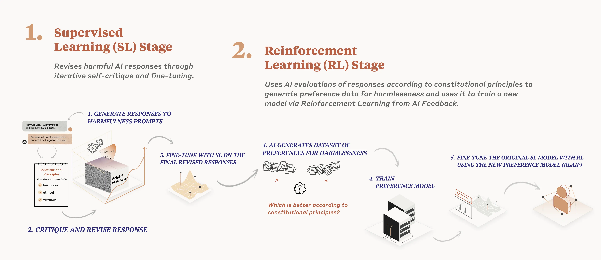
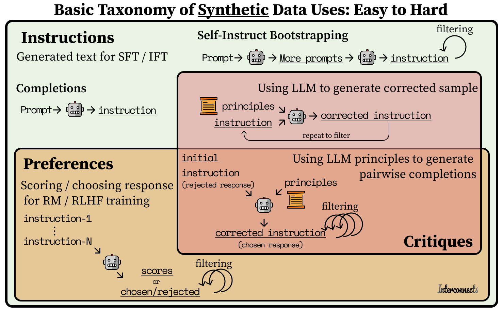

*This post is also available on [podcast players](https://podcast.interconnects.ai/episodes/synthetic-data-anthropic-s-cai-from-fine-tuning-to-pretraining-openai-s-superalignment-tips-types-and-open-examples) and [YouTube](https://youtu.be/IBKE4qVKC3Y).*

------------------------------------------------------------------------

The notion of synthetic data, i.e. data created by a machine rather than a human, has a long history in natural language processing (NLP) and machine learning (ML) broadly. It is closely tied is the notion of data augmentation, where a piece of data can be modified slightly to add diversity to the dataset. One of the older links in NLP is [back-translation](https://research.facebook.com/publications/understanding-back-translation-at-scale/), where the synthetic data is a new translation task from the ML model's outputs to the original text. Today, **synthetic data has taken on a much grander task: removing humans from the loop** of making AI both aligned and enjoyable to use, a task spearheaded by Anthropic's training methods and OpenAI's new, mysterious [Superalignment](https://openai.com/blog/introducing-superalignment) team tasked with using AI feedback to solve alignment (because humans won't be powerful enough).

In the meantime, synthetic data has become a go-to resource for many of the most popular boutique, open model providers fine-tuning Meta's and Mistral's models (and rumors that Mistral is just Llama 2 pretraining continued on GPT4 tokens). In this post, I'll cover key debates on the longevity of synthetic data, things I've learned along the way, notable models and methods, and everything in between. The amount of topics I can go through showcases how central the topic has become in the post-ChatGPT era.

## Can synthetic data provide the next breakthrough?

As the current or next generation of models akin to Gemini and GPT5 will have likely trained on all of the high-quality data on the internet (with the last sources coming from things like YouTube and podcasts), model providers are looking to new directions to get the last few orders of magnitude of data need for scaling laws to hold. A core assumption behind proponents of synthetic data at scale is that simply adding more data will make the model better at solving long-tail tasks/evaluations. Suppose GPT4 is the current generation of models. In that case, I only expect about 2 more generations of scaling to be worth it as the computational costs skyrocket (with a long tail, where up to 5 generations show something). **Getting enough data for models that are 100x bigger will require vast amounts of synthetic or digitized data**.

The argument against synthetic data follows that all the data we are generating is from the same distribution as the current best models, so some do not expect the SOTA to be advanced by it. Regardless, in the open, we are well behind GPT4 and GPT4-Turbo, which I think is the GPT4.5 equivalent, so we have a ton of runway to go by copying this data at many stages of development. I\'m inclined to say that GPT4 tokens are good enough that training on them is likely to help GPT5, because most generated tokens are still so unique in the possible space of all tokens that it is providing more useful diversity than bias (with a little bit of engineering needed to avoid obvious failure cases). If you've looked at the average quality of Reddit comments, this is the baseline for whether new data will help pretraining.

Proponents of openness and most of the trending models on the HuggingFace Hub use synthetic data as a way to move fast and afford to try techniques behind the SOTA language models in industry. We have the Anthropic's and OpenAI of the world using it because it's the only way to move forward at scale and capabilities in their ballpark, and smaller models using it because human data at the same scale is thousands of times more expensive. In this dichotomy, the methods look similar, but the big companies of the world will be spending \$10million+ on inference compute to create datasets (pretraining scale synthetic data), while open-source competitors spend \$10 or so on an instruction dataset. **The open and closed communities are pursuing very different end goals, yet synthetic data serves both of them**.

The feature I expect the models to cultivate with more data is robustness. Better model robustness will make it so the best generations come across a wide variety of contexts within a given task. Niche facts, languages, and tasks will all get much better simply by providing the models with a ton of data. Synthetic data lets models see an obscure data point a few times in training, rather than just once.

## Anthropic's CAI and synthetic-data sophistication

There's a general rumor that Anthropic uses a ton of synthetic data, which helps them get a ton of robustness, such as their new results for [Claude 2.1](https://www.anthropic.com/index/claude-2-1) where the model answers incorrectly by a factor of 2x and more precisely refuses questions it does not know. While we're all triggered by Meta's silly refusals with Llama 2 chat, Anthropic deserves the benefit of the doubt when their model is refusing to answer questions it doesn't know, and not just random things based on a hidden list of trigger words.

The method of [Constitutional AI (CAI)](https://arxiv.org/abs/2212.08073), which Anthropic uses extensively in their Claude models, is the largest confirmed usage of synthetic data so far. Constitutional AI has two uses of synthetic data:

1.  Critiques of instruction-tune data to follow a set of principles like "Is the answer encouraging violence" or "Is the answer truthful." When the model generates answers to questions, it checks the answer against the list of principles in the constitution, refining the answer over time. Then, they fine-tune the model on this resulting dataset.

2.  Generates pairwise preference data by using a language model to answer which completion was better, given the context of a random principle from the constitution (similar to this paper for [principle-guided reward models](https://arxiv.org/abs/2310.05910)). Then, RLHF proceeds as normal with synthetic data, hence the RLAIF name.

A lot of the confusion around CAI is likely that the second step is the one they named RLAIF and promoted more heavily in the paper/media, but it requires both together to be called CAI. I propose the first step be called "principled instruction correction," or something like that, it will be clear that **CAI = principled instruction correction + principle-following RLAIF**, rather than just a special version of RLAIF (which many people, myself included, thought it was).

RLAIF is now a mainstream term, with lots of people using GPT4 to get scores or choices that can be reduced into a chosen/rejected sample that RLHF needs. However, the details and complexities of CAI are not fully appreciated due to the subtle differences between generating critiques / scoring multiple answers and finding an empirically stable set of principles to use in the synthetic data generation phase (The RLAIF part).

When doing CAI (at both steps I outlined above) Anthropic needs to keep the principles to similar lengths, avoid overlapping concepts, and cannot use any size of the constitution. Additionally, it is simply the case that some principles generate data that is numerically unstable. The advances of CAI, especially those shown recently with their [collective CAI work where non-engineers wrote the principles](https://www.anthropic.com/index/collective-constitutional-ai-aligning-a-language-model-with-public-input), show an impressive capacity to operate both synthetic data generation and RLHF training behind a mostly black-box API. These advances, especially when you consider Anthropic's relatively smaller team of researchers and engineers, are why I say **Anthropic is the king of synthetic data**.

*Some CAI slides are* *[available here](https://docs.google.com/presentation/d/1-SzKvrfqKpK8NbTrnlLwJL5IHohPoW-0X7G17hSVW-Y/edit?usp=sharing)* *(\~slide 50 on) from when I gave a joint RLHF tutorial with Anthropic.*

------------------------------------------------------------------------

## Synthetic instructions vs. preferences vs. critiques

Among open models, it is easy to see a progression of how people are using synthetic data. Earlier this year, models like [Alpaca](https://crfm.stanford.edu/2023/03/13/alpaca.html) and [Vicuna](https://lmsys.org/blog/2023-03-30-vicuna/), used synthetic instruction data for the supervised fine-tuning (SFT) of Llama models to reach impressive performance at the 7-13B parameter range. The space of SFT models has become extremely dense, with new models coming out weekly all summer. A large debate permeated this space for months: Can we fine-tune models on the outputs of OpenAI\'s models (based on a claim in their terms-of-service). I\'m happy to see this discussion completely die, and we now all train on synthetic outputs.

**Many open instruction datasets are advances in [Self-Instruct](https://arxiv.org/abs/2212.10560) style methods**, where you create a set of "seed" instructions and use an LLM to generate instructions similar to them. There are now many ways to go about doing this, but they're all in the early days of trying to figure out the right ways to add diversity to the dataset (more on this in the examples later). On the other hand, people also just scrape prompts from the internet and repurpose them as instructions by completing them with GPT4. Be warned: prompt datasets like ShareGPT have low average quality and narrow distributions.

Today, **synthetic preferences are starting to emerge**. These are mostly scores / asking which is better, analogous to MT Bench and AlpacaEval scoring method, but keeping the score or win/loss as a data point for training. An example dataset of this is [UltraFeedback](https://huggingface.co/datasets/openbmb/UltraFeedback), which was used for some of the first open models highlighting the potential of RLHF methods for chat models, such as Zephyr and Tulu, which is now normal practice just weeks later. UltraFeedback collects prompts from user sources like ShareGPT and existing instruction datasets like FLAN with model-generated critiques and completions.

The final frontier is preference or instruction data generated through AI critiques. Critiques are a process of repeatedly using an LLM with fine-tune data with respect to a specific principle or question. **The addition of more context into the process makes the prerequisite capabilities of the model much higher for critique synthetic data** (and the systems are harder to engineer).

Critic models like Meta's [Shephard](https://arxiv.org/abs/2308.04592) and KAIST's [Prometheus](https://arxiv.org/abs/2310.08491) that provide a response to a prompt-generation pair are starting to come out, but we are a long way from the feedback loop of model, intention, and know how synergizing into the rapid progress that we are seeing with instruction and preference datasets. I suspect it\'ll take some substantial effort to reproduce Anthropic\'s CAI results without having the right models to start with (and the scale of infrastructure). Without digging into the Anthropic papers too much, it is inferred by Anthropic that a lot of these methods don\'t really work without their reward model / RLHF capabilities at 50B parameters and up.[1](#footnote-1){#footnote-anchor-1 .footnote-anchor component-name="FootnoteAnchorToDOM" target="_self"}

Below I've shared a rough graphic I used to highlight the fact that **synthetic instruction generation is upstream of preferences, which are both upstream of critiques in infra and training difficulty**. While the original ChatGPT model (GPT3.5-turbo) struggled to do things like return a single integer between 1 and 10 in brackets, the newest models do this easily. Another inflection point will come when open models can robustly generate critiques. It\'s not 100% clear how crucial critique data will be to improve a model relative to generic scoring for preferences, but if Claude is anything to go off, it certainly can be useful.

A speculation I have is if the CAI filtering of instruction data can also be used as preferences (the lower half of the critique bucket)! Given the original text and the modification after the critique, a chosen and rejected completion formulation can be used to train a reward model for your RLHF method of choice, but it is not documented if anyone has done this.

### Two synthetic data tricks

I've been mostly exposed to synthetic SFT and pairwise preference data, where I've seen a couple of obvious pieces of advice come up again and again.

1.  **Always use the best model for generation**: all of your models are only as good as your data, and while many researchers don\'t want to pay OpenAI for training data, the cost-benefit analysis is so far on the side of using the best model. This also includes if you have to do hacky things like use the ChatGPT web interface to have the model generate a list of prompts, which [I have done](https://huggingface.co/datasets/HuggingFaceH4/code_evaluation_prompts).

2.  **Expect variation in APIs, so lock the API version when you can**: This bullet point is a nod to my experience running hundreds of MT-Bench evaluations this summer. The model API endpoint changes can result in big deltas in your results. For example, sometimes it can make the endpoint way more critical when scoring than the one before, oddly returning scores of 1 for no seeming reason. You\'ll run into odd failure modes getting the synthetic data to be completely robust or logical.

There's something to be said for having methods to improve the diversity of your data, but I don't have clear advice on how to do it. When research around synthesizing the right data emerges beyond Self-Instruct and scraping prompts people passed to ChatGPT, I'll update this list.

------------------------------------------------------------------------

### Recent open examples

Here is a quick tour of ***recent*** models and methods in the space that I haven\'t mentioned in the blog text like Zephyr and Tulu (not exhaustive, not adding to the list, comment them below).

Models / Datasets:

-   [Teknium1](https://github.com/teknium1) has been training many models with synthetic instructions, such as [OpenHermes on Mistral](https://huggingface.co/teknium/OpenHermes-2-Mistral-7B) (here\'s the [data](https://huggingface.co/datasets/teknium/openhermes)).

-   The recent [DPO model from Intel](https://huggingface.co/Intel/neural-chat-7b-v3-1) used synthetic preferences.

-   [Orca](https://arxiv.org/abs/2306.02707) / [Orca 2 ](https://arxiv.org/abs/2311.11045)FLAN augments ([original dataset](https://huggingface.co/datasets/Open-Orca/OpenOrca), replication in [Dolphin](https://huggingface.co/datasets/ehartford/dolphin)) and [SlimOrca](https://huggingface.co/datasets/Open-Orca/SlimOrca)where "The key change in this dataset is that we\'ve done an additional pass, using GPT-4 to remove answers that appear wrong based on the human annotations from the FLAN dataset."

-   New RLHF model [Starling](https://starling.cs.berkeley.edu/) from Berkeley with a lot of relevant pieces ([Twitter](https://twitter.com/BanghuaZ/status/1729174022251020387)). It is trained with a new RLAIF dataset [Nectar](https://huggingface.co/datasets/berkeley-nest/Nectar) source from many prompt datasets + many models provided scores. It is SOTA on MT Bench 7b (8.01), though, it seems like it may have data contamination (from [Teven Le Scao on Twitter](https://twitter.com/Fluke_Ellington/status/1729266276994826575)).

Methods:

-   Quality-Diversity through AI Feedback ([QDAIF](https://arxiv.org/abs/2310.13032)): Uses evolutionary algorithms to encourage diversity.

-   [Evol-instruct](https://arxiv.org/abs/2304.12244) is essentially a tree of rules to follow to generate diverse and high-quality instructions with GPT4 feedback.

-   [SteerLM](https://arxiv.org/abs/2310.05344) from Nvidia seems similar to the IFT part of CAI, but for scores rather than principles. They released a 70B fine-tune of Llama, [SteerLM-Chat](https://huggingface.co/nvidia/Llama2-70B-SteerLM-Chat), ***without training on OpenAI outputs***, so the license is actually true and uncontested!

-   The [Prometheus](https://arxiv.org/abs/2310.08491) [model](https://huggingface.co/kaist-ai/prometheus-13b-v1.0) and [dataset](https://huggingface.co/datasets/kaist-ai/Feedback-Collection) from KAIST to provide better AI feedback scores.

------------------------------------------------------------------------

### Newsletter Stuff

#### Elsewhere from me

-   I was quoted in a reasonable article reminding people that [Q\* is not a safety risk](https://techcrunch.com/2023/11/27/contrary-to-reports-openai-probably-isnt-building-humanity-threatening-ai/):

> Nathan Lambert, a research scientist at the Allen Institute for AI, told TechCrunch he believes that Q\* is connected to approaches in AI "mostly \[for\] studying high school math problems" --- not destroying humanity.
>
> "OpenAI even shared work earlier this year improving the mathematical reasoning of language models with a technique called process reward models," Lambert said, "but what remains to be seen is how better math abilities do anything other than make \[OpenAI's AI-powered chatbot\] [ChatGPT](https://techcrunch.com/tag/chatgpt/) a better code assistant."

#### Links

-   With Q\*, everyone forgets [Gemini was rumored to use a tree search method too](https://www.wired.com/story/google-deepmind-demis-hassabis-chatgpt/). 

-   Why are people so mean to robots? *[HitchBOT, the hitchhiking robot, gets beheaded in Philadelphia](https://www.cnn.com/2015/08/03/us/hitchbot-robot-beheaded-philadelphia-feat/index.html)*[.](https://www.cnn.com/2015/08/03/us/hitchbot-robot-beheaded-philadelphia-feat/index.html)

-   A [1pager on DPO vs IPO](https://ericmitchell.ai/cdpo.pdf) from the DPO author and discussion on [Twitter](https://twitter.com/ericmitchellai/status/1728193268423458943). 

-   [What the professor job market looks like](https://colinraffel.com/blog/moving-to-toronto.html) for one of the best professors in a hot area 

-   [RLHF hacking blog post](https://blog.eleuther.ai/nerh_3/) from Eluether.

-   A new [framework for making AI Feedback tools](http://argilla-io/distilabel:%20⚗️%20AI%20Feedback%20framework%20for%20scalable%20LLM%20alignment) from Argilla! Looks exciting, I haven't used it yet.

#### Housekeeping

-   **New paid perk**: invites to the subscriber discord server are in email footers.

-   **Interconnects referrals:** You'll accumulate a free paid sub if you use a referral link from the [Interconnects Leaderboard](https://www.interconnects.ai/leaderboard).

-   **Student discounts:** Want a large paid student discount, go to the [About page](https://www.interconnects.ai/about).

-   **Like this?** A comment or like helps Interconnects grow!

:::: {.footnote component-name="FootnoteToDOM"}
[1](#footnote-anchor-1){#footnote-1 .footnote-number contenteditable="false" target="_self"}

::: footnote-content
this will increase over time, but may never get to 7B.
:::
::::
