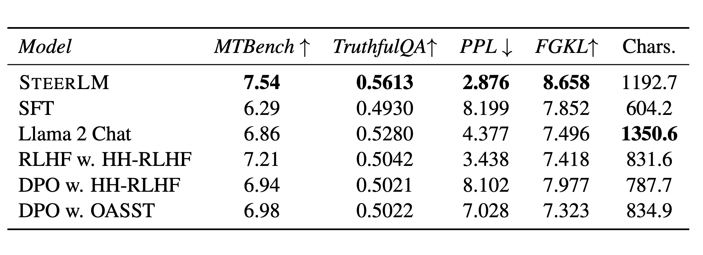
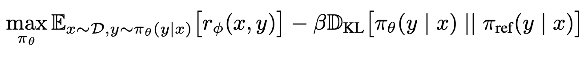
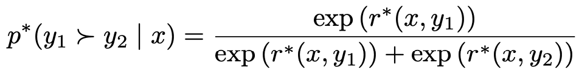
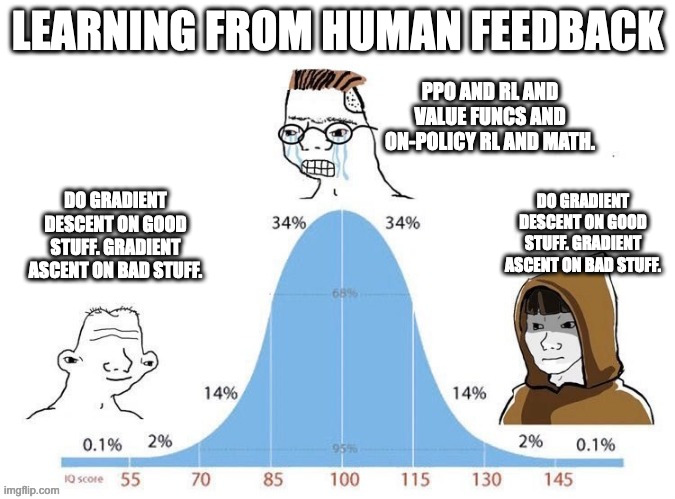

*Audio of this post is available [here](https://podcast.interconnects.ai/episodes/the-dpo-debate-do-we-need-rl-for-rlhf) or on [YouTube](https://www.youtube.com/watch?v=2m33Ncs7pRI).*

------------------------------------------------------------------------

Two weeks ago, when I released [this blog post](https://www.interconnects.ai/p/rlhf-progress-scaling-dpo-to-70b) stating that we successfully scaled the Direct Preference Optimization (DPO) method to a 70 billion parameter model, the debate on the *final* and *correct* method for integrating human preferences into large language models (LLMs) has only burned brighter. It took the open community of academics and hackers longer than expected to get into the space of reinforcement learning from human feedback (RLHF) methods, but now the pace of adoption is just as fast as the instruction-tuning takeoff from earlier this summer. Broadly, the argument boils down to one question: **Do we need the inner workings of reinforcement learning, with value functions, policy gradients, and all, to align language models with RLHF?** There are many related questions that I avoid in this post, such as online vs. offline RL, on-policy vs. not, and other RL nuances that add confusion to a relatively simple debate.

The problem we need to address before we can answer the question is that we need to build a lot of high-quality datasets and tools to answer it definitively. At least we can lay out the groundwork for what we need to test pretty clearly to get these answers.

To the extent that you *can* create a good model, DPO certainly is an option. Additional results that\'ll be coming out soon show that the 70B Tulu DPO model is on average about on the level of the original ChatGPT. While we still have a lot of work to do to close in on GPT4 and the code/reasoning abilities of any of OpenAI\'s models, this is a marked achievement for open-source and academic progress. Some models trained with PPO are strong. It seems to have been up to chance that the models that broke through are with DPO (combined with facts/lick of the UltraFeedback dataset and DPO's implementation simplicity).

One year out from ChatGPT, open models have just about caught up and DPO is part of it (without lying to yourself, like everyone did from about March through July when deluded posts about open-source ChatGPT flooded every media channel). While PPO has solid models, the true limits are not known due to how tricky it is to work with, although the dark corners of RLHF work like [TRLX Megatron integrations](https://github.com/CarperAI/trlx/blob/main/trlx/models/README.md), which have tons of details, may have hidden answers.

To the extent that [Tulu](https://huggingface.co/allenai/tulu-2-70b) and [Zephyr](https://huggingface.co/HuggingFaceH4/zephyr-7b-beta) were breakthroughs, it was not due to tweaking the optimizer, it was due to data and exploration of hyperparameters. DPO has a straightforward implementation, which is why people love it and it can be implemented in tons of existing LLM toolkits, which goes to show the loss function is not universal magic. **The long story short for open RLHF efforts is that we have more limitations with data and tooling and evaluation than optimizer choice.** Was the UltraFeedback dataset that these models were based on for some reason well-suited to DPO? What was missing about it? This could give the start of partial answers.

------------------------------------------------------------------------

*To answer questions about what type of performance you can get out of DPO when everything is running alright (and not perfectly optimized), check out the previous post I mentioned if you haven\'t read it, which highlights the [Tulu](https://huggingface.co/allenai/tulu-2-dpo-70b) and [Zephyr](https://huggingface.co/HuggingFaceH4/zephyr-7b-beta) models:*

::: {.digest-post-embed attrs="{\"nodeId\":\"9f3c94af-0254-4fad-9a68-1b7bdc2fcaf5\",\"caption\":\"Reinforcement learning from human feedback (RLHF), the technology that emerged to make ChatGPT feasible, is still extremely unknown and undocumented. Employees at Anthropic and OpenAI (rip) rely on methods of empirical exploration to get strong results, rather than clear recipes. Even the few things that people do understand are generally not shared.\",\"cta\":null,\"showBylines\":true,\"size\":\"sm\",\"isEditorNode\":true,\"title\":\"RLHF progress: Scaling DPO to 70B, DPO vs PPO update, Tülu 2, Zephyr-β, meaningful evaluation, data contamination\",\"publishedBylines\":[{\"id\":10472909,\"name\":\"Nathan Lambert\",\"bio\":\"ML scientist (RL, RLHF, society, robotics), athlete, yogi, chef. Writes about ML research.\\nPhD from Berkeley AI, Cornell Lightweight Rowing `17\",\"photo_url\":\"https://substackcdn.com/image/fetch/f_auto,q_auto:good,fl_progressive:steep/https%3A%2F%2Fbucketeer-e05bbc84-baa3-437e-9518-adb32be77984.s3.amazonaws.com%2Fpublic%2Fimages%2Fdda47b96-836a-4b95-99a0-f0ec744d4245_2316x2316.jpeg\",\"is_guest\":false,\"bestseller_tier\":100}],\"post_date\":\"2023-11-22T13:00:42.210Z\",\"cover_image\":\"https://substackcdn.com/image/fetch/f_auto,q_auto:good,fl_progressive:steep/https%3A%2F%2Fsubstack-post-media.s3.amazonaws.com%2Fpublic%2Fimages%2F3a08cd70-ef6a-45ef-8bd9-1eab619ef2fb_1820x1024.jpeg\",\"cover_image_alt\":null,\"canonical_url\":\"https://www.interconnects.ai/p/rlhf-progress-scaling-dpo-to-70b\",\"section_name\":null,\"video_upload_id\":null,\"id\":139063245,\"type\":\"newsletter\",\"reaction_count\":20,\"comment_count\":1,\"publication_name\":\"Interconnects\",\"publication_logo_url\":\"https://substackcdn.com/image/fetch/f_auto,q_auto:good,fl_progressive:steep/https%3A%2F%2Fsubstack-post-media.s3.amazonaws.com%2Fpublic%2Fimages%2Fe70f9dbf-4fe6-404c-b6bb-1831d1b7ed0b_590x590.png\",\"belowTheFold\":true}"}
:::

------------------------------------------------------------------------

As it goes these days, another power 7 Billion parameter model fine-tuned with RLHF was released, Starling. Quoting from the [Starling blog post](https://starling.cs.berkeley.edu/) on the different algorithms they could use, before settling on Advantage-Induced Policy Alignment (APA):

> DPO is simpler in implementation, which directly updates the language model on the pre-collected offline preference dataset. In contrast, online RL methods like PPO sample new responses using the current language model, score the new responses with the trained reward model, and update the language model with the reward information on the new responses. Despite the challenges in hyperparameter optimization for PPO, we found that, with optimal hyperparameter settings, the online RL methods yielded comparably strong results. We ultimately selected a checkpoint from an APA run. Our preliminary experiment on DPO showed no significant improvements over the initial model Openchat 3.5. This is likely due to that Openchat 3.5 has already done [Conditioned RL Fine-Tuning (C-RLFT)](https://arxiv.org/abs/2309.11235), a different format of offline preference-based training, and offline RL methods may not be as effective as online RL with a high-quality reward model. In the future, we envision a better language model fine-tuning procedure being using (conditional) offline RL including DPO or C-RLFT to leverage reward information to create a strong initial model, and further improve the helpfulness and harmlessness with reward training and online RL.

This paragraph is again a ton of interesting information, but it is not conclusive. We now know that DPO at least needs weird hyperparameters (e.g. low learning rates like 5e-7) and may need special data like UltraFeedback to work. I suspect the authors will continue these comparisons until the community feels strongly about them.

Nvidia\'s work is another recent one that \"shows\" DPO is less performant than PPO. For the model [SteerLM](https://arxiv.org/abs/2310.05344), they released the dataset [HelpSteer](https://arxiv.org/abs/2311.09528) which has some ablations (though the learning rate of 9e-6 is considered high compared to more successful DPO experiments).

The results above from the paper show a slight edge to RLHF (PPO) on MT-Bench and a few other benchmarks. These results are with datasets no one in the open source has really extracted powerful performance from. It\'s a useful data point early in the process of learning why RLHF works, but it is not conclusive! **Most of the evidence in the early literature of an extremely empirical field like RLHF is not conclusive \-- we need to build a web of more direct comparisons with shared code and detailed parameters.**

The key story of the DPO debate is that we need to be patient with the timeline by which new results come out. I\'ve been waiting for DPO validation for about 6 months, and it\'ll probably take at least that long until we really know the differences between DPO methods and RL methods.

As you can see, we don\'t have clear answers here. We know basic things like DPO being easy to implement and an extremely strong optimizer (potential to overfit if the [objective is misspecified](https://arxiv.org/abs/2311.00168)). There are also plenty of great intuitions that apply to DPO algorithms that don\'t in the RL case ([from the author](https://twitter.com/rm_rafailov/status/1729208993745342684)):

> A DPO policy is optimal solution to implicit reward function.

Yes, this solution is to the same Bradley-Terry optimization problem used in ChatGPT and Claude. These will be the two equations I subject you to in this post. First, the KL-constrained optimization problem RLHF operates on:

And second, the Bradley-Terry model of pairwise preferences:

The real questions I have with DPO, which are definitely more technical than most of the post, are the following. From biggest to smallest, and remember that every question I ask has a flip side that is a potential strength of DPO algorithms. We know so little:

1.  Is the **engineering abstraction separating reward model training from policy training** important to stable and scalable RLHF? Leading RLHF labs clearly do this based on many conversations, but it isn't possible in DPO.

2.  Does the **implicit reward** they define as a log-prob ratio behave like the classifier-based rewards (direct scalars) from a standard reward model?

3.  Do direct optimization algorithms have an advantage in the **synthetic preference data** regime (where GPT4 labels the score/choice)? Humans, in most general chat and reasoning tasks) have \~70% agreement/accuracy whereas GPT4 has 80%. Is this lower accuracy a signal that the prompt is hard? Regardless, if DPO or RL methods perform better with synthetic data, that'll be a huge advantage!

4.  Will it become important to be able to **train reward models with different preference rankings** and then apply RL to them? If the way preference data is collected changes, a new DPO algorithm will need to be derived and may or may not exist.

5.  Does **bootstrapping pairwise preferences from scalar reward functions** like code-based execution scores, toxicity, and other clever operations translate to DPO? If not, we will *always* need an RL-based alternative.

6.  How do DPO and **offline RL algorithms overcome the lack of feedback that generating samples gives**, where samples have some feedback of the policy in the form of scalar reward that goes into updates?

Testing these hypotheses is compute-heavy but doesn't require particularly new insights. We need to make the public infrastructure for RLHF easier to work with and compare. Resources like HuggingFace's [TRL](https://github.com/huggingface/trl) are where I expect this to happen, but there are lots of issues like RLHF not having a central benchmark to show progress on algorithms or data. They\'re all muddled together. Then, there are practical problems like lots of AI2\'s compute being GPUs and TRL not supporting that. The problem I\'m focusing on right now is that we have very little understanding of what happens in these preference datasets and how to clean them.

To summarize the DPO debate, I gave a talk on this question of DPO vs. RL, if you're willing to spend more time on it. Watch it here (slides available [here](https://docs.google.com/presentation/d/1gCnS6Sv2ynER3hB8TKyVJE4VxlcR8iGkg5iFIbZa4a8/edit#slide=id.g2a105985c94_0_0)):

:::::::: {#youtube2-YJMCSVLRUNs .youtube-wrap attrs="{\"videoId\":\"YJMCSVLRUNs\",\"startTime\":null,\"endTime\":null}" component-name="Youtube2ToDOM"}
::::::: youtube-inner
:::::: iframe
::: {#player}
:::

:::: player-unavailable
# An error occurred. {#an-error-occurred. .message}

::: submessage
[Try watching this video on www.youtube.com](https://www.youtube.com/watch?v=YJMCSVLRUNs){target="_blank"}, or enable JavaScript if it is disabled in your browser.
:::
::::
::::::
:::::::
::::::::

------------------------------------------------------------------------

### IPO, cDPO, and DPO-class algorithms

From now on, it is clear that DPO-like algorithms will be a part of RLHF research and practice. It's useful to remember that **DPO is training a reward model and getting an optimal policy-induced from it**. All of these other algorithms will do the same, at least until empirical hackers really mess up the implementation of the loss function and the theory never applies.

**φPO (or IPO)** is a new algorithm proposed in a [theory paper from Google DeepMind](https://arxiv.org/abs/2310.12036) that was singularly designed to improve the quality of the debate around DPO methods and the assumptions they make. From the IPO abstract:

> The prevalent deployment of learning from human preferences through reinforcement learning (RLHF) relies on two important approximations: the first assumes that pairwise preferences can be substituted with pointwise rewards. The second assumes that a reward model trained on these pointwise rewards can generalize from collected data to out-of-distribution data sampled by the policy. Recently, Direct Preference Optimisation (DPO) has been proposed as an approach that bypasses the second approximation and learn directly a policy from collected data without the reward modelling stage. However, this method still heavily relies on the first approximation.

This generally tells you what you need to know, but the details in the paper give you a lot of opportunity to learn about the math and assumptions beneath pairwise RLHF. IPO, and [conservative DPO](https://ericmitchell.ai/cdpo.pdf) (cDPO), a modified derivation of DPO that assumes N% of every preference label is wrong, act as a regularization term on DPO that could potentially alleviate overfitting.

In the talk I gave above, I didn\'t give it enough credit, mostly because I think I am bad at reading theory papers. In some discussions with the authors, they were directly pointing at DPO because of its success, and you need to be direct when calling out the shortcomings of very powerful research results in AI these days \-- it\'s hard to break through the noise. Now, IPO is implemented in TRL and the original DPO repo, so comparisons have begun (with early results showing they\'re very similar).

Evolving the methods for direct preference optimization instead of RL is very important, but the minor changes people are making right now are less important than data and experiments. In the future, they could be more important, of course.

Finally, when people complain about DPO not being RLHF, remind them that **RLHF is further from traditional RL than DPO is from what we were doing in RLHF to begin with.**

## The DPO debate in real-time

There has been a total deluge of new DPO experiments, derivations, and rants on Twitter (side note, we are so back). If you want to go deeper or understand why this post needed to be written, you can find all the resources below:

-   \[November 21st\] RLHF veteran and professor [Raj Ammanabrolu re-started the debate by saying](https://twitter.com/rajammanabrolu/status/1727001006024933663) DPO is "not well suited to initial RLHF training on real data" because of a lack of exploration or reward.

-   \[November 24th\] Eric Mitchell [defended DPO](https://twitter.com/ericmitchellai/status/1728193268423458943) in light of recent debates about IPO by posting a [one-pager](https://ericmitchell.ai/cdpo.pdf) on modifications to DPO to help with regularization and address the theoretical concerns in the IPO paper.

-   \[November 27th\] Co-lead Rafael Rafailov posted [a long thread](https://twitter.com/rm_rafailov/status/1729208972476059785) summarizing good intuitions for DPO and experiments we need to run in the open before we can conclude one algorithm is better than another.

-   \[November 29th\] Sasha Rush [asked the right questions about PPO](https://twitter.com/srush_nlp/status/1729896568956895370) being "inherently necessary" for modern RLHF, which prompted a long and hilarious debate on Twitter, resulting in a [great meme from Tom Goldstein](https://twitter.com/tomgoldsteincs/status/1729910334318633116).

-   \[December 1st\] I posted [my talk on the RL in RLHF](https://www.youtube.com/watch?v=YJMCSVLRUNs) at about 4 PM on a Friday.

-   \[December 1st\] At about 9 PM that Friday, in legendary grad student fashion, Co-lead author Archit Sharma posted new [win-rate comparisons between DPO, IPO, and cDPO](https://twitter.com/archit_sharma97/status/1730819199675908181?s=20) on [Anthropic's Helpful-harmless dataset](https://huggingface.co/datasets/Anthropic/hh-rlhf), showing that they\'re all pretty similar.

-   \[December 1st\] A non-author grad student at Stanford [wrote up an alternate derivation for the optimal policy DPO](https://twitter.com/AllanZhou17/status/1730784839488749703) solves via a Lagrangian method buried in the replies of a thread.

-   \[December 2nd\] Eric Mitchell [followed up with more new results on the length biases of these methods](https://twitter.com/ericmitchellai/status/1731093366849577386), which show length decreasing, which is the opposite of what people thought they knew. The takeaway is to try all the methods and checkpoint frequently (depending on the dataset).

To be clear, I probably missed some. It even got to the point that Yann Lecun retweeted my talk on this. I'm not sure it's a good thing, but here we are.

More resources you can use to go deeper into DPO methods:

-   A paper you should know about if you're going deep on the DPO is methods: [Contrastive Preference Learning](https://arxiv.org/abs/2310.13639) (CPL), which casts DPO-like methods into a multi-turn framework for decision-making and multi-turn conversation.

-   Here is a [talk from Sasha Rush on Zephyr models](https://www.youtube.com/watch?v=cuObPxCOBCw&t=1s) and their recent peers!

-   There are now tons of RLHF papers that catch my eye every week. Some related to this are: An older paper that casts the idea of [RL with KL penalties as Bayesian inference](https://arxiv.org/abs/2205.11275) rather than a hack, a new paper from DeepMind integrating [ideas of Nash Equilibriums into preference modeling](https://misovalko.github.io/publications/munos2024nash.pdf), and [a paper studying the numerical quirks of Elo rankings in LLM evaluation](https://arxiv.org/abs/2311.17295), which is a common tool for vibes-based eval. of RLHF.

-   Argilla [trained a variation of Zephyr-Beta, Notus](https://twitter.com/argilla_io/status/1730575383219626278), which re-did the DPO training with a filtered and fixed dataset. Similarly, we at AI2 [released a cleaned version of UltraFeedback](https://huggingface.co/datasets/allenai/ultrafeedback_binarized_cleaned) that removes the TruthfulQA prompts that contaminate the results. Argilla also released another version that aggregated the preferences slightly differently.

------------------------------------------------------------------------

### Do we have the right RLHF objective?

It\'s a good time to remember when debating all of this about DPO and PPO if the objective / problem specification we\'re using for RLHF is even the right one (KL constrained reward).

I wrote a whole paper explaining all the ways it may not be, and how there may be \"objective mismatches\" between reward model training, policy training, and evaluation. DPO methods only solve the reward-model policy links, and not the others. I present these missing links as \"[The Alignment Ceiling](https://arxiv.org/abs/2311.00168)\" (slides [here](https://docs.google.com/presentation/d/1RiTFvVzPbAwceLOuMuI2yV2FWCXyBhMLd-WDeKKckxY/edit?usp=sharing)). I presented this idea for my job talk at AI2:

:::::::: {#youtube2-yrdUBwCnMr8 .youtube-wrap attrs="{\"videoId\":\"yrdUBwCnMr8\",\"startTime\":null,\"endTime\":null}" component-name="Youtube2ToDOM"}
::::::: youtube-inner
:::::: iframe
::: {#player}
:::

:::: player-unavailable
# An error occurred. {#an-error-occurred. .message}

::: submessage
[Try watching this video on www.youtube.com](https://www.youtube.com/watch?v=yrdUBwCnMr8){target="_blank"}, or enable JavaScript if it is disabled in your browser.
:::
::::
::::::
:::::::
::::::::

------------------------------------------------------------------------

*Thanks* *to my AI2 colleagues, the original authors, and many others on Twitter/online for engaging so respectfully and thoroughly in this debate. The list of people that helped with this article in that way is quite long. Starting with some: Hamish I, Archit S, Eric M, Rafael R, Sasha R, Louis C, and it goes on.*

------------------------------------------------------------------------

### Newsletter stuff

#### Models

-   A new non-transformer model was released in the billions of parameter range, and it\'s promising! The paper is [here](https://arxiv.org/abs/2312.00752), and more on [Twitter](https://twitter.com/_albertgu/status/1731727672286294400).

#### Links

-   This a very [high effort post summarizing progress in RLHF and IFT](https://gaotianyu.xyz/blog/2023/11/30/instruction-tuning/) this year.

-   Sailing + RL crossover, [here is a funny video if you sailed](https://www.sailingscuttlebutt.com/2023/11/30/can-a-computer-learn-to-sail-an-optimist-with-ai/).

-   An [accessible LLM survey dropped](https://arxiv.org/abs/2311.17301)! Share it with your noob friends.

-   Intriguingly HuggingFace dropped the eval `Drop` from the leaderboard citing sensitive behavior. They wrote a [decent blog post](https://huggingface.co/blog/leaderboard-drop-dive) explaining it.

#### Housekeeping

-   **New paid feature \-- Discord**: an invite to the subscriber-only Discord server is in email footers.

-   **New feature \-- Audio:** all posts can be listened to on [podcast players](https://podcast.interconnects.ai/) or [YouTube](https://youtube.com/@interconnects) (may transition to paid feature in the future).

-   **Interconnects referrals:** You'll accumulate a free paid sub if you use a referral link from the [Interconnects Leaderboard](https://www.interconnects.ai/leaderboard).

-   **Student discounts:** Want a large paid student discount, go to the [About page](https://www.interconnects.ai/about).
