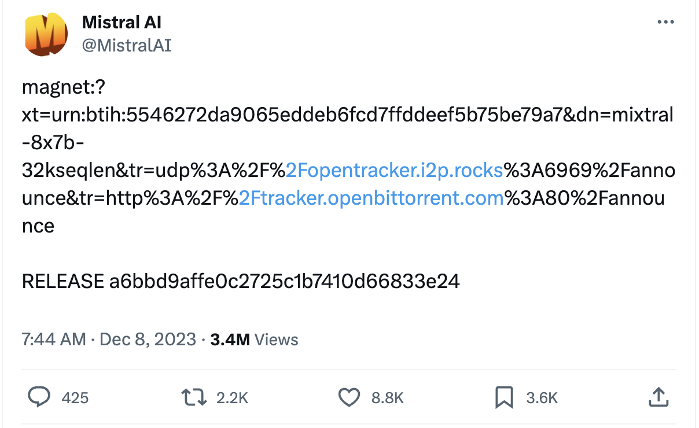
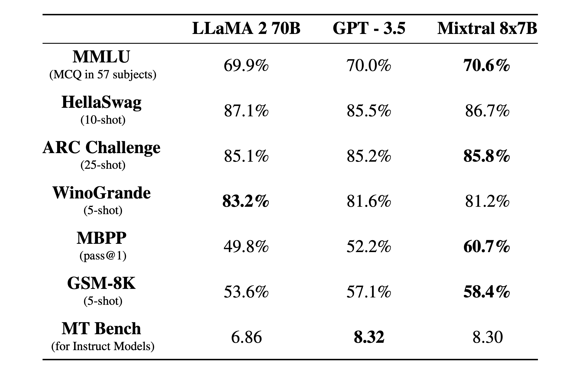
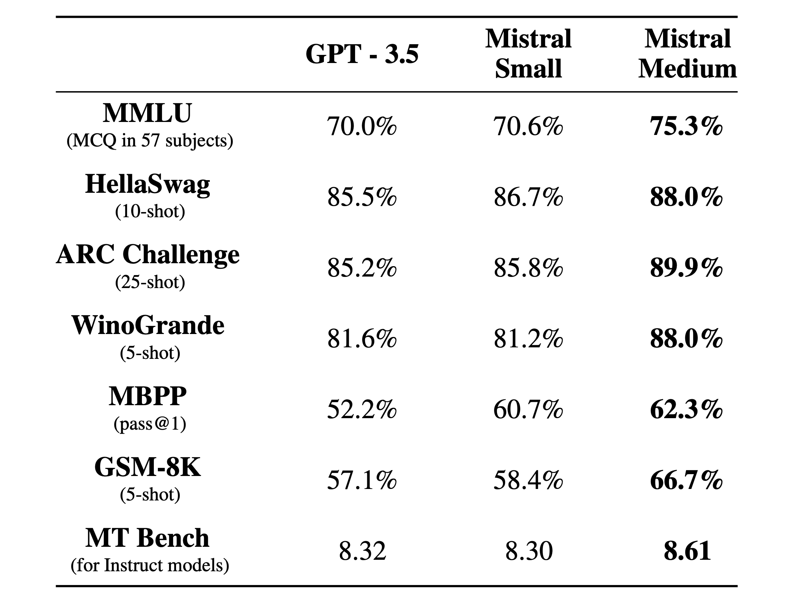
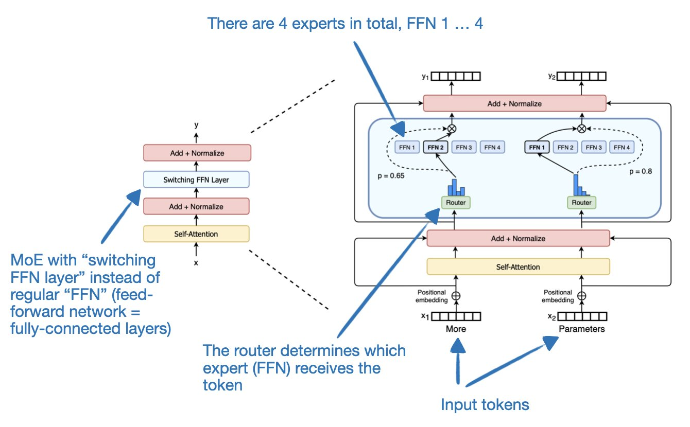
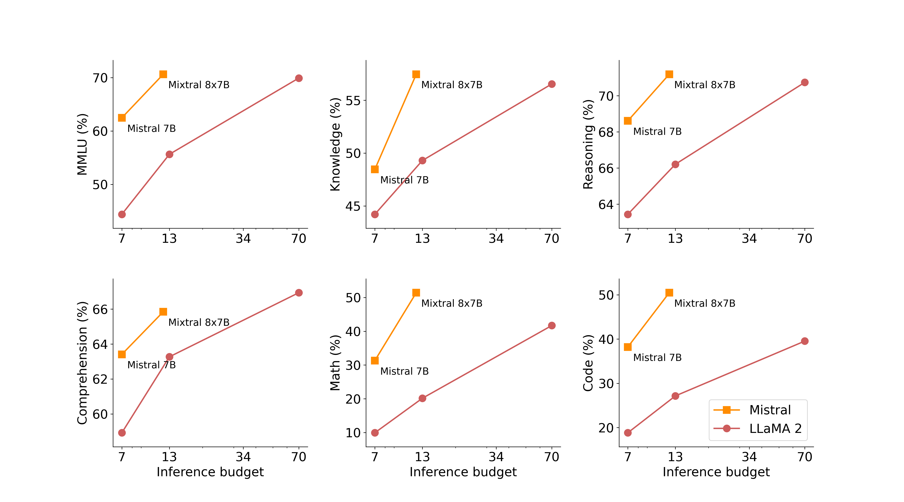
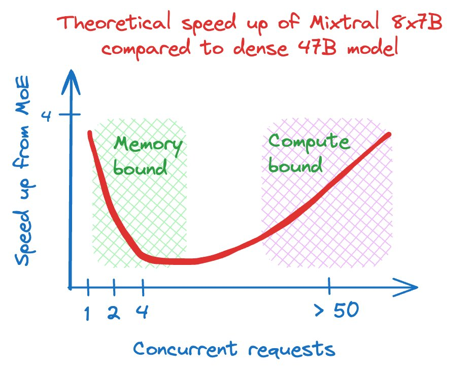
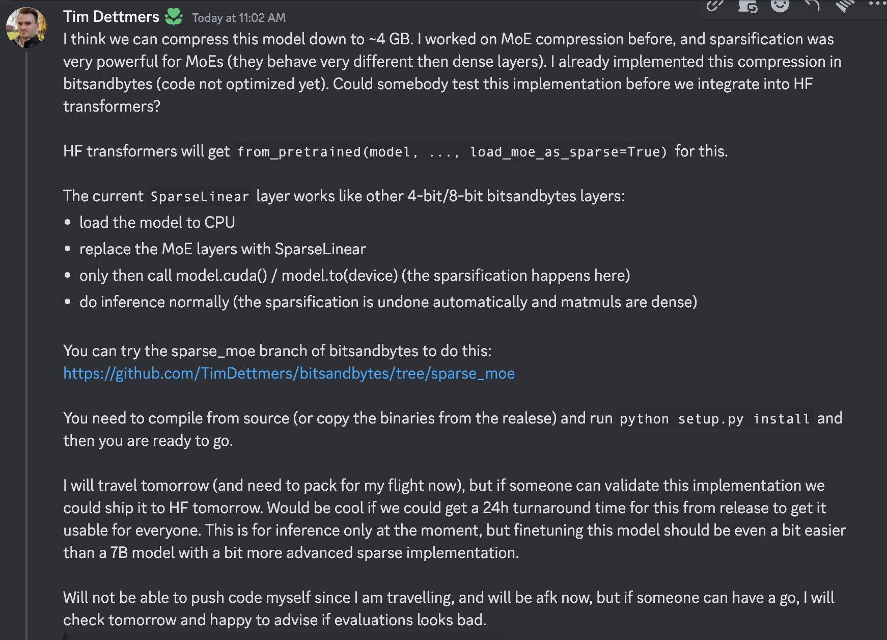

Emergency blog 🚨 (as I finally study and understand mixture of experts)! *As the holiday season comes around, remember you can* *[give the gift of Interconnects](https://www.interconnects.ai/subscribe?gift=true). While it\'s still early days on paid features, it'll guilt them into reading the highest signal AI essays out there.*

(Slightly funny) audio of this post is available on [podcasts](https://podcast.interconnects.ai/episodes/mixtral-the-best-open-model-moe-trade-offs-release-lessons-mistral-raises-400mil-googles-loss-vibes-vs-marketing) and [YouTube](https://youtu.be/4C4Y8riu43Q) shortly.

------------------------------------------------------------------------

The AI community loves to launch products before or during the biggest AI conference of the year, the Conference on Neural Information Processing Systems (NeurIPs). Last year, ChatGPT launched with a murmur that grew into a roar. This year, we have Google launching Gemini last Wednesday, but that is already overshadowed. On Friday, December 8th, the San Francisco contingent of the AI community woke up to another [torrent link from our friends in Paris](https://twitter.com/MistralAI/status/1733150512395038967).

The model, cleverly named [Mixtral 8x7B](https://huggingface.co/mistralai/Mixtral-8x7B-v0.1), is an 8-expert, sparse mixture of experts (SMoE) model with about 52 billion total parameters of which 12B are active at inference. While there was a [craze](https://twitter.com/jphme/status/1733412003505463334) of [people](https://twitter.com/4evaBehindSOTA/status/1733341003531338220) [trying](https://twitter.com/Francis_YAO_/status/1733686003687112983) to figure out how to fairly evaluate the model before official inference code like vLLM and HuggingFace Transformers existed the following Monday, we now have the true measure of the Mixtral model\'s strength (from the [launch blog](https://mistral.ai/news/mixtral-of-experts/)):

> It gracefully handles a context of 32k tokens.
>
> It handles English, French, Italian, German and Spanish.
>
> It shows strong performance in code generation.
>
> It can be finetuned into an instruction-following model that achieves a score of 8.3 on MT-Bench.

These are very good scores to put it simply. **Beating Llama 2 70B is not an easy task**. The true evaluation vs. ChatGPT 3.5 will be on crowd-source head to head chat comparisons, where pure evaluation scores never tell the whole story for chat-tuned models (they are technically comparing a chat model to a base model, but that's what happens when no one follows true open-source principals). It's a vibe test, even internal to these top ML labs.

They also released an [initial instruction-tuned version of the model](https://huggingface.co/mistralai/Mixtral-8x7B-Instruct-v0.1) trained with [Direct Preference Optimization (DPO)](https://www.interconnects.ai/p/the-dpo-debate). And we have more exciting news to come, from the launch of [Mistral's API platform](https://mistral.ai/news/la-plateforme/) (Mistral Small is Mixtral, Mistral Tiny is the 7B model):

Here, we can see that a larger checkpoint of Mistral is already done training, called Mistral medium, which has very strong benchmarks (but not yet to GPT4 levels, which to recall has evals of MMLU: 86.4, HellaSwag: 95.3, AI2 Reasoning Challenge: 96.3, WinoGrande: 87.5, GSM8k: 92.0). Of course these comparisons are pending shot-count, which is how many in-context examples exist in the prompt, and other tunings. Mistral Medium passing GPT4 on WinoGrande is a good sign for potential in coding/reasoning tasks, where open models have lagged substantially.

Finally, it is obvious that the naming *medium* warrants immediate and vast speculation on the existence of Large and Extra-large models. Given that the Mixtral model is a MoE model with about 12 billion active parameters, there\'s a lot of room to scale upwards (more on MoE later in the post). Let\'s go, but let\'s not get ahead of the fact that we don\'t know if every model will be openly released. They do need to make money after all.

The key thing that makes Mistral look so good is velocity. Both Mistral 7B, their original model, and now Mixtral were released in between Llama 2 and Llama 3. While it's almost a certainty that the Llama 3 base model is done training and they're doing safety experiments, the relative velocity further amplifies the perceived capabilities of Mistral as an organization and their models. *Chapeau!*

### Mixture of Expert (MoE) basics

I'll answer the most obvious question first, **why are so many people using MoE models?** In short, two things that I will revisit in this post: better model performance on many tasks and better scaling for large-scale distributed inference (like on OpenAI's API). It's an efficient way of training better models, and is sort of used as a hyperparameter in many top labs (e.g. how many experts can we fit on our infrastructure and how many experts continue to improve task performance).

Now, to an explanation of how this works. From the Mixtral blog (emphasis mine):

> Mixtral is a sparse mixture-of-experts network. It is a decoder-only model where the feedforward block picks from a set of 8 distinct groups of parameters. **At every layer, for every token**, a router network chooses two of these groups (the "experts") to process the token and combine their output additively.
>
> This technique increases the number of parameters of a model while **controlling cost and latency**, as the model only uses a fraction of the total set of parameters per token. Concretely, Mixtral has 46.7B total parameters but only uses 12.9B parameters per token. It, therefore, processes input and generates output at the same speed and for the same cost as a 12.9B model.

There are a few key things to know about how MoE models work. First, they have a routing system that chooses which expert each token will be passed to at each layer. To see how this works, look at the great figure below from the [Swap Transformer paper](https://arxiv.org/abs/2101.03961):

In this model, the forward pass selects from 2 of 8 experts in each block. This happens in every feed-forward network (FFN), rather than all of the attention layers or other compute-heavy areas. This is why the new network Mixtral doesn't have 56 billion parameters, from 7x8=56, but only 46.7 billion.

Second, MoE models effectively make the trade of increasing VRAM usage for faster inference and better model performance at the same active number of parameters. With this, MoE is a training hyperparameter that increases model performance, especially with more Vram available, for faster inference and a bit better performance.

Sparsity in LLMs effectively means that many of the connections in the network can be set to zero during inference and/or training. MoE is a specific architecture particularly suited to this. *For more on the basics of sparsity, see this* *[post on Lil](https://lilianweng.github.io/posts/2023-01-10-inference-optimization/#sparsity)*['](https://lilianweng.github.io/posts/2023-01-10-inference-optimization/#sparsity)*[Log](https://lilianweng.github.io/posts/2023-01-10-inference-optimization/#sparsity)* *or from* *[Finbarr](https://www.artfintel.com/i/139095371/effective-sparsity).*

#### In the weeds details

-   Some people, like Karpathy, can read the metadata of the model state dictionary and know basic facts about how the model compares to dense networks. In this [tweet](https://twitter.com/karpathy/status/1733181701361451130?utm_source=ainews&utm_medium=email&utm_campaign=ainews-1282023-mamba-v-mistral-v-hyena), Karpathy explains things like the MLP expansion factor of 3.5 (ratio of attention dim to hidden dim of the embedding/vocab), the [multi-query attention](https://arxiv.org/abs/1911.02150) factor where keys and values are shared across 4 heads, and the basic MoE parameters.

-   The Mixtral model has a very strong Mostly Basic Python Programming ([MBPP](https://paperswithcode.com/dataset/mbpp)) eval score (higher than CodeLlama 34B), which means it may be a very strong code model when fine-tuned.

-   [Mistral's models are fairly instruct-native](https://twitter.com/abacaj/status/1733725408040829063), showing decent chat performance just with a system prompt. While there are rumors that they train on distilled GPT4 data, that isn\'t the point here. Base models increasingly are becoming steerable \-- the boundary between pretraining and fine-tuning will ebb and flow regularly in the next few years.

------------------------------------------------------------------------

**Links**

-   Base model on [HuggingFace](https://huggingface.co/mistralai/Mixtral-8x7B-v0.1).

-   Instruct model on [HuggingFace](https://huggingface.co/mistralai/Mixtral-8x7B-Instruct-v0.1).

-   Official [blog post from Mistral](https://mistral.ai/news/mixtral-of-experts/).

-   Inference [code in the project vLLM](https://github.com/vllm-project/vllm/commit/b5f882cc98e2c9c6dde7357dbac2ec0c2c57d8cd).

-   A [free demo on HuggingChat](https://huggingface.co/chat/?model=mistralai/Mixtral-8x7B-Instruct-v0.1).

-   [MegaBlocks MoE training code](https://github.com/mistralai/megablocks-public) where the model first appeared (and the [MegaBlocks paper](https://arxiv.org/abs/2211.15841)).

-   Finbarr's more technical, paper-driven mixture of experts [blog post](https://www.artfintel.com/p/papers-ive-read-this-week-mixture) and [follow-up](https://www.artfintel.com/p/more-on-mixture-of-experts-models).

-   A [mixture of experts explainer](https://huggingface.co/blog/moe), which is quite thorough, was released by friends at HuggingFace.

------------------------------------------------------------------------

### MoE quirks and lessons

This is the real reason I'm posting this --- the interesting things we have to learn about MoE models in open ML.

**Faster inference with more memory**

Again, from the Mixtral blog, which shows how the active parameter counts compare to the Llama 2 models:

Here, we can see Mistral pretty clearly dunking on Llama models when comparing active parameter count. This is the advantage they get for moving fast.

However, the parameter count and inference advantages of MoE models is not unilateral. While it is a huge advantage for the GPU-rich of the world, with the best high-end GPUs that have tons of memory when serving models, who also benefit from the massive number of concurrent calls on an API --- that is MoE models handle batching well.

When running the model locally with one single prompt, the expert parameters should be loaded in and out so that all 47 billion parameters don't need to be saved at once, but I'm not sure how fast it is to swap between them if the next requested token needs a different expert. This can let more people play with the model, but new system bottlenecks emerge.

On the other hand, if many requests are being handled in one batch, then all the experts will likely be stored in memory, and the inference speed is solely limited by the number of FLOPs that a GPU can perform (which is the normal bottleneck of serving LLMs).

*For more on this tradeoff, see this* *[Twitter thread from D. Dzhulgakov](https://twitter.com/dzhulgakov/status/1734029842436472898). A system paper on inference and training of MoE models can be found* *[here](https://arxiv.org/abs/2201.05596)*.

**Bootstrapped model from Mistral 7b? (a.k.a. stitching 8 models together)**

There was an interesting [Tweet](https://twitter.com/tianle_cai/status/1734188749117153684) that pointed out a strong correlation between the parameters in the Mixtral model and the previous Mistral-7B model that everyone has loved recently (the predecessor to my team's work on [Zephyr-beta](https://huggingface.co/HuggingFaceH4/zephyr-7b-beta)). This was posted to make it seem like Mistral jammed 8 models together, turned on fine-tuning, and got a Mixtral out. I don\'t think this is the case and haven\'t seen anything in the literature to indicate that is possible.

From the Mixtral blog:

> Mixtral is pre-trained on data extracted from the open Web -- we train experts and routers simultaneously.

So, it seems like the Mixtral model is not continual training from the 7B model, but rather using a continuation of the same dataset and training infrastructure, which is logical.

**Safety flag in the system prompt**

[Eric Mitchell](https://twitter.com/ericmitchellai/status/1734135338824822881) pointed out the following quote from the blog post on how Mixtral handles content filtering:

> Mixtral can be gracefully prompted to ban some outputs from constructing applications that require a strong level of moderation, as exemplified [here](https://docs.mistral.ai/platform/guardrailing).

The guard railing API looks like the following:

    chat_response = client.chat(
       model="mistral-tiny",
       messages=ChatMessage(role="user", content="What is the best French cheese?"),
       safe_mode=True
     )

Where `safe_mode` appends a system prompt essentially asking the model to be safe. If this is served in the API, it\'ll lead to new varieties of jailbreaks switching the safety on and off, and so on. The simple API is reasonable from a platform perspective, the safety needs of your model depend on the use case of your customer. Consumer products need filters, enterprise ones may not (as a gross oversimplification).

**Compressibility, local running, and fine-tuning**

As far as I know, instruction-tuning and RLHF on MoE models proceed the same as long as the codebase you're using as the MoE architecture is implemented and you have enough VRAM. However, there are [lots of questions as if this is easy to use for the vibing fine-tuning community](https://twitter.com/sea_snell/status/1733171940884693152) due to the increased memory needed for training relative to a true 12B parameter model.

This was counteracted by lots of discussion and [responses from Tim Dettmers](https://twitter.com/Tim_Dettmers/status/1733676239292866682) on the early promise of quantizing this model. The hypothesis that the model can get compressed down to about 4GB for inference, buried in the [DiscoResearch](https://twitter.com/DiscoResearchAI) Disco(rd) was the following:[1](#footnote-1){#footnote-anchor-1 .footnote-anchor component-name="FootnoteAnchorToDOM" target="_self"}

The conclusion is that \"fine-tuning this model can be easier than a 7B model locally,\" but this presumes that fine-tuning with QLoRA techniques is as good as full fine-tuning, which w[e showed wasn\'t the case in the Tulu 2 paper.](https://arxiv.org/abs/2311.10702)

All this being said, the first fine-tune I saw [was this one](https://twitter.com/mattshumer_/status/1733927635246305633), only two days after and before the official code. There'll be a ton to learn in this space, and I expect to write an entire other post once people start using RLHF on MoE models in the open!

**Future issues with torrent releases**

While releasing models with torrents is fun and meme-y, I'm not sure it's something that should be encouraged. The weekend before the official models were released on HuggingFace was a deluge of model copies and local experiments. If there was a bad actor that wanted to cause harm, it could've been done because all the [models were being processed with ](https://huggingface.co/DiscoResearch/mixtral-7b-8expert)`trust_remote_code=True` on HuggingFace to include the MoE code. Maybe I need to learn more about the safety of torrent networks, but ML models are increasingly going to be central resources in crucial computing infrastructures, so I would appreciate people building better habits around their distribution sooner rather than later.

------------------------------------------------------------------------

### Mistral's gain, Google's loss, 2024 in open ML

Just two days before the release, we had Google's attempt to capitalize on OpenAI's chaos. If Google just presented an equal alternative to GPT4 their cloud business would benefit. Though, the [Gemini demo was faked](https://techcrunch.com/2023/12/07/googles-best-gemini-demo-was-faked/) (and yes Google admitted it), highlighting the continued cultural lag they\'re dealing with at the decision-maker level. **Non-live demos are a pre-ChatGPT energy**, even though it is clear that Gemini is a fantastic model. People know that computers are slow again with the best models, but that\'s okay!

At the same time, open ML was ready to capitalize on this mistake. Mistral released these models, [announced their \$400million series A raise](https://techcrunch.com/2023/12/11/mistral-ai-a-paris-based-openai-rival-closed-its-415-million-funding-round/), and the [EU carved out benefits for open-source in the AI a](https://www.washingtonpost.com/technology/2023/12/08/ai-act-regulation-eu/)ct (more [analysis on Twitter](https://twitter.com/togelius/status/1733418673904206181)); all just weeks after the creation of the [AI Alliance](https://thealliance.ai/) (AIA), a giant open-source ML coalition. The border between vibes and reality in open ML is not quite fully settled. The AI Alliance is a great step forward with an amazing initial batch of organizations, including scientific giants like CERN, but it\'s still not clear what the governance structure or project scope will be. I want the AIA to succeed, but we need to wait and see if they can actually ship anything.

Let's hope for more Mistral models soon, keep an [eye on their API platform](https://mistral.ai/news/la-plateforme/), try and guess if Llama 3 will be entirely MoE, and so on. If anyone at Mistral is still reading and wants to chat, I'd love to connect and maybe even interview you (given the new addition of [Interconnects Audio](https://podcast.interconnects.ai/)).

Given that the active parameters are only about 12B for Mixtral, I see extremely strong chat fine-tunes coming next year. It'll be a moderate shift in the training code people use to adapt models, but things like Zephyr-Gamma and Tulu v3 now have all the ingredients to definitively beat GPT3.5. The question is, **how far does this shift take us towards GPT4?** I think we still need a bigger base model to close that gap, but as I've discussed before, [open models are on a different development path than closed ones](https://www.interconnects.ai/p/llm-development-paths), so we should be excited and see where it goes.

------------------------------------------------------------------------

### Newsletter stuff

Models

-   A new non-transformer model, [Striped Hyena 7B](https://www.together.ai/blog/stripedhyena-7b), from Transformer, with actually competitive performance.

-   Stability released a [Zephyr-style 3B model](https://stability.ai/news/stablelm-zephyr-3b-stability-llm?utm_source=twitter&utm_medium=website&utm_campaign=blog), which looks very strong, but not a world-beater like Emad is saying ([Twitter](https://twitter.com/StabilityAI/status/1732840342251315518) link).

Gemini notes

-   [Summary from S Rush](https://twitter.com/srush_nlp/status/1732427569352323401).

-   Multi-objective RLHF. From the paper: \"We use multi-objective optimization with a weighted sum of reward scores from helpfulness, factuality, and safety, to train a multi-headed reward model." OpenAI etc are probably doing this too as Llama 2 did this for helpfulness and safety.

-   The safety filter of Gemini is during *and after* RLHF, where they have a classifier that gives a go-no-go on chat responses.

-   We have no idea how they do multimodal output RLHF, seems very hard --- you can't just freeze parameters or the RL optimizer will overoptimize around them.

Links

-   [LMSYS updated the ChatBot arena](https://lmsys.org/blog/2023-12-07-leaderboard/) with more results showing that Tulu 2 70B \~ ChatGPT 3.5 and better evaluation strategies for comparing models with Elo.

-   Better safety evals from open source <https://ai.meta.com/blog/purple-llama-open-trust-safety-generative-ai/?utm_source=tldrai>

-   AlpacaFarm [updated their results](https://twitter.com/lxuechen/status/1732835994230202767) and showed that DPO is close to PPO for them too.

-   Human Aware Loss Functions (HALOs) from Stanford / Contextual on [Twitter](https://twitter.com/ethayarajh/status/1732837520784957476) / [blog](https://contextual.ai/better-cheaper-faster-llm-alignment-with-kto/) / [report](https://github.com/ContextualAI/HALOs/blob/main/assets/report.pdf) / [code](https://github.com/ContextualAI/HALOs). A new method for using score-based rewards rather than pairwise preferences. This looks great, but needs to be pushed a bit to get the Zephyr or Starling model quality. Here\'s [more math comparing it to DPO](https://twitter.com/ericmitchellai/status/1732987427608994210).

------------------------------------------------------------------------

#### Housekeeping:

-   **New paid feature, Discord**: an invite to the subscriber-only discord server is in email footers.

-   **New feature, Audio:** all posts can be listened to on [podcast players](https://podcast.interconnects.ai/) or on [Youtube](https://youtube.com/@interconnects)(may transition to paid feature in the future).

-   **Interconnects referrals:** You'll accumulate a free paid sub if you use a referral link from the [Interconnects Leaderboard](https://www.interconnects.ai/leaderboard).

-   **Student discounts:** Want a large paid student discount, go to the [About page](https://www.interconnects.ai/about).

:::: {.footnote component-name="FootnoteToDOM"}
[1](#footnote-anchor-1){#footnote-1 .footnote-number contenteditable="false" target="_self"}

::: footnote-content
I was stalking the Mixtral-implementation channel all weekend :).
:::
::::
