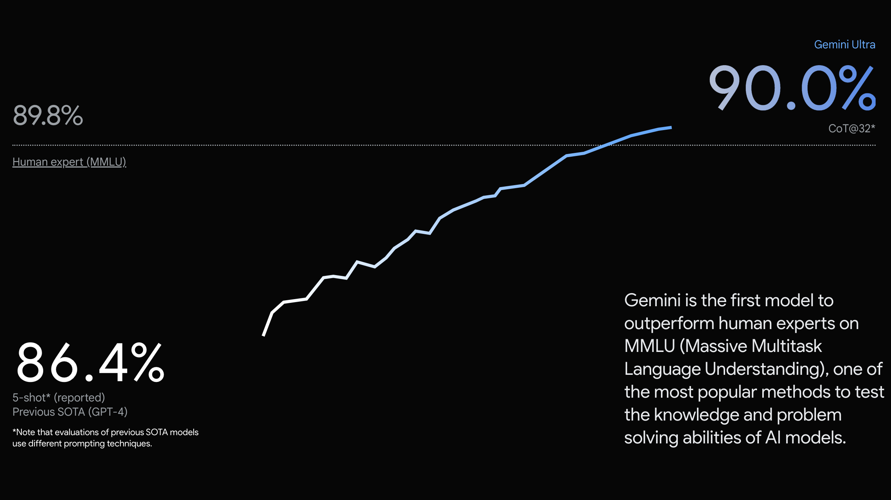

Just last week we had Google announce the Gemini model suite (with the Pro version actually being available via API as of today), so this week we got to see the response of the Microsoft-OpenAI coalition. In reality, they didn\'t need to respond, but some research on domain-specific use of LLMs in medicine was re-purposed to fire the response. I'll paraphrase it: "**GPT4 is better than Gemini because it scores .06 higher on one esoteric benchmark**!"

Call this the first meme special of Interconnects. In reality, memes get the point across better than reality. None of the memes in this post are targeting the researchers doing their best to figure out AI, but the people distorting it.

The original paper from Microsoft, *[Can Generalist Foundation Models Outcompete Special-Purpose Tuning? Case Study in Medicine](https://arxiv.org/abs/2311.16452),* has no mention of Gemini, as one would expect. The company blog post for this work was posted by the Chief Science Officer Eric Horvitz, *[The Power of Prompting](https://www.microsoft.com/en-us/research/blog/the-power-of-prompting/)* on November 28th, so before Gemini. The second blog post for the paper, which seems like it was put out just to comment on Gemini, extended their discussion on the mysterious \"[power of prompting](https://www.microsoft.com/en-us/research/blog/steering-at-the-frontier-extending-the-power-of-prompting/).\" This second post is where we get this masterpiece, showing incremental improvements in GPT-4\'s MMLU score with more and more sophisticated prompting techniques.

I\'ll be honest, I didn\'t even read the paper that the technique Medprompt comes from. I\'m sure there\'s useful stuff in here, but it\'s not designed to improve the MMLU score! For the non-ML experts in the audience, I made an annotated version of this plot better reflecting the reality of the situation in the MSFT public relations office:

Why is this so obviously the case? Let us consider, for example, what Gemini Ultra\'s MMLU score would be with this new advanced prompting technique. Exactly, Microsoft cannot know this because they don\'t have access to the model. Without access to the model, it\'s impossible to do a fair comparison. Without any semblance of a fair comparison, the numbers are marketing, not science.

Microsoft is obviously not the only one guilty of this. From the [Gemini Apple-themed launch page](https://deepmind.google/technologies/gemini/#capabilities), we got the other obnoxious evaluation graph:

What is even going on here? Google is drawing an arbitrary line to show that Gemini Ultra is better than both human experts and GPT-4 with their specific prompting technique (which I repeat, cannot be verified without more access to the model weights). There are lots of things that should annoy you about this, such as how they\'re creating the imagination of data between the two for what should be a bar plot, but it is another case of **Big Tech companies comparing their model\'s scores without the ability to evaluate their competitor**. There are minor details like Gemini Ultra being evaluated with 32-shot learning compared to GPT-4\'s 5-shot, but that honestly is less important. I\'ve heard these sorts of problems even trickle down within the labs, where researchers don\'t compare their models to other companies enough, but I need to learn more before I can dunk there too.

This all goes well beyond the headline evaluation scores for foundation models like MMLU. With the scope of the teams to train these large language models (LLMs), there are so many ways that individual scores can be boosted intentionally or unintentionally. There are lots of rumors that companies mix in instruction data at the end of pretraining, or some other special sauce, which could help improve these evaluation scores. **Without access to the training data or code, little can be said with confidence as to why LLM eval scores are different**.

While open providers do have some shortcomings in this regard, with public relations and touting your own horn steering decisions like trying to top HuggingFace\'s leaderboard, that\'ll settle down into 2024 when fewer people are training more focused models. The initial land grab in the open seems mostly over. At least the leaderboard is standardized! I\'ve written extensively on evaluating open LLMs already, so please read this post on [discovering models](https://www.interconnects.ai/p/evaluating-open-llms) or this post on the [leaderboard\'s role in the ecosystem](https://www.interconnects.ai/p/how-the-open-source-llm-ecosystem) if you are interested.

Private companies have structural incentives and market problems that\'ll make fixing this harder, as **Google misleadingly shows their new models crushing OpenAI could actually cause a stock bump in the public markets. Have fun fixing that incentive problem.**

Funnily enough, all of this nonsense makes me trust the scores of OpenAI and Anthropic even more relative to their Big Tech competitors. These companies still have major power centers that are mega-nerds that want to build the absolute best models possible. They don\'t have time to try and one-up someone\'s recent release, they\'re actually building reliable improvements.

If you\'re working on open models and for some reason get inspired to build yet another evaluation aggregation service, please build on [Eluether\'s evaluation harness](https://github.com/EleutherAI/lm-evaluation-harness) \-- that\'ll make **open models continue to have the advantage they should have, better validation and comparison of scores and capabilities**!

What makes this all even more funny is the fact that most of the times the true reality of model's strengths and usefulness come from playing with it. Models are so strong on most of the benchmarks we use these days that it takes a huge difference in the numerical scores to make it obvious that one model is better than another. **If you want to be informed about which LLM is the one for you, sit down and chat with some LLMs.** You'll know the answer pretty quick. Reacting based on evaluation scores pre-release won't get you far, especially if your business is on the line.

I didn't really cover evaluation contamination in this post, but it's important to know that companies not disclosing training data may literally be training on these public evaluation sets because a) it'll make the score go up and b) it'll make the model better. We cannot confirm nor deny this practice without open models. **Even if you assume eval-data contamination isn't happening, there are still plenty of ways to mislead communications about evals.**

------------------------------------------------------------------------

## More nuanced points

**How do you even evaluate MMLU?**

MMLU, the [Massive Multitask Language Understanding](https://arxiv.org/abs/2009.03300) benchmark, isn\'t even that simple to get scores from! The community has mostly converged on a technique, where you generate answers and the model scores which of the multiple choice options is the most likely. Though, some evaluation tools do something odd where they take the perplexity of the answer as a sequence and choose the lowest perplexity answer (I heard [Mosaic Eval Gauntlet](https://www.mosaicml.com/llm-evaluation) does this, but I did not confirm). Essentially, perplexity is how surprised a model is by text, so lower would mean a more confident answer. The problem is when you encounter sequences like \"none of the above,\" it\'ll heavily skew answer selection compared to \"C\". This is one of many problems in making LLM eval reliable. In this case, the Llama models handle both formulations well, but most open base models do not.

*For more on perplexity, I really enjoyed the* *[introduction in the HuggingFace doc](https://huggingface.co/docs/transformers/perplexity)* and for an information-theoretic approach, this *[Gradient post](https://thegradient.pub/understanding-evaluation-metrics-for-language-models/).*

**From prompting to in-context learning**

The funny thing is, prompting is obviously here to stay in all of this. But! A big, \"but,\" is that prompting and evaluation don\'t mix well. Prompting is most useful for tailoring the models' performances to specific needs and styles. Prompting is a fantastic tool for local model users.

You can think of in-context learning is an idea to use ML methods to learn what the prompt is, but in the technical literature it'll encompass things as simple as prompt-engineering. This taxonomy will likely evolve over time.

In this way, the smart thing for a big company that cares about accuracy and delivering user value is to switch the narrative to in-context learning rather than focus on prompting. In-context learning broadly includes prompting, but it is the space of manual and automatic techniques for modifying the prompt to improve performance generally. In-context learning in this case could be a way to enable model personalization by integrating the vast troves of data these companies already have about our backgrounds and interests. Google, Microsoft, and all of them should be touting their ability to make the models know things their competitors can\'t, not a macho-size contest that just makes people more confused.

I\'m so bullish to say that in-context learning will be by far and away the fastest way to personalized models. Allowing users to control their own reinforcement learning from human feedback (RLHF) or constitutional AI is computationally expensive and a mess. In-context learning will be fast, cheap, and get us most of the way there. Here\'s a [paper](https://arxiv.org/abs/2210.14215) that serves as a good place to start in understanding its potential.

------------------------------------------------------------------------

*Credit to Hamish Ivison and Oyvind Tafjord for evaluation conversations that helped steer this post.*

------------------------------------------------------------------------

Audio of this post will be available later today on [podcast players](https://podcast.interconnects.ai/) and [YouTube](https://www.youtube.com/channel/UCMhPRKnK8S_ruoGSt3vm1sQ).

#### Links

-   A new [ML lab was announced again](https://www.answer.ai/posts/2023-12-12-launch.html), this time with Jeremy Howard! Woot!

-   [Mistral removed the training LLMs terms-of-service restriction](https://twitter.com/arthurmensch/status/1734470462451732839).

-   HuggingFace collections for [feedback](https://huggingface.co/collections/HuggingFaceH4/awesome-feedback-datasets-6578d0dc8628ec00e90572eb) and [instruction-tuning](https://huggingface.co/collections/HuggingFaceH4/awesome-sft-datasets-65788b571bf8e371c4e4241a) datasets.

**Models**

-   A new [open-source LLM project](https://www.llm360.ai/), LLM360, with code, data, checkpoints, etc was announced!

-   A new strongest-on-leaderboard 10.7B parameter model, [SOLAR](https://huggingface.co/upstage/SOLAR-10.7B-v1.0), (compared to 13B, the Llama standard scale). There\'s an [instruction-tuned variant too](https://huggingface.co/upstage/SOLAR-10.7B-Instruct-v1.0).

-   A strong 7B parameter to maybe dethrone Mistral, [DeciLM 7b](https://deci.ai/blog/introducing-DeciLM-7b-the-fastest-and-most-accurate-7b-large-language-model-to-date?utm_campaign=DeciLM%207B%20Launch&utm_source=twitter&utm_medium=social)! (Announcement on [Twitter](https://twitter.com/deci_ai/status/1734576141326078417))

-   [Mixtral runs on M2 via the new Apple framework](https://twitter.com/awnihannun/status/1734646740144345487).

-   [Phi-2](https://www.microsoft.com/en-us/research/blog/phi-2-the-surprising-power-of-small-language-models/), another super strong \<3 billion parameter model from Microsoft (not officially on HuggingFace\...).

#### Housekeeping

-   **Audio updates**: Intro/outro music (from [MusicGen](https://audiocraft.metademolab.com/musicgen.html) with edits, and some TTS fixes). I\'ll keep improving this, so give it a shot every now and then!

-   **New paid feature, Discord**: an invite to the subscriber-only Discord server is in email footers.

-   **New feature, Audio:** all posts can be listened to on [podcast players](https://podcast.interconnects.ai/) or on [Youtube](https://youtube.com/@interconnects) (may transition to paid feature in the future).

-   **Interconnects referrals:** You'll accumulate a free paid sub if you use a referral link from the [Interconnects Leaderboard](https://www.interconnects.ai/leaderboard).

-   **Student discounts:** Want a large paid student discount, go to the [About page](https://www.interconnects.ai/about).
