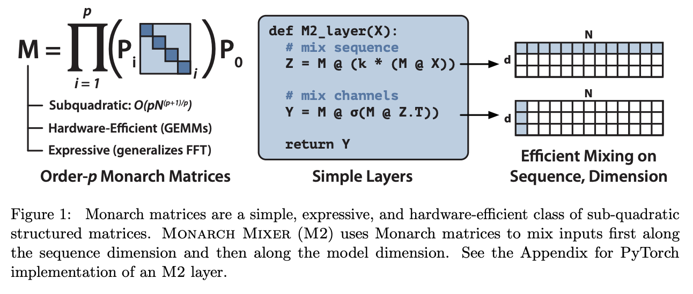

*As the holiday season comes around, remember you can* *[give the gift of Interconnects](https://www.interconnects.ai/subscribe?gift=true). While it\'s still early days on paid features, it'll guilt them into reading the highest signal AI essays out there.*

*No audio of the post due to reliance on figures. State-space LLMs is the last topic of Interconnects for the year, next week will be a year in review post.*

------------------------------------------------------------------------

I know everyone is ready for vacation, but there's one more topic that has absolutely blitzed the AI community in the last few weeks: Non-attention architectures for language modeling. In summary, consistent long-term progress from a corner of the ML community has materialized rapidly into a pair of models, **Mamba** and **StripedHyena**, that are comparable in many ways to household names like Llama 2 and Mistral 7B. Reaching this general ballpark, and so soon after the dramatic acceleratory effect that Llama and Mistral gave us this year, made it obvious to many people that **it is time to take non-attention architectures more seriously**.

This post will cover enough of the details you need to get an understanding of what happened in 2023 and get you ready for 2024 with different language model architectures to choose from. To be clear, this is a fairly mathematically advanced topic, but one that is rewarding to go deeper and make the numerous connections. To make it easier to navigate this mega-post and master the topic, you can click on the sections below:

-   [Introduction](https://www.interconnects.ai/i/139943907/attention-vs-recurrence-and-state-space-models-ssms): Why we may not want to use attention and what a recurrent neural network is.

-   [Mamba model](https://www.interconnects.ai/i/139943907/mamba-and-efficient-compute-for-rnns): The new state space model pushing features and **hardware acceleration** for future classes of language models.

-   [StripedHyena model](https://www.interconnects.ai/i/139943907/real-world-performance-stripedhyena-b): The new 7B model from Together AI that is all about **combining approaches from recent research on RNNs and Transformers to make a great model**.

-   [Monarch Mixers research](https://www.interconnects.ai/i/139943907/monarch-mixer-models-without-attention-or-multi-layer-perceptrons): A recent paper on the area that is a **good example of how this research operates** and can succeed **without attention or MLPs**.

-   [Zoology research](https://www.interconnects.ai/i/139943907/zoology-of-models-and-the-model-based): A **repository for research on efficient LLM architectures for associative recall**, and Based, a resulting model from these studies.

-   [Further links, reading, and resources](https://www.interconnects.ai/i/139943907/extra-credit-links-and-notes).

Finally, if everything above doesn't interest you, you should just check out the interview I did with Michael Poli and Tri Dao, two leading researchers in the area:

::: {.digest-post-embed attrs="{\"nodeId\":\"4cd469bf-ea97-4d1b-a953-d8b6bb8a2c63\",\"caption\":\"This interview is on YouTube and podcast players. Giving a voice to researchers is the best way to cut through the noise and understand what is happening with core developments of LLM technologies. I’m excited to get to talk with Michael Poli (Stanford PhD student + research at Together AI) and\",\"cta\":null,\"showBylines\":true,\"size\":\"sm\",\"isEditorNode\":true,\"title\":\"Interviewing Tri Dao and Michael Poli of Together AI on the future of LLM architectures\",\"publishedBylines\":[{\"id\":10472909,\"name\":\"Nathan Lambert\",\"bio\":\"ML scientist (RL, RLHF, society, robotics), athlete, yogi, chef. Writes about ML research.\\nPhD from Berkeley AI, Cornell Lightweight Rowing `17\",\"photo_url\":\"https://substackcdn.com/image/fetch/f_auto,q_auto:good,fl_progressive:steep/https%3A%2F%2Fbucketeer-e05bbc84-baa3-437e-9518-adb32be77984.s3.amazonaws.com%2Fpublic%2Fimages%2Fdda47b96-836a-4b95-99a0-f0ec744d4245_2316x2316.jpeg\",\"is_guest\":false,\"bestseller_tier\":100},{\"id\":135792998,\"name\":\"Tri Dao\",\"bio\":null,\"photo_url\":null,\"is_guest\":true,\"bestseller_tier\":null},{\"id\":25324447,\"name\":\"Michael Poli\",\"bio\":\"C.S. PhD student at Stanford, Staff Scientist at Together AI. Deep learning, numerics, and systems. I like to architect big neural nets that run fast.\",\"photo_url\":\"https://substack-post-media.s3.amazonaws.com/public/images/73bdb92f-41c5-41fb-a559-33094b7b3d84_792x1193.png\",\"is_guest\":true,\"bestseller_tier\":null,\"primaryPublicationSubscribeUrl\":\"https://michaelpoli.substack.com/subscribe?\",\"primaryPublicationUrl\":\"https://michaelpoli.substack.com\",\"primaryPublicationName\":\"Michael Poli\",\"primaryPublicationId\":2193088}],\"post_date\":\"2023-12-21T14:55:00.192Z\",\"cover_image\":\"https://substack-post-media.s3.amazonaws.com/public/images/44f22051-cc84-45de-b148-87cb689e7d22_1792x1024.png\",\"cover_image_alt\":null,\"canonical_url\":\"https://www.interconnects.ai/p/interviewing-tri-dao-and-michael\",\"section_name\":null,\"video_upload_id\":null,\"id\":139958384,\"type\":\"podcast\",\"reaction_count\":0,\"comment_count\":0,\"publication_name\":\"Interconnects\",\"publication_logo_url\":\"https://substackcdn.com/image/fetch/f_auto,q_auto:good,fl_progressive:steep/https%3A%2F%2Fsubstack-post-media.s3.amazonaws.com%2Fpublic%2Fimages%2Fe70f9dbf-4fe6-404c-b6bb-1831d1b7ed0b_590x590.png\",\"belowTheFold\":false}"}
:::

------------------------------------------------------------------------

## Attention vs. Recurrence and State Space Models (SSMs)

The core of this post is about understanding how different compute fixtures create different capabilities in models. Language is the topic of focus for this post, but the ideas translate across many modalities (in fact, some of the first successes of these new architectures came in audio). The different internals of the model imply inductive biases, new scaling laws for training, different inference time costs, new levels of expressibility (how complex of tasks the model can learn), and many, many things. The architecture changes everything about how a model is *expressed*, even if the data is the same.

As always, **there is no free lunch with architecture choices**. There are tons of reasons why attention, the core component behind the Transformer models popular today, skyrocketed in performance and accessibility. This article won't list all of them, but in short, attention makes for models with a natural inductive bias for language, models that are easily scalable on GPUs and TPUs for training, models that can process inputs in large batches efficiently (e.g. storing the [key-value matrices](https://huggingface.co/docs/text-generation-inference/conceptual/paged_attention)), and more.

Attention, at its core, has a mapping from every past token to the current token. This dense architecture is what gives the models the ability to represent a large variety of content and to attend to long-context samples.

The main contender discussed in this post, Recurrent Neural Networks (RNNs), have a different way of integrating time into the model. These models update an internal state variable, below as *x*, every time new input data is encountered. In principle, this internal state can capture the relevant long-term behavior of any system without needing direct computational links to the data. This could free up a lot of compute efficiency for long sequences, but until recently has not proven to equal attention-based models in performance. A comparison of the computation graph for attention and RNNs is shown below.

There are *a lot* of fancy terms thrown around when discussing these models. The driving idea, in my read, has been around creating an RNN-like time dependency while retaining the very efficient training of architectures like attention or convolutions. To do this, many recent works are formulated around state-space models (SSMs), following the continuous or discrete time evolution of a state as us electrical engineers were taught long ago: `x'(t) = Ax(t) + Bu(t), y(t) = Cx(t) + Du(t)` . With clever linear algebra or differential equations, depending on if it is continuous or discrete time, the matrix governing the evolution of the state can be shown to be a 1d convolution. Convolutions are efficient architectures, so this bodes well, but otherwise, I will mostly avoid the nitty gritty math in this post.

The equations are shown below, from the [Mamba paper](https://arxiv.org/abs/2312.00752). Unless you want to be an expert on this, the important things to know are that this is formulated in continuous time (1a and 1b), is often discretized (2a and 2b), and results in a kernel *K* (3a and 3b), which is technically a 1D convolution.

While I don't expect this to change everything in 2024, it is a sign of what is coming in the 2-4 year time frame. **We're going to have different LLM architectures based on the task that we're solving**. I even expect systems like ChatGPT to use multiple *types* of language models to perform normal tasks. As you will see in this post, the models built on this RNN structure (with many modifications for specific technical reasons) have clear scaling advantages in the potential accuracy and cost of inference for long-context tasks.

For people interested in the deep science of language modeling and machine learning, December has been a great month. Most reasonable people know attention is likely to be replaced someday but wonder how so and when. With the amount of investment going into attention-specific infrastructure, I didn't expect this to be soon for the GPT-N's and Gemini's of the world. To the extent that it succeeds and attention is deprecated, it is a huge issue for Google as the TPU is not guaranteed to work for all of this (much like MoE already isn't handled well by the TPU). Though, there are still way more **challenges facing SSMs and related technologies**, as there is yet to be a proof of concept for many, many things like:

-   The ability to get **high utilization on GPUs** is needed for effective scaling.

-   The ability to **fine-tune models easily** and maintain most performance.

-   The ability to perform **in-context learning** and other things like system prompts.

-   The fact that most of the parameters and computation in large Transformer models are still the **feed-forward networks** (FFNs), which SSMs either use or don't modify.

-   The bottleneck on the needed **capacity of the hidden state in RNNs**.

-   The ability to **integrate things like retrieval memory**, especially in long-documents. This is more about integrating complex information sources than the long-context scaling that exists.\
    (Edit: Yes I know the benchmark numbers here are very strong, so it's well on it's way, but there's more complex tasks to be confirmed here still. At least this is what some leading researchers like [Sasha R. mentioned](https://twitter.com/srush_nlp/status/1737150368453185764)).

This list can go on. While you read this article, remember that **the new non-attention technology is extremely promising**, but that doesn\'t mean it\'s ready for the big leagues because there are one or two striking results. It means we\'re in the early days.

*This list was partially inspired by Tweets from* *[Eric](https://twitter.com/ericmitchellai/status/1736800424764879042)* *and* *[Sasha](https://twitter.com/srush_nlp/status/1737150368453185764).*

# Recent model releases

### Mamba and efficient compute for RNNs

On December 4th, Albert Gu and Tri Dao announced [Mamba](https://arxiv.org/abs/2312.00752), a focused attempt to make non-attention LLMs perform on par with Transformers, while addressing the computational limitations in long-context scenarios. Mamba has three key features:

1.  (Data) Selection Mechanism: "We design a simple selection mechanism by parameterizing the SSM parameters based on the input."

2.  Hardware-aware Algorithm: A switch from a convolution to a scan over features to make the model operate more efficiently on existing hardware.

3.  Architecture: Combine the recurrence of previous SSMs with the feedforward block style of transformers.

All three of these are fairly math-intensive. Ultimately, they are **techniques designed to improve to expressiveness of SSMs in ways that do not induce computational inefficiencies**.

The first point, the data selection mechanism, enables the SSM to formulate the processing matrices of a recurrent space, B and C, as being functions of the input text *x* (also called removing the linear time invariance, LTI, of the matrices). This adds expressivity at the cost of generality as input sequences will take on very different behaviors depending on the domain. The matrices learn which tokens of the input will be most important, hence the name \"selection."

The hardware-aware component focuses on how to store the latent state *h* in the most efficient part of memory. The core parameters used in the SSM update, the linearized A, B, and B matrices, are kept in a sort of cache called the SRAM so that the cost of moving weights around doesn\'t induce a large computational bottleneck. The diagram showing which type of memory is held is below:

Finally, the Mamba paper includes a new model block that takes inspiration from SSMs and Transformer models. I don't know the exact takeaways of this, but it seems reasonable to me to keep both activation and MLP involved in state-of-the-art LLMs given their centrality to all ML to date.

This project is best thought of as an awesome piece of work building on lots of research work in SSMs (which is not what StripedHyena did!). GPUs really went brrr for this project with [custom Cuda kernels](https://github.com/state-spaces/mamba/tree/main/csrc/selective_scan).

The CUDA kernels with the specialization of the architecture give wild inference speedups, shown below:

Finally, the average evaluation performance vs the Pythia suite is below per model size. I will note that Pythia is not the state-of-the-art anymore for model efficiency per parameter, so this is a little flattering relative to models such as Mistral, which would be shifted up on the y-axis. Additionally, the model is not necessarily robust and flexible given the plot below, but it's at least worth knowing about.

As a sneak peek from the interview later, Tri Dao says that **architecture will only shift the scaling law curve upwards with a better fit, and data-driving LLMs is still the biggest factor driving the best models**. I see this as restricting the model architecture further to get better performance on the compute available and tasks of interest. Great stuff. More information on the methods is on [Twitter](https://twitter.com/_albertgu/status/1731727672286294400) and the [model announcement](https://twitter.com/_albertgu/status/1734613777407004823). Mamba models and code are available [here](https://github.com/state-spaces/mamba).

*Soon after posting, I found this [minimal implementation of the Mamba architecture on GitHub](https://github.com/johnma2006/mamba-minimal).*

### Real-world performance: StripedHyena-7B

While the past two projects were about pushing the architecture of LLMs, the model that maybe made the most noise about new LLM architectures, StripedHyena (SH), was explicitly about pushing the performance by combining many advancements and architectures (including Attention).

On December 8th, Together AI launched the first one, [StripedHyena-7B](https://www.together.ai/blog/stripedhyena-7b). StripedHyena (SH) surprised me. It's a new language model that is in the ballpark to models that I've been using regularly this year. If you read the blog post closely, you see that they used a technique called "grafting\" to build this model. Essentially, it seems like **Together took modules from multiple pretrained models, slotted them together, and kept training the model to get stable performance**. Quoting the blog post:

> We grafted architectural components of Transformers and Hyena, and trained on a mix of the RedPajama dataset, augmented with longer-context data.

The name Hyena comes from the following paper: *[Hyena Hierarchy: Towards Larger Convolutional Language Models](https://arxiv.org/abs/2302.10866).*

On the OpenLLM leaderboard tasks, SH straight up beats Llama 2 and Yi 7B!

Like many non-attention architectures, a big piece of the selling point for this model is long-context performance. The authors use the benchmark [ZeroScrolls](https://www.zero.scrolls-benchmark.com/) to show that SH gets a 3-point better average f1 score than Mistral 7b v0.1 on this task (though doesn\'t win on every subcategory). The margin of 27.5 for SH over Mistral doesn\'t seem huge, but models like GPT-4 are only at an average score of 41.7, so it\'s a solid score (numbers from the [paper PDF](https://arxiv.org/pdf/2305.14196.pdf))!

Performance aside, a large portion of this work was around different notions of computational efficiency in LLMs. The blog post details new Chinchilla-style scaling laws for models with different architectures. A comparison of Llama-2 to SH is below on the left with an optimal attention percentage based on budget on the right (the full scaling laws are in the blog, where you can see the trade-offs):

As with Mamba, the SH release contained extensive details on inference improvements. First, end-to-end completion speed:

And second, the total memory footprint shows a sub-quadratic scaling in memory usage versus context length.

Given that this model was more about real-world performance, I did some side-by-side comparisons to Mistral 7b. I still liked Mistral's answers more, but **SH is in the right ballpark**, and if it came out earlier this year, it may have been SOTA for a bit. That goes to show how these new architectures aren't too far behind.

There are limitations here, as usual for 2023: No data was shared on the base model other than "a mix of the RedPajama dataset, augmented with longer-context data." Get more information at the [blog post](https://www.together.ai/blog/stripedhyena-7b) (it\'s even more dense than this one), in the [Twitter summary](https://twitter.com/togethercompute/status/1733213267185762411), on [HuggingFace](https://huggingface.co/togethercomputer/StripedHyena-Hessian-7B), or visit the [demo](https://api.together.xyz/playground/chat/togethercomputer/StripedHyena-Nous-7B).

At the end of their blog post, they make it pretty clear what we should see next from Together in this direction:

> -   Larger models with longer context. 
>
> -   Multi-modal support. 
>
> -   Further performance optimizations. 
>
> -   Integration of StripedHyena into retrieval pipelines for full utilization of longer context.

------------------------------------------------------------------------

# Recent research

This section is for new papers that could have the same impact as Mamba and StipedHyena, but probably need a few more iteration cycles before getting there.

For transparency, **I almost cut this from the blog post because they're currently much less part of the main narrative the last few weeks**, but I left them in given that this post is more pedagogical than analytical. They were the material I needed to get much closer to mastery of these subjects quickly.

### Monarch Mixer: models without attention or multi-layer perceptrons

This paper is a recent one that is working to remove not only attention from the Transformer but also the MLPs that take up most of the parameters (discussed earlier in this post as FFNs). This is the type of research that'll be in Mamba-like models in 6-24 months!

*[Monarch Mixer: A Simple Sub-Quadratic GEMM-Based Architecture](https://arxiv.org/abs/2310.12109)* *(paper October 18th, 2023,* *[blog](https://hazyresearch.stanford.edu/blog/2023-07-25-m2-bert) post, Jul. 25).* GEMM is a generalized matrix multiply algorithm, which is the [fundamental operation](https://docs.nvidia.com/deeplearning/performance/dl-performance-matrix-multiplication/index.html) behind most popular architectures including FFNs, RNNs, LSTMs, and GRUs. GEMMs can be very efficient on GPUs, as you may expect given that matrix multiplications are the core of modern ML, but setting them up in new ways doesn\'t mean the models will always scale successfully!

Let\'s walk through the abstract and understand what it means (emphasis mine):

> Machine learning models are increasingly being scaled in both sequence length and model dimension to reach longer contexts and better performance. However, **existing architectures such as Transformers scale quadratically along both these axes**. We ask: are there performant architectures that can scale sub-quadratically along sequence length and model dimension?

While long-context lengths are all the rage these days, it is not an efficient way of doing inference. Model size, I think is less of a core factor here, or it should be phrased slightly better: searching for an architecture with a scaling law that follows a less exponential power law. Continuing:

> We introduce **Monarch Mixer (M2)**, a new architecture that uses the same sub-quadratic primitive along both sequence length and model dimension: Monarch matrices, a simple class of expressive structured matrices that captures many linear transforms, achieves high hardware efficiency on GPUs, and scales sub-quadratically.

The figure of the Monarch matrix is shown below, which effectively mixes inputs first by the sequence length and then the model dimension, rather than both at once:

> As a proof of concept, we explore the performance of M2 in three domains: non-causal BERT-style language modeling, ViT-style image classification, and causal GPT-style language modeling.

In this post, we focus on GPT-style language modeling, because it's all the rage, but non-attention architectures are likely to benefit many fields (such as [Diffusion Models](https://arxiv.org/abs/2311.18257)). For people who came into ML recently, [Bidirectional Encoder Representations from Transformer](https://arxiv.org/abs/1810.04805) (BERT) is worth knowing about \-- it was one of the first Transformer models to generate tons of fine-tunes and benefits. Continuing with BERT-style and ViT (vision transformer) performance:

> For non-causal BERT-style modeling, M2 matches BERT-base and BERT-large in downstream GLUE quality with up to 27% fewer parameters, and achieves up to 9.1× higher throughput at sequence length 4K. On ImageNet, M2 outperforms ViT-b by 1% in accuracy, with only half the parameters.

Back to what we are here for, the GPT-style models:

> Causal GPT-style models introduce a technical challenge: **enforcing causality via masking introduces a quadratic bottleneck**. To alleviate this bottleneck, we develop a novel theoretical view of Monarch matrices based on multivariate polynomial evaluation and interpolation, which lets us parameterize M2 to be causal while remaining sub-quadratic. Using this parameterization, M2 matches GPT-style Transformers at 360M parameters in pretraining perplexity on The PILE\--showing for the first time that it may be possible to match Transformer quality without attention or MLPs.

There's a lot in this paragraph. Essentially, when doing inference with a transformer you need to mask up the attention matrix to be upper triangular so that each generated token looks at only the past tokens. This is in the decoder part of the model, and if you look at an encoder like BERT, you'll see a fully activated attention matrix. The math in the M2 paper alleviates this quadratic bottleneck (attending to M context tokens directly for up to N tokens generated, roughly). This is a big deal, but I don't really fully understand the math that well. Listen to the interview to hear from people who do!

The model in the paper has 360M parameters, so it's in the range of many GPT2 models and still has a long way to go.

------------------------------------------------------------------------

### Zoology of models and the model: Based

In this frenzy of releases also came [Zoology](https://github.com/HazyResearch/zoology): a library to understand and test language model architectures on synthetic tasks. Christopher Re\'s group, Hazy Research, shared two blog posts on the matter relevant to this post. The [first post](https://hazyresearch.stanford.edu/blog/2023-12-11-zoology1-analysis) studied how different architectures managed the problem of *associate recall* in language modeling, which is the ability of the model to retrieve and combine signals from different data sources or concepts. In short, this is one of the things that Attention-based models do well. As a striking example,

> we found that a 70M parameter attention model outperforms a 1.4 billion parameter gated-convolution model. Although this might sound like some esoteric task, AR has a [long](https://arxiv.org/abs/1410.5401) [history](https://arxiv.org/abs/1610.06258) [in](https://papers.nips.cc/paper_files/paper/2019/hash/952285b9b7e7a1be5aa7849f32ffff05-Abstract.html) [machine](https://transformer-circuits.pub/2022/in-context-learning-and-induction-heads/index.html) [learning](https://arxiv.org/abs/2212.14052) and prior work shows that the ability to solve these AR tasks is [highly correlated with enticing capabilities like in-context learning](https://transformer-circuits.pub/2022/in-context-learning-and-induction-heads/index.html#definition-of-induction-heads).

The [second post](https://hazyresearch.stanford.edu/blog/2023-12-11-zoology2-based) is the one that got the most attention because they released a new model architecture based on their findings, Based! From the blog post:

> We demonstrate these properties along three axes, finding that `Based` provides:
>
> 1.  **Simple and intuitive understandings**: we motivate `Based` with the view that simple convolutions and attentions are good at modeling different kinds of sequences. Instead of introducing new complexities to overcome their individual weaknesses, we can combine familiar versions of each (short 1D convolutions! "spiky" linear attentions!) in intuitive ways to get a best-of-both-worlds situation.
>
> 2.  **High quality modeling:** despite its simplicity, in our evaluations we find `Based` outperforms full Llama-2 style Transformers (rotary embeddings, SwiGLU MLPs, etc.) and modern state-space models (Mamba, Hyena) in language modeling perplexity at multiple scales.
>
> 3.  **Efficient high-throughput inference**: when implemented in pure PyTorch, `Based` achieves **4.5x higher inference throughput** than competitive Transformers, e.g., a parameter-matched **[Mistral](https://mistral.ai/news/announcing-mistral-7b/)** with its sliding window attention and **[FlashAttention 2](https://arxiv.org/abs/2307.08691)**. High throughput is critical for enabling **[batch processing tasks](https://hazyresearch.stanford.edu/blog/2023-04-12-batch)** with LLMs.

Again, I shared these mostly to highlight how different architectures are going to have different strengths and weaknesses. If you\'re interested in going deeper on associative recall, you should check out the [Zoology](https://github.com/HazyResearch/zoology) code. Otherwise, read more on [Twitter](https://twitter.com/EyubogluSabri/status/1735022400457036271).

------------------------------------------------------------------------

### Extra credit links & notes

If you think you're an expert, make sure you can solve this [word game from Sasha Rush](https://twitter.com/srush_nlp/status/1734612632181657659):

> Attention and RNNs are distinct, but Linear Attention is a Linear RNN, but not vice versa. Luckily both are also Convolutions\.... but not with data dependent parameters.
>
> Ladies and gentlemen, deep learning.

After writing this, and interviewing Tri and Michael I'm starting to get it. If you want to understand the puzzle, I recommend watching this [talk](https://www.youtube.com/watch?v=dKJEpOtVgXc) from Sasha on the question of "Do we need Attention?" The slides are [here](https://github.com/srush/do-we-need-attention/blob/main/DoWeNeedAttention.pdf). It does a great job of conveying how these methods are "**an RNN revival**" and explaining the problem formulation thoroughly. You'll learn things like the weight carried by the hidden dimensions in RNNs, the difference between vanilla RNNs/attention and their nonlinear relatives (remove the softmax for efficiency), the Elmo model, the underlying linear algebra, the benefits of Fourier space, and other topics.

If you haven't, check out my interview on these topics with two scientists at [Together AI](https://www.interconnects.ai/p/interviewing-tri-dao-and-michael)! It was where most of this finally clicked for me. Otherwise, here are more places to learn more:

-   An important model in this line of work was the Receptance Weighted Key Value (RWKV) architecture, from the paper [RWKV: Reinventing RNNs for the Transformer Era](https://arxiv.org/abs/2305.13048). This paper includes models up to 14 billion parameters, which is wild and awesome. There was more discussion on "How does RWKV compare?" From an [author](https://twitter.com/AlbalakAlon/status/1736469277643837455) and from [Eluether](https://twitter.com/AiEleuther/status/1736260370426114466). Essentially, RWKV is a quotient of 2 linear RNNs, derived from something close to Attention (receptance rather than query vector). They also have a custom Cuda kernel and were the first non-attention models to scale further and beat some popular models like OPT and Pythia.

-   The [Gated Linear Attention](https://arxiv.org/abs/2312.06635) (GLA-Transformer): An architecture with "linear-time inference complexity, sub-quadratic parallel training, the same performance as both Transformers and Mamba, and all the other benefits you will expect from an RNN model!" More info can be found on [Twitter](https://twitter.com/Yikang_Shen/status/1734441200759820518?t=-JU68mLY4AYf0fbWECSA4g&s=19). Another one of the authors [stated](https://twitter.com/bailin_28/status/1734598358805762330) that "It seems that data-dependent gating is the core ingredient for effective linear-complexity alternatives to softmax attention, as shown in both our GLA and Mamba."

-   The key points of all these successful architectures may be fast weight gates and cell skip connections (from LSTM author [Rupesh](https://twitter.com/rupspace/status/1732031440282591711)).

-   [The Attention Bet](https://www.isattentionallyouneed.com/), why most researchers care about this 😉.

-   Some more papers I read writing this: [Structured State Space sequence models](https://arxiv.org/abs/2111.00396) (S4) ad [Hungry Hungry Hippos](https://www.together.ai/blog/hungry-hungry-hippos-towards-language-modeling-with-state-space-models) (H3). Great paper names. Similarly, [The Annotated S4](https://srush.github.io/annotated-s4/) blog from Sasha Rush is great.

------------------------------------------------------------------------

### Newsletter stuff

**Elsewhere from me**

-   On [episode 12 of the Retort](https://retortai.com/episodes/everyone-wants-fair-benchmarks-but-do-you-even-lift), Tom and I got a little spicy on the current state of affairs in ML. This was a good one.

-   I recorded a history talk for my paper *The History and Risks of Reinforcement Learning and Human Feedback;* [slides](https://docs.google.com/presentation/d/1kBEKvHBugXE5tSnwp2_kQ1VdV5bOP_LveY6gkTe_Vco/edit?usp=sharing)\*\* and [recording](https://www.youtube.com/watch?v=Mu_-FWIuhDA). I'll always try and re-record private talks for openness!

**Links**

-   Who is [next to get banned by OpenAI for training on the model outputs](https://www.theverge.com/2023/12/15/24003542/openai-suspends-bytedances-account-after-it-used-gpt-to-train-its-own-ai-model)? A[n open LLM darling](https://twitter.com/rohanpaul_ai/status/1736827830971867312)? We\'ll see.

-   More [discussion on the question](https://twitter.com/rosstaylor90/status/1736663405333811318) as to if leaderboards are good for open source. I think they\'re a net good for a business ecosystem, and net bad for understanding and making the best models.

**Models**

-   OpenChat released a very, very strong coding model, [OpenChat-3.5-1210](https://huggingface.co/openchat/openchat-3.5-1210) with a bump on the coding task HumanEval from 55.5 to 68.9. This is wild to me for such a small model, whether or not HumanEval is a particularly good tool. There\'s more discussion on [Twitter](https://twitter.com/openchatdev/status/1736840031266918616).

-   The [10.7B parameter model SOLAR](https://huggingface.co/upstage/SOLAR-10.7B-Instruct-v1.0) is making some waves. The Instruction variant is outperforming Mixtal 12B instruct. More comparisons on [Twitter](https://twitter.com/burkov/status/1736224977337069941).

-   Models creation processes are getting WEIRD. This model, [LeoScorpius](https://huggingface.co/viethq188/LeoScorpius-7B-Chat-DPO), is quite the character. [Quoting Alexander Doria](https://twitter.com/Dorialexander/status/1735361503681737007): "A very good summary of the increased complexity of open LLMs on the Nous discord: one of the top model on HuggingFace is a combination of 7 models/dataset (through finetuning, DPO, model merge). How regulation should apply to this level of cross-dependencies is... not easy.\"

**Housekeeping**

-   **New paid feature, Discord**: an invite to the subscriber-only Discord server is in email footers.

-   **New feature, Audio:** all posts can be listened to on [podcast players](https://podcast.interconnects.ai/) or on [Youtube](https://youtube.com/@interconnects) (may transition to paid feature in the future).

-   **Interconnects referrals:** You'll accumulate a free paid sub if you use a referral link from the [Interconnects Leaderboard](https://www.interconnects.ai/leaderboard).

-   **Student discounts:** Want a large paid student discount, go to the [About page](https://www.interconnects.ai/about).
