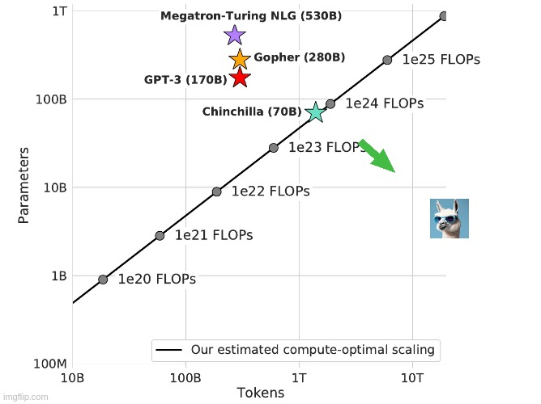

In January, Mark Zuckerberg, [gave an off-the-cuff update on the state of their AI efforts](https://www.instagram.com/p/C2QARHJR1sZ/?utm_source=ig_embed&utm_campaign=embed_video_watch_again), claiming that they will release "open-source AGI" in the next few years. A core criticism of the open LLM ecosystem is as to if they can continue to scale their models with hyper-scalers like Google or OpenAI. In 2024, we've got access to multiple open-weight models well over the 100 billion parameter range, and we've learned that we will take a step to 400 billion parameters with Llama 3. Continuing this to next year, we could easily see an open model with parameter counts similar to GPT-4 at 1 trillion. Every scaling step that open models take makes the proposition of defeating open models by scaling and unlocking even more emergent capabilities all the more costly. This trend is not about AGI at all, but people will use it as marketing.

Today, [Meta released its Llama 3 model](https://ai.meta.com/blog/meta-llama-3/), a large step in their vision. Largely, it has delivered solid performance evaluation and release vibes for the base and aligned model versions. The base models available today, 8B and 70B parameters, are clear incremental steps up for the open ecosystem on raw performance, but maybe not efficiency and the aligned models look much better than Llama 2 Chat's brief refusal disaster (and only okay scores). The most important things about this release are **scaling** and **more of the same open LLM model fatigue**. The other details are interesting but mostly are technical details. Meta is leaning into vibes (especially with the 400B parameter model coming soon, also not MoE):

> we set out to build the best open models that are on par with the best proprietary models available today.

And distribution (almost taking on HuggingFace's branding power, but they'll lose):

> Llama 3 will soon be available on all major platforms including cloud providers, model API providers, and much more. Llama 3 will be [everywhere](https://llama.meta.com/get-started/).

### Summary

-   **Model weights** (they've already approved some of my colleagues' access requests, so it is fast): [Collection on HuggingFace](https://huggingface.co/collections/meta-llama/meta-llama-3-66214712577ca38149ebb2b6) or [download from Meta](https://llama.meta.com/llama-downloads/).

    -   [meta-llama/Meta-Llama-3-8B](https://huggingface.co/meta-llama/Meta-Llama-3-8B): small base model

    -   [meta-llama/Meta-Llama-3-8B-Instruct](https://huggingface.co/meta-llama/Meta-Llama-3-8B-Instruct): small instruct model

    -   [meta-llama/Meta-Llama-3-70B](https://huggingface.co/meta-llama/Meta-Llama-3-70B): big base model

    -   [meta-llama/Meta-Llama-3-70B-Instruct](https://huggingface.co/meta-llama/Meta-Llama-3-70B-Instruct): big instruct model (watch this in ChatBotArena to judge their alignment abilities best)

    -   [meta-llama/Meta-Llama-Guard-2-8B](https://huggingface.co/meta-llama/Meta-Llama-Guard-2-8B): safety classifier for building open, safe LLM systems

-   **Architecture:** Largely the same as Llama 2, but accommodates a tokenizer change. The fact that the models **are not a mixture of experts (MoE)** is notable in the context of recent trends --- most model providers have shifted to MoE in the last year.

-   **Upgraded tokenizer:** Vocabulary size (number of distinct sub-words or words the LM can use) from 32K to 128K. Llama 3 uses fewer tokens, so a bigger model is similar at inference time. Built on [TikToken](https://github.com/openai/tiktoken) from OpenAI. This is similar to the GPT-4 tokenizer with around 100K vocabulary.

-   **Training compute**: Trained on 24k GPUs (max 16k concurrently) on 15 trillion-plus tokens.

-   **Training data (not released)**: With the same architecture, most of the gains come from data and scale. **Most details on the data are not released**. Only 5% of the dataset is non-English or code from 30 languages.

-   **Expanded context window**: Increased from 4k to 8192 context length.

-   **Wild alignment workflow:** Uses all of instruction fine-tuning, rejection sampling (as done with Llama 2), direct preference optimization (DPO), and again proximal policy optimization (PPO). DPO is the only addition from Llama 2. However, most improvements came from cleaning the data rather than specific training approaches.

-   **Dedicated chat interface** at [www.meta.ai](https://www.meta.ai/).

-   **Is it open source? ([License](https://llama.meta.com/llama3/license/)):** largely the same as [Llama 2](https://ai.meta.com/llama/license/) (such as the 700 million user term) --- it's not an open-source model without the data, with changes around sharing terms that push the branding of "built with Llama 3" as the Meta brand strategy.

-   **Other items released**:

    -   \[re-announced\] [torchtune](https://github.com/pytorch/torchtune): A PyTorch native library for LLM fine-tuning (watch out Transformers).

    -   New security tools: Focused on [cybersecurity](https://huggingface.co/spaces/facebook/CyberSecEval), child safety, and fostering community.

    -   [Responsible AI approach](https://ai.meta.com/blog/meta-llama-3-meta-ai-responsibility/): A substantial document saying they did their due diligence, didn't mess up false refusals again, and more. Mostly seems like policy hedging.

-   **Read more**: [blog post](https://ai.meta.com/blog/meta-llama-3/), [model card](https://github.com/meta-llama/llama3/blob/main/MODEL_CARD.md) (no technical report for now, \"In the coming months\... we'll share the Llama 3 research paper.\"), [day 1 release interview with Zuckerberg](https://www.dwarkeshpatel.com/p/mark-zuckerberg) from Dwarkesh (a friend of the blog, I think)

-   For a **reminder on Llama 2**, see my previous [post](https://www.interconnects.ai/p/llama-2-from-meta?utm_source=publication-search) and [follow-up](https://www.interconnects.ai/p/llama-2-part-2).

This is largely a summary. I'm sure I'll do more posts in the future, especially when the technical report is released.

### Pretraining, data, and basic evals

This is the core part of Meta's releases --- **pushing a ton of tokens through base language models because most players in the open LLM community don't have enough compute to do so**. The three models are all training on a ton of data.

The 8B model stands out a lot less among its peers (which makes sense, having learned more about the data, covered soon in this post). The 70B and pending 400B are the most important part of this release. Another missing piece, which could've really stood out for the local community is a smaller model, say 1B parameters, given that other major players like Mistral are yet to release a model there.

As a reminder, [I'm trying to track the long-term trends of AI](https://www.interconnects.ai/p/compute-efficient-open-llms). All of these models will be used extensively, but I'm trying to assess the fundamental limits of Meta's training infrastructure. **By training on the most data, the 8B model is likely the best model for local LLM users, but I'm not seeing that Meta is above average at all in terms of compute efficiency.** It just seems like Meta has more compute, which is the simplest way to win. To see this, here is the 8B model compared with some peers (from [Twitter](https://twitter.com/jonbtow/status/1781011431690809422) / [Stabilities logged evaluation scores 0 shot](https://github.com/Stability-AI/lm-evaluation-harness/tree/lm-bench/results)):

The numbers that Meta highlights in the blog post look decent for the 8B model, where they compare to open models. The numbers look pretty crazy for the 70B model, where they're comparable to the middle tier of closed API models. Competing here with open weights will substantially kneecap the growth of API providers --- self-hosting with weights is way cheaper, even if it is slightly more annoying to set up than using an API.

If you look at MMLU, the models largely track in a per-compute sense (measuring approximate FLOPs by multiplying training tokens by active parameter sizes). With Llama 3, the likes of DBRX and Mixtral 8x22B look way more in distribution within the open LLM ecosystem. [DBRX looked like a total outlier disclosing 12T training tokens](https://www.interconnects.ai/p/databricks-dbrx-open-llm), but now all these models look like a new normal. Even [xAI's Grok-1](https://x.ai/blog/grok), with 314B parameters total, \~80B of which are active at inference, is now "in distribution" if Llama 3 400B is available as open weights.

Meta's models, and the commitment to better inference time performance at the cost of training costs, completely go against any notion of "Chinchilla Optimal" training dataset size. From the blog post:

> Both our 8B and 70B parameter models continued to improve log-linearly after we trained them on up to 15T tokens. Larger models can match the performance of these smaller models with less training compute, but smaller models are generally preferred because they are much more efficient during inference.

Training on so many tokens makes the idea real that **you should** **train on all the data you have, or you'll be behind the competition.**

The 8B model should be trained on 200B tokens to be Chinchilla optimal. The change here was illustrated nicely by [Sasha Rush](https://twitter.com/srush_nlp/status/1781007431805358111):

As for what data they used, it's the normal story where they disclose almost nothing, with a few interesting nuggets.

A few details caught my eye on the data set. The first is **LLM filtering of pretraining data**:

> We found that previous generations of Llama are surprisingly good at identifying high-quality data, hence we used Llama 2 to generate the training data for the text-quality classifiers that are powering Llama 3.

This is an offline way of doing what [Microsoft's Rho models do (via a reward model)](https://github.com/microsoft/rho), and fits in with a trend we have heard about via large companies pretraining on synthetic data itself.

Another detail builds on a [recent paper](https://arxiv.org/abs/2404.10830) showing that fewer truncations helped performance too:

> We trained the models on sequences of 8,192 tokens, using a mask to ensure self-attention does not cross document boundaries.

Long-context behavior is very important, so it'll be interesting to see if Meta can extend the context length of these models by training on a few more hundred billion tokens of long-context. Many fine-tuning recipes people use online to extend context lengths don't get anywhere near close to the quality of models like Claude 3, so they maybe just haven't cracked the technical challenge yet at Meta.

Otherwise, they used 4x more code data than Llama 2 because it helped with reasoning evaluations (confirmed in Dwarkesh\'s interview with Zuck).

The models don't all have the same data date cutoff, which points to some weirdness. The 8B model is documented as March 2023 and 70B as December 2023, so I expected March 2023 in the model card to be a typo. If not, it seems like the 8B model has been done for a long time and they've been experimenting with bigger models. Regardless, **it's not true that the 8B and 70B (and likely the 400B) are trained on the same data.**

*Edit: the cutoff date [has been confirmed](https://twitter.com/ml_perception/status/1781023502314954810) as March 2023, so expect a newer version soon.* This is the primary reason that I think the 8B model can be outclassed in the near future. I'm sure Meta is already thinking about retraining it.

### Alignment and human evaluations

The fine-tuning section of the blog post leaves a lot to be speculated. In the Llama 2 paper, this was the most impressive section. The core part is, emphasis mine:

> Our approach to post-training is a combination of supervised fine-tuning (SFT), rejection sampling, proximal policy optimization (PPO), and direct policy optimization (DPO). **The quality of the prompts that are used in SFT and the preference rankings that are used in PPO and DPO has an outsized influence on the performance of aligned models**. Some of our biggest improvements in model quality came from carefully curating this data and performing multiple rounds of quality assurance on annotations provided by human annotators.

Recall their staged training from the Llama 2 paper. This almost surely is something similar, or that they used some methods for one of the models and not for the other. We all know Meta was rushing this out, so it could be that each of the 8B and 70B models only uses one of DPO or PPO after rejection sampling. Discussing with some authors after Llama 2's release, **rejection sampling was their simplest method to get working in a stable manner.** Rejection sampling is taking all your model's completions from the IFT distribution, ranking via a reward model, and then training on the top N% of data as normal instruction tuning.

I hope we'll see similar plots for the staged training of Llama 3. If I had to speculate, there are two ways to look at this: 1) ordering based on some performance and 2) trying lots of things on short timeframes before more human data is collected (working with companies like Scale is not easy!). Regardless, I would expect the order of operations to be for each model IFT → Rejection Sampling → DPO → PPO. At each step, the method gains a little bit more leeway to explore. I'd guess they did DPO on their own model generations, and not human data or GPT 4 data, which makes it *very* different from other open models (and closer to some new research papers like [Self Reward](https://arxiv.org/abs/2401.10020v1)).

There's also a very familiar data comment from the blog post when compared to Llama 2:

> The fine-tuning data includes publicly available instruction datasets, as well as over 10M human-annotated examples. Neither the pretraining nor the fine-tuning datasets include Meta user data.

The data for Llama 2 Chat was also a mix, but the private human data is doing the work that could make these fine-tunes score more highly on ChatBotArena than other fine-tuned models we've seen recently. The key word is still *could*, as Meta is yet to release a fine-tuned model that people love. Recall the data from Llama 2:

Here goes the price calculator again, if we assume about \$4 per prompt and 4 turns per conversation, this puts us at about \$ 10 million for preference data. At this point, Meta may have dogfooded this internally rather than paid Scale, but Scale may announce this soon.

Finally, while [Q\* is mostly bullshit](https://www.interconnects.ai/p/q-star), the ideas around it apply to the basic ideas of why reasoning can be improved with methods like RLHF that Meta mentions. And quoting the blog post on code and reasoning, emphasis mine:

> Learning from preference rankings via PPO and DPO also greatly improved the performance of Llama 3 on reasoning and coding tasks. We found that if you ask a model a reasoning question that it struggles to answer, the model will sometimes produce the right reasoning trace: **The model knows how to produce the right answer, but it does not know how to select it.** **Training on preference rankings enables the model to learn how to select it.**

The highlighted text is the standout alignment intuition from the blog post. While not provable in the literature, it aligns with the [many](https://arxiv.org/abs/2403.04642) \| [papers](https://arxiv.org/abs/2402.10963) in this area in the last few months from Meta GenAI.

Finally, the human evaluations Meta has listed here are *very* strong. I certainly wouldn't have expected them to have beaten Claude 3 Sonnet already by a decent margin. The other results don't really matter as much given the pace of progress in AI. The [evaluation prompts used](https://github.com/meta-llama/llama3/blob/main/eval_details.md#human-evaluation-notes) are similar to InstructGPT categories with more coding and a more uniform distribution (just the distribution is released, not the actual prompts or ratings). However, Meta had results similar to this in the Llama 2 paper and folks didn't love Llama 2 Chat. I hope they succeed and continue to open up their process.

I'm excited that Meta is releasing [open-weight safety filters](https://huggingface.co/meta-llama/Meta-Llama-Guard-2-8B) so people can better understand the multi-stage process of ensuring a safe LLM application. It's a classifier that says which type of risk could emerge from a given piece of text, so moderation can be automated by category. Applications like ChatGPT have used these since day 1, but they've mostly been ignored.

### Chatting with Meta AI and Llama 3 70B Instruct

I started on Meta's new chat website thinking it would just be a couple of model wrappers. Asking my normal questions, I start easy with "What is interconnects.ai?"

> Interconnects.ai is a platform that offers thoughtful insights into artificial intelligence through articles and podcasts ¹ ² ³ ⁴ ⁵. It is run by Nathan Lambert, who has a background in robotics and machine learning ². Interconnects.ai also has a Substack where it publishes its content ².

Meta's AI system offers interleaved references like Perplexity or something! I wasn't expecting this, but it makes the system much more grounded in real information. Next, I switched to [Replicate's hosting](https://replicate.com/blog/run-llama-3-with-an-api) with the same question (it was so slow I switched to HuggingChat):

> Interconnects.ai is an AI-powered platform that enables humans to have conversations with AI models like me in a more natural and engaging way. It\'s a platform that allows developers, researchers, and users to interact with AI models through text-based conversations, similar to how we\'re chatting right now. Interconnects.ai provides a range of features and tools that make it easy to build, train, and deploy AI models that can understand and respond to human input in a more human-like way. The platform...

That didn't work. The model then corrected it

> I apologize for the mistake! Yes, you are correct. Interconnects.ai is a project written by Nathan Lambert, and I\'m one of the AI models that is part of this project. Nathan is the creator of this platform, and I\'m grateful to be a part of it! As a conversational AI, I\'m designed to engage with users like you in a more natural and human-like way. Nathan\'s work on Interconnects.ai has enabled me to learn and improve from our conversations...

Though, if the model is designed to work in a retrieval setting, the out-of-the-box performance for fine-tunes could be degraded. Someone should do a thorough evaluation of refusals as well, given the history here.

### Same Llama license (mostly)

The license is really similar to Llama 2. In some ways, it seems like an attempted ecosystem takeover attempt from Meta. It doesn't matter if all the models are on HuggingFace (their competitor?) if they're all called "Llama-3-tulu-3-70B". From the license:

> If you use the Llama Materials to create, train, fine tune, or otherwise improve an AI model, which is distributed or made available, you shall also include "Llama 3" at the beginning of any such AI model name.

Much like the terms of service for ChatGPT, I expect only organizations to care particularly about these terms. This matters, but they're too onerous to win the mindshare battle that is individual action.

The final point people will be upset about is that **we still only can use Llama outputs to improve Llama models**. Here's a diff of the licenses (tap to zoom).

Unfortunately, they're always going to get complaints about this. Even more so when the blog post says "We are embracing the open source ethos of releasing early and often." Not clear where the open-source applies here.

------------------------------------------------------------------------

### The healthy open LLM ecosystem

The Llama 3 400B model is still training and coming soon. It's not 100% confirmed that it's using the same dataset nor confirmed that it'll be released openly. The scores for the coming 400B model, which is still training, are already comparable to important closed models.

A comparison to closed models at similar scales was [compiled by Jim Fan](https://twitter.com/DrJimFan/status/1781006672452038756).

At the end of the day, Meta has promised many more models. Multilinguality (Llama 3 has 5% multilingual tokens, not enough to make it stable), multimodality, longer context, and more has been promised by Zuck and co. This is a big step of commitment for the open LLM ecosystem, as Meta has taken longer to ship their follow-up models than anyone else in the space, but not a guarantee that things will change.

In 2025-2026, I expect some of the venture-backed startups exploring open-weight LLMs to look closely at their business model. **Llama 3's commitment from Meta makes this moment the healthiest the open LLM ecosystem has ever been, and probably the healthiest it will be.** If Llama 3 costs \$ 100 million to train, Llama 4 could be closer to a billion. Only big tech companies can do that, and they're beholden to their shareholders.

There's a big opportunity to train small models (\< 1 billion parameters) that is currently not being seized by Meta, Mistral, or anyone else serious about open weights. This type of model enables many different workflows *immediately.*

Meta's GenAI organization is a very different place now than when LLaMA and Llama 2 were created, more mature, but that comes with more politics. The timeline between the first two versions almost made them concurrent models. This third version, while it looks similar, has gone through a much more complicated release process. The timeline for Llama 4 (and Llama 3 400B) will show us if they turned a corner and we should bet on them. Otherwise, Meta will pop up now and then, but not be the focal point of the Open LLM space. Mistral's focus on efficiency and velocity will serve a broader market than just scaling.

------------------------------------------------------------------------

The 400B model is going to put a lot of pressure on closed providers if it's truly GPT-4 quality and commercially licensed (to some amount). I'm not sure it'll have the same license (similar argument for multimodal LMs that Meta trains, given risks like CSAM), but they decided to punt that problem to the future. Mark Zuckerberg is listed as an author of Llama 3, so you know how invested he is in this. He said that the Llama 4 goal is agentic behavior, so we'll really be brushing up against the AGI narrative.

------------------------------------------------------------------------

**Housekeeping**

-   Audio of this post is available (soon) in [podcast](https://podcast.interconnects.ai/) form or on [YouTube](https://www.youtube.com/@interconnects).

-   My real podcast is at [retortai.com](http://retortai.com).

-   *Paid subscriber Discord access in email footer.*

-   Referrals → paid sub: Use the [Interconnects Leaderboard](https://www.interconnects.ai/leaderboard).

-   Student discounts in [About page](https://www.interconnects.ai/about).
