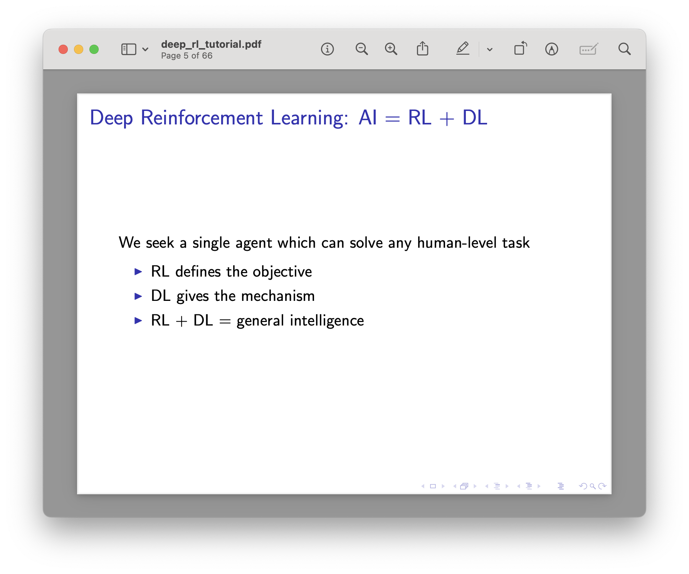
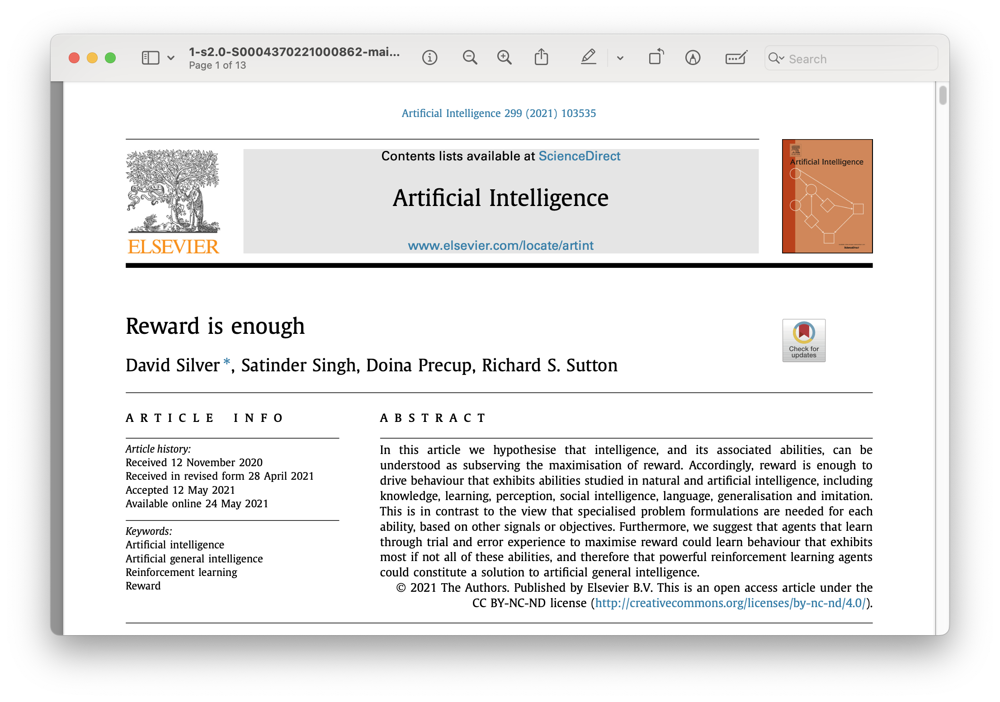

Artificial general intelligence (AGI) doesn't need to involve the idea of agency. The term's three words only indicate a general level of capability, but given its lack of grounding in any regulatory agency or academic community, no one can control what others think it means. The biggest problem with the AGI debate is different folks have different end goals and value systems around the symbol. These end goals have added new constraints on the Overton window of acceptable AGI definitions towards more advanced capabilities.

Let's quickly recap some definitions of AGI --- from early academic definitions to OpenAI's corporate one. The origins of the term AGI are benign and recent. It replaced a previous idea, Strong AI, to encompass something more vague, as strong AI could be achieved in many ways. From [Wikipedia](https://en.wikipedia.org/wiki/Artificial_general_intelligence):

> The term \"artificial general intelligence\" was used as early as 1997, by Mark Gubrud in a discussion of the implications of fully automated military production and operations. A mathematical formalism of AGI was proposed by [Marcus Hutter](https://en.wikipedia.org/wiki/Marcus_Hutter) in 2000. Named [AIXI](https://en.wikipedia.org/wiki/AIXI), the proposed AGI agent maximises "the ability to satisfy goals in a wide range of environments". This type of AGI, characterized by the ability to maximise a mathematical definition of intelligence rather than exhibit human-like behaviour, was also called universal artificial intelligence.

The framework [AIXI is described on Lesswrong](https://www.lesswrong.com/tag/aixi) (the popular AI Alignment discussion board) as "not computable, and so does not serve as a design for a real-world AI." A more modern definition of AGI could be what OpenAI defines AGI as:

> highly autonomous systems that outperform humans at most economically valuable work.

This sort of definition is surely what is convenient for them and not the only acceptable definition of AGI. I'm actually okay with calling a system like ChatGPT-4 AGI, but that loops me in with the hype machine that was the [Sparks of AGI paper from Microsoft](https://arxiv.org/abs/2303.12712):

> Given the breadth and depth of GPT-4's capabilities, we believe that it could reasonably be viewed as an early (yet still incomplete) version of an artificial general intelligence (AGI) system.

The claim above is actually quite reasonable if accompanied with a sufficiently mellow definition of AGI as an AI system that can match human capabilities on a broad suite of tasks. Regardless of what the formal definition is, it's clear that GPT-4 fits many colloquial definitions of AGI. My definition has always been quite literal: an AI system that is generally useful.

The media backlash following the *Sparks of AGI* paper largely stems from the methods in the paper and definitions of AGI relative to OpenAI. Given OpenAI's dominance of the mindshare for what AI is, and the specific importance of AGI to their company charter and their relationship with Microsoft, the AI community largely struck out against the authors as over-claiming. The paper itself read more as a list of examples and a user manual for GPT-4-Vision, built on non-public APIs, rather than an argument for what is or is not AGI. **If the** ***Sparks of AGI*** **paper had made this case for what AGI is rather than doing marketing for OpenAI, none of the blowback would have occurred**.

Recall that once OpenAI achieves AGI, Microsoft's market position will weaken substantially. From [VentureBeat](https://venturebeat.com/ai/openais-six-member-board-will-decide-when-weve-attained-agi/#:~:text=According%20to%20OpenAI%2C%20the%20six,to%20pursue%20the%20Nonprofit's%20mission%2C%E2%80%9D):

> once the \[OpenAI\] board decides AGI, or artificial general intelligence, has been reached, such a system will be "excluded from IP licenses and other commercial terms with Microsoft, which only apply to pre-AGI technology."

This makes that entire debacle look even more silly. Microsoft's researchers were making an extremely aggrandizing case of what is AGI that weakened their own marketplace. Satya, the CEO of Microsoft, was probably not thrilled.

My confusion as someone trained in reinforcement learning is over how this subfield of AI manages to still capture the cultural zeitgeist even when its technical solutions are largely out of style. The RL from human feedback (RLHF) revolution that happened with ChatGPT doesn't change the truth that RL research passed a zenith of interest in the ML community in the timeframe of 2017 to 2020. It grounds me in remembering that every time someone is talking about AGI they're talking about vibes rather than reality.

### RL still rules the AGI discourse

Regardless, the cultural narrative of reinforcement learning still is heavily impacted on the psyche of the machine learning community. [The narratives of RL are more effective than the methods](https://www.interconnects.ai/p/rl-tool-or-framework-or-agi). Reinforcement learning researchers are obsessed with **agency** and **feedback**. The two terms together create an intriguing form of intelligence, but both of them are really needed. Feedback alone is just a while loop. Agency alone has no prospect of self-improvement or learning.

David Silver gave a [tutorial on Deep RL in 2016 at ICML](https://www.davidsilver.uk/wp-content/uploads/2020/03/deep_rl_tutorial_small_compressed.pdf), where he had a slide that essentially claims that strong AI is at its essence a combination of RL and deep learning. My claim is that this attitude, even if further from the technical reality, is still the cultural reality.

The other form of RL's AGI argument is the [Reward is Enough](https://www.sciencedirect.com/science/article/pii/S0004370221000862) paper. This mostly says, that as we approach the conditions discussed above on the limits of AGI, we can solve any problem with an RL-like approach. Seems like AGI is guaranteed then --- it's another mathematical formulation of AGI that assumes human society is static and we just have to drop an AI system and all else is static.

If some form of agency is required for AGI, how do we determine this? Will people be okay with a while loop on a task given to an LLM or is autonomous intelligence acquisition required? We've seen very little evidence that LLMs can autonomously improve --- mostly due to how resource-intensive and sensitive the training runs are. **The crucial question of what determines if a powerful AI system is "autonomous" is the next debate for whether or not GPT-N is AGI**. If GPT-5 is 10 times as powerful as GPT-4, it will clearly be transformative to every type of knowledge work. Does this only become AGI when it's in a simple loop? That's a stupid answer. No one will accept that. The goalposts will move.

### Modern AGI tests

The [same Wikipedia article](https://en.wikipedia.org/wiki/Artificial_general_intelligence) has gathered "modern" definitions to test for what AGI is, and they're clearly pretty random. Going in order in which they're presented in Wikipedia:

-   **The Employment Test (*****[Nilsson](https://en.wikipedia.org/wiki/Nils_John_Nilsson)*****):** A machine performs an economically important job at least as well as humans in the same job. AIs are now replacing humans in many roles as varied as fast food and marketing.

This all hinges on the words *perform* and *economically important*. Given that the vast majority of crowdsourcing websites like Amazon Mechanical Turk are powered mostly by ChatGPT, I'd argue that we've already almost crossed this boundary. Does it have to be 0% human involvement? I'd argue that even when we have AGI of all definitions, we want humans to be in the loop.

-   **The Ikea test (*****[Marcus](https://en.wikipedia.org/wiki/Gary_Marcus)*****):** Also known as the Flat Pack Furniture Test. An AI views the parts and instructions of an Ikea flat-pack product, then controls a robot to assemble the furniture correctly.

This definition is not surprising given many of Marcus's other ideas. This is more about robotics than it is about intelligence. Moving along.

-   **The Coffee Test (*****[Wozniak](https://en.wikipedia.org/wiki/Steve_Wozniak)*****):** A machine is required to enter an average American home and figure out how to make coffee: find the coffee machine, find the coffee, add water, find a mug, and brew the coffee by pushing the proper buttons. This has not yet been completed.

It's interesting to see another one about robotics here. This **suggests a third requirement for AGI, embodiment**, which is likely downstream of a fixation with the human form. I don't think intelligence, physicality, and especially life all need to be tied together. Having AI make fantastic coffee would be great, though.

-   **The Modern Turing Test (*****[Suleyman](https://en.wikipedia.org/wiki/Mustafa_Suleyman)*****):** An AI model is given \$100,000 and has to obtain \$1 million.

This final example is probably the best definition. It's actionable, ambitious, and interpretable. An AI, with no human assistance, would need to accomplish this. Given that an AI system will be competing with many people with near-AGI level systems that make productivity and market analysis much easier, this is a bold goal. There's no constraint on the timeline, but I don't think that matters.

### Agency and shifting goalposts

What if humans continue to get smarter and more productive as AI becomes more powerful? How will AI ever fully replace any human job if every job is made multiplicatively easier by AI systems? We already saw this dynamic with the game of Go --- [after strong AI was developed, professional Go players got better](https://www.henrikkarlsson.xyz/p/go/comments). Would AlphaGo be enough to beat them today, probably not. Could we build a more powerful AI system? Absolutely.

The "AI Agent" [coding assistant Devin is a recent example of a system with "glimpses of AGI."](https://thezvi.substack.com/p/on-devin?r=68gy5&utm_medium=ios&triedRedirect=true) Within this, we see trust as a big issue. Given power to AI agents will take substantial infrastructure and social expectations. This is one limiter to the adoption of strong AI.

Another relevant constraint was a topic in the recent [Dwarkesh interview with Mark Zuckerberg](https://www.dwarkeshpatel.com/p/mark-zuckerberg). Specifically, there are large question marks surrounding how we will even power the data centers needed to train GPT-5 class models and onwards. Zuckerberg comments on the needs for Gigawatts of power needed for these models, almost 5 times more than current data centers provide and proportional to one nuclear power plant:

> Right now a lot of data centers are on the order of 50 megawatts or 100MW, or a big one might be 150MW. Take a whole data center and fill it up with all the stuff that you need to do for training and you build the biggest cluster you can... But when you start getting into building a data center that\'s like 300MW or 500MW or 1 GW, no one has built a 1GW data center yet\... Just to put this in perspective, I think a gigawatt would be [the size of a meaningful nuclear power plant](https://www.energy.gov/ne/articles/infographic-how-much-power-does-nuclear-reactor-produce) only going towards training a model.

There's a countervailing trend to this: Nvidia's new product suite around maximizing compute power at a fixed energy volume and physical footprint --- [Moore's law for the data center](https://www.fabricatedknowledge.com/p/the-data-center-is-the-new-compute). Regardless, Jensen alone cannot solve a 10 times-per-year growth in computing interest. The physical constraints are now at play, a huge counterpoint to any comment on "runaway AI."

The final flywheel that is slowing down for these models is data. I'm not going to turn this into a synthetic data post, but there is a reason [OpenAI hires experts in every field they care about, or creators](https://qz.com/is-openai-extending-an-olive-branch-to-creators-and-wri-1851156896?ref=wheresyoured.at) even. They need domain-specific data to enable robust generalization and capability.

AI's rate of adoption has a ceiling on it, governed by human outputs and geological constraints.

------------------------------------------------------------------------

My favorite part is that given the Microsoft-OpenAI deal rests so strongly on the definition of AGI, eventually a jury and or a judge will get to decide what the definition of AGI is. Presumably, this will happen after OpenAI says they've "achieved AGI" to be free of the Microsoft deal.

Over the decades we're going to keep seeing the definition of AGI change as what it means to be human changes in the face of AI. So, you can believe that AGI is real. This is close to saying God is real. I don't agree with you, but it doesn't affect me. I believe that we already achieved AGI, so the whole AGI prediction discussion is a religion.

Mistral's CEO [Arthur Mensch says the AGI stuff is about creating God](https://www.businessinsider.com/mistrals-ceo-said-obsession-with-agi-about-creating-god-2024-4), but I think a more specific claim is the AGI discourse is around creating faith.

------------------------------------------------------------------------

*Thanks to Delip Rao for the title suggestion.*

------------------------------------------------------------------------

### Newsletter stuff

**Elsewhere from me**

**Models, datasets, and other tools ([2024 artifacts](https://huggingface.co/collections/natolambert/2024-interconnects-artifacts-6619a19e944c1e47024e9988), [2023 artifacts](https://huggingface.co/collections/natolambert/2023-interconnects-artifacts-661b19d27082ad0b43d67b17))**

-   \[Data\] Gretel AI released a cool [synthetic dataset for text to SQL queries](https://huggingface.co/datasets/gretelai/synthetic_text_to_sql). Mostly added this as an example of a great way to add specific capabilities to models.

-   \[Visual LM\] HuggingFace released the second version of their multimodal language model (MLM) or VLM. [Idefics2](https://huggingface.co/HuggingFaceM4/idefics2-8b) has strong numbers, and a good parameter size range!

-   \[Data\] A cool dataset of [permissively licensed YouTube captions](https://huggingface.co/datasets/PleIAs/YouTube-Commons)! This surprised me!

-   \[LLM\] The [first Llama 3 fine-tune I saw](https://huggingface.co/cognitivecomputations/dolphin-2.9-llama3-8b) (8B)!

-   \[Reward model\] The first [Llama 3 reward model](https://huggingface.co/sfairXC/FsfairX-LLaMA3-RM-v0.1) I saw (also 8B).

-   \[RL\] A cool [generalist agent model](https://huggingface.co/jat-project/jat), JAT, from folks I overlapped with at HuggingFace.

-   \[LLM\] [Phi 3 is out](https://huggingface.co/microsoft/Phi-3-mini-4k-instruct). People aren't sure if it is good or trained on test set. I think it'll be decent with inflated scores.

**Housekeeping**

-   Audio of this post is available (soon) in [podcast](https://podcast.interconnects.ai/) form or on [YouTube](https://www.youtube.com/@interconnects).

-   My real podcast is at [retortai.com](http://retortai.com).

-   *Paid subscriber Discord access in email footer.*

-   Referrals → paid sub: Use the [Interconnects Leaderboard](https://www.interconnects.ai/leaderboard).

-   Student discounts in [About page](https://www.interconnects.ai/about).
