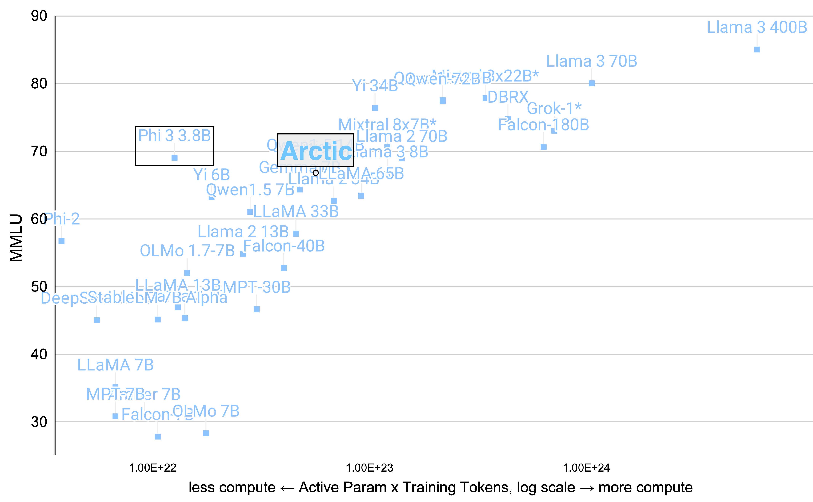
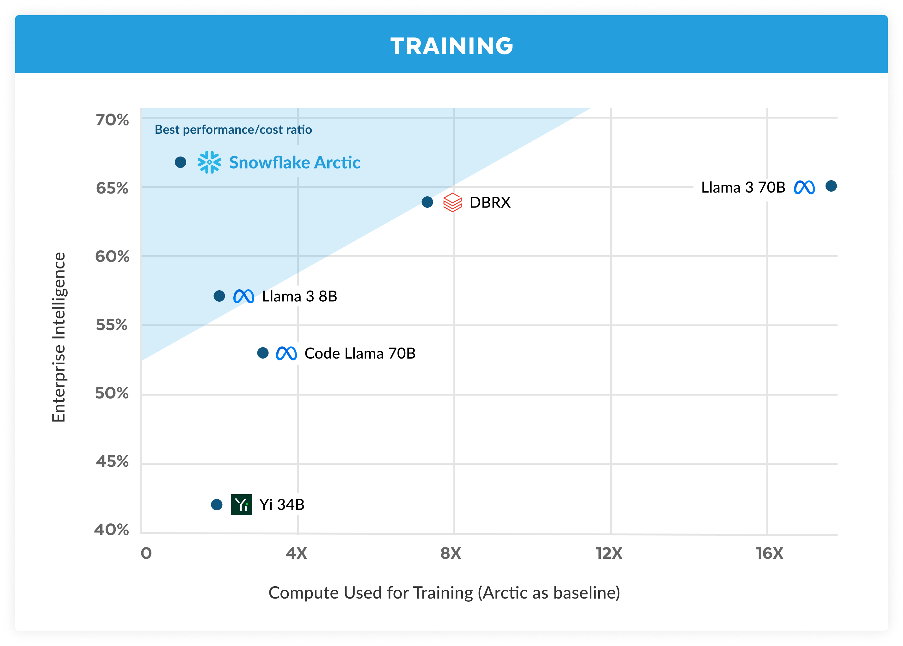
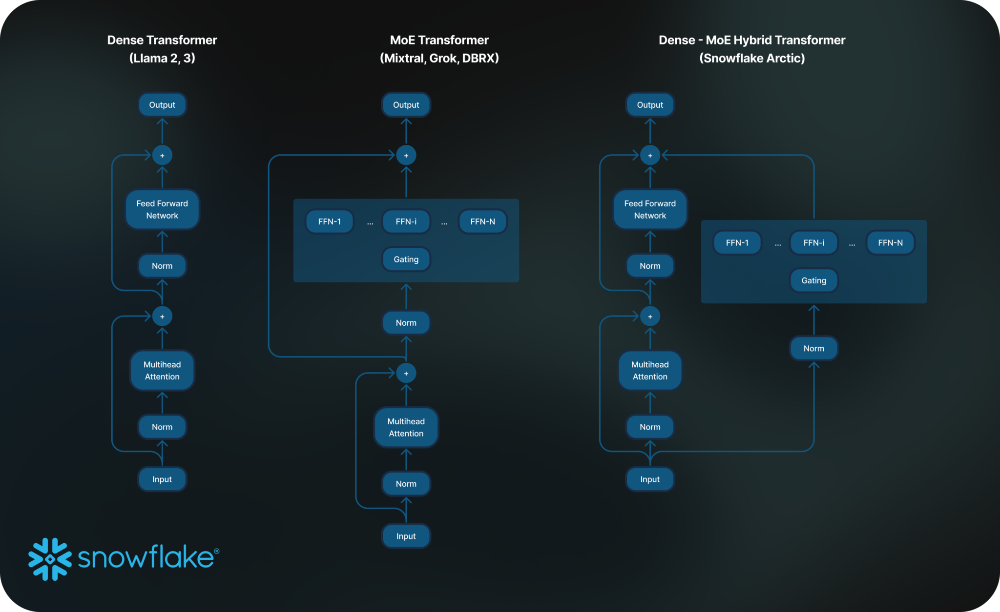

Last week, two very interesting open models were released into the world, Phi 3 from Microsoft and Arctic from Snowflake, and they both stand on their own in training techniques. The Phi series of models is known for taking an opinionated stance on synthetic, high-quality data and Arctic is a new entry that has a very sparse Mixture of Experts (MoE) architecture that makes it useful exclusively for the coding-focused, VRAM-rich inference population.

My primary reason for writing this article is that I thought they already broke my model relating pretraining compute to MMLU score but it seems like it may be more robust than I initially thought. MMLU is an okay metric for open models because we're still seeing gains and models that aren't good enough to play in the space. Obviously, you can't over-index on one metric, but it gives many good lessons. Let's start with Arctic, which was more surprising for most of us plugged into the industry.

### Arctic & open mixture of expert trends

Last week, Snowflake launched its response to the recent DBRX model from their often-paired competitor, Databricks: [Arctic](https://huggingface.co/Snowflake/snowflake-arctic-instruct). Arctic has a very different architecture when compared to most open models these days. I played with Arctic a little bit in [their demo](https://huggingface.co/spaces/Snowflake/snowflake-arctic-st-demo), but it didn't pass my basic challenge tasks around who I am, RLHF details, and the stretch question of writing DPO code. It's clear from the announcements that this is a model with a niche in coding and reasoning, and [that's a good thing when it comes to open LLM strategy](https://www.interconnects.ai/p/open-llm-company-playbook).

For most of us, Arctic is just a reference on a small list of very open models, but I hope that it performs on the tasks claimed within the nebulous, and bordering on cringe, evaluation of "enterprise intelligence.\" The core plot of the announcement is below --- they actually fixed the image with DBRX's correct position, to give them credit ([originally was wrong](https://twitter.com/sam_havens/status/1783208028663394344)).

This comes just a week or two after [Mistral shared a similar "efficiency" plot](https://mistral.ai/news/mixtral-8x22b/?utm_source=ainews&utm_medium=email&utm_campaign=ainews-mixtral-8x22b-instruct-defines-frontier), which sparked [extensive mid-tier memeing](https://twitter.com/AlbertQJiang/status/1780648008696091003). To the [blog post](https://www.snowflake.com/blog/arctic-open-efficient-foundation-language-models-snowflake/). The Arctic model uses a "Dense-MoE Hybrid transformer architecture with "a 10B dense transformer model with a residual 128×3.66B MoE MLP resulting in 480B total and 17B active parameters chosen using a top-2 gating."

The 17B active parameters number here seems great, but the 480B total parameters in this model make it pretty much stopped from a consumer and researcher fine-tuning perspective. While only 17B parameters are active for inference, you still need to be able to load all the weights in memory (otherwise inference and fine-tuning would be extremely slow reading and writing to memory constantly). If nothing else, it matches the trend that the [minimum footprint needed for working with open LLMs is growing fast](https://www.interconnects.ai/p/llama-3-and-scaling-open-llms). It's an enterprise LLM because only enterprises really have the compute to use it, which doesn't really matter if you're focused on your market.

Much of the blog post is about what "enterprise intelligence" is, but editing for clarity and emphasis, the key points are:

> 1) **Many-but-condensed experts with more expert choices*****...*** In designing Arctic, we noticed that the improvement of the model quality depended primarily on the number of experts and the total number of parameters in the MoE model, and the number of ways in which these experts can be combined together.
>
> Based on this insight, Arctic is designed to have 480B parameters spread across 128 fine-grained experts and uses top-2 gating to choose 17B active parameters. In contrast, **recent MoE models are built with significantly fewer experts**.  **Intuitively, Arctic leverages a large number of total parameters and many experts to enlarge the model capacity for top-tier intelligence**, while it judiciously chooses among many-but-condensed experts and engages a moderate number of active parameters for resource-efficient training and inference.

Mostly, Snowflake found that adding more experts lets the model keep getting better at benchmarks without increasing the inference cost. Continuing:

> 2) **Architecture and System Co-design**: Training vanilla MoE architecture with a large number of experts is very inefficient even on the most powerful AI training hardware due to high all-to-all communication overhead among experts. However, it is possible to hide this overhead if the communication can be overlapped with computation.
>
> **Our second insight is that combining a dense transformer with a residual MoE component in the Arctic architecture enables our training system to achieve good training efficiency via communication computation overlap**, hiding a big portion of the communication overhead.

Their somewhat confusing diagram is here. The thing to focus on is the residual streams --- the model flow that goes *around* rather than through the expensive computation blocks.

I like this architecture because it fits with a training intuition from Anthropic around the models *adding* to the residual flow of information and building up the output, rather than the core signal flow being through the blocks. We don't know how to confirm this idea or the opposite for large models, but you can find more on this in a [recent Dwarkesh episode](https://www.dwarkeshpatel.com/p/sholto-douglas-trenton-bricken).

> **Dwarkesh Patel:** You referred earlier to [Anthropic\'s way of thinking about transformers](https://transformer-circuits.pub/2021/framework/index.html) as these read-write operations that layers do. One of you should just kind of explain at a high level what you mean by that.
>
> **Trenton Bricken** So for the residual stream, imagine you\'re in a boat going down a river and the boat is the current query where you\'re trying to predict the next token. So it\'s "the cat sat on the \[blank\]." And then you have these little streams that are coming off the river where you can get extra passengers or collect extra information if you want. And those correspond to the attention heads and MLPs that are part of the model.

In the meantime, we're seeing a proliferation of open, small mixture of expert models: [JetMoE](https://huggingface.co/jetmoe/jetmoe-8b), [Qwen MoE](https://huggingface.co/Qwen/Qwen1.5-MoE-A2.7B), [DeepSeekMoE](https://huggingface.co/deepseek-ai/deepseek-moe-16b-base), Arctic, and likely more I missed. What I've been hearing is that training a small mixture of expert models is much less of a mess than training bigger models.

Seeing all this, I thought that maybe the Arctic model was going to break my [recent model](https://www.interconnects.ai/p/compute-efficient-open-llms) showing the relationship between active parameters, training dataset size, and MMLU performance. The *best* rendition of a model like this is hyper-inference optimized when compared to dense models like Llama 3 70 or 405B, and it should be an outlier on this plot compared to dense models. Artic 2 and 3, if coming, should prove this to be true. In the meantime, the real outlier is still the Phi models, let's get into how.

### Phi 3, synthetic data, and small models

"[Tiny but mighty](https://news.microsoft.com/source/features/ai/the-phi-3-small-language-models-with-big-potential/)" is the branding of the [new series of Phi models](https://azure.microsoft.com/en-us/blog/introducing-phi-3-redefining-whats-possible-with-slms/). After Llama 3's release, especially with the 405B model coming, the biggest opportunity in the open LLM space is with small models. **As the performance per parameter ratio of LLMs improves, small models could unlock the most economic value** by unlocking applications reliant on edge computing or low-costs.

Phi 1 and Phi2 are not models I featured on Interconnects, but they're a key point in the arc of data and model sizes of open LLMs. Phi 1, and its peer [Phi 1.5](https://huggingface.co/microsoft/phi-1_5), came out as a model trained *[exclusively on synthetic textbook data](https://arxiv.org/abs/2306.11644)*, but only 6 billion tokens of it. Phi 2 was an update to the model series that made it more like a normal open pretrained LLM, with 2.7 billion parameters, scaling up a synthetic data pipeline to 1.4 trillion tokens. Phi 2 was one of the first, capable, small language models (SLMs). [Phi 3](https://huggingface.co/microsoft/Phi-3-mini-128k-instruct) is a scaled version of Phi 2, with more parameters for all the models in their suite and more "improved" training data. All of Phi 3, Arctic, and our recently [updated OLMo 1.7 model](https://blog.allenai.org/olmo-1-7-7b-a-24-point-improvement-on-mmlu-92b43f7d269d), among many others, highlighted a multi-stage training where high-quality data of some sort comes later.

I was hoping the Phi 3 report would say if they upgraded to GPT-4 for their synthetic data, but there's nothing in there beyond "continuing to improve the recipe of Phi 2," which was built on GPT-3.5.

These new Phi models, mini, small, and medium, come in at 3.8, 7, and 14 billion parameters respectively. The models look decent, but they're surely outliers in the MMLU versus compute plot. This generated *a lot* of discussion on Twitter and many ML discords, accusing the Phi team of training on the test set again, as this happened with Phi 2. This critique of Phi is low-hanging fruit, given the state of our evaluation systems in the open LLM ecosystem, but it's not really the point.

**Phi models are effectively trained on textbooks. The MMLU benchmark is all multiple-choice questions. Textbooks have** ***a lot*** **of data and formatting relevant to MMLU. It's not surprising that Phi does well**. Rather than accusing the Phi team of cheating, it's more useful to show that specific data can totally break MMLU. The reality of how Phi was trained, though, is always somewhere in the middle. Phi's ChatBotArena score is highly unlikely to correlate with it's MMLU boost.

From the outside, the Phi team is a research group learning the limits of LLM distillation. Given that Microsoft wants to sell LLM usage on Azure, understanding how people would want to do so makes sense. Some of the mixed vibes may be coming from Microsoft's entire open LLM strategy, rather than the team itself. The release of Phi 3 certainly felt rushed, with the first version of the paper [having empty evaluation values for their own models](https://arxiv.org/abs/2404.14219) in addition to the two bigger checkpoints of the suite being "available soon." Additionally, [Microsoft wiped all the models and datasets affiliated with the model series WizardLM](https://www.reddit.com/r/LocalLLaMA/comments/1c8e08x/wizardlm_models_gone/) from HuggingFace and GitHub soon after the release of the 2nd version and jumped the gun for "forgetting a pre-release toxicity assessment." WizardLM was a leader in the fine-tuning space, but one that wasn't documented extremely well, so it feels like a loss of what could've been important new artifacts. Hopefully, they come out again, but I'm so not confident.

For a [rapid-fire architecture summary](https://twitter.com/danielhanchen/status/1782853167572832650) of Phi 3, for the folks that like this, it has a sliding window attention (SWA) of 2047, which is weird because it's not a power of 2, upcasted Rotary Position Embedding (RoPE) like Gemma that can be extended to 128k context lengths, [fused layers](https://stackoverflow.com/questions/56601075/what-is-a-fused-kernel-or-fused-layer-in-deep-learning), and more.

------------------------------------------------------------------------

Apple also released a [small scaling suite of open LLMs](https://huggingface.co/apple/OpenELM). These are welcome and look to be decent models. Not good enough that the call for small models above is solved, but directionally useful to show the ecosystem is moving in the right direction.

------------------------------------------------------------------------

### Newsletter stuff

**Models, datasets, and other tools ([2024 artifacts](https://huggingface.co/collections/natolambert/2024-interconnects-artifacts-6619a19e944c1e47024e9988), [2023 artifacts](https://huggingface.co/collections/natolambert/2023-interconnects-artifacts-661b19d27082ad0b43d67b17), [MMLU vs training compute model](https://docs.google.com/spreadsheets/d/13LMlSGQQ3_qxbjIcEkgqofr2Ay1JT0XEH4S-AWQi8so/edit?usp=sharing))**

-   \[Preference data\] An exciting new preference dataset was released, [PRISM](https://huggingface.co/datasets/HannahRoseKirk/prism-alignment), which focuses on building understanding around how preferences from different individuals are integrated into RLHF.

-   \[Base model\] Qwen joined the "big model" phase with [the 110B variant of Qwen 1.5](https://huggingface.co/Qwen/Qwen1.5-110B).

**Housekeeping**

-   Audio of this post is available (soon) in [podcast](https://podcast.interconnects.ai/) form or on [YouTube](https://www.youtube.com/@interconnects).

-   My real podcast is at [retortai.com](http://retortai.com).

-   *Paid subscriber Discord access in email footer.*

-   Referrals → paid sub: Use the [Interconnects Leaderboard](https://www.interconnects.ai/leaderboard).

-   Student discounts in [About page](https://www.interconnects.ai/about).
