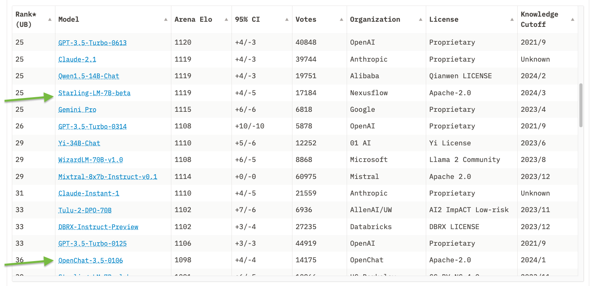

*See [part 1](https://www.interconnects.ai/p/how-rlhf-works) of this series for a textual overview of the 3 stages of RLHF: instruction-tuning, reward modeling, and RL.*

17 months on from the release of ChatGPT and we still do not have any fully open-source replications of its fine-tuning process. [We're much further from it than most people think](https://www.interconnects.ai/p/open-gpt4-limitations). Still, the literature of reinforcement learning from human feedback (RLHF) techniques and the broader class of preference fine-tuning algorithms available these days (DPO, ORPO, CPO, KTO, IPO, etc) have been slowly and steadily moving forward on specific avenues for delivering value. We're not close to the closed models, but we're healthily improving. That's the cause for this post --- try and clearly outline the things that RLHF is doing to recent models for better and worse --- and this update was long overdue.

10 months ago, trying to describe "how RLHF works" was a largely qualitative exercise. It quoted unreproducible papers from OpenAI and Anthropic. Today, we at least have *some* papers demonstrating what different types of RLHF contribute to final models. To start, let's recall the high-level things that RLHF can do. From [my first article in this series](https://www.interconnects.ai/p/how-rlhf-works):

> RLHF ultimately will work in the long term (with language models and elsewhere) when two conditions are met. First, there needs to be some signal that applying vanilla supervised learning only does not work --- in this case the pairwise preference data. Second, the less important one, I suspect it also excels where there is a complex optimization landscape that needs to slowly change over time to achieve success (path dependency, best characterized by Anthropic\'s plot in the constitutional AI paper).

This article was right after I figured out the base assumption that you can easily do some RLHF training on preference data for safety tasks. Now there's Llama 2 and [a cool paper largely reproducing the dual reward model safety training used in Llama 2](https://arxiv.org/abs/2310.12773), among other research showing RLHF works for safety. For tasks a language model shouldn't answer, the chosen is a refusal and the rejected is a completion. For tasks that are borderline, such as the dataset [XSTest](https://arxiv.org/abs/2308.01263) and Llama 2's "killing a python process," you can down-weight refusals in that case by making it a preference.

Other similar "structured" claims for RLHF exist, such as upweighting verifiable claims. Another example of this is an RLHF solution to the [Pink Elephant Problem](https://arxiv.org/abs/2402.07896) --- where a language model likes to talk about what is in the prompt. In this case, you can revise the original incorrect answer with another language model, then the revision is the chosen response and the rejected is the answer with an error. Many more domains have this option, such as tasks with numerical questions or other verifiable claims without external information context. Creating basic preference pairs is easy, and largely has been accepted to work. We still need more canonical references to prove it.

The other half of the above excerpt is predominantly about improving the capabilities of language models in more complex ways. We're seeing more papers, and rumors, involving RLHF in improving reasoning and coding abilities through some combination of RL as search or data generation. This was recently highlighted in the [Llama 3 blog post](https://ai.meta.com/blog/meta-llama-3/) (and is most of [what I thought Q Star was about](https://www.interconnects.ai/p/q-star)):

> Learning from preference rankings via PPO and DPO also greatly improved the performance of Llama 3 on reasoning and coding tasks. We found that if you ask a model a reasoning question that it struggles to answer, the model will sometimes produce the right reasoning trace: The model knows how to produce the right answer, but it does not know how to select it. Training on preference rankings enables the model to learn how to select it.

I've heard something like this described to me as "PPO figures out chain-of-thought reasoning," where DPO doesn't always. I don't like these intuitions because they assign a lot of unrealistic agency to what is a computational process, but I'll conclude this article with more about why people are modifying DPO to match this exploratory feature of PPO.

In my above excerpt, the two "importances" I played out are currently flipped. I fully expect that the latter, which figures out some sort of exploration through online generations, is far more important than the former, which is how RLHF got its reputation as "just style transfer," but it is actually much harder.

Style transfer, meanwhile, is the thing holding back the open RLHF narrative the most, for two reasons. First, when people discuss style transfer, they don't describe this as being important or exciting. **Style is a never-ending source of human value, it's why retelling stories can result in new bestselling books (such as Sapiens), and it is a fundamental part of continuing to progress our intellectual ecosystem**. **Style is intertwined with what the information is**. Second, we've seen how different styles actually can improve evaluation improvements with Llama 3. The Llama 3 Instruct models scored extremely high on ChatBotArena, and it's accepted as being because they had a more fun personality. If RLHF is going to make language models simply more fun, that is delivered value.

### The chattiness paradox

RLHF or preference fine-tuning methods are being used mostly to boost scores like AlpacaEval and other automatic leaderboards without shifting the proportionally on harder-to-game evaluations like ChatBotArena. The paradox is that while alignment methods like DPO give a measure-able improvement on these models that does transfer into performance that people care about, a large swath of the models doing more or less the same thing take it way too far and publish evaluation scores that are obviously meaningless.

For how methods like DPO can simply make the model better, some of my older articles on [scaling DPO](https://www.interconnects.ai/p/rlhf-progress-scaling-dpo-to-70b) and [if we even need PPO](https://www.interconnects.ai/p/the-dpo-debate) can help. These methods, when done right, make the models easier to work with and more enjoyable. This often comes with a few percentage point improvements on evaluation tools like MT Bench or AlpacaEval (and soon [Arena Hard](https://lmsys.org/blog/2024-04-19-arena-hard/) will show the same). The problem is that you can also use techniques like DPO and PPO in feedback loops or in an abundance of data to actually lobotomize the model at the cost of LLM-as-a-judge performance. There are plenty of examples.

Some of the models I'm highlighting here are academic papers that shouldn't entirely be judged on "if the final model passes vibes tests," but are illustrative of the state of the field. These are still useful papers, just not something everyone will immediately use for training state-of-the-art models. Those come from downstream papers.

During the proliferation of the DPO versus PPO debate there were *many* papers that came out with ridiculous benchmarks but no model weights that gathered sustained usage. **When applying RLHF, there is no way to make an aligned version of a 7 billion parameter model actually beat GPT-4**. It seems obvious, but there are papers claiming these results. Here's a figure from a paper called [Direct Nash Optimization](https://arxiv.org/abs/2404.03715) (DNO) that makes the case that their model is state-of-the-art or so on AlpacaEval.

Even the pioneering paper *[Self Rewarding Language Models](https://arxiv.org/abs/2401.10020)* disclosed ridiculous scores on Llama 2 70B. A 70B model can get closer to GPT-4 than a 7B model can, as we have seen with Llama 3, but it's important to separate the reality of models from the claims in modern RLHF papers. Many more methods have come and gone in the last few months. They're the academic line of work that I'm following, and there's insight there, but the methods that stick will be accompanied by actually useful models some number of months down the line.

Other players in industry have released models alone (rather than papers) that gamify these metrics. Two examples that come to mind are the [Mistral 7B fine-tune from Snorkel AI](https://huggingface.co/snorkelai/Snorkel-Mistral-PairRM-DPO) or a [similar model from Contextual trained with KTO](https://huggingface.co/ContextualAI/Contextual_KTO_Mistral_PairRM). There are things in common here --- using a reward model to further filter the data, repeated training via some sort of synthetic data feedback, and scores that are too good to be true.

A symptom of models that have "funky RLHF" applied to them has often been a length bias. This got so bad that multiple evaluation systems like AlpacaEval and WildBench both have [linear length correction mechanisms in them](https://arxiv.org/abs/2404.04475). This patches the incentives for doping on chattiness to "beat GPT-4," and adds a less gamified bug that shorter and useful models may actually win out. So far so good on the linear length controls.

Regardless, aligning chat models simply for chattiness still has a bit of a tax in the literature. This note from the [Qwen models](https://huggingface.co/Qwen/Qwen1.5-72B-Chat) is something that has been seen multiple times in early alignment experiments. I suspect this is mostly about data.

> We pretrained the models with a large amount of data, and we post-trained the models with both supervised finetuning and direct preference optimization. However, DPO leads to improvements in human preference evaluation but degradation in benchmark evaluation.

A good example of this tradeoff done right is a model like [Starling Beta](https://huggingface.co/Nexusflow/Starling-LM-7B-beta). It's a model that was fine-tuned from another chat model, OpenChat, which was in fact trained by an entire other organization. It's training entirely focuses on a k-wise reward model training and PPO optimization, and moves it up 10 places in ChatBotArena. The average response length of the model increases, but in a way that's good enough to actually help the human raters.

### The mechanism for making models chattier

Let's round out this article with *how* RLHF is actually achieving chattiness at the parameter level. Most of the popular datasets for alignment these days are synthetic preferences where a model like GPT-4 rates outputs from other models as the winner or the loser. Given that GPT-4 is [known to have length and style biases for outputs that match itself](https://arxiv.org/abs/2306.05685), most of the pieces of text in the "preferred" section of the dataset are either from an OpenAI model or are stylistically similar to it. The important difference is that not all of the pieces of text in the dataset will have that. They're often generated from other open models like Alpaca, Vicuna, or more recent examples. These models have very different characteristics.

Next, now that we've established that we have a preference dataset where most of the chosen models are similar to ChatGPT (or some other model that is accepted to be "strong"), these alignment methods simply increase the probability of these sequences. The math is somewhat complicated, where the batches of data operate on many chosen-rejected pairs at once, but in practice, the model is doing credit assignment over sequences of tokens (subword pieces). Preference alignment for chattiness is making the sequences found in outputs of models like GPT-4 more likely and the sequences from other, weaker models less likely. Repeatedly, this results in models with longer generations and characteristics that people like more.

Those among you who are familiar with RLHF methods may ask if the KL constraint in the optimization should stop this from happening. The KL constraint is a distance term between the distribution of the original model and the resulting model. It helps make the optimization more robust to overoptimization, but that makes the border between good and bad models a bit more nuanced. Hence, the prevalence of vibes-based evaluations. Though, models tend to have enough parameters where they can change substantially and still satisfy the KL constraint on the data being measured --- it can't be the entire pertaining dataset, for example.

As more models than ChatGPT become prevalent and strong enough for creating [synthetic data](https://www.interconnects.ai/p/llm-synthetic-data), the distribution of outcomes we can expect from our aligned models should shift. There are two key places where the data influences this process: 1) where the text used to train the model is generated and 2) which LLM is used to determine which answer is the "winner" and "loser" in the preference learning framework. While all of these models have licenses or terms of service that make this practice technically violate an agreement of use, we've had more than a year of progress in open alignment practices relying on them in the past, so I don't expect it to change. Mistral AI is *the only* LLM provider that doesn't have a term restricting training on outputs (as far as I know).

------------------------------------------------------------------------

Here's a timeline to gauge how important data is to alignment research & engineering in the open: **how long until a non-Meta fine-tune of Llama 3 70b equals it in ChatBotArena?**

------------------------------------------------------------------------

## Some next steps for RLHF research

I had a lot more things I wanted to expand on in this post, but many of them are *emerging* rather than *established*. The core thing that for some reason needs to be conveyed is how directly RLHF and other preference learning methods are impacting the development of AI right now. There are three categories I'm monitoring right now that could very well be an entire other post in this series very soon.

**1. Reasoning and code improvements**

There are tons of signs and sounds that RLHF methods are core to reasoning performance improvements at big labs like Meta AI and OpenAI. From Q\* to the Llama 3 blog post, this comes up all the time. In the academic space, there are disproportionally few datasets here to make this happen. I've seen a few recent datasets like [UltraInteract](https://arxiv.org/abs/2404.02078) and [CodeUltraFeedback](https://arxiv.org/abs/2403.09032), but they haven't yet proven to be the artifact that unlocks a ton of progress like the UltraFeedback dataset did for chat. Otherwise, we spend time reading papers from [Meta](https://arxiv.org/abs/2402.10963) and [OpenAI](https://arxiv.org/abs/2305.20050) showing us they get a lot out of it, but they haven't been applied to open LLMs yet. [OpenAI makes the most noise in this space](https://twitter.com/OpenAI/status/1778574613813006610), and their recent model is the top reasoning model in ChatBotArena.

*As writing this, a [paper](https://arxiv.org/abs/2404.19733) came out combining this with the main theme of the post: powerful RLHF feedback + reasoning. Seems promising, as they add another learning constraint to the DPO optimization to keep behavior in line.*

**2. Proliferation of online methods (and PPO beats DPO?)**

We're starting to see *a ton* of papers showing that some sort of online data (either generating from a policy model or relabeling preferences with a retrained reward model) is important to getting the best RLHF performance. From [mostly theoretical papers from Stanford](https://arxiv.org/abs/2404.14367) to [new renditions](https://arxiv.org/abs/2404.14367) of [DPO with](https://arxiv.org/abs/2402.04792) \| [online](https://arxiv.org/abs/2403.08635) \| [updates](https://arxiv.org/abs/2402.11253), expect to see more of this soon. Llama 2 and 3 hinted at doing multiple stages of training and I expected it was to keep the data fresh. This may be the biggest story of the RLHF literature in 2024 after the DPO paper in 2023, and it is likely connected to why people will be getting better performance models with PPO instead of straight DPO.

**3. Novel methods like KTO**

[Kahneman-Tversky Optimization](https://arxiv.org/abs/2402.01306) (KTO) raised a lot of eyebrows when it was released for its simplicity. Since then, I've heard from applied organizations that they've replaced DPO with it and showed better improvement. The data that KTO operates on is binary preference signals (e.g. thumbs-up buttons) rather than paired preferences. This makes the data easier to collect for industry, but less available for academic work. This is why it can take a long time for new methods to really pop like DPO taking 5 months until the Zephyr Beta release.

We'll see more types of methods soon. Different data collection, different strengths. It's just hard to predict what they look like.

------------------------------------------------------------------------

**Housekeeping**

-   Audio of this post is available (soon) in [podcast](https://podcast.interconnects.ai/) form or on [YouTube](https://www.youtube.com/@interconnects).

-   My real podcast is at [retortai.com](http://retortai.com).

-   *Paid subscriber Discord access in email footer.*

-   Referrals → paid sub: Use the [Interconnects Leaderboard](https://www.interconnects.ai/leaderboard).

-   Student discounts in [About page](https://www.interconnects.ai/about).
