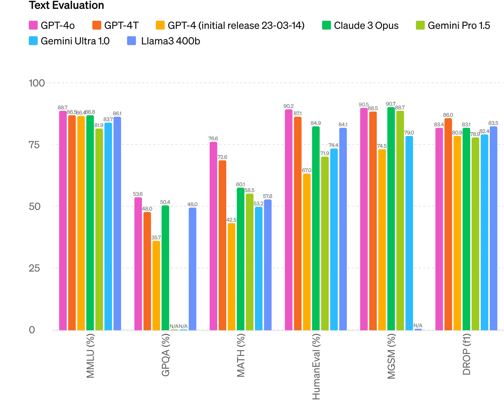

Tom and I recorded an episode of [The Retort](https://retortai.com/) on OpenAI's culture shift with this announcement --- it'll be out Friday. Subscribe if that sounds interesting!

------------------------------------------------------------------------

The 2013 film Her is an artful warning of the challenges posed to human identity by emerging technologies. The quintessential technology to challenge this identity, and the society and values that come with it, is an omnipresent AI partner. Intelligence, attention, positive feedback, etc., are all fundamentally craved by humans but have not been easy to create artificially, especially not together. GPT-4o's demo showcases that we are intentionally marching toward this reality with no shadow of regret.

OpenAI, an organization historically cautious in its approach to safety and forthcoming with warnings of the power of its technology, blissfully recreated this technology. The new model that OpenAI created, GPT-4o, which has a novel architecture and notable improvements in performance, could express almost any voice character, but they decided to go with something extremely close to the AI in Her, named Samantha. Here's a short snippet of the voice, responding to the OpenAI employee greeting and saying he will ask her some questions:

::: {.native-video-embed attrs="{\"mediaUploadId\":\"deed66ea-bf1f-4287-92c8-346cc7d2ed4e\",\"duration\":null}" component-name="VideoPlaceholder"}
:::

> \[In an extremely stereotypical assistant voice\] Woooooooow, that's quite the outfit you got on. Love the...

This is not the only example that OpenAI has promoted, given that this was a live demo, some weirdness could be expected, there are [other demo videos on their YouTube with slightly off-putting personalities](https://www.youtube.com/watch?v=vgYi3Wr7v_g). As for branding the release after the movie, Sam Altman went so far as to explicitly lean into the narrative, Tweeting just "[her](https://twitter.com/sama/status/1790075827666796666?ref_src=twsrc%5Egoogle%7Ctwcamp%5Eserp%7Ctwgr%5Etweet)." After [Sam's ousting last fall for "not being consistently candid with the board,"](https://www.interconnects.ai/p/openais-shakeup-and-narratives?utm_source=publication-search) this completes an arc in the AI discourse away from existential risk and deliberation into a new era of product-first competition. I have to say, maybe Helen Toner, one of the board members who temporarily ousted Altman, was right.

The products announced this week, on Monday from OpenAI and on Tuesday from Google, showcase a meaningful improvement in the performance of the AI systems we are using on a regular basis, but not ones that are easily benchmark-able. We are moving towards a future where everything we perceive can be acted upon by an AI and everything we store digitally can be used to augment it. Connections, context length, and speed are the only limits we have, and we took a big step toward solving all of these.

### Talking to ChatGPT

The demos of this new version of ChatGPT are truly incredible. They are obvious glimpses of the future and well worth watching. OpenAI doubled down on this with a serious repetition of the word *free.* Whether they're worried about competition or made a huge cost cut internally, rolling this out to every user will be a change in the ecosystem. This is a can of worms that will not go away, whether or not the technology is good --- one of many we are seeing with AI. The two core technical advancements that make this real-time conversation with AI possible are latency, which is hard, and training a model that can be interrupted and resume nicely, which is probably easy.

The [keynote](https://www.youtube.com/watch?v=DQacCB9tDaw&t=1s) was obviously designed to have the OpenAI employees interrupt the model and show how well it quickly responds. The demo was such a big step forward that it revealed the next problem to be solved with interruptible audio agents: presence. In order to interrupt the AI model, you need to make a clear and articulate sound. In order to interrupt a human companion, you need to make one of many subtle body expressions we evolved to pick up on.

There's substantial energy in building devices that show AI what we see, from the Humane AI pin, our smartphones, Meta's AI glasses, the Rabbit R1, and more. Only one of these actually has the hardware, and positioning during use, to both see what we see and our expressions --- the smartphone. Where we've evolved to hold the smartphone when we show someone a space on FaceTime turns out to be the perfect interaction for an AI that can take in your surroundings and your expressions in real-time.

Peripheral AI assistants receptive to interruptions will definitely be used, but this demo exposed another reason why the smartphone is king. As for digital interactions, the mirror to this signal is the physicality provided by virtual reality. Regardless of the models we train, the interfaces will now be a gating factor on our experience.

### GPT-4o: Training omnimodal models

[OpenAI's new model](https://openai.com/index/hello-gpt-4o/) confirms a shift in how frontier models are trained that [was hinted at by Gemini's ability to take in audio or video and output them as well](https://www.interconnects.ai/p/multimodal-rlhf). Previous models could take in images as inputs, and maybe video, by collecting pixels into patches which are tokens interweaved with the usual subword pieces. Now, GPT-4o, and likely Gemini, process and create this information in an entirely different way. They can take in input tokens corresponding to audio, images, or text, and they can generate them too.

The previous multimodal systems we were using in an interface like ChatGPT had audio and image modes, but this was acting via a complicated handoff between models. This handoff reduced the capacity for creativity, sort of like pushing all information through a narrow pipe, and most importantly added substantial latency. Where talking to ChatGPT used to take three model passes --- speech-to-text, LLM generation, and then text-to-speech --- text and audio can be processed, and more importantly outputted, in real-time. Just like words would be streamed onto your ChatGPT interface one at a time directly from the LM, audio tokens can now do that too. Any transformation in the prompt of the type and speed of the speaker results in different audio chunks directly from the model. [All information is just tokens and will be interleaved.](https://twitter.com/willdepue/status/1790078289023062255)

This change in model architecture, which OpenAI still calls GPT-4 based, is a very new way of doing things; GPT-4o is a bigger change than going from dense models to mixture of expert models. Now that we've shown you can add the modalities of image and audio, adding anything else will be easier in the future. Beyond modalities that humans perceive, the models may also gain direct abilities to integrate with more digital systems without a wrapper function. It's as simple as modifying the tokenizer, retraining the model, fine-tuning for a new modality, and not showing any major performance drops on evaluation benchmarks. OpenAI went through this entire process and is still gaslighting us as "not really re-doing pretraining much." [OpenAI even listed contributors under encoders](https://openai.com/gpt-4o-contributions/), which have been largely ignored and not used during the text-only portion of language models' recent hype.

The benchmarks for GPT-4o show marginal improvements over the models we were already using. Beyond this, it can be summarized as:

-   Mixed feelings among early testers, showcasing speed as a good feature and a decrease in perceived laziness, but some people hate it.

-   A [big bump in ChatBotArena](https://twitter.com/liamfedus/status/1790064963966370209?s=46), marking a new tier above GPT-4 base and turbo, especially in code. There are some mumblings that they've gamified the coding category.

What is not captured in the benchmarks is how intelligence can be reflected by each modality. OpenAI has a monstrous data trove at this point for textual answers to challenging prompts, but how will that translate to audio? The same thing that makes streamlining the system for latency easier makes maintaining performance harder. The audio generation is from different tokens than a textual answer, so new mediums for prompting and extracting performance will be needed. I don't think many people are going to want a model to do a full chain of thought reasoning out loud. To start with, I expect audio to be a *less intelligent* form of the model. As fine-tuning research catches up, everything will equalize, but this is months to years away.

The model clearly has some new pieces. OpenAI likes to say "this model is built off GPT-4," but what they are referring to is an entire training infrastructure, not just a set of model weights. There is [a slim chance that the tokenizer was extended after training](https://arxiv.org/abs/2405.07883v1#page11) to include audio and images, but common practice assumes that a model is retrained from scratch to incorporate a new tokenizer like this. The GPT-5 moniker is reserved for the new supercomputer they're building with Microsoft, rather than the changes in how they're trying to use the model.

The most interesting technical detail revealed by the new model is through the [tokenizer delta](https://github.com/openai/tiktoken/commit/9d01e5670ff50eb74cdb96406c7f3d9add0ae2f8). GPT-4 and GPT-4-Turbo both had a tokenizer with a vocabulary of 100k tokens. GPT-4o has a tokenizer with 200k tokens to work better for native multimodality and multilingualism. Switching to more tokens makes generating more efficient, as the model can learn to generate more characters at once as one token in a variety of circumstances. The OpenAI blog highlights 2-4x speed increases for many non-English languages.

However, by releasing the tokenizer code, people found *a lot of weirdness,* such as [two tokens being mapped together](https://twitter.com/suchenzang/status/1790262822389399727) or [many, many bizarre tokens](https://twitter.com/suchenzang/status/1790171161512587424). This tokenizer weirdness makes me think there's more to come from OpenAI soon, or they cracked a new way of training, or else it would seem like they're hurting their model. My favorite piece of weirdness is that [two of the chatbots that OpenAI was testing in the LMSYS arena have different tokenizers](https://twitter.com/magikarp_tokens/status/1790387018461053419) --- there are many theories as to why, and they all point to OpenAI trying crazy shit.

### Google's mirror

The day after OpenAI's keynote, Google announced very similar features, and many more, coming to their Google suite of products. Google presented agents as a core theme, whether discussing with you or working for you in the background, with a simple catchphrase they repeated a few times: "Google will do the Googling for you."

The most notable demo was codenamed [Project Astra](https://www.youtube.com/watch?v=nXVvvRhiGjI), and presented a similar vision to OpenAI's with real-time multimodal feedback and voice-based conversation in multiple domains. The biggest technical achievement was Gemini's ability to remember the recent past in videos, but as always Google's demos are a bit further from reality than OpenAI's.

The keynote had many other blockbuster AI features. Asking Gemini for feedback on your photos, like search but complex, a video generation model to rival Sora, privacy features, a longer context length, new TPUs, and much more. It was a very strong, broad showing for Google. OpenAI's success in media coverage is almost all down to presentation style and approach rather than substance, which still counts.

OpenAI presented these technologies much more as a singleton product, or a single personality, while Google presented a suite of products. When you zoom in closely or ask people who were there, Gemini's latency is still much worse than what OpenAI achieved. All together, this shows why OpenAI focuses on Google. They can expand the envelope of AI in every direction and are by far the closest in technical capacity to OpenAI when averaged across the multimodal categories and product distribution channels (I do expect Meta is of concern too).

All of the products announced in the last few days are announced rather than released while some models are available in previous distribution channels. Google presented its vision as a set of tools, that should sell better to enterprise users, and OpenAI continues to pile its chips on a single consumer vision of AI. OpenAI has the media narrative, but with solid Google momentum like this, it will not be easy to unseat them. In fact, OpenAI may be trying too hard to react and cover their competition.

### OpenAI's AI Safety: Have your cake and eat it too

OpenAI's rather odd mission state is, and has been: \"to ensure AGI benefits all of humanity." They used to take this more strategically, playing up the risks of AI to protect their advantage. OpenAI is stuck in a phase of growing pains, where they want to serve many masters. Their founding team is focused on the long-term of AI and what it means for society, but their investors want one thing and their business needs another thing to survive.

This results in many actions at once, such as [the Model Spec they recently released](https://www.interconnects.ai/p/openai-rlhf-model-spec), which defines what RLHF "should do", and [deals with media brands to "promote their content."](https://www.adweek.com/media/openai-preferred-publisher-program-deck/) At the same time, OpenAI states in the Model Spec that "We\'re exploring whether we can responsibly provide the ability to generate NSFW content in age-appropriate contexts through the API and ChatGPT," and in the leaked memo that "members of the program receive priority placement and "richer brand expression" in chat conversations, and their content benefits from more prominent link treatments. Finally, through PPP, OpenAI also offers licensed financial terms to publishers." I'm not sure where these mix.

If you want to be an organization that is serious about AI safety and the trajectory of AI, you fundamentally cannot deliberate and lead on every issue by partaking in it. The creation of Her bots, available for free to every human, fulfills their mission from one angle, but to the extent that it becomes AI girlfriends due to their technical design decisions on whether or not they should be able to output NSFW content, violates the most important one.

On top of the announcements this week, Ilya Sutskever, a prominent and key researcher in the Organization, who has been on the sidelines since the Altman Affair last fall, has [finally announced he is departing](https://twitter.com/ilyasut/status/1790517455628198322). His [co-lead of the SuperAlignment team resigned soon after](https://twitter.com/janleike/status/1790603862132596961). This mirrors the power shift we are seeing. One read of this is that OpenAI is no longer a company defined by their models, but by their products. That is okay, but they should maintain this reality while disseminating narratives into the policy landscape.

OpenAI Always has been an unstable company, so I recommend people to be wary of trusting them on crucial matters of AI progression and security. Their technical innovation is top-notch and should be imitated, but think twice before assuming the OpenAI worldview is true. If not, we are going towards a future where [the film Her is reality](https://www.youtube.com/watch?v=Ewq5tStHmdk&t=1s). Her is now streaming on HBO, and if you haven't watched it, it is well worth your time and reflection.

------------------------------------------------------------------------

**Elsewhere from me**

-   I was on one of the [many online DPO papers](http://arxiv.org/abs/2405.01511)! This one explores using and retraining reward models in the loop.

-   I gave a [Stanford lecture on the history of open alignment](https://www.youtube.com/watch?v=AdLgPmcrXwQ) --- this is quite a good one!

**Housekeeping**

-   Audio of this post is available (soon) in [podcast](https://podcast.interconnects.ai/) form or on [YouTube](https://www.youtube.com/@interconnects).

-   My real podcast is at [retortai.com](http://retortai.com).

-   *Paid subscriber Discord access in email footer.*

-   Referrals → paid sub: Use the [Interconnects Leaderboard](https://www.interconnects.ai/leaderboard).

-   Student discounts in [About page](https://www.interconnects.ai/about).
