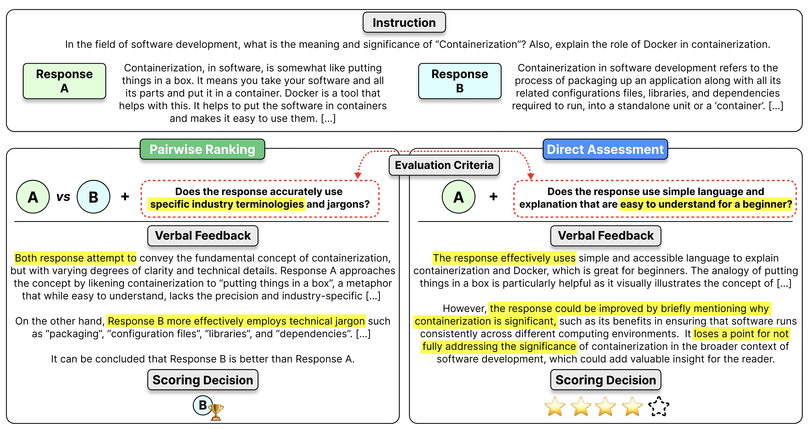
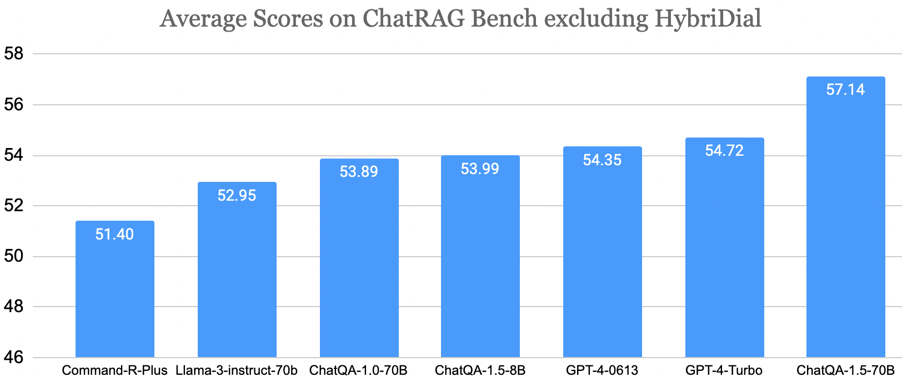
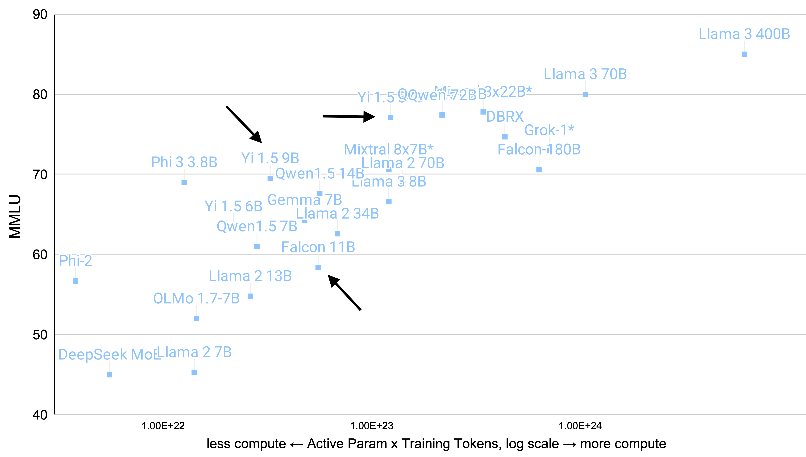

Welcome to a new series! For the last year or so, I've been compiling links to recent open models and datasets at the end of normal Interconnects posts. The lists have grown and become more thorough, so I figured I would split it out into standalone posts (I also normally don't have the motivation to do it after writing, for what it's worth). What you'll get is **a curated set of recent open LLMs, datasets, and anything else that catches my eye** (links, videos, talks, etc.). The vast majority of things will be things you can use today, primarily on HuggingFace.

I've learned a lot by understanding the dynamics of HuggingFace model and dataset pages in the last year, so I'm excited to share that with you. It'll also give me a bit more flexibility to write about models that are interesting but don't warrant an entire post.

I expect 0-2 of these posts per month.

------------------------------------------------------------------------

### Models

1.  **[prometheus-7b-v2.0](https://huggingface.co/prometheus-eval/prometheus-7b-v2.0)** by [prometheus-eval](https://huggingface.co/prometheus-eval): This is the next paper in a line of work trying to train open models to replace GPT-4 et al. for LLM-as-a-judge. This is a very promising model, but still some open questions for me (e.g. why is performance low on RewardBench). This model requires a specific rubric when evaluating, which makes sense, but adds a bit of a barrier to use it. PS they trained a [version on Mixtral 8x22B too](https://huggingface.co/prometheus-eval/prometheus-8x7b-v2.0)! It's shocking there aren't more models doing this!

    

2.  **[Llama3-ChatQA-1.5-70B](https://huggingface.co/nvidia/Llama3-ChatQA-1.5-70B)** by [nvidia](https://huggingface.co/nvidia): A general question answering and RAG model from Nvidia. People tend to sleep on their fine-tuning teams, this looks solid (figure below)!

    

3.  **[pair-preference-model-LLaMA3-8B](https://huggingface.co/RLHFlow/pair-preference-model-LLaMA3-8B)** by [RLHFlow](https://huggingface.co/RLHFlow): Really strong reward model, trained to take in two inputs at once, which is the top open reward model on RewardBench (beating one of Cohere's).

4.  **[DeepSeek-V2](https://huggingface.co/deepseek-ai/DeepSeek-V2)** by [deepseek-ai](https://huggingface.co/deepseek-ai) (21B active, 236B total param.): Another strong MoE base model from the DeepSeek team. Some people are questioning the very high MMLU scores, which is a similar story to the next model (Yi 1.5). Regardless, open models are making a lot of progress on MoE models. Scaling MoE models from this 20B active range to 100+ is supposedly an almighty engineering challenge.

5.  **[Yi-1.5-34B](https://huggingface.co/01-ai/Yi-1.5-34B)** by [01-ai](https://huggingface.co/01-ai) (6B, 9B, 34B base and chat variants): Another strong base model from a Chinese company. It seems to me that Chinese models can largely keep up with open players in the rest of the world, and are more numerous, but are yet to take a step that truly differentiates them from existing models. Good and great models, but not shocking (yet).

6.  **[paligemma-3b-pt-896](https://huggingface.co/google/paligemma-3b-pt-896)** by [google](https://huggingface.co/google): Google release a very solid visual language model in its Gemma suite. Folks online have been impressed --- this space is really heating up!

7.  **[xgen-mm-phi3-mini-instruct-r-v1](https://huggingface.co/Salesforce/xgen-mm-phi3-mini-instruct-r-v1)** by [Salesforce](https://huggingface.co/Salesforce) (\~5B param): Small multimodal model built on Phi 3 ([BLIP style](https://arxiv.org/pdf/2301.12597)).

8.  **[Llama3-OpenBioLLM-70B](https://huggingface.co/aaditya/Llama3-OpenBioLLM-70B)** by [aaditya](https://huggingface.co/aaditya): The first Llama 3 70B fine-tune that caught my eye was trained for biology, which was unexpected. I keep up with this because it is an indicator of how many people are seriously playing in the fine-tuning space. In this case, it took about 2 weeks for an IFT Llama 3 70B to show up. DPO takes a bit longer, and PPO-like methods the longest.

9.  **[Chuxin-1.6B-Base](https://huggingface.co/chuxin-llm/Chuxin-1.6B-Base)** by [chuxin-llm](https://huggingface.co/chuxin-llm): A small base model from a Chinese group that is also training on fully open data. It's a little hard to access (language barrier), but promising.

10. **[Llama-3-Refueled](https://huggingface.co/refuelai/Llama-3-Refueled)** by [refuelai](https://huggingface.co/refuelai): Non-commercial fine-tune for basic information processing tasks.

11. **[timesfm-1.0-200m](https://huggingface.co/google/timesfm-1.0-200m)** by [google](https://huggingface.co/google): A cool transformer focusing on time-series data (such as weather forecasting?). Seems good for science.

12. **[airoboros-70b-3.3](https://huggingface.co/jondurbin/airoboros-70b-3.3)** by [jondurbin](https://huggingface.co/jondurbin): Big smash of instruction/chat data into Llama 3, and funnily gets around the Llama 3 license by saying in text: "The name of this model is..." rather than having the name being in the url. There are a lot of models like this mixing 10s of datasets together to fine-tune models. I have no idea how they measure anything.

13. **[bagel-8b-v1.0](https://huggingface.co/jondurbin/bagel-8b-v1.0)** by [jondurbin](https://huggingface.co/jondurbin): Similar to above. I'm waiting for DPO to kick in, but the model merges are happening.

14. **[falcon-11B](https://huggingface.co/tiiuae/falcon-11B)** by [tiiuae](https://huggingface.co/tiiuae): New model from Falcon team before Falcon 180 2, but not the best scores, weird license.

Here's where the base models in here fall on my MMLU vs. training compute model (which is soon going to be made more accessible via a Python package):

### 

### Datasets

1.  **[lmsys-arena-human-preference-55k](https://huggingface.co/datasets/lmsys/lmsys-arena-human-preference-55k)** by [lmsys](https://huggingface.co/lmsys): This drop of data from LMSYS is great! The preference labels may be a little suspicious (for technical reasons that are hard to avoid and detailed [in my recent post](https://www.interconnects.ai/p/chatbotarena-the-future-of-llm-evaluation)), but these prompts are **extremely valuable to the open community**. We need to keep building on this!

2.  **[WildChat-1M](https://huggingface.co/datasets/allenai/WildChat-1M)** by [allenai](https://huggingface.co/allenai): Similar to above, this dataset contains 1 million ChatGPT conversations which will be super useful for training open models. Both of these subsets, as we start to accumulate data, will lead to filtering techniques and then better models.\
    Expert to hear about both of these again!

3.  **[Buzz](https://huggingface.co/datasets/H-D-T/Buzz)** by [H-D-T](https://huggingface.co/H-D-T): A large scale conversational dataset (almost 3million examples). It's built from a [composite of many datasets](https://arxiv.org/pdf/2301.12597) with almost 80million conversational turns to start with.

### Other

-   This [talk on the ML systems of ChatGPT](https://www.youtube.com/watch?v=PeKMEXUrlq4) was very, very good. Recommended.

-   This [new paper](https://arxiv.org/abs/2405.09818) for Chameleon models from Meta shows extremely strong performance in an architecture very close to GPT-4o's. I wish they were released, but this helps too. There's an entire section on fine-tuning and safety testing I'll be reading. Doesn't look like they had any structured blockers.

------------------------------------------------------------------------

References: ([2024 artifacts](https://huggingface.co/collections/natolambert/2024-interconnects-artifacts-6619a19e944c1e47024e9988), [2023 artifacts](https://huggingface.co/collections/natolambert/2023-interconnects-artifacts-661b19d27082ad0b43d67b17), [MMLU vs training compute model](https://docs.google.com/spreadsheets/d/13LMlSGQQ3_qxbjIcEkgqofr2Ay1JT0XEH4S-AWQi8so/edit?usp=sharing))

Keep sending me models (and datasets)!
