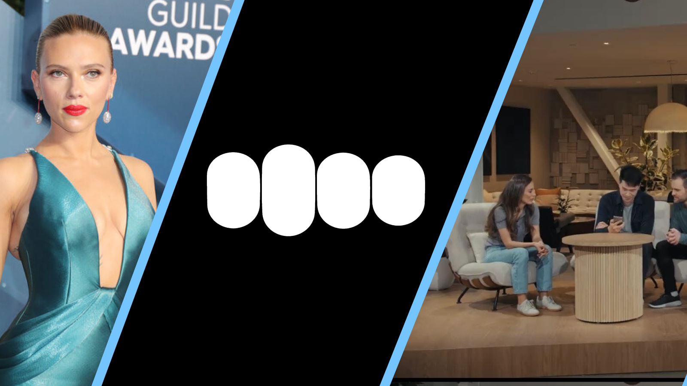

*Reminder: Last week Tom and I discussed the cultural weirdness of the GPT-4o voice launch, the [Retort AI episode](https://retortai.com/episodes/openai-diamond-of-the-season-or-quite-the-scandal) has aged well. I also appeared on to [discuss](https://link.chtbl.com/chinatalk)*  *[the intersection of AI and policy.](https://link.chtbl.com/chinatalk)*

------------------------------------------------------------------------

AI gives immense power to any individual to broadcast their personal brand to the world --- both those that have no reach and those with the largest established reach. The fundamental question that is yet to be answered about AI specifically, which has already been touched by technology generally, is: **will the power of name, image, and likeness (NIL) expand or contract for established figures?**

The initial impression that most people would have, given that AI is further democratizing the creation of content in the same vein as the printing press, is that the power of the newcomers would increase at the cost to the celebrities. However, as the barrier to entry gets lowered, existing relationships become more important. These relationships will grow stronger as we crave trusted information and entertainment, giving power and protection to the existing figures.

OpenAI, a company with a history of not being able to just stay quiet and let negative PR pass, is yet again at the forefront of this discussion on the future of AI. Just months after [a landmark copyright case with the New York Times](https://www.nytimes.com/2023/12/27/business/media/new-york-times-open-ai-microsoft-lawsuit.html), OpenAI is entangled in another mess of existing media structures: the power of the individual.

### OpenAI's second terrible, horrible, no good, very bad week

Last week, OpenAI launched a new model, which was evidently based on a specific creative likeness. I wrote, *[OpenAI chases Her](https://www.interconnects.ai/p/openai-and-her)*:

> OpenAI, an organization historically cautious in its approach to safety and forthcoming with warnings of the power of its technology, blissfully recreated this technology. The new model that OpenAI created, GPT-4o, which has a novel architecture and notable improvements in performance, could express almost any voice character, but they decided to go with something extremely close to the AI in Her, named Samantha.

Samantha from the film was voice acted by Scarlett Johansson, [an actress not wary of taking on existing power structures](https://www.hollywoodreporter.com/business/business-news/scarlett-johansson-disney-settle-black-widow-lawsuit-1235022598/). Johansson came out swinging on Monday with new revelations on the process that OpenAI used to create its new assistant. There's a lot to this story, but it can be summarized as:

1.  Some undeclared early time: OpenAI hired unnamed voice actors for a new GPT-4o voice that ended up sounding very similar to Johansson's voice. It's not clear if this came after the next point.

2.  Last September: OpenAI solicited Johansson asking if she wanted to be the voice for the new ChatGPT system. She declined.

3.  Sometime in the middle: OpenAI rolls out the Sky voice to the existing ChatGPT app and no one notices.

4.  Just before the GPT-4o launch: Altman contacts Johansson's agent asking if she would like to reconsider. She declines.

5.  Last week: OpenAI launched the GPT-4o model with a voice Sky with a similar voice. OpenAI's team leans into the Her narrative, Sam Altman Tweets "her" and other audio team members add Her references to online bios.

6.  Early Monday: OpenAI releases a [blog post](https://openai.com/index/how-the-voices-for-chatgpt-were-chosen/) describing how the voices for GPT-4o were chosen and curated.

7.  Midday Monday: Scarlett Johansson's team [releases the statement](https://x.com/yashar/status/1792682664845254683) with many of the above details, indicating pending legal action against OpenAI.

8.  Later Monday: Altman issues a [statement to media](https://x.com/haydenfield/status/1792748249272795348) saying that they didn't intend the voice to be similar and that OpenAI is "pausing" the use of the Sky voice in GPT-4o "out of respect for Ms. Johansson." The crucial detail, which may or may not be true, is "We cast the voice actor behind Sky's voice before any outreach to Ms. Johansson."

It's worth reading the full, short [statement from Johansson here](https://x.com/yashar/status/1792682664845254683) regarding OpenAI's actions. In the process of this, OpenAI clearly scored many own goals. There are many questions, such as: Why can't the new voice actors' identities be revealed --- surely they want credit for their work? Why did OpenAI leadership give the legal team of Johansson so much ammo by directly referencing Her repeatedly?

The funniest own-goal is from OpenAI's own description of why they didn't release their new voice cloning tool that was developed internally. From [their blog announcing the unreleased model they trained](https://openai.com/index/navigating-the-challenges-and-opportunities-of-synthetic-voices/):

> We believe that any broad deployment of synthetic voice technology should be accompanied by voice authentication experiences that verify that the original speaker is knowingly adding their voice to the service and a no-go voice list that detects and prevents the creation of voices that are too similar to prominent figures.

Unfortunately, this isn't all just gamesmanship, as there is some legal precedent that is remarkably similar and what will likely build the defining court case on name, image, likeness, and AI that goes toward the Supreme Court. [Midler v. Ford Motor Co](https://en.wikipedia.org/wiki/Midler_v._Ford_Motor_Co.). was a case where Ford wished to recreate music from an artist, who then refused, and Ford proceeded with the commercial with imposters. Ford lost on appeal on a decision that indicates *a specific feature such as a voice can not be used with impunity*.

------------------------------------------------------------------------

**Unpaid plug for a friend of the blog:** *Curious about the impact of OpenAI's chief scientist leaving? Wondering what lies ahead for TikTok if it\'s sold to a billionaire tech critic? So am I --- that's why I read [Semafor Tech](https://www.semafor.com/newsletters/tech?utm_source=swaps&utm_medium=swap&utm_campaign=interconnects1), a twice-weekly newsletter that is packed with original reporting, data exploration, witty captions, and must-read tidbits on everything going on in Big Tech. Join 50k CTOs, founders, and tech executives --- [subscribe for free now](https://www.semafor.com/newsletters/tech?utm_source=swaps&utm_medium=swap&utm_campaign=interconnects1).* 

------------------------------------------------------------------------

### The expansion of name and likeness

Name, image, and likeness are intentionally vague. With a narrow window of only exact likeness, it'll be too easy to exploit. Given the inherent wiggle room within NIL, the risk of conflicting with it by building an AI model is even higher. This is combined with increased power accrued to public figures as a source of trust, leaving little room for AI to deconstruct the value of the individual. Inherently, the individual will be afforded more protection proportional to how easy it is to make a clone.

One reason this could be legally enforceable is that any [multimodal model is](https://x.com/bcmerchant/status/1792656947344519315) *[almost certainly](https://x.com/bcmerchant/status/1792656947344519315)* [trained on some amount of data from every established celebrity](https://x.com/bcmerchant/status/1792656947344519315). Even though the proportion is tiny, it could make future models gain the ability to recreate any of the figures near-perfectly without an emphasis during training.

In the case of Scarlett Johansson, it is important some key things about how AI voices will be used, and how entirely different is different from different voice acting:

1.  Her voice would effectively be reading the result of every search query, covering health issues, therapy, refusals to harmful queries, and more.

2.  An actor or actress's career is defined by how you say things and portray characters.

For these reasons, actors and search-like use cases are the peak examples of the downside risk of AI on name, image, and likeness. For most people, you would have to pay them life-changing amounts of money to be that voice, and for Johansson, I doubt OpenAI was doing so. If you're not paying them, celebrities will protect their brand --- it is their only advantage.

In other areas than general-purpose text completion, NIL's role with AI is slightly more mixed in its application. For music, we've seen a few cases go either way --- some musicians embrace AI-generated variants of themselves and some litigate it. For both of these cases, if you assume that AI-generated music is here to stay, increased power is concentrated in the individual because their celebrity gives them more power over the creative ecosystem than they would've had as an independent entity.

We've seen a mixed bag of fondness for AI play out already with musicians --- where one approach is fighting upstart creatives and another one is a clear attempt to share on the upside. Normally, on the internet, the latter one is easier to pull off. Some of the hits:

-   Drake had a popular song with AI-generated the voice of a deceased hip-hop artist and [was forced to take the song down](https://time.com/6971720/drake-tupac-ai/).

-   An anonymous ghostwriter [used the likeness of Drake and The Weeknd successfully](https://variety.com/2023/music/news/ai-generated-drake-the-weeknd-song-submitted-for-grammys-1235714805/) enough to get a controversial bid in the Grammys.

-   The electronic artist [Blau has partially embraced the AI-music](https://web.archive.org/web/20240122001404/https://fortune.com/2024/01/12/grimes-3lau-ai-models-collaborate-ai-duo-banger/).

-   The artist Grimes has [leaned in the most](https://www.npr.org/2023/04/24/1171738670/grimes-ai-songs-voice) --- seeing a large upside. They even tweeted:

> I\'ll split 50% royalties on any successful AI generated song that uses my voice. Same deal as I would with any artist i collab with. Feel free to use my voice without penalty. I have no label and no legal bindings.

This area of investigation can easily expand further given the prevalence of NIL and the role of content's authenticity in media writ large. The [NCAA just allowed their athletes to monetize NIL as of 2021](https://www.ncaa.org/news/2021/6/30/ncaa-adopts-interim-name-image-and-likeness-policy.aspx) and there was a large screenwriter strike at the same time as AI's first contact with the film industry, which now resulted in a [long list of resources](https://www.sagaftra.org/contracts-industry-resources/contracts/2023-tvtheatrical-contracts/artificial-intelligence-resources) for how screenwriters and related artists should deal with AI.

We've only seen the power and role of influencers grow as our information diets become increasingly algorithmic. In the era of AI that we interact with, this gating of celebrity and information will become far messier, yet still, it is likely to increase the power of the trusted few.

### Culture and AI development

AI technology, more than many technologies coming before, is one that mirrors the culture of its employees. A company's employees mirror their leadership, even if they do not realize they are doing so. The culture of these companies can easily matter more than their stated goals when building technology given how steerable AI systems are. When using AI, such as the difference between Meta's Llama 3 and Anthropic's Claude, it's easy to feel the difference. It's not easy to feel the difference in cultures between Google and Bing (discounting the association of culture and product). When given a voice, these cultural mirrors will become stronger.

Technology has always taken on a reflection of its employees, but AI is doing it differently by attacking different pressure points, which are more culturally relevant, and adding more humanity to the technology, which makes it easier to absorb. AI is the final straw in a long-changing ecosystem for the very public economic zones of media --- both print and film. These organizations will fight tooth and nail to hold onto the last land that they have and adding a level of humanity to the project by taking it down makes it easier to point out its cultural flaws.

Even if OpenAI wins this Scarlett Johansson Her case in the courtroom they\'re not going to get remotely close in the court of public opinion. Congrats to Google for avoiding these two major legal headaches! Johansson's case is literally personal, and likely will pass more quickly, while the New York Times wants to send a message.

------------------------------------------------------------------------

*Thanks to Valentina Pyatkin and Jacob Morrison for some discussions that helped brainstorm this piece.*

**Housekeeping**

-   Audio of this post is available (soon) in [podcast](https://podcast.interconnects.ai/) form or on [YouTube](https://www.youtube.com/@interconnects).

-   My real podcast is at [retortai.com](http://retortai.com).

-   *Paid subscriber Discord access in email footer.*

-   Referrals → paid sub: Use the [Interconnects Leaderboard](https://www.interconnects.ai/leaderboard).

-   Student discounts in [About page](https://www.interconnects.ai/about).
