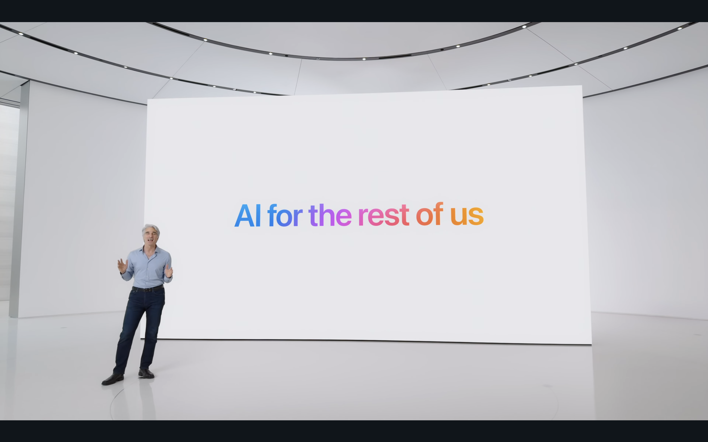
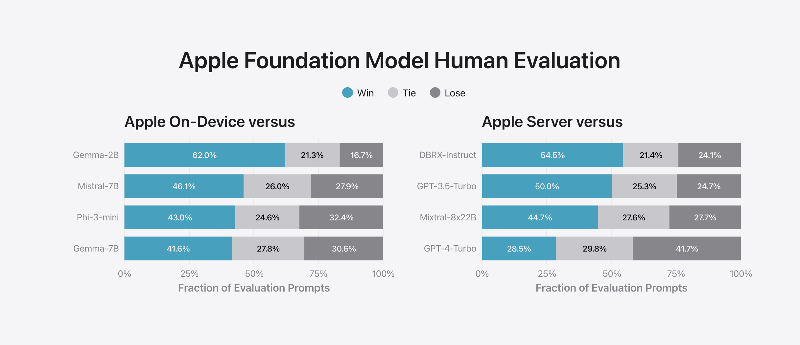
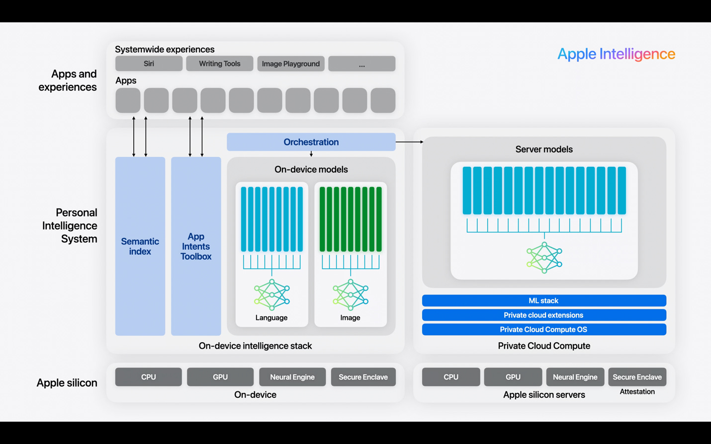
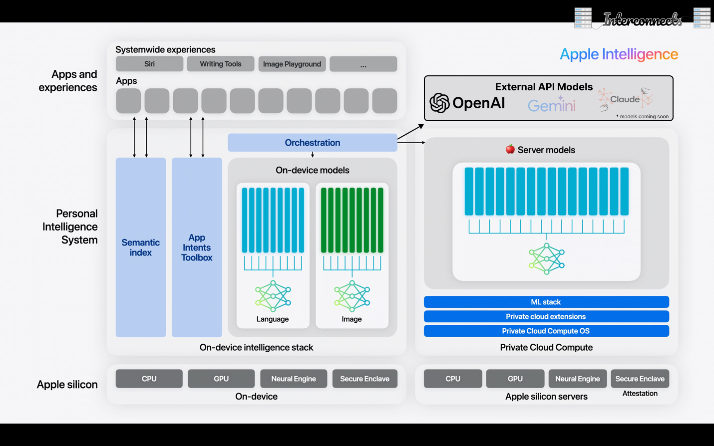

By being quiet in the race for the biggest and most rad foundation models, many people assumed that Apple didn't have anything to contribute to the AI race. After their new announcements, many in the heart of the AI labs still will argue this, forecasting that [a marginal lead on language model performance has an effectively infinite expected value](https://situational-awareness.ai/from-agi-to-superintelligence/#The_power_of_superintelligence). Apple is betting that AI follows paths paved by previous technological revolutions: incremental progress to transformational results.

With a large swath of new features, many of which are built into a new multi-model AI system called [Apple Intelligence](https://www.apple.com/apple-intelligence/), Apple has demonstrated how meaningful AI interactions can be built into every corner of our digital life --- connecting apps and making tasks easier. By executing this well, Apple can guarantee that AI is a force multiplier that keeps even people using their devices longer, rather than pushing them to other upstart companies or competitive products.

Apple's presentation rang very different than most AI keynotes we've seen in the last few years. While OpenAI and Google are trying to *prove* that they are the best at AI, Apple leaned into a narrative of what else we can do with AI. Apple's large suite of new AI features coming this fall across all their devices, enabling automation, information retrieval, and generation in a privacy-conscious way will be the first time that many people meaningfully interact with AI.

This is the latest chapter that the story of the internet is unfolding at the junction between Apple and Meta. Two companies, who should really be compliments, consistently try to one-up and out-position each other. A few months ago with the launch of Llama 3, Meta launched [Meta AI](https://ai.meta.com/meta-ai/), which is generally available and rolling out to Meta's 3 billion users. Meta AI is much more general. It is trying to be a chatbot, entertainment, and an information store. Its competition includes ChatGPT and all the other places people can go for this information. Meta AI should really be integrated next to ChatGPT into operating system features, but this is very unlikely.

Apple's new features will be rolled out on its newest devices (e.g. iPhone 15 Pro and later, M1 Macs and later), which eventually can reach all of their 2 billion users as well. It presents a very different view of what AI is to the general public. Apple is framing what they built as being fundamentally different from ChatGPT, Claude, Meta AI, Gemini results, etc., and it is probably right.

While the many features they announced are interesting, and I will be upgrading my phone this cycle to try them out, they have an extremely high variance on how well they'll land in the final product (e.g. how [Microsoft Recall needed substantial updates post announcement](https://blogs.windows.com/windowsexperience/2024/06/07/update-on-the-recall-preview-feature-for-copilot-pcs/) due to security issues). Photo generation, decent on-device generation, better Siri, textual Siri, webpage summaries, etc. all will serve different audiences. Today, beyond the focus on how transformative it is for billions of people to have access to AI rather than hundreds of millions, I want to dig into the interesting technical details Apple has shared with us.

------------------------------------------------------------------------

## Apple's technical approach

All the evidence in WWDC and related communications, such as a [foundation model blog post](https://machinelearning.apple.com/research/introducing-apple-foundation-models), showcase that Apple is right where it needs to be with AI on the technical side. Given the amount of AI products that are announced and never delivered, passing the bar on technical capabilities via clear communications with the ML community is important for independent monitoring of the performance of top labs (i.e. what I, and many investors, ML nerds, etc. all try to do). I split this summary into three core categories: 1) **Core model performance**, 2) **adapter and on-device strategy**, and 3) **alignment strategies**.

The general approach that Apple is taking is highlighted in this [great 6-minute video from the WWDC keynote](https://x.com/MaxWinebach/status/1800277157135909005). In summary, Apple foundation models focus on personalization (alignment strategies), performance (core models), and size (on-device strategies). Only the last one is orthogonal from other developers out there, but it surely added substantial constraints that inspired the other two.

### Core models: What did Apple build?

There are a lot of details in the blog post about their models, covering everything from safety to summarization to email completion. At the end of the day, most of these evaluations are extremely opaque, so I'm leaning on a lot of trust in the company\'s reputation and general context to make predictions on the actual quality of their models.

The most central figure to my analysis is the Apple human evaluation versus other top language models. This evaluation likely favors Apple by at least a few percentage points. The things they're training these models for are explicitly different than what ChatGPT is --- otherwise, why would Apple have the option to send any prompts to other services? These models are about things that iPhone users already could use AI for. Regardless, the scores are still solid enough to make a strong case.

We can see that the on-device model, which is about 3 billion parameters, performs very well versus other models out there. Models like [Gemma](https://www.interconnects.ai/p/gemma-google-ships-it) and [Phi 3](https://www.interconnects.ai/p/phi-3-and-arctic-llms) are more research or marketing artifacts than models central to future business strategy, so Apple really ought to be crushing models here.

Apple's Server Model is where things get a little more interesting. The models they're comparing to, except GPT-4, mostly are considered B-tier by the community. This looks like 2 years after the ~~release~~ (edit) training of GPT-4, Apple has approximately trained an original GPT-4 level model. This is likely not their ceiling, but the sweet spot they found with respect to their costs --- again, the hardest tasks will be offloaded. Beating models like DBRX and Mixtral 8x22B is not trivial, yet it is where Apple should be. To beat the current GPT-4-Turbo, Apple likely needed to invest way more money than would be worth it (e.g. Meta's GenAI / Metaverse level spending). It was reported that Apple "used a host of licensed content to train and fine-tune their models" like many big tech peers.

There are lots of noteworthy privacy features in the handling of the server model --- [secure enclave](https://support.apple.com/guide/security/secure-enclave-sec59b0b31ff/web), secure boot, encryption, no persistent storage, etc. --- the combination of which Apple is going to make public so security researchers can verify their claims of privacy. Apple is serving this model entirely on its own infrastructure, which is likely the only way this level of privacy could be achieved (so Google may be able to do something similar if they want to too).

### Alignment strategies: Some new things!

I wasn't expecting to write about this, but Apple buried a revealing paragraph about fine-tuning techniques. in their foundation model blog post (emphasis mine):

> We find that data quality is essential to model success, so we utilize a hybrid data strategy in our training pipeline, incorporating both human-annotated and synthetic data, and conduct thorough data curation and filtering procedures. We have developed two novel algorithms in post-training: (1) a **rejection sampling fine-tuning algorithm with teacher committee**, and (2) a reinforcement learning from human feedback **(RLHF) algorithm with mirror descent policy optimization** and a **leave-one-out advantage estimator**. We find that these two algorithms lead to significant improvement in the model's instruction-following quality.

The bookends of this paragraph are pretty standard --- use all the quality data you can get (human and synthetic) and the right algorithm, and you'll get great performance out of your model. The algorithmic details are interesting because they are so specific with respect to existing literature.

First, rejection sampling with the teacher committee looks like an extension of the rejection sampling approach that was used for Llama 2, Llama 3, Qwen 2, and more models. [Rejection sampling](https://arxiv.org/abs/2309.06657) is a simple idea to generate completions from your model, rank them by a reward model (trained separately), and then use the language modeling loss again to fine-tune your model on the top texts. The new thing introduced is a "teacher committee," which is very likely to be building on the extensive work that has been appearing around using [reward model ensembles](https://arxiv.org/abs/2312.09244) (or [merging](https://arxiv.org/abs/2401.12187)) to [improve performance](https://arxiv.org/abs/2401.16635). Ensembles, in principle, improve performance by giving a more robust and or calibrated reward signal.

The second algorithm is far more interesting (and technical, so bear with me). They put a direct reference to an older RL algorithm that never really got a ton of traction (e.g. it isn't implemented in most popular RL libraries) and [mirror descent policy optimization](https://arxiv.org/abs/2005.09814) (MDPO). This algorithm is similar to [proximal policy optimization](https://arxiv.org/abs/1707.06347) (PPO), the algorithm you hear about a lot when people discuss RLHF, but solves the problem in a different way. PPO, and its predecessor [TRPO](https://arxiv.org/abs/1502.05477), optimize what they call a "surrogate objective" that looks like maximizing a value with respect to a constraint on a "trust region." Instead of a constraint, MDPO looks like a penalty (and there are many other details). [Leave-one-out error](https://huggingface.co/blog/putting_rl_back_in_rlhf_with_rloo) is likely an implementation detail of that algorithm that is grounded broadly in ML theory.

The MDPO offers some great intuitions on how the algorithms relate to each other, and how parts of them may impact current RLHF approaches. Let's start with a comparison of PPO and TRPO, from the paper (additions mine):

> PPO takes a more relaxed approach \[than TRPO\] and updates its policies by solving an unconstrained optimization problem in which the ratio of the new to old policies is clipped to remain bounded.

This, though, can result in some numerical issues in practice.

> This phenomenon, which has been reported in ([Wang et al., 2019](https://arxiv.org/abs/1903.07940)) and ([Engstrom et al., 2020](https://arxiv.org/abs/2005.12729)), shows that clipping in PPO does not prevent the policy ratios to go out of bound, but it only reduces its probability. This means that despite using clipping, PPO does not guarantee that the trust-region constraint is always satisfied. In fact, recent results, including those in (Engstrom et al., 2020) and our experiments in Section 5.3, show that most of the improved performance exhibited by PPO is due to code-level optimization techniques, such as learning rate annealing, observation and reward normalization, and in particular, the use of generalized advantage estimation (GAE).

This is essentially saying that PPO works due to implementation tricks and not exactly due to its designed objective, which MDPO tries to fix. The key differences between MDPO and PPO are that:

-   MDPO updates are on the "entire dataset" rather than batches. With this, MDPO can be run in an on-policy and an off-policy manner.

-   MDPO uses a different scheduling of KL distance (which may not exist in the RLHF version relative to the original paper).

-   MDPO uses opposite direction of [KL](https://en.wikipedia.org/wiki/Kullback%E2%80%93Leibler_divergence). The Kullback--Leibler (KL) divergence is a directional measure of distance between two distributions that is not symmetric. PPO does KL distance the old policy to the new policy and MDPO the opposite. Intuitively, this is a change between information gain and loss of the policy, where one direction penalizes the loss of high-probability tokens and the other penalizes the creation of new behaviors. MDPO, being the latter, could potentially explore better.

The key takeaway is that seeing new algorithms for RLHF is exciting because it is very unlikely that the current PPO implementations are actually optimal for our final goals, so this will encourage more experimentation across the industry.

Realistically, all the details aside, Apple is most likely to innovate here due to their deep company culture of creating *personal* products. I'm excited to keep tabs on what they build, as true personalization is a large blindspot in the RLHF literature and discourse.

### Orchestrating adapters and on-device magic

Apple has done a ton of things to put all of this together on their devices. They figured out how to train great models that use just the right amount of memory with quantization, how to train many adapters that work with different apps or styles, how to get fast latency speeds, and much more they didn't talk about. This is very serious ML system engineering of a different flavor than large models and large request count handling.

This on-device stage relies on a lot of groundwork that Apple has built in the past, such as [App Intents](https://developer.apple.com/documentation/appintents), which is a standard way for apps to expose their functionality to automation apps and Siri. Apple has successfully trained a small language model to speak the same functional language. In the WWDC keynote, Apple explained that they focused on fine-tuning specific models for specific tasks, which is likely the 12 categories of applications they will be supporting when this launches.

Apple fine-tuned a batch of adapters for the small model that are loaded into memory when the prompt is detected to need them. What I'm not sure about is how the multi-app sequences showcased in the keynote are handled. When Apple Intelligence is asked "Can I make it to my daughter's play in time," the example Craig used, are each of the adapters loaded sequentially, or are they applied and mixed together? This sort of technical magic I don't expect to get an answer to, but represents a serious investment, especially with the high-quality bar that Apple has.

It's extremely validating for the local model community that a model that takes only 1 GB of memory to load when quantized, and another 3.2GB to run inference for can do so much. As Apple expands the memory footprint of their devices to accommodate a larger AI narrative, they have easy performance to gain by just dropping the quantization levels a bit. For more on this area, check out [the summary on the AI News newsletter](https://buttondown.email/ainews/archive/ainews-talaria-apples-new-mlops-superweapon-4066/) that explains a bit more about the paper Apple published in this area, [Talaria](https://machinelearning.apple.com/research/talaria?utm_source=ainews&utm_medium=email&utm_campaign=ainews-talaria-apples-new-mlops-superweapon-4066).

When you put the Apple Intelligence system together, you end up with this slide from the keynote.

They left out one detail, predictably, which is the handling of the external language models that Apple hopes to commoditize by letting the user choose.

------------------------------------------------------------------------

### Light for other narratives around AI

I'm not the first one to say this, but Apple crushed this presentation (and [the markets agree](https://www.forbes.com/sites/dereksaul/2024/06/11/apple-stock-hits-all-time-high-minting-200-billion-ai-rally/)). More important is [what this means for the future and narratives of AI](https://www.hyperdimensional.co/i/145548687/what-it-means-two-conflicting-visions-of-ais-future). I've been saying for a long time that parties outside of the existential risk community need better narratives around the future of AI's development. Apple\'s succeeding, especially given that [Llama 3 was branded as an "open-source AGI,"](https://www.interconnects.ai/p/llama-3-and-scaling-open-llms) is a great addition to a simple and calibrated discourse of AI. Being able to say "Yes, super powerful AI can be folded into many compelling stories around the future of humanity, but it is also a technology that we use today," will go a long way in policy circles.

------------------------------------------------------------------------

**Housekeeping**

-   Audio of this post is available (soon) in [podcast](https://podcast.interconnects.ai/) form or on [YouTube](https://www.youtube.com/@interconnects).

-   My real podcast is at [retortai.com](http://retortai.com).

-   *Paid subscriber Discord access in email footer.*

-   Referrals → paid sub: Use the [Interconnects Leaderboard](https://www.interconnects.ai/leaderboard).

-   Student discounts in [About page](https://www.interconnects.ai/about).
