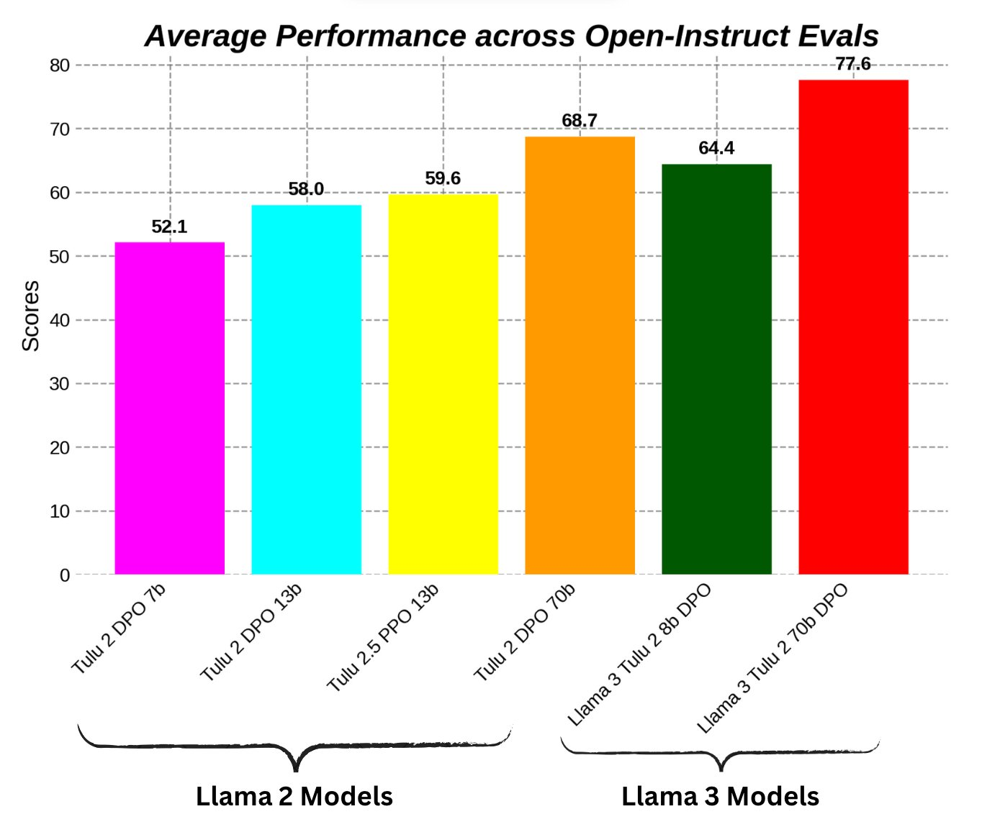

*Audio of this post is available [here](https://podcast.interconnects.ai/episodes/rlhf-roundup-trying-to-get-good-at-ppo-charting-rlhfs-impact-rewardbench-retrospective-and-a-reward-model-competition).*

The open alignment space makes most of its progress in spurts. The last major breakthrough was with [a bunch of models trained with Direct Preference Optimization (DPO) last fall](https://www.interconnects.ai/p/rlhf-progress-scaling-dpo-to-70b). Since then, the situation hasn't changed dramatically --- new codebases are being built, (a few) new datasets have been released, and papers are continuing to flow, but the state of play feels largely the same. Everyone is saying to use variants of "online DPO," but that hasn't materialized into meaningfully better models.

I recently gave a talk on this state of play called "[Life after DPO](https://docs.google.com/presentation/d/1on5xTePaUYg47vui3dUr0Lp6GUXmOXmhceNJLXRbGsE/edit)," where I detailed the sort of work that is needed to make this pace of progress feel faster. With any new academic field, it is expected for progress to feel horizontal and expansive, rather than forward, because more people are joining and making their first contribution to the field. This is expected.

What is less expected is that some prominent friends I have in this space largely think "all of the open-source tools" for doing at-scale RLHF are largely broken. The engineering stack we, being the folks training open-aligned models, use is extremely fickle and out of touch with the techniques that industry is using.

One of the most popular tools (that I helped build a bit while at HuggingFace), TRL, [now has 7 different loss functions just for the DPO trainer](https://github.com/huggingface/trl/blob/7965b7834052ab3d60a1cc5de382e2f56b3772e7/trl/trainer/dpo_trainer.py#L139), with more coming. [The variation between algorithmic variant](https://huggingface.co/blog/pref-tuning)s is normally less than the variation between popular datasets used for alignment. This was one of the in-between-the-lines findings of our recent paper, *[Unpacking DPO and PPO: Disentangling Best Practices for Learning from Preference Feedback](https://arxiv.org/abs/2406.09279)*.

The goal of the paper is to try and figure out if we can make Proximal Policy Optimization (PPO) work more or less "as well as industry says it does." A lot of off-the-record conversations have indicated to me that PPO can outperform DPO by "well more than 5% on average." What isn't accounted for in all of these vibesy conversations is which evaluation suite the comparisons are made over, so we wanted to make sure we weren't holding ourselves back from being stuck to DPO. After a few short grad student weeks[1](#footnote-1){#footnote-anchor-1 .footnote-anchor component-name="FootnoteAnchorToDOM" target="_self"}, we had a working PPO implementation in Jax and machines to get to the bottom of things.

Footnote: A summary of the story of the paper on Llama 2 13B is below evaluated with the [open-instruct](https://github.com/allenai/open-instruct) suite. First, we show a baseline of what DPO performance looks like over the instruction-tuned variant with a noisier dataset, in this case, the classic [Anthropic Helpful and Harmless data](https://huggingface.co/datasets/Anthropic/hh-rlhf), plus 1.3 score. This is largely to compare to "better" data, which in this case is the UltraFeedback dataset that I discussed [last week in my post on synthetic data](https://www.interconnects.ai/i/145870222/pros-and-cons-of-training-on-multi-output-source-synthetic-datasets), plus 2.9 score. Then, we kept the data the same and switched over to our new PPO implementation, plus 1.2 score. After this, we weren't able to reliably extract more performance from two ideas we've heard repeated:

1.  Use a bigger reward model to distill better knowledge into the policy --- in this case a 70B parameter reward model with a 13B policy. This increased some benchmarks but not others, and not reliably.

2.  Adding more reasoning prompts to the mix to improve on reasoning tasks, given all the discussion of RLHF and related methods helping with code and reasoning.

These PPO models, while scoring highly on AlpacaEval length controlled, still are extremely yappy and a little unhinged like models of previous generations. They're a great example of why you cannot blindly trust AlpacaEval scores.

These overall evaluation numbers look pretty meager when you compare them to Llama 3 models, which we also included DPO-trained checkpoints for. Some early experiences, which aren't surprising, with transitioning PPO to other base models is that we haven't had the same success as we have had with Llama 2 base models. These models, especially at 70B parameters are still well below Meta's Llama-3-Instruct model. [Some papers have begun to show up beating Llama-3-Instruct at the 8B scale](https://arxiv.org/abs/2405.07863) (and not only on gamifiable benchmarks like AlpacaEval), but I suspect there's still a solid way to go at the 70B scale with the state of distributed fine-tuning libraries.

These are the first decent models released in quite a while (since maybe [Stable Vicuna](https://huggingface.co/CarperAI/stable-vicuna-13b-delta) last April) that were trained with PPO and in the ballpark of state-of-the-art. **If we are serious about making better open models, continuing to go deeper on fewer algorithms and datasets is needed**. The dataset work will be how the best academics and open-source members differentiate themselves from the noise.

Llama-3-Instruct 70B is a good target for open alignment labs to be able to beat reliably because it has been validated on ChatBotArena, Meta.ai, and many other evals. The only reason I'm optimistic about catching up is that we can [more readily use synthetic data without the threat of substantial litigation from OpenAI or another frontier model provider](https://www.interconnects.ai/i/145870222/synthetic-data-strategy-taxes). For more on these models or methods, you can access the [Tulu 2.5 model suite](https://huggingface.co/collections/allenai/tulu-v25-suite-66676520fd578080e126f618) (Llama 2 base), the [Llama 3 initial Tulu models](https://huggingface.co/collections/hamishivi/tulu-2-llama-3-update-6674a1cbd1bb4d33b5dec246), or the [PPO code for the paper](https://github.com/hamishivi).

------------------------------------------------------------------------

### How big is the impact of RLHF relative to pretraining?

Here's an [interesting plot from Epoch AI](https://epochai.org/blog/ai-capabilities-can-be-significantly-improved-without-expensive-retraining) that tries to illustrate how much improvements in post-training techniques compared to scale, where reinforcement learning from human feedback (RLHF) is the prominent tool. The plot is rather rudimentary, with estimates of a change in the pretraining scale between generations, and aggregated evaluation scores on the y-axis. It is arguing that RLHF can bring something like a recent GPT 3.5 model to be roughly equivalent to the original GPT-4, which was trained largely in 2022. With measurements like [ChatBotArena](https://chat.lmsys.org/), the fact they're illustrating is not true, but the story still holds.

A large amount of success in the frontier models comes through post-training. Llama 3 Instruct even improves metrics like MMLU by almost 2.5 points, which is largely seen as a pretraining metric. There are plenty of other examples that are passed as rumors. RLHF is where most of the fine-tuning to "what the users need" happens.

For this reason, viewing RLHF as an improvement over a previous base model doesn't really make sense. RLHF is about extracting performance from a base model. Still, doing RLHF well is an extremely detail-oriented and tricky process. One must first get a base model of the quality of GPT-4, then they can extract a ton more performance through it with RLHF. This is why post-training is allocated about 50% of the compute of pretraining teams at most frontier labs. It is expensive but worth it.

------------------------------------------------------------------------

### RewardBench retrospective after 100 models and 90% peak accuracy

Since releasing [RewardBench](https://huggingface.co/spaces/allenai/reward-bench), the first generalist evaluation tool for the reward models used to train language models with RLHF, I've talked to many people about how to break through into the mainstream of evaluating language models. We've got confirmation that folks have used RewardBench at Apple, Google, Databricks, Perplexity, Nvidia, and Cohere. Others probably have and have not told us. The primary reasons that it was picked up so fast were:

1.  It was highly specific.

2.  It filled a niche that was entirely empty.

3.  The [code](https://github.com/allenai/reward-bench) was simple and designed for that use case.

Without all of these, the quick traction of a new evaluation tool isn't easy. There are still plenty of things people would like to measure in language models, but evaluations don't exist.

At the time of release, the top models were scoring primarily in the 60 to 70% range with one model above 80%. Today, the leaderboard is much better distributed with a spectrum of models, with the top models crossing 90% performance. It's clear that version two of the evaluation is already needed, one that will last a bit longer. The initial evaluation tool was all about incepting clearer ideas about how people can do an evaluation, the follow-ups are for tools that people can use for years or even decades.

There are [definitely bugs with the RewardBench dataset](https://github.com/allenai/reward-bench/issues/88) and questions as to whether the data is correlated with downstream performance during RLHF, but there's been a clear trend throughout of better models being climbing on the test set.

The most interesting follow-up questions to RewardBench to me are:

-   How do we evaluate reward models like industry does? I hear that most of this is based on reward model agreement with purely human data across similar domains to training.

-   Can reward models replace LLM-as-a-judge? On the leaderboard, reward models are the "classifiers" and LLM-as-a-judge in another way to say a "generative" reward model.

Let me expand on this. Across our testing, reward models predicting scalar scores directly for two chats and ranking them perform much better than asking a generative language model which response was better. This fact has a long-range of trickle-down facts (and was discussed in the recent [Nvidia Nemotron 340B report](https://arxiv.org/html/2406.11704v1)). Reward models are more specialized than most of the generative models people are using for evaluation, which are trained as generally helpful agents.

Reward models only need to predict one token to score a piece of text by being trained as a classifier. To evaluate these responses with a generative language model (the ones we normally use like ChatGPT), the model needs to generate a bunch of tokens and then return a ranking or score. This is extremely inefficient compared to a reward model.

If this trend of reward-model-as-a-judge continues to hold over LLM-as-a-judge, many evaluation tools (e.g. MT Bench, AlpacaEval, Arena-Hard,...) and synthetic preference dataset pipelines will become orders of magnitude cheaper.

**What is the best-case scenario for RewardBench and new evals?**

Evaluation has many tiers of success now, and all of them come with huge upsides. The lowest bar of breakthrough success for evaluations is that every academic paper will use them, such as AlpacaEval and MT Bench. The middle tier is things that breakthrough into the common conversation, such as ChatBotArena. The ultimate tier of useful evaluations are tools that are codified into regulatory or oversight mechanisms in the next few years.

With different tiers of evaluation success comes a different set of players who are interested. Given that reinforcement learning from human feedback is associated with safety, the final goalposts for the best evaluations for fine-tuning could become metrics of places like the U.K. or U.S. Safety Institutes in 2025 (thanks Jack Clark for making me extend my goalposts). To make this bar, the evaluation must show something very specific and actionable. RewardBench isn't currently there, but this points to the datasets and relationships we need to curate if we have ambitious goals.

------------------------------------------------------------------------

### RewardBench reproducibility

I had to go down a long, long rabbit hole to learn the sources of randomness in the reward models we use all the time. I detailed all the technical things that cause potential issues when using RewardBench here:

::: {.digest-post-embed attrs="{\"nodeId\":\"5be161aa-c303-4e20-a213-1d6fc3fdd58c\",\"caption\":\"Recently, we added an inference command line interface (CLI) to RewardBench that made it easy for people to compute agreement of a reward model with any preference dataset. The workflow is as simple as: pip install rewardbench rewardbench --model={yourmodel} --dataset={yourdataset} --batch_size=8\",\"cta\":null,\"showBylines\":true,\"size\":\"sm\",\"isEditorNode\":true,\"title\":\"A case study in reproducibility of evaluation with RewardBench\",\"publishedBylines\":[{\"id\":10472909,\"name\":\"Nathan Lambert\",\"bio\":\"ML scientist (RL, RLHF, society, robotics), athlete, yogi, chef. Writes about ML research.\\nPhD from Berkeley AI, Cornell Lightweight Rowing `17\",\"photo_url\":\"https://substackcdn.com/image/fetch/f_auto,q_auto:good,fl_progressive:steep/https%3A%2F%2Fbucketeer-e05bbc84-baa3-437e-9518-adb32be77984.s3.amazonaws.com%2Fpublic%2Fimages%2Fdda47b96-836a-4b95-99a0-f0ec744d4245_2316x2316.jpeg\",\"is_guest\":false,\"bestseller_tier\":100}],\"post_date\":\"2024-06-07T17:46:04.747Z\",\"cover_image\":\"https://substackcdn.com/image/fetch/f_auto,q_auto:good,fl_progressive:steep/https%3A%2F%2Fsubstack-post-media.s3.amazonaws.com%2Fpublic%2Fimages%2F95af3145-2905-4cc6-abf2-ef689860d80b_1304x886.png\",\"cover_image_alt\":null,\"canonical_url\":\"https://www.interconnects.ai/p/reward-bench-reproducibility\",\"section_name\":null,\"video_upload_id\":null,\"id\":145419588,\"type\":\"newsletter\",\"reaction_count\":2,\"comment_count\":0,\"publication_name\":\"Interconnects\",\"publication_logo_url\":\"https://substackcdn.com/image/fetch/f_auto,q_auto:good,fl_progressive:steep/https%3A%2F%2Fsubstack-post-media.s3.amazonaws.com%2Fpublic%2Fimages%2Fe70f9dbf-4fe6-404c-b6bb-1831d1b7ed0b_590x590.png\",\"belowTheFold\":true}"}
:::

------------------------------------------------------------------------

### LMSYS\'s reward modeling competition

LMSYS has teamed up with Kaggle to organize a [competition](https://lmsys.org/blog/2024-05-02-kaggle-competition/) with some of the data obtained from ChatBotArena. Broadly, the task is to predict which model response will win given a specific question. From LMSYS:

> LMSYS and Kaggle are launching a human preference prediction competition! You are challenged to predict which responses users will prefer in head-to-head battles between Large Language Models (LLMs). You\'ll work with a dataset from the [Chatbot Arena](https://chat.lmsys.org/), containing conversations and user preferences across various LLMs. By developing a model that accurately predicts human preferences, you\'ll contribute to improving chatbot performance and alignment with user expectations. The training dataset includes over 55,000 real-world user and LLM conversations and user preferences, with personally identifiable information removed. Your solution submission will be tested on a hidden test set of 25,000 samples. The dataset includes real-world conversations with over 70 state-of-the-art LLMs, such as GPT-4, Claude 2, Llama 2, Gemini, and Mistral models.

With everything that has been discussed with ChatBotArena above, I expect this task to be extremely tricky. Skimming through prompts in the dataset shows extreme diversity. This diversity simply adds noise to the test set and lowers the maximum possible accuracy.

This is a great initiative for academic progress, where the preference learning task can be tested on real data with an additional charge that isn't normally used in the reinforcement learning from human feedback (RLHF) process --- the addition of ties. The task is to predict the probability of either model winning or a tie. A simple solution to adapt a reward model to this would be to just increase the probability of tie if the probabilities of response A and response B are high because the training objective for reward models is designed to have the reward outputted be proportional to the probability of choosing that individual piece of text.

Adding the presence of ties makes the reward models coming out of this competition much harder to use for downstream alignment as a plug-and-play addition. However, being able to handle ties robustly and output multiple classes given a specific completion will be crucial to having more calibrated preference models. Calibration in the ML community is the study of learning probability distributions that are actually smooth and add up to one, rather than outputting numbers that are proportional to probabilities and often need more smoothing out later. Calibration of outputs in reward models would make it much easier to confidently compare the various beliefs and principles embedded in reward models.

Broadly, yes, this is a reward modeling competition which is exciting! I expect the solution to be LLM-based, probably from Llama 3. The competition runs through July.

------------------------------------------------------------------------

**Housekeeping**

-   Audio of this post is available (soon) in [podcast](https://podcast.interconnects.ai/) form (or previous posts on [YouTube](https://www.youtube.com/@interconnects), I've paused new generation).

-   My real podcast is at [retortai.com](http://retortai.com).

-   *Paid subscriber Discord access in email footer.*

-   Referrals → paid sub: Use the [Interconnects Leaderboard](https://www.interconnects.ai/leaderboard).

-   Student discounts in [About page](https://www.interconnects.ai/about).

:::: {.footnote component-name="FootnoteToDOM"}
[1](#footnote-anchor-1){#footnote-1 .footnote-number contenteditable="false" target="_self"}

::: footnote-content
This was definitely not easy. I am still very impressed.
:::
::::
