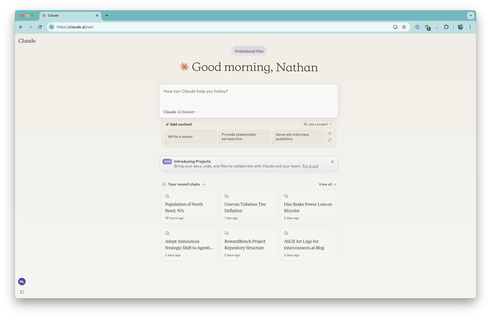
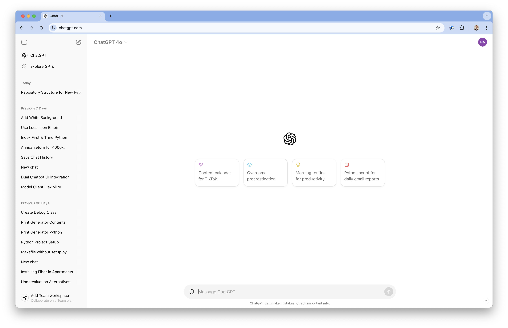
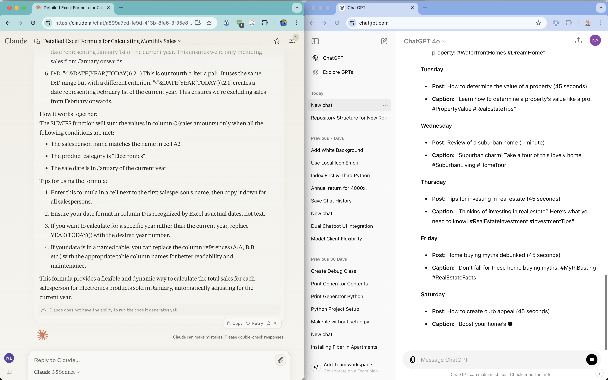
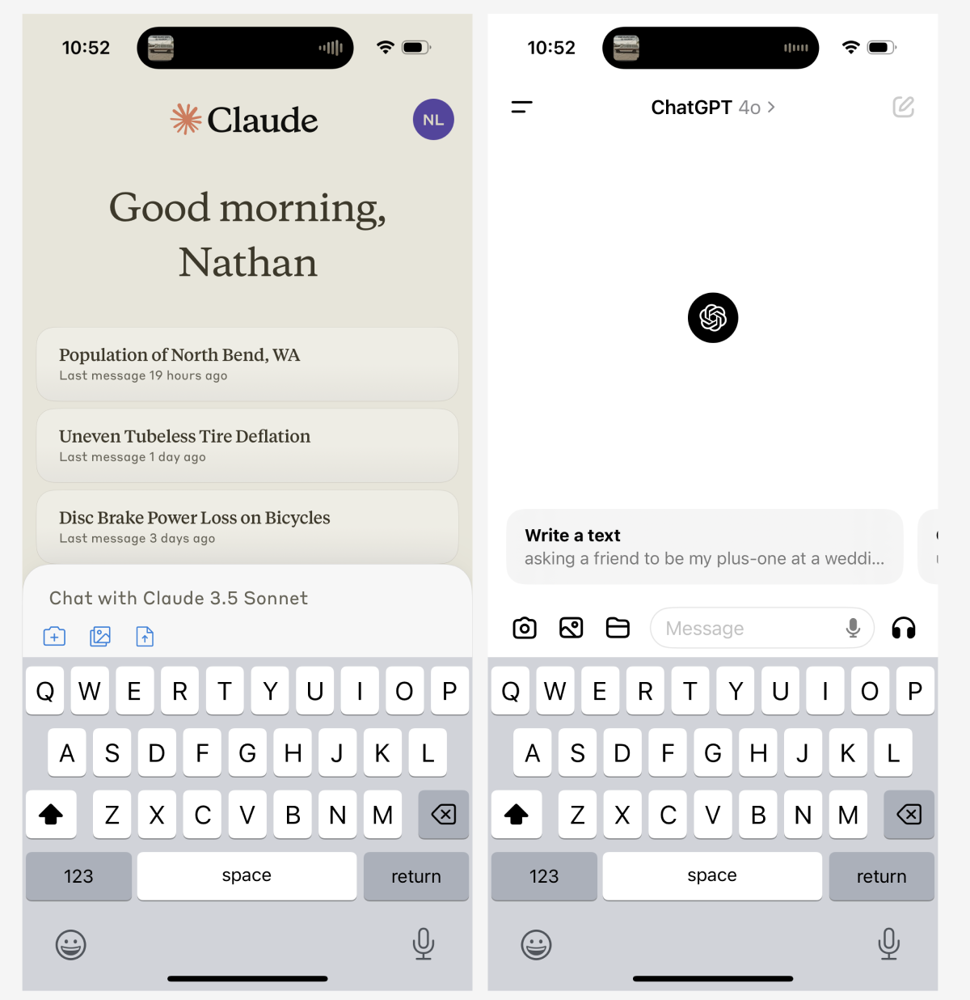

*Audio version available [here](https://podcast.interconnects.ai/episodes/switched-to-claude-3-5).*

There isn't a higher value signal for a post-training researcher than the impressions, prompts, and vibes that convince a user to move to another model as their primary daily driver. Now that the three leading labs, [OpenAI, Anthropic, and Google, largely all have models of a similar caliber](https://www.oneusefulthing.org/p/which-ai-should-i-use-superpowers), we've entered a state of play where people know they can go elsewhere. Even before [Claude 3.5 was released](https://www.anthropic.com/news/claude-3-5-sonnet), many people had switched to Claude just for its superior coding capabilities. Claude 3 alone wasn't enough to unstick me. It was obvious that on paper the model was better, but that wasn't enough to warrant a switch.

When model capabilities are stagnant for longer it's much easier to deeply understand if a model is or is not serving you. Claude 3.5 just does what I need a few percentage points more reliably than ChatGPT, still using GPT-4 and not GPT-4o, which made it easy to start going there first.

Claude 3.5's release is characterized by doing a lot of the little things needed to serve a successful model better --- faster, clearer, and more consistent --- [making distillation a popular technique for top labs these days](https://www.interconnects.ai/i/145870222/are-gemini-flash-and-claude-haiku-distilled).

Beyond the base metrics and throughput, Anthropic's models consistently feel like the one with the strongest personality, and it happens to be a personality that I like. This type of style is likely due to focused and effective fine-tuning. The sort of thing where everyone on the team is in strong agreement with what the model should sound like.

The closest thing we have to a [model specification](https://www.interconnects.ai/p/openai-rlhf-model-spec) from Anthropic is listening to one of their alignment leads [Amanda Askell talk about "what a model's personality should be](https://m.youtube.com/watch?v=iyJj9RxSsBY&embeds_referring_euri=https%3A%2F%2Fradicaldatascience.wordpress.com%2F&feature=emb_imp_woyt)," or [reading the model's system prompt](https://x.com/AmandaAskell/status/1765207842993434880?lang=en). The Claude models are focused on being helpful, charitable, and honest and it shines through. At the same time, OpenAI's model spec reads as being very dry and about following the rules.

At the time of the Claude 2.1 launch, Anthropic actually got a lot of pushback to its efforts to make the model more honest [by reducing answers to questions the model doesn't know](https://x.com/AnthropicAI/status/1727001779890749809). Adding refusals is bait for the general AI commentariat. With the benefit of hindsight, this feels like the groundwork for something that we now love about Claude 3.5 --- it is the best model for staying precisely on topic with my instructions. I suspect this goes hand in hand with the model knowing what it knows.

People seem to think that most of these gains (including what is happening at OpenAI) are from improvements in post-training methods like reinforcement learning from human feedback (RLHF). I commend Anthropic for leaning into their personality traits and understanding how that contextualizes the information we get from the model. In my recent post on *[How RLHF Works](https://www.interconnects.ai/p/how-rlhf-works-2)*, I explained why this is so important:

> Style is a never-ending source of human value, it's why retelling stories can result in new bestselling books (such as Sapiens), and it is a fundamental part of continuing to progress our intellectual ecosystem. Style is intertwined with what the information is.

Some ways you can see the style of Claude 3.5 include:

-   It is more assistant-like, asking "Should I do X" at the end of an answer to simple questions or requests.

-   Having a tone that is focused and particular with it's words, as opposed to the sometimes unnecessary verbosity of ChatGPT's recent models. I see this in some of the more flavored filler like "that makes sense" when correcting a typo in my question.

-   Being quicker to drop all placeholder text when asked clearly to solve a task and not contextualize in text.

This means some of the failure modes that annoy people with ChatGPT, like the system trying to generate an image when you ask about an image input you gave it or adding "your code here" to a text answer, have yet to plague me in a week or so of heavy use with Claude. In this vein, it seemed like Claude just had a shorter learning curve. Getting ChatGPT right for me involved a bunch of work like "no yapping" or formatting prompts right. I just throw everything at Claude and it usually sticks.

Being clearer really makes me think that Claude right now is the intelligent person's assistant, where it's doing exactly what we want without additional information. It's fun, but not masquerading on trying to impress anyone with an answer that "is what an AI should look like" to people accustomed to ChatGPT. The things holding Claude back are product features and polish.

### Product priorities

A lot of people criticize Anthropic's user interface (and other product features) for not being as good as ChatGPT, but in reality, they're conflating design with execution. To me, the Claude interface is cleaner and more intuitive, but it definitely lacks some features that people may be used to in ChatGPT's. First, here's Claude's interface.

What I see is ChatGPT taking a bit better use of space, but putting the text box front and center is the easiest way to get people to use it, which Google has done forever.

The information density when generating is also higher for Claude than ChatGPT (where ChatGPT was generating a crazy long answer for one of their own examples, wildly enough).

The iOS apps for Claude and ChatGPT mirror the characteristics of the web apps. Here's a comparison of them.

Using Claude I'm losing out on some image generation capabilities and being able to run code as easily, but the upsides still outweigh it for me. Anthropic seems to be very close to adding a lot of these features anyway, with [Artifacts](https://www.youtube.com/watch?v=rHqk0ZGb6qo) being a v0.

The missing link in this conversation is Google, which I use when analyzing large files like full podcast episodes for generating chapters and show notes. Gemini's [new app page](https://gemini.google.com/) I found when researching this article, but for some reason, I thought I was supposed to be using [Google AI Studio](https://aistudio.google.com/), which is simply behind all the others. My confusion is likely not alone and reflective of Google being a bit slow and messy booting up in the AI race. They're doing better now, but have to clean up previously lacking clarity.

### RLHF's peak?

It's easy for me to paint a narrative around post-training methods like RLHF becoming increasingly important to the state-of-the-art models people use, given my personal likelihood to benefit from that, but it is somewhat misleading. Given that methods like RLHF are largely used to extract performance potential from a base model, it is natural that as we age towards the end of this generation of models, based on compute infrastructure, post-training reaches its zenith in influence and cultural awareness --- at least for this model cycle.

In reality, when GPT-5 and the Ultra/Opus class models are released into the world with fast and free inference, the discussion will again flip back to data and scaling. Data is the only constant here, where the majority of industrial post-training gains likely come from carefully curated data for the prompts that users care about.

Increasingly, datasets we used to reserve for instruction fine-tuning after the large-scale pretraining are now being used in "late pretraining" to give the model general notions of instruction following. As we get a better sense of the important preference datasets for how people use models today, we'll scale them up and include them in pretraining too. RLHF is always going to be a successful tool because it can adapt to new needs and include them in the model. I don't think this is where most of the capabilities the user sees come from.

For more reading on Claude 3.5 Sonnet, you can check out [The Zvi](https://thezvi.substack.com/p/on-claude-35-sonnet). Claude is number 1 or close to it on most of the leaderboards, from [Scale AI's](https://scale.com/leaderboard) to [ChatBotArena](https://chat.lmsys.org/?leaderboard).

------------------------------------------------------------------------

**Housekeeping**

-   Audio of this post is available (soon) in [podcast](https://podcast.interconnects.ai/) form (or previous posts on [YouTube](https://www.youtube.com/@interconnects), I've paused new generation).

-   My real podcast is at [retortai.com](http://retortai.com).

-   *Paid subscriber Discord access in email footer.*

-   Referrals → paid sub: Use the [Interconnects Leaderboard](https://www.interconnects.ai/leaderboard).

-   Student discounts in [About page](https://www.interconnects.ai/about).
