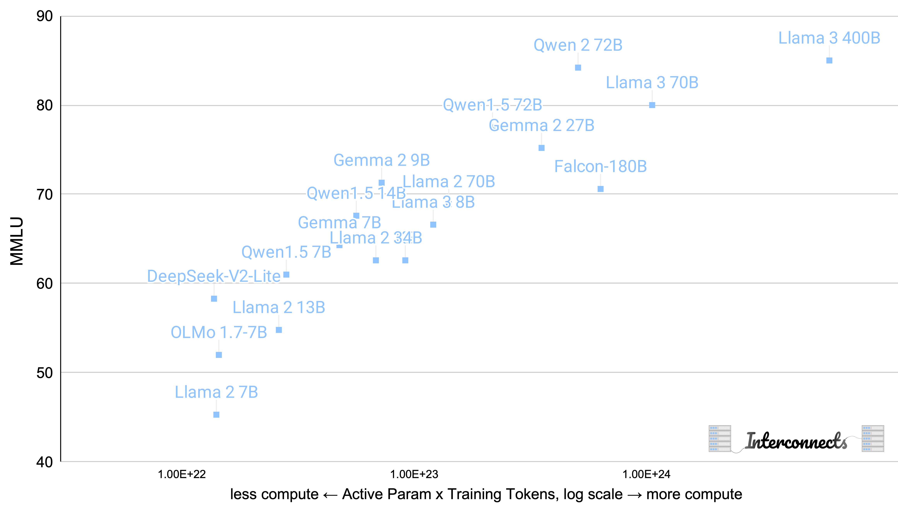
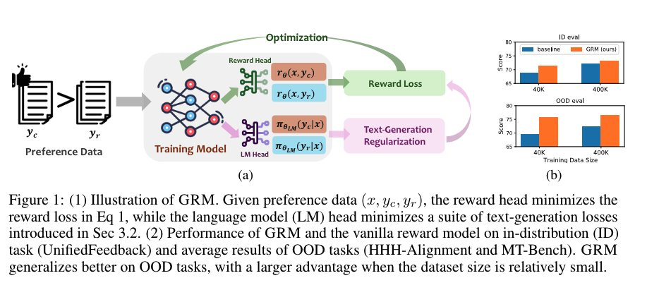
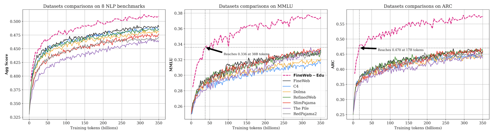

*Previous Issues: [#1 - May 2024](https://www.interconnects.ai/p/artifacts-log-1)*

There are no signs of open models slowing down. Tons of models. Tons of topics. The biggest stories are [Nemotron 340B](https://huggingface.co/nvidia/Nemotron-4-340B-Instruct) from Nvidia, which I discussed at length in my [recent post on synthetic data](https://www.interconnects.ai/p/frontiers-in-synthetic-data), and Gemma 2 from Google, which I haven't covered directly until now. Gemma 2 is a very serious model that beats Llama 3 Instruct on ChatBotArena. The [technical report](https://storage.googleapis.com/deepmind-media/gemma/gemma-2-report.pdf) has a lot of pointers to novel techniques but not a lot of answers for how others could do this too.

The open model ecosystem is clearly healthy.

Given the amount of models, I've broken them down by category. Models at the top of the lists are those that are most interesting and some models are filtered out for length of the issue.

### General-use text models

-   **[gemma-2-27b](https://huggingface.co/google/gemma-2-27b)** by [google](https://huggingface.co/google): This is a serious model. I could write a speculative post about each of the sections in the report. In summary, it [evaluated on ChatBotArena well](https://x.com/JeffDean/status/1807407880766726464), is [trained on LMSYS data](https://x.com/natolambert/status/1806384821826109597), is distilled similarly to Gemini (probably, as [discussed in my recent post](https://www.interconnects.ai/p/frontiers-in-synthetic-data)), uses model merging during fine-tuning, uses an order of magnitude larger reward model for RLHF (\>100B parameters), uses synthetic and human data, and is a reasonable size for inference on one 80GB memory GPU. Read more in the [technical report here](https://storage.googleapis.com/deepmind-media/gemma/gemma-2-report.pdf).

    \
    Otherwise, I seriously expect future Gemma models to replace a lot of Llama models in workflows. Google shows every intention of putting a lot of weight behind these, which is fantastic to see. Hopefully it can continue.\
    For more on Gemma 2, see [this post from HuggingFace](https://huggingface.co/blog/gemma2).

-   **[Qwen2-72B-Instruct](https://huggingface.co/Qwen/Qwen2-72B-Instruct)** by [Qwen](https://huggingface.co/Qwen): Another very strong and recent open model. The instruct version came in around the same level of Command R Plus, but is the top open-weight Chinese model on LMSYS. Two API models, Yi-Large and GLM-4-0520 are still ahead of it (but we don't know what they are).

-   **[DeepSeek-V2-Lite](https://huggingface.co/deepseek-ai/DeepSeek-V2-Lite)** by [deepseek-ai](https://huggingface.co/deepseek-ai): Another great chat model from Chinese open model contributors. Consistently, the 01-ai, DeepSeek, and Qwen teams are shipping great models This DeepSeek model has "16B total params, 2.4B active params" and is trained on 5.7 trillion tokens. This is a great size for many people to play with.

-   **[K2](https://huggingface.co/LLM360/K2)** by [LLM360](https://huggingface.co/LLM360): A 65B "fully open-source" model. This model reaches similar performance to Llama 2 70B and uses less compute (only 1.4 trillion tokens).

I've added these models and some of their recent peers to the MMLU model. Models are continuing to climb the compute efficiency frontier (especially when you compare to models like Llama 2 and Falcon 180B that are recent memories).

-   **[neo_7b](https://huggingface.co/m-a-p/neo_7b)** by [m-a-p](https://huggingface.co/m-a-p): Another open-source model (at least they include data, I haven't looked at the code). It's great to have more competition and peers to learn from for OLMo.

-   **[Mistral-7B-Instruct-v0.3](https://huggingface.co/mistralai/Mistral-7B-Instruct-v0.3)** by [mistralai](https://huggingface.co/mistralai): Mistral is still improving their small models while we're waiting to see what their strategy update is with the likes of Llama 3 and Gemma 2 out there.

-   **[openchat-3.6-8b-20240522](https://huggingface.co/openchat/openchat-3.6-8b-20240522)** by [openchat](https://huggingface.co/openchat): These openchat models are really popular with researchers doing RLHF. They are strong base models to do continued RLHF or reward modeling on, and here's the latest version!

-   **[Phi-3-medium-4k-instruct,](https://huggingface.co/microsoft/Phi-3-medium-4k-instruct) [Phi-3-small-8k-instruct](https://huggingface.co/microsoft/Phi-3-small-8k-instruct)**, and the rest of the Phi family by [microsoft](https://huggingface.co/microsoft): We knew these models were coming, but they're solid for trying tasks like data filtering, local fine-tuning, and more on.

### Reward models

-   **[llemma-7b-prm-metamath-level-1to3-hf](https://huggingface.co/ScalableMath/llemma-7b-prm-metamath-level-1to3-hf)** by [ScalableMath](https://huggingface.co/ScalableMath): While process reward models (PRMs) --- reward models that score each step in a reasoning chain) are documented by OpenAI as being really helpful for model reasoning capabilities ([more in my Q\* post](https://www.interconnects.ai/i/139117155/fine-grained-reward-labels-in-generation-process-reward-models-prm)), there really are almost *none* on HuggingFace. I was scraping for them, and found this one organization has a couple!

-   **[GRM-llama3-8B-distill](https://huggingface.co/Ray2333/GRM-llama3-8B-distill)** by [Ray2333](https://huggingface.co/Ray2333): This model comes from a [new paper](https://arxiv.org/abs/2406.10216) that adds some language model loss functions (DPO loss, reference free DPO, and SFT - like InstructGPT) to reward model training for RLHF. It show strong results on RewardBench and downstream RLHF performance. This is close to what I\'ve heard from some industry labs regarding RM training, so I'm happy to see this.

### Datasets

-   **[HelpSteer2](https://huggingface.co/datasets/nvidia/HelpSteer2)** by [nvidia](https://huggingface.co/nvidia): It's rare that we get access to a dataset created by one of the big data labelling labs (they push pretty hard against open-sourcing in my experience, in order to protect their business model). This dataset, and particularly the accompanying paper, is a dense resource filled with insights on how state-of-the-art fine-tuning may actually work in industry labs.

-   **[fineweb-edu](https://huggingface.co/datasets/HuggingFaceFW/fineweb-edu)** by [HuggingFaceFW](https://huggingface.co/HuggingFaceFW): This is the "high-quality" split of the recent well-received pretraining corpus from HuggingFace. The split was created by training a classifier on Llama 3 70B to identify educational style content. This type of filtering is on a fast track to being used everywhere (along with distillation from a bigger model in training).

### Domain-specific fine-tunes

-   **[aya-23-35B](https://huggingface.co/CohereForAI/aya-23-35B)** by [CohereForAI](https://huggingface.co/CohereForAI): Cohere updated their [original Aya model](https://huggingface.co/CohereForAI/aya-101) with fewer languages and using their own base model (Command R, while the original model was trained on top of T5).

-   **[TowerBase-7B-v0.1](https://huggingface.co/Unbabel/TowerBase-7B-v0.1)** by [Unbabel](https://huggingface.co/Unbabel): A multilingual continue training of Llama 2 7B, importantly it "maintains the performance" on English tasks. This is a domain I expect things to expand on.

-   **[Llama3-8B-Chinese-Chat](https://huggingface.co/shenzhi-wang/Llama3-8B-Chinese-Chat)** by [shenzhi-wang](https://huggingface.co/shenzhi-wang): A Chinese focused Llama 3.

-   **[Swallow-70b-instruct-v0.1](https://huggingface.co/tokyotech-llm/Swallow-70b-instruct-v0.1)** by [tokyotech-llm](https://huggingface.co/tokyotech-llm): A Japanese focused Llama 2 model.

-   **[internlm2-math-plus-mixtral8x22b](https://huggingface.co/internlm/internlm2-math-plus-mixtral8x22b)** by [internlm](https://huggingface.co/internlm): Next model in the popular series of math models.

-   **[scitulu-70b](https://huggingface.co/allenai/scitulu-70b)** by [allenai](https://huggingface.co/allenai): A Llama 2 fine-tune designed to specialized on scientific information extraction and processing tasks. Built on top of our [Tulu 2 work](https://arxiv.org/abs/2311.10702)!

-   **[DeepSeek-Coder-V2-Instruct](https://huggingface.co/deepseek-ai/DeepSeek-Coder-V2-Instruct)** by [deepseek-ai](https://huggingface.co/deepseek-ai): A super popular new coding model. Evals on coding specific models like this are tending to match or pass the API-based general models. I haven't given them a shot yet.

### Visual language models (VLMs)

-   **[Llama-3-8B-Dragonfly-v1](https://huggingface.co/togethercomputer/Llama-3-8B-Dragonfly-v1)** by [togethercomputer](https://huggingface.co/togethercomputer) and **[MiniCPM-Llama3-V-2_5](https://huggingface.co/openbmb/MiniCPM-Llama3-V-2_5)** by [openbmb](https://huggingface.co/openbmb): Two new late-fusion VLMs built on the Llama 3 8B backbone. Please reach out if you have experience with these

-   **[Phi-3-vision-128k-instruct](https://huggingface.co/microsoft/Phi-3-vision-128k-instruct)** by [microsoft](https://huggingface.co/microsoft): Reminder that Phi had a vision version!

### Other models I flagged

-   **[CommonCanvas-XL-C](https://huggingface.co/common-canvas/CommonCanvas-XL-C)** by [common-canvas](https://huggingface.co/common-canvas): A text-to-image model with better data traceability. From the model card: "The goal is to produce a model that is competitive with Stable Diffusion 2, but to do so using an easily accessible dataset of known provenance. Doing so makes replicating the model significantly easier, and provides a clearer mechanism for applying training-data attribution techniques."

-   **[Skywork-MoE-Base](https://huggingface.co/Skywork/Skywork-MoE-Base)** by [Skywork](https://huggingface.co/Skywork): Another MoE model.

-   **[mamba2-2.7b](https://huggingface.co/state-spaces/mamba2-2.7b)** by [state-spaces](https://huggingface.co/state-spaces): [Mamba](https://www.interconnects.ai/i/139943907/mamba-and-efficient-compute-for-rnns) v2!

-   **[Zamba-7B-v1](https://huggingface.co/Zyphra/Zamba-7B-v1)** by [Zyphra](https://huggingface.co/Zyphra): A hybrid model (like StripedHyena) with Mamba and Transformer blocks.

-   **[Yuan2-M32-hf](https://huggingface.co/IEITYuan/Yuan2-M32-hf)** by [IEITYuan](https://huggingface.co/IEITYuan): Another MoE model.

-   **[glm-4-9b-chat](https://huggingface.co/THUDM/glm-4-9b-chat)** by [THUDM](https://huggingface.co/THUDM): A really popular Chinese chat model I couldn't parse much from r/LocalLLaMA on.

-   **[esm3-sm-open-v1](https://huggingface.co/EvolutionaryScale/esm3-sm-open-v1)** by [EvolutionaryScale](https://huggingface.co/EvolutionaryScale): A giant model for protein prediction from a new high valuation startup.

-   **[Hermes-2-Theta-Llama-3-70B](https://huggingface.co/NousResearch/Hermes-2-Theta-Llama-3-70B)** by [NousResearch](https://huggingface.co/NousResearch): A general chat model from one of the normal fine-tuning groups!

------------------------------------------------------------------------

**Links**

-   This commencement speech from Grant Sanderson of 3Blue1Brown fame was one of the best I've ever watched. Nails a lot on how to navigate a career and early life.

:::::::: {#youtube2-W3I3kAg2J7w .youtube-wrap attrs="{\"videoId\":\"W3I3kAg2J7w\",\"startTime\":null,\"endTime\":null}" component-name="Youtube2ToDOM"}
::::::: youtube-inner
:::::: iframe
::: {#player}
:::

:::: player-unavailable
# An error occurred. {#an-error-occurred. .message}

::: submessage
[Try watching this video on www.youtube.com](https://www.youtube.com/watch?v=W3I3kAg2J7w){target="_blank"}, or enable JavaScript if it is disabled in your browser.
:::
::::
::::::
:::::::
::::::::

-   I enjoyed this article on "[The importance to stupidity in scientific research](https://journals.biologists.com/jcs/article/121/11/1771/30038/The-importance-of-stupidity-in-scientific-research)." Too much of modern ML is about grinding.

**Elsewhere from me**

I was on a couple podcasts recently.

-   In late May I was on the ChinaTalk podcast to discuss the GPT-4o launch, DC vibes on open source, China and opensource, etc.

:::::::::::::::::: iframe
::::::::::::::::: {#__next}
:::::::::::::::: {style="--image-src:url('https://image-cdn-ak.spotifycdn.com/image/ab67656300005f1f0df3df2ca32db938fdc6490d')" testid="main-page"}
::::::::::::::: {.encore-dark-theme .encore-layout-themes .EpisodeOrShowWidget_widgetContainer__pXtAi testid="embed-widget-container" style="--dynamic-opacity:1;--dynamic-background-base:rgba(158, 3, 38, 255);--dynamic-background-tinted:rgba(97, 0, 12, 255);--dynamic-background-tinted-50:rgba(97, 0, 12, 0.5);--background-base:rgba(158, 3, 38, 255);--background-tinted:rgba(97, 0, 12, 255);--text-base:rgba(255, 255, 255, 255);--text-bright-accent:rgba(255, 255, 255, 255);--text-subdued:rgba(255, 189, 187, 255)"}
::: BackgroundColorContainer_backgroundColorContainer__YZSQ7
:::

::::::::::::: {.EpisodeOrShowWidget_singleGridContainer__PY2uT testid="initialized-false"}
:::: EpisodeOrShowWidget_coverArtContainer__65Ei9
::: {.CoverArtBase_coverArt__ne0XI .CoverArtSingle_coverArtSingle__KLcKa aria-hidden="true"}
:::
::::

::: EpisodeOrShowWidget_spotifyLogoContainer__UqGD_
[![](data:image/svg+xml;base64,PHN2ZyBkYXRhLWVuY29yZS1pZD0iaWNvbiIgcm9sZT0iaW1nIiBhcmlhLWhpZGRlbj0idHJ1ZSIgY2xhc3M9ImUtOTEwNjEtaWNvbiBlLTkxMDYxLWJhc2VsaW5lIiBzdHlsZT0iLS1lbmNvcmUtaWNvbi1maWxsOnZhcigtLXRleHQtYmFzZSwgIzAwMDAwMCk7LS1lbmNvcmUtaWNvbi1oZWlnaHQ6dmFyKC0tZW5jb3JlLWdyYXBoaWMtc2l6ZS1kZWNvcmF0aXZlLWxhcmdlcik7LS1lbmNvcmUtaWNvbi13aWR0aDp2YXIoLS1lbmNvcmUtZ3JhcGhpYy1zaXplLWRlY29yYXRpdmUtbGFyZ2VyKSIgdmlld2JveD0iMCAwIDI0IDI0Ij48cGF0aCBkPSJNMTIuNDM4IDEuMDA5QzYuMzY4Ljc2OSAxLjI1MSA1LjQ5NCAxLjAwOCAxMS41NjVjLS4yNCA2LjA3IDQuNDg1IDExLjE4NiAxMC41NTYgMTEuNDI2IDYuMDcuMjQyIDExLjE4NS00LjQ4NCAxMS40MjctMTAuNTU0UzE4LjUwNyAxLjI1MSAxMi40MzggMS4wMDltNC42NDQgMTYuMTE0YS42NTcuNjU3IDAgMCAxLS44OTcuMjQ2IDEzLjIgMTMuMiAwIDAgMC00LjcxLTEuNjAyIDEzLjIgMTMuMiAwIDAgMC00Ljk2OC4yNDIuNjU4LjY1OCAwIDAgMS0uMzEtMS4yNzggMTQuNSAxNC41IDAgMCAxIDUuNDYtLjI2NWMxLjgzNy4yNTcgMy41NzkuODUxIDUuMTc3IDEuNzYuMzE1LjE3OC40MjUuNTguMjQ2Ljg5NnptMS40NDUtMi44ODdhLjg1My44NTMgMCAwIDEtMS4xNTguMzQ0IDE2LjIgMTYuMiAwIDAgMC01LjQ3NS0xLjc5NyAxNi4yIDE2LjIgMCAwIDAtNS43NTguMjE5Ljg1NS44NTUgMCAwIDEtMS4wMTgtLjY1Ljg1Ljg1IDAgMCAxIC42NS0xLjAxOCAxNy45IDE3LjkgMCAwIDEgNi4zNjItLjI0MSAxNy45IDE3LjkgMCAwIDEgNi4wNDkgMS45ODVjLjQxNS4yMjQuNTcuNzQzLjM0NCAxLjE1OHptMS42MDItMy4yNTVhMS4wNSAxLjA1IDAgMCAxLTEuNDE4LjQ0OCAxOS43IDE5LjcgMCAwIDAtNi4zNDEtMi4wMjUgMTkuNiAxOS42IDAgMCAwLTYuNjU1LjE5OSAxLjA1IDEuMDUgMCAxIDEtLjQxNy0yLjA2IDIxLjcgMjEuNyAwIDAgMSA3LjM2NC0uMjIgMjEuNyAyMS43IDAgMCAxIDcuMDE5IDIuMjRjLjUxNS4yNjguNzE1LjkwMy40NDggMS40MTgiIC8+PC9zdmc+){.e-91061-icon .e-91061-baseline}](https://open.spotify.com "Play on Spotify"){role="button" aria-label="Play on Spotify" testid="spotify-logo"}
:::

::::::::: EpisodeOrShowWidget_metadataWrapper__pJ9rE
#  {#section .e-91061-text .encore-text-body-medium .TitleAndSubtitle_title__Nwyku encore-id="text" testid="entity-title"}

::::: {.Marquee_container__CV7du title="AI Roundup: GPT4o, SCSP AI Expo, Open vs Closed"}
:::: Marquee_scrollableContainer__mcSox
::: Marquee_inner__UKCZf
[AI Roundup: GPT4o, SCSP AI Expo, Open vs Closed](){.e-91061-text-link .e-91061-baseline .e-91061-overflow-wrap-anywhere .encore-internal-color-text-base .e-91061-text-link--standalone .e-91061-text-link--use-focus encore-id="textLink"}
:::
::::
:::::

[]{.EpisodeOrShowWidget_labelsAndSubtitle__Ke6t9}

##  {#section-1 .TitleAndSubtitle_subtitle__P1cxq}

::::: {.Marquee_container__CV7du title="AI Roundup: GPT4o, SCSP AI Expo, Open vs Closed"}
:::: Marquee_scrollableContainer__mcSox
::: Marquee_inner__UKCZf
[[·]{.e-91061-text .encore-text-body-small-bold .encore-internal-color-text-subdued .TitleAndSubtitle_separator__4WdMW encore-id="text" aria-hidden="true"}[[ChinaTalk](){.e-91061-text-link .e-91061-baseline .e-91061-overflow-wrap-anywhere .encore-internal-color-text-subdued .e-91061-text-link--standalone .e-91061-text-link--use-focus encore-id="textLink" dir="auto"}]{.e-91061-text .encore-text-body-medium encore-id="text"}]{.TitleAndSubtitle_wrapper__xndXC}
:::
::::
:::::
:::::::::
:::::::::::::
:::::::::::::::
::::::::::::::::
:::::::::::::::::
::::::::::::::::::

-   In June I was on SuperDataScience to cover recent happenings in the space of RLHF. Covering normal topics: DPO, personalization, robotic foundation models, etc.

::::::::: iframe
:::::::: {#__next}
::::::: {style="--image-src:url('')" testid="main-page"}
:::::: Error_wrapper__rnmqo
::: Error_icon__7F4I4
![](data:image/svg+xml;base64,PHN2ZyBkYXRhLWVuY29yZS1pZD0iaWNvbiIgcm9sZT0iaW1nIiBhcmlhLWhpZGRlbj0idHJ1ZSIgY2xhc3M9ImUtOTEwNjEtaWNvbiBlLTkxMDYxLWJhc2VsaW5lIiBzdHlsZT0iLS1lbmNvcmUtaWNvbi1oZWlnaHQ6dmFyKC0tZW5jb3JlLWdyYXBoaWMtc2l6ZS1kZWNvcmF0aXZlLWxhcmdlcik7LS1lbmNvcmUtaWNvbi13aWR0aDp2YXIoLS1lbmNvcmUtZ3JhcGhpYy1zaXplLWRlY29yYXRpdmUtbGFyZ2VyKSIgdmlld2JveD0iMCAwIDI0IDI0Ij48cGF0aCBkPSJNMTIuNDM4IDEuMDA5QzYuMzY4Ljc2OSAxLjI1MSA1LjQ5NCAxLjAwOCAxMS41NjVjLS4yNCA2LjA3IDQuNDg1IDExLjE4NiAxMC41NTYgMTEuNDI2IDYuMDcuMjQyIDExLjE4NS00LjQ4NCAxMS40MjctMTAuNTU0UzE4LjUwNyAxLjI1MSAxMi40MzggMS4wMDltNC42NDQgMTYuMTE0YS42NTcuNjU3IDAgMCAxLS44OTcuMjQ2IDEzLjIgMTMuMiAwIDAgMC00LjcxLTEuNjAyIDEzLjIgMTMuMiAwIDAgMC00Ljk2OC4yNDIuNjU4LjY1OCAwIDAgMS0uMzEtMS4yNzggMTQuNSAxNC41IDAgMCAxIDUuNDYtLjI2NWMxLjgzNy4yNTcgMy41NzkuODUxIDUuMTc3IDEuNzYuMzE1LjE3OC40MjUuNTguMjQ2Ljg5NnptMS40NDUtMi44ODdhLjg1My44NTMgMCAwIDEtMS4xNTguMzQ0IDE2LjIgMTYuMiAwIDAgMC01LjQ3NS0xLjc5NyAxNi4yIDE2LjIgMCAwIDAtNS43NTguMjE5Ljg1NS44NTUgMCAwIDEtMS4wMTgtLjY1Ljg1Ljg1IDAgMCAxIC42NS0xLjAxOCAxNy45IDE3LjkgMCAwIDEgNi4zNjItLjI0MSAxNy45IDE3LjkgMCAwIDEgNi4wNDkgMS45ODVjLjQxNS4yMjQuNTcuNzQzLjM0NCAxLjE1OHptMS42MDItMy4yNTVhMS4wNSAxLjA1IDAgMCAxLTEuNDE4LjQ0OCAxOS43IDE5LjcgMCAwIDAtNi4zNDEtMi4wMjUgMTkuNiAxOS42IDAgMCAwLTYuNjU1LjE5OSAxLjA1IDEuMDUgMCAxIDEtLjQxNy0yLjA2IDIxLjcgMjEuNyAwIDAgMSA3LjM2NC0uMjIgMjEuNyAyMS43IDAgMCAxIDcuMDE5IDIuMjRjLjUxNS4yNjguNzE1LjkwMy40NDggMS40MTgiIC8+PC9zdmc+){.e-91061-icon .e-91061-baseline}
:::

:::: Error_content__DLtLW
# Sorry, that's not currently available. {#sorry-thats-not-currently-available. .Error_title__Itx4f}

Luckily, lots of other stuff is.

::: Error_links__xYnxY
[Discover more](https://open.spotify.com/search){.Error_primary__1qg4H target="_blank"}
:::
::::
::::::
:::::::
::::::::
:::::::::

References: ([2024 artifacts](https://huggingface.co/collections/natolambert/2024-interconnects-artifacts-6619a19e944c1e47024e9988), [2023 artifacts](https://huggingface.co/collections/natolambert/2023-interconnects-artifacts-661b19d27082ad0b43d67b17), [MMLU vs training compute model](https://docs.google.com/spreadsheets/d/13LMlSGQQ3_qxbjIcEkgqofr2Ay1JT0XEH4S-AWQi8so/edit?usp=sharing))

Keep sending me models (and datasets)!
