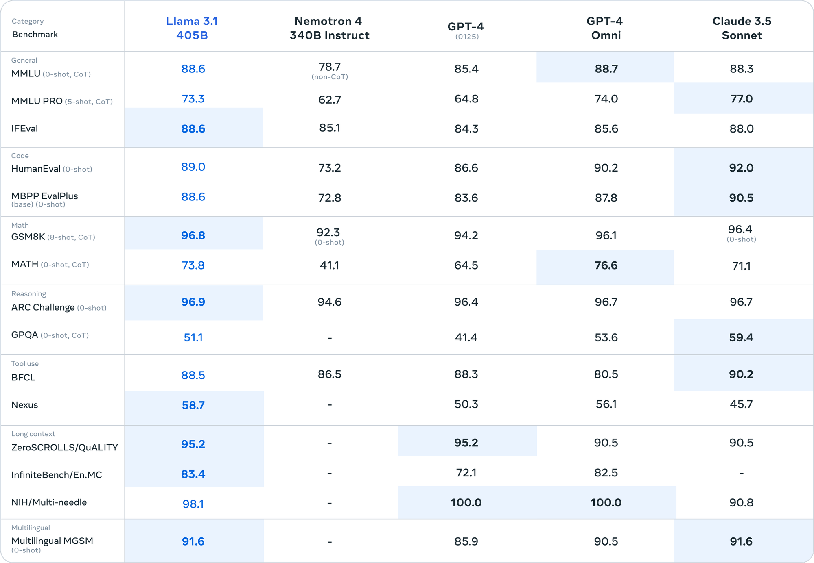
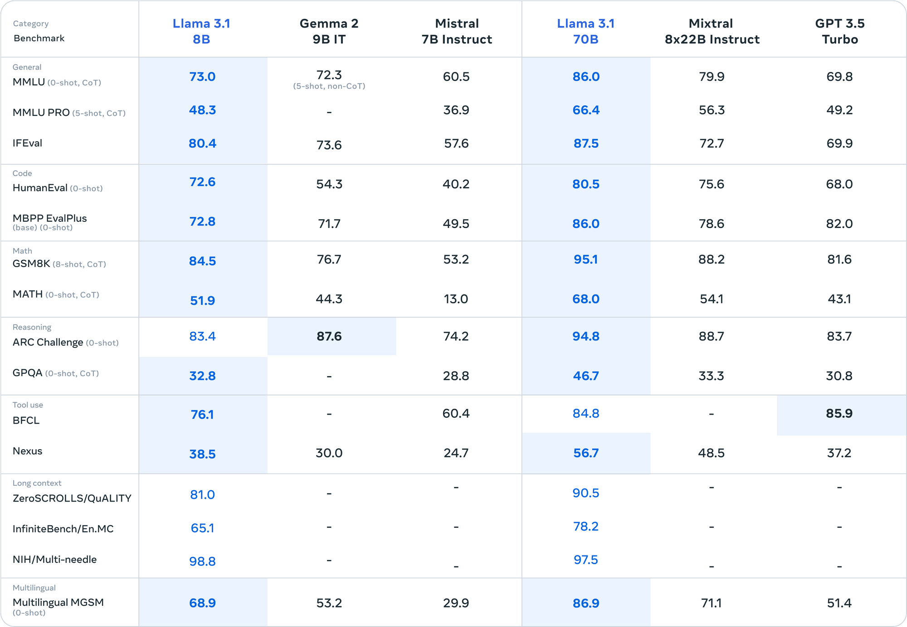
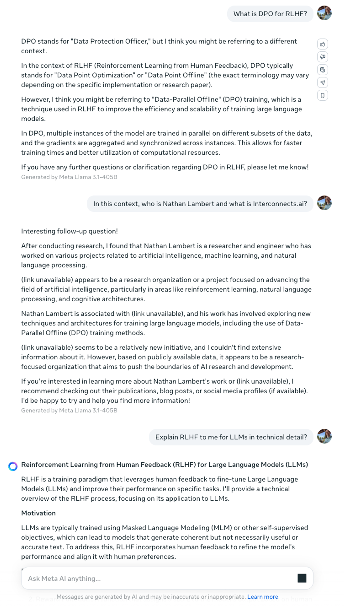
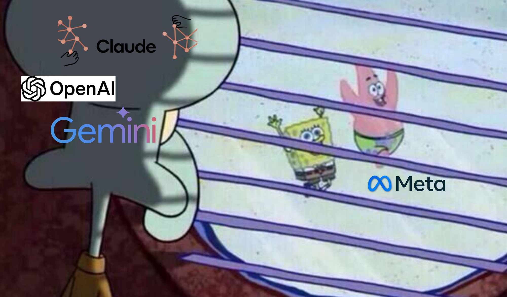

Today, Meta [released their Llama 3.1 suite of models](https://ai.meta.com/blog/meta-llama-3-1/), confirming their open-source ethos from the initial Llama 3 "preview" as embracing [ship early and ship often](https://en.wikipedia.org/wiki/Release_early,_release_often). The Llama 3.1 models, which come in three sizes, 8, 70, and the long-rumored 405 billion parameters, are best-in-class open-weight models for their size. The 405 billion parameter model is directly in the ballpark of Anthropic's Claude 3 and OpenAI's GPT-4o. The marketing of Llama 3.1, and Meta's AI strategy broadly, is pushing directly on translating open-source software practices into open-source AI. The fulcrum of this release and the future of AI is [how truly "open-source" AI can be](https://www.interconnects.ai/p/an-open-source-llm), and if Meta is indeed the company that owns the stack.

This will be the first of multiple posts on Llama 3 and the open language model ecosystem. This focuses on the evolution of likely futures for AI given that Llama 3.1 is released with few restrictions. Open language models, not necessarily open-source ones, now have multiple more years of guaranteed relevance compared to closed labs [preparing their \$100 billion training clusters](https://fortune.com/2024/04/02/microsoft-openai-stargate-100-billion-ai-supercomputer-star-wars-sdi/). The open community now has a model, namely the 405 billion parameter instruction variant, which opens up many doors for research and development --- distillation, synthetic data, fine-tuning, tool use, and more.

The next post(s) will continue into more of the technical details and findings as people begin to build on the models

### Meta's open frontier model

The [launch blog for the Llama 3.1](https://ai.meta.com/blog/meta-llama-3-1/) contains all the normal details for the model. The model's architecture is so simple that its simplicity is a talking point. It's a feedforward dense transformer with many, many parameters trained on 15.6 trillion carefully curated tokens of data. The [license is decent](https://huggingface.co/meta-llama/Meta-Llama-3.1-8B/blob/main/LICENSE) compared to Llama 3 and other recent open models, allowing synthetic data creation, but comes with heavy branding terms (more on this below). For more on the previous Llama 3 version, see this post:

::: {.digest-post-embed attrs="{\"nodeId\":\"933482d2-daa6-4af0-97c8-4a1f3c5711a3\",\"caption\":\"In January, Mark Zuckerberg, gave an off-the-cuff update on the state of their AI efforts, claiming that they will release “open-source AGI” in the next few years. A core criticism of the open LLM ecosystem is as to if they can continue to scale their models with hyper-scalers like Google or OpenAI. In 2024, we’ve got access to multiple open-weight mode…\",\"cta\":null,\"showBylines\":true,\"size\":\"sm\",\"isEditorNode\":true,\"title\":\"Llama 3: Scaling open LLMs to AGI\",\"publishedBylines\":[{\"id\":10472909,\"name\":\"Nathan Lambert\",\"bio\":\"ML scientist (RL, RLHF, society, robotics), athlete, yogi, chef. Writes about ML research.\\nPhD from Berkeley AI, Cornell Lightweight Rowing `17\",\"photo_url\":\"https://substackcdn.com/image/fetch/f_auto,q_auto:good,fl_progressive:steep/https%3A%2F%2Fbucketeer-e05bbc84-baa3-437e-9518-adb32be77984.s3.amazonaws.com%2Fpublic%2Fimages%2Fdda47b96-836a-4b95-99a0-f0ec744d4245_2316x2316.jpeg\",\"is_guest\":false,\"bestseller_tier\":100}],\"post_date\":\"2024-04-18T16:44:16.782Z\",\"cover_image\":\"https://substack-post-media.s3.amazonaws.com/public/images/7d328e84-ffc3-4feb-ad29-94068b0258ca_6097x3763.png\",\"cover_image_alt\":null,\"canonical_url\":\"https://www.interconnects.ai/p/llama-3-and-scaling-open-llms\",\"section_name\":null,\"video_upload_id\":null,\"id\":143712870,\"type\":\"newsletter\",\"reaction_count\":44,\"comment_count\":0,\"publication_name\":\"Interconnects\",\"publication_logo_url\":\"https://substackcdn.com/image/fetch/f_auto,q_auto:good,fl_progressive:steep/https%3A%2F%2Fsubstack-post-media.s3.amazonaws.com%2Fpublic%2Fimages%2Fe70f9dbf-4fe6-404c-b6bb-1831d1b7ed0b_590x590.png\",\"belowTheFold\":false}"}
:::

This model showcases Meta's focus on scaling their systems, rather than following the path of mixture of experts and then distillation that all of OpenAI, Anthropic, and Google have done for their flashy small models (Haiku, Flash, and Mini). Meta was a late starter to the frontier model game, but it is closing the gap very fast. It is the first time that fair comparisons to closed, frontier models have appeared reasonable in an open model launch post.

Llama 3.1 405B instruct (and base, but above is likely instruct), is beating many of the best models out there (highlighted in blue). Meta also shows how their smaller model variants in the 3.1 herd wipe the floor with open counterparts (including very recent models like Gemma 2).

Meta has done a lot of the hard work to land this release with developers, building day-one integrations into many popular tools from [HuggingFace](https://en.wikipedia.org/wiki/Release_early,_release_often) to [VLLM](https://github.com/vllm-project/vllm/pull/6553) and more. The important one for users is the release of quantized models, such as the [405B model in FP8](https://huggingface.co/meta-llama/Meta-Llama-3.1-405B-FP8), so it can be run easily on one node of 8x80GB A100s or H100s for inference.

Data is still king in this model. They don't detail much, and Scale AI claimed credit for being a partner in post-training, in addition to a substantial amount of synthetic data, [which is very similar to the Nemotron recipe](https://www.interconnects.ai/i/145870222/filtering-prevents-collapse).

The 405B model pricing on APIs is very similar to GPT-4o, ranging from \$3-9 per million input tokens and \$3-15 per million output tokens where GPT-4o is \$5 per million input, \$15 per million output, but with local hosting, many agencies will be able to drive this much lower, given that they have existing GPU allocations.

The model is available for free to use in [Meta.ai](http://Meta.ai) (and for [download on HuggingFace](https://huggingface.co/collections/meta-llama/llama-31-669fc079a0c406a149a5738f)), where it didn't pass the vibe tests that most models still fail (without a web API). The text, other than the factual knowledge, is obviously quite good. It's interesting that Meta swapped the UX from the default of other providers, where the user would be on the left and the assistant on the right. I wonder if they measure an engagement boost from it in A/B testing, or if they just want to be different.

### Zuckerberg's vision for open-source AI (vs. reality)

With the release of Llama 3.1, Mark Zuckerberg wrote a [compelling essay on why open-source AI is the right direction](https://about.fb.com/news/2024/07/open-source-ai-is-the-path-forward/) for the American technology industry to pursue. The essay focuses on three arguments: open-source AI for developers, open-source AI for Meta, and open-source AI for the world. I agree with the flavor of his text, especially his handling of the potential of "unintentional harms" like intelligence explosions, but he's using craft storytelling to try and oversell the role of Meta AI.

The core of Zuckerberg's argument rests on how language models and AI will be a new computing platform for the future of technology, leveraging analogies to Unix operating systems that were built collaboratively (especially timely in the context of the [recent CrowdStrike news](https://stratechery.com/2024/crashes-and-competition/)). The details of why open-source AI is good for development are largely accepted now --- privacy of data, security of one's own infrastructure, and cost savings by training your own models.

Where the essay becomes most interesting is on the role of open-source AI for Meta and the world. Meta's strategy fully realizes that AI is a tool that they use and not one that is central to their business model, so they should [commoditize their compliments](https://www.joelonsoftware.com/2002/06/12/strategy-letter-v/). There is a long history of technology companies doing this --- they're weakening their competitors' without kneecapping their own performance. When AI is moving so fast, it also has the potential of gaining the upside in tricks that the community finds for their models. Zuckerberg is repeating a simple strategy that has worked for technology companies for decades, but potentially at smaller scales of capital investment. It works for Llama 3 scale, but it isn't clear if Llama 4 will be another 10 times bigger (and he is careful to not discuss these trends). Llama 3 likely costs on the order of \$100million (but more than this), which is cheap. \$1 billion and higher starts to shift the shareholders.

Around the edges of this blog post and other interviews Zuckerberg did for this (and other Llama releases) is the idea that *Llama* is the central point of open-source AI. There is a fundamental mismatch between a software package like an operating system, which can be built from many small contributions, and a language model, which needs centralized development and slower release cycles. A foundation model is a large piece of the open-source AI ecosystem, but the tools to modify it and open resources for training are just as important --- which Meta does not own.

The true start of the open-source AI stack is Nvidia GPUs, Nvidia's Cuda, HuggingFace, and then Meta's Llama. **It would be much easier for Nvidia to acquire HuggingFace and train Nemotron 5 to own the open-source default for AI than it would be for Meta to represent the entire stack.** Both Meta and Nvidia likely cannot expand in this space due to the [early antitrust attention on AI](https://www.interconnects.ai/i/146686823/antitrust-attention-and-opportunity), so open-source AI will move from whichever model is best at the time.

Meta can only lock it down by training better models, which is an expensive process with little user lock-in. HuggingFace, despite criticism by some on the quality of their code, will remain the default starting point for transformer-style models --- this is real lock-in that is much harder to break. Even if Meta doesn't create lock in for users (which it doesn't need because it doesn't monetize), each marginal model right now is putting real pressure on competitors. **Separating competitive pressures from branding is the hardest part of this Meta strategy --- they don't know which one will matter more.**

The final point Zuckerberg makes is "why open-source is good for the world," which he breaks into a study of intentional harms (e.g. hate speech, malicious actors, etc.) and unintentional harms (e.g. rogue AI, runaway models, etc.). He argues that the open models we're using cause little change to the intentional harms, as most of them depend on whoever is deploying a user endpoint, so we should have a nuanced debate about the unintentional harms.

I agree that including more scientists, regulatory bodies, and communities by releasing **current models** openly and quickly is the better option for now. We need state-of-the-art, or close to it, models in the open to understand how the technology is moving, and then we can move fast if emerging threats appear.

The second part of this is if open-source AI will help China more than it will help ourselves and our allies. I firmly believe that until we can measure near catastrophic risks from AI models, crippling the open-source ecosystem in the United States will cause far more harm. Openness, transparency, and cooperation have been fundamental tenets of why the U.S. has dominated the first era of the technology economy, and undoing that is an extreme risk. Zuckerberg writes on this well:

> The next question is how the US and democratic nations should handle the threat of states with massive resources like China. **The United States' advantage is decentralized and open innovation.** Some people argue that we must close our models to prevent China from gaining access to them, but my view is that this will not work and will only disadvantage the US and its allies. Our adversaries are great at espionage, stealing models that fit on a thumb drive is relatively easy, and most tech companies are far from operating in a way that would make this more difficult. It seems most likely that a world of only closed models results in a small number of big companies plus our geopolitical adversaries having access to leading models, while startups, universities, and small businesses miss out on opportunities. Plus, constraining American innovation to closed development increases the chance that we don't lead at all. Instead, I think our best strategy is to build a robust open ecosystem and have our leading companies work closely with our government and allies to ensure they can best take advantage of the latest advances and achieve a sustainable first-mover advantage over the long term.

### Does the Llama 3.1 license support open-source AI?

Within the release materials, especially the [model card](https://huggingface.co/meta-llama/Meta-Llama-3.1-405B-Instruct) and [paper](https://ai.meta.com/research/publications/the-llama-3-herd-of-models/), Meta is continuing the industry standard of open-washing in AI. Coming down from Zuckerberg, Llama 3.1 is being touted as a leading strategy for \"open-source AI,\" while institutional working groups, which Meta participates in, are debating the true definition of open-source AI. Llama 3.1\'s launch does not fit any of the proposed definitions of open-source AI, failing on the common step, data. Meta\'s release documents detail the data being \"publicly available,\" with no definition or documentation. At the same time, the CEO of Scale AI tweeted that Llama 3.1 was a major partnership in their data foundry business.

The more nuanced component of Llama 3.1 and its potential support of the open-source ecosystem is through its license. Llama 3.1 will be the default model for most people, but the license determines how more organizations and small companies can join the movement toward open frontier models.

Bespoke license agreements are the defining factor of new open model releases from top AI labs and with Llama 3.1, Meta hones its open-source strategy for AI. The Llama 3.1 license is a [modification of the fairly restrictive Llama 3 license](https://www.diffchecker.com/nbHQZode/), keeping most of its core terms around commercial usage restriction, naming restrictions, and legal filler (liability, definitions, terms, etc.). The primary news in the Llama 3.1 license are terms around training on outputs (for [synthetic data](https://www.interconnects.ai/p/llm-synthetic-data)) and downstream naming.

1.  Users can now train other models than Llama models on the outputs of Llama models. In the previous license version, users could only train Llama models.

2.  Users must still name their downstream models "Llama-{your-model-name}" which is a slight change from "Llama-3-{xyz}".

**What is notable is that even though we can train models on outputs, the resulting artifacts are then absorbed into the Meta open-source strategy**.

Meta is doing its best to absorb all of the work in the open-source language modeling community into its Llama brand. With the strength of the evaluation scores of these models, training on synthetic data from Llama 3.1 Instruct 405B will be much cheaper than using an API at most labs, and fine-tuning from the 8 or 70B models will be most academic's core baseline and starting point.

The terms for the original Llama 3 license did not make sense, as they were in spirit trying to proliferate the Llama branding, but they kneecapped one of the primary methods for distribution in synthetic data.

On the grounds of open-source AI, most companies releasing models will abide by these rules --- a name change is not worth the legal risk. Most of the companies that build on top of open AI models won't be releasing their's publicly, so naming and derivative licensing is a non-factor.

In some ways, this feels like a minor sibling of the legal purgatory over if we can train on OpenAI's outputs due to their terms of service that forbid it. Over the early months of open fine-tuning projects, community norms accepted that training on outputs is okay. Many companies did it and the only one to face judgement was the [Chinese company ByteDance](https://www.theverge.com/2023/12/15/24003542/openai-suspends-bytedances-account-after-it-used-gpt-to-train-its-own-ai-model). Will Meta be as gracious with its license terms? Who is going to take the risk to find out?

Most companies will try to comply, but individuals playing with training synthetic models online will take this as free reign to use Llama 3.1 outputs to train open models. The delta from the Llama 3 license speaks more strongly than the text of the current version, given that these license documents are extremely oddly formatted and questioned in their legal validity (e.g. how does it make sense to let the user own outputs, but then put restrictions on what they name a dataset?).

There are plenty of subtle ways of getting around naming rules, but the intent is clear --- Meta wants the Llama brand to touch as much of the open ecosystem that it can. At this point, Meta should go as far as renaming their [meta.ai](http://meta.ai) interface to [llama.ai](http://llama.ai).

Other terms of note when using this model remain the following:

1.  Any derivative artifact, including models and datasets, must be distributed with the Llama 3.1 license.

2.  Companies with greater than 700 million active users at the time of release cannot use the model.

This new license takes the Llama models a step closer to fulfilling part of Meta's scorched earth strategy when it comes to AI. Until then, [Nemotron 340B is still the best model for synthetic data](https://www.interconnects.ai/p/frontiers-in-synthetic-data) if you are avoiding any license restrictions. If Meta wants to define open-source AI and be the platform for doing so (regardless of whether they are at the right level of the stack to do so), this license is not doing it in a way that makes the definition agreeable to other entities.

The Llama 3 license was weakened likely due to community pushback, so we'll see how much progress can be made on future licenses. In order to be "truly open-source," the model will likely need more details on data and [remove restrictions on the types of use](https://www.interconnects.ai/p/an-open-source-llm?utm_source=publication-search) that are allowed (a long-fought battle in the history of open-source software). The Llama 3.1 license is closer to freeware than open-source.

### Different futures for regulating frontier models

The same day as the release of Llama 3.1, [five Democratic senators sent a letter to Sam Altman and OpenAI asking for a heads-up on future foundation model releases](https://x.com/andrewcurran_/status/1815730280235401452?s=46) (original source [Washington Post](https://www.washingtonpost.com/technology/2024/07/23/openai-senate-democrats-ai-safe/)). This comes just weeks after the launch of Claude 3.5 Sonnet, where Anthropic detailed that they [ran pre-release checks with the UK AI Safety Institute](https://www.anthropic.com/news/claude-3-5-sonnet). While Meta made [internal efforts to mitigate "critical risks"](https://huggingface.co/meta-llama/Meta-Llama-3.1-405B#critical-and-other-risks), there is no mention of the involvement of sovereign entities --- they're just "following" regulations put in place. From their [Llama 3.1 responsible development post](https://ai.meta.com/blog/meta-llama-3-1-ai-responsibility/):

> We're closely following as governments around the world seek to define AI safety. Meta supports new safety institutes and works with established entities---including the National Institute of Standards and Technology (NIST) and ML Commons---to drive toward common definitions, threat models, and evaluations. Working with bodies such as Frontier Model Forum (FMF) and Partnership on AI (PAI), we seek to develop common definitions and best practices, while also engaging with civil society and academics to help inform our approach. For this release, we've continued to build on our efforts to evaluate and red team our models in areas of public safety and critical infrastructure, which includes cybersecurity, catastrophic risks, and child safety.

I believe Zuckerberg when he says companies should work in the open and with governments (from an [interview with Rowan Cheung](https://www.youtube.com/watch?v=Vy3OkbtUa5k)) - he has a track record that is better than many other big tech companies (e.g. Tesla and Apple with their ties to China) when it comes to supporting American values. Many would argue he can do more, given the platforms accepting political vitriol for profit, but AI is starting a new conversation branching off of content alone.

Having Meta take this stance will help to balance the discussion and lobbying efforts on what the future AI ecosystem in the United States should look like. Open models will give many more people the ability to chime in and deeply understand the capabilities of these models.

In the meantime, GPT-5 is looming and Zuckerberg has hinted to architecture changes coming soon to Llama 4, let alone the multimodal Llama 3 that is around the corner. Given the uncertainty and pace of progress, we need to include more stakeholders than just representatives of the largest companies in this process. Some would say OpenAI is already feeling the product pressure from this release, [launching a new free fine-tuning feature on its small model GPT-4o](https://x.com/OpenAIDevs/status/1815836887631946015).

For now, we congratulate Meta on joining the list of frontier model labs, with OpenAI, Anthropic, and Google, which is a huge effort, but in the near future their starkly different strategy will reignite the debates of 2022 and 2023 on how AI should be handled.

**Housekeeping**

-   Audio of this post is available (soon) in [podcast](https://podcast.interconnects.ai/) form (and sometimes on [YouTube](https://www.youtube.com/@interconnects)).

-   My real podcast is at [retortai.com](http://retortai.com).

-   *Paid subscriber Discord access in email footer.*

-   Referrals → paid sub: Use the [Interconnects Leaderboard](https://www.interconnects.ai/leaderboard).

-   Student discounts in [About page](https://www.interconnects.ai/about).
