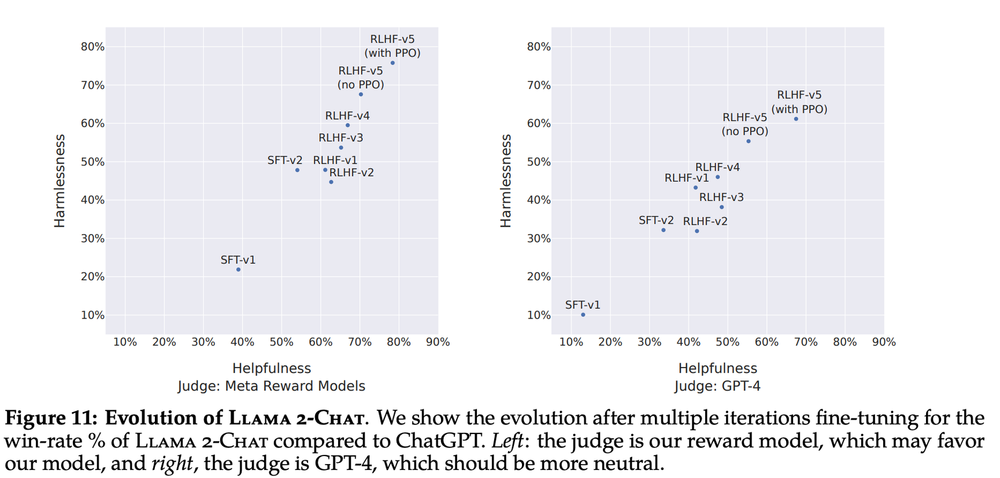
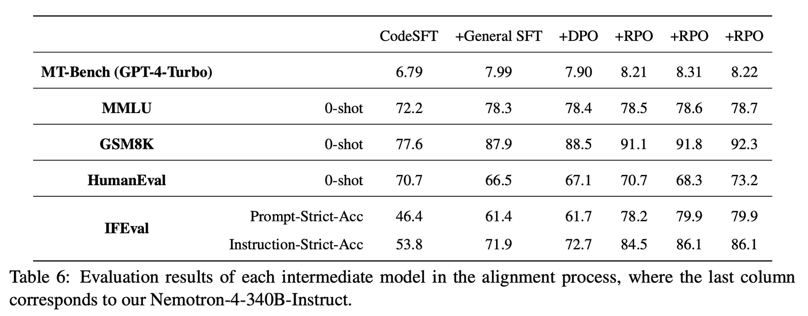
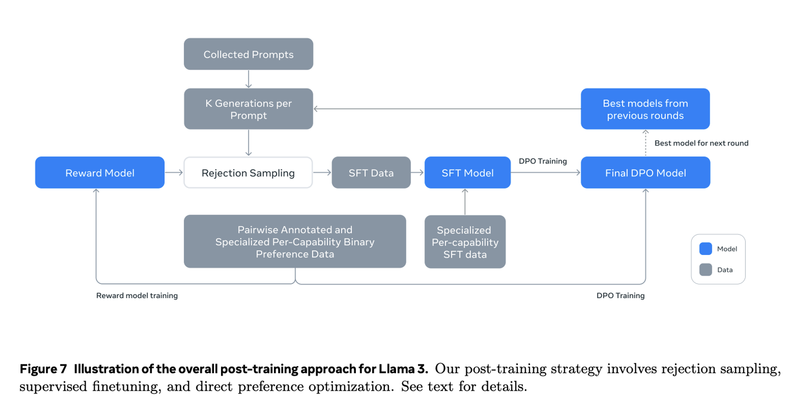
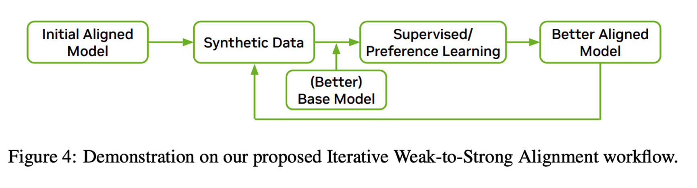
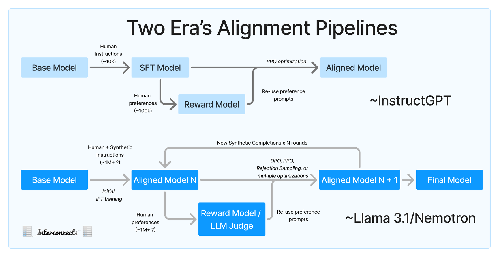

[InstructGPT](https://arxiv.org/abs/2203.02155), [WebGPT](https://arxiv.org/abs/2112.09332), [Sparrow](https://deepmind.google/discover/blog/building-safer-dialogue-agents/), [Summarizing from Human Feedback](https://arxiv.org/abs/2009.01325), and [Helpful and Harmless Assistant](https://arxiv.org/abs/2204.05862) are most of the search terms for people trying to find the "default RLHF recipe." I've said the rule of thumb of 10k high quality instructions and 100k preferences so many times. These are the seminal works that bridge the gap from a new research area to the post-ChatGPT field we have today. These works are becoming out of date with how RLHF is done today. Directionally, they are relevant --- the goals still apply, the high-level tools match up, and some of the evaluations too, but the details are now far from accurate representations of reality. The data curation style and scale of these works feels antiquated.

The [Llama 3.1 paper](https://ai.meta.com/research/publications/the-llama-3-herd-of-models/) includes substantial details on their post-training process. These models, along with [Nemotron 340B from Nvidia](https://arxiv.org/abs/2406.11704v1) and the [foundation model report from Apple](https://machinelearning.apple.com/papers/apple_intelligence_foundation_language_models.pdf) (and to some extent [Gemma 2](https://storage.googleapis.com/deepmind-media/gemma/gemma-2-report.pdf)), have made it clear that a new default recipe exists for doing high-quality RLHF. The new recipe requires a few assumptions:

-   Synthetic data can be of higher quality than humans, especially for demonstrations on challenging tasks.

-   Reinforcement learning from human feedback (RLHF) can scale far further than instruction tuning.

-   It takes multiple rounds of training and generation to reach your best model.

-   Data filtering is the most important part of training.

These assumptions largely interleave with each other and lead to a training recipe that can scale up organizationally to large teams.

# A new standard pipeline

This is far more clarity than I expected to converge on in 2024 with respect to "how top labs handle post-training." If ChatBotArena scores are a metric to correlate with post-training performance, which largely correlates with the style and robustness gains, all the major labs gain substantially by iterating on post-training. We have not seen the model architectures of the like of Gemini 2 or GPT-5, which will reset post-training practices and potentially unlock even deeper levels of control.

### **1. Human preference data**

The focus of the original RLHF pipeline was on human data. It came in two primary forms: 1) human data for instruction-tuning on specialized tasks and 2) human preference data on model completions. The datasets were costly and guarded --- the only public example of these fine-tuning datasets (to my knowledge) is [No Robots](https://huggingface.co/datasets/HuggingFaceH4/no_robots) from my old team at HuggingFace. The human preference data largely was tied to improving a specific model, and to the extent that data *could* be open, we are not sure we could transfer one model's online preference data to another later. We tried this at HuggingFace and failed on a small paid data contract.

Now, the only human data aspect is the preference data. From the Llama 2 numbers and other rumors, it's likely Meta spent \$10-20 million plus on preference data. This is just for the final model and may not include extensive experimentation and evaluation. Nemotron used a large amount of synthetic data to replace this, but the model is largely not seen as a comparably strong fine-tune.

An immediate challenge and opportunity in the open community is to figure out how much of this human intervention can be completed with LLM-as-a-judge or reward modeling techniques. I was getting at this earlier in the year when I claimed that "[the open GPT-4 wouldn't match OpenAI's](https://www.interconnects.ai/i/140329776/rlhf-progress-revisiting-llama-s-release-and-potential-in)" --- I was right that we wouldn't have access to the data but wrong that we wouldn't have the downstream model (Llama 3.1).

### **2. Scaling RLHF**

[Thomas Scialom](https://x.com/thomasscialom?lang=en), alignment lead on Llama 3, said on [Latent Space](https://www.latent.space/p/llama-3):

> RLHF is so much more scalable. It costs less, it\'s easier, that it leads in general to just better performance.

He continued to say that he would spend "100%" of his alignment data budget on preferences, which are needed for this RL stage, rather than spend more time on instructions.

Far too many in the open alignment space are focused on scaling instruction fine-tuning (IFT, also called SFT). It's approachable, works for many tasks, and is simple to use with synthetic completions, but it is clear that industry sees IFT as a starting point that you then scale from. The SFT data is focused around specific domains that none of the previous models can cover, and then scale RLHF from there.

RLHF is an iterative process, the model generations let it continue to get slightly better. The Llama 2 paper and the Nemotron paper detail about 5 training rounds, but we don't know if there is a ceiling on this. Llama 3.1 was 6 rounds of preferences, Llama 2 5, and Nemotron 4. Multiple instruction tuning rounds come before.

For preferences, the multiple rounds is likely mostly a practicality because:

1.  The data is delivered to the lab from the annotation company in rounds (future article on this coming soon --- the details of some of my experiences with these companies).

2.  Small training runs de-risks the end product. It's nice to see you're on track over time, rather than waiting for all the data to come in before pressing go.

Regardless, these types of context can be the triggers for industry norms in the future. Here's the relevant figure from the [Llama 2 paper](https://arxiv.org/abs/2307.09288) with 5 RLHF rounds of rejection sampling and PPO.

And Nemotron also did two SFT rounds and 4 alignment rounds. RPO is just Nvidia's reward model weighted DPO optimizer.

Iterative RLHF approaches like this goal all the way back to Anthropic's Constitutional AI paper, but are largely not reproduced in the open community. [Academics are focusing on "online" DPO trainers these days](https://www.interconnects.ai/i/144206247/some-next-steps-for-rlhf-research), which is directionally similar, but it comes with much less focus on data in between the rounds. Online DPO is what this will look like in the future, once the process is automatable, but for now, it is very manual.

The algorithm choices of the various teams should not be fixated on. The choices are mostly a simplicity-based decision as these teams are still relatively new and building modular systems. DPO scales more easily, but PPO-inspired methods (online RL) have a higher ceiling (I recently [recorded a talk on some of our new work on DPO vs. PPO](https://www.youtube.com/watch?v=rDF7eFPeVto&t=1s)). I don't see any reason to refute this. One of the team members on the Llama 3 post training team [confirmed this engineering-simplicity approach](https://x.com/ssgrn/status/1815786519816495374):

> Llama 3 has a simple posttraining loop: rejection sampling, SFT, and DPO. This not only performed best empirically; it also enabled reproducibility, and our team could async explore many different workstreams (eg coding, math), funneling data into the same, simple loop.

### **3. Synthetic data**

A large proportion of this new RLHF loop is only made possible by synthetic instruction data surpassing the capabilities of humans on most tasks. Now that models can generate better instructions if you can keep improving your model a tiny bit more, you can almost "start over" and get a better model checkpoint. Meta made it clear that they "used the 405B parameter model to improve the post-training quality of our smaller models." Google does this through distillation to Gemini Flash, but realistically most frontier models likely have some component of this.

I've heard rumors that OpenAI is training its next generation of models on 50 trillion tokens of largely synthetic data. Last year the rumors that Anthropic had a "pretraining scale Constitutional AI corpus" now feel unsurprising.

The timeline when companies realized synthetic data is important is likely when they added the "you cannot train on outputs" terms to their models --- this was 12 to 18 plus months ago. Meta only removed this because they benefit from other open models getting better.

Looking at modern post-training makes it clear that [model collapse](https://www.nature.com/articles/d41586-024-02420-7) is overblown. Synthetic data only leads to model collapse [when deployed in a contrived setting](https://x.com/RylanSchaeffer/status/1816881533795422404) where the original data is thrown away after the new data is generated.

### 4. Don't forget --- data quality is king

The majority of the Llama 3.1 report is about data curation details. Every subdomain of interest needs extensive and specific curation instructions. This maps to what I've heard it\'s like to work on John Schulman's post-training team at OpenAI (or similar groups) - get a domain, then you get the data, then the model gets better.

I'm not going into every little detail in this post, but I will revisit the sections of the Llama 3.1 report as they're relevant. None of the above RLHF methods work without extensive data filtering a curation.

We have started prioritizing data far more at Ai2 for our post training recipes, and we could immediately feel the pace of progress shift. I shared more thoughts on the difference on [Twitter](https://x.com/natolambert/status/1820896730616881529) and [Linkedin](https://www.linkedin.com/feed/update/urn:li:activity:7226662518843133952/), which I'll likely revisit in the blog later.

------------------------------------------------------------------------

## **Putting it together**

We can see how Nemotron and Llama visualize putting this together. It's a feedback loop around synthetic data and optimizer(s). Here's Llama:

And Nemotron's, which is less detailed:

Putting this together, we can see roughly where everyone has converged.

What these diagrams, and most industry research papers these days, neglect is data.

There are many small details in these reports that we can debate, but in the fullness of time, they will become unimportant. Regularization, slight tweaks to loss functions, model averaging, and similar small mentions are marginal gains on performance but largely outside the core fine-tuning loop.

------------------------------------------------------------------------

## Apple confirms the new normal

Apple's recent launch of the beta version of Apple Intelligence was accompanied by the [afore-linked technical report](https://machinelearning.apple.com/papers/apple_intelligence_foundation_language_models.pdf) for its foundation models. It doesn't go into as much detail as Nvidia and Meta, but it covers enough to be clear. It's rare that there is so much alignment in methodologies across industry. Largely, Apple echoed everything I've said in the above blog post. This analysis is the more focused version of what I reported when they launched the [blog post for their foundation models during WWDC](https://www.interconnects.ai/i/145560765/alignment-strategies-some-new-things).

The paper reads like any industry-lab post-training section. There are the normal comments on data, like "both human annotated and synthetic data" --- which reminds us that we never see humans only anymore, as you did a year or two ago with InstructGPT et al. Second, they echo the data message with another bland statement: "We have found data quality to be the key to model success and thus have conducted extensive data curation and filtering procedures."

To recap the above post, they do the new normal, including:

-   Human preference data and [HelpSteer](https://arxiv.org/abs/2406.08673v1) style grading of attributes for regularization.

-   High-quality reward models for filtering.

-   Replacement of human demonstrations with model completions in some domains.

-   Multi-round RLHF --- "We iterate data and model qualities jointly to improve them in a unified flywheel."

-   A very large suite of data curation techniques, including prompt re-writing and refining for expansion of costly datasets, filtering math and code answers with outcomes (correctness or execution), filtering with LLMs-as-a-judge, and other new normal stuff.

The most interesting points of it to me were around choosing the instruction tuning mixture before doing RLHF. First, they treated selecting the instructions as an optimization problem.

Interesting section on selecting an SFT mixture

> Given a set of weights (w1, w2, \..., wn) where wi represents the ratio of a specific component in the mixture, we train a model with wi → wi ± ∆wi and evaluate the quality change on a set of benchmarks. We find that extensively running such experiments can effectively identify the best mixture and remove the least impactful data components.

Additionally, they make a crucial commentary that the best instruction-tuned model does not lead to the best downstream RLHF model, with an intermediate evaluation.

> Since the evaluation metrics fluctuate across different checkpoints, we run checkpoint selection based on automatic evaluation benchmarks and best-of-N selection with reward models to test the headroom for RL.

Apple includes the fundamentals of their RL methods, including a different type of soft margin loss for the reward model, regularizing binary preferences with absolute scores, their iTeC rejection sampling algorithm that is very similar to Meta's approach, and their leave-one-out Mirror Descent RL algorithm, MDLOO. These have cool details if you're looking to learn more, but the high-level setup is most important. Some notes on them, because I can't help myself:

-   The rejection sampling (iTeC) uses a large amount of models to generate completions.

-   The rejection sampling (iTeC) uses just the best completion of the batch for each prompt, to make sure each prompt is in the instruction tuning step.

-   Apple heavily misuses the technical term distillation in their report, as many of us now do, now that knowledge distillation is popularized again.

-   The RL algorithm MDLOO algorithm [builds on interesting work from Cohere](https://arxiv.org/abs/2402.14740) --- it seems promising.

------------------------------------------------------------------------

**Housekeeping**

-   Audio of this post is available (soon) in [podcast](https://podcast.interconnects.ai/) form (and sometimes on [YouTube](https://www.youtube.com/@interconnects)).

-   My real podcast is at [retortai.com](http://retortai.com).

-   *Paid subscriber Discord access in email footer.*

-   Referrals → paid sub: Use the [Interconnects Leaderboard](https://www.interconnects.ai/leaderboard).

-   Student discounts in [About page](https://www.interconnects.ai/about).
