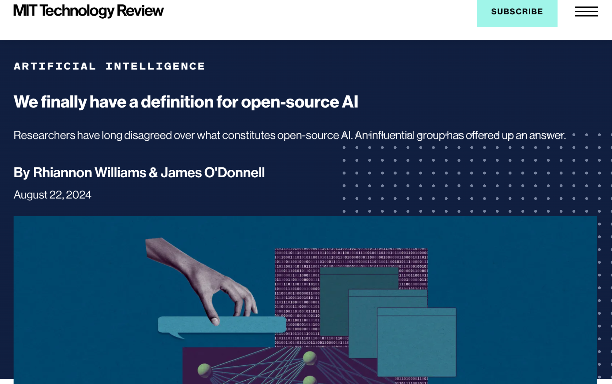

*[On Episode 32 of The Retort](https://youtu.be/naT9UWWb768), we discussed summer breaks and avoiding burnout in AI.*

*I wrote this up to make sure my views and Ai2's strategy was up to date with the pending definition of open source strategy. I decided to send it out because it may interest many of my readers. Thank you to Percy Liang, Stella Biderman, Aviya Skowron, and Yacine Jernite for a great conversation on open source AI definitions that resulted in most of this article.*

------------------------------------------------------------------------

The definition of open source AI has been a [regular topic on this blog](https://www.interconnects.ai/t/open-source). The strategies by common players in the open AI ecosystem haven't changed much --- Meta, Mistral, and others release open-weight models with special licenses. A few small players release truly open source models. What has been changing are our abilities to contextualize, formalize, and utilize these dynamics to create a literate AI ecosystem.

A stable definition of open source AI is a step in that direction. It does not mean the norms and definitions will not continue to change.

The [last time I talked about open source definitions](https://www.interconnects.ai/p/flavors-of-open-source-ai), it was also to debunk a poorly framed MIT Technology Review article. Here we are again. A few days ago, the MIT Technology Review published this article titled *[We finally have a definition for open source AI](https://www.technologyreview.com/2024/08/22/1097224/we-finally-have-a-definition-for-open-source-ai)*.

What they are referring to is the [v0.0.9 definition of Open Source AI](https://hackmd.io/@opensourceinitiative/osaid-0-0-9) (and a somewhat [simpler checklist](https://opensource.org/deepdive/drafts/the-open-source-ai-definition-checklist-draft-v-0-0-9) to see if a model conforms). I've referenced previous versions of this definition on Interconnects, where progress to today focuses on the role of data documentation and availability for an open source AI artifact.

This is a work in progress, with a "stable version" being targeted for October. In the meantime, it is misleading to say we have one single definition. We have progress.

Even with the first stable version, it will likely change. Being close to the stable definition mirrors our convergence on modes of open source AI engagement.

The recent version is clearly a compromise around data and will not make everyone happy. The tension in open source AI's definitions comes from the gap between those who believe every detail should be documented for reproducibility and those who will define open source AI as what they can grab off the shelf and use easily. The former is a small set of models like Ai2's OLMo, EleutherAI's Pythia, and LLM360. The latter is what is often called open-weights --- Llama is the most popular. This definition seeks to fall in the middle.

The spirit of open source, and where the process for open source AI started, is with the ability to study and modify the requisite artifacts.

The reasons for this definition, in my eyes, are about informing regulation and community best practices, rather than directly changing commercial action in AI. Llama 3, 4, and 5 will still be very popular models with developers regardless of whether they are technically open source. Having a clear definition of open source will allow regulatory carve-outs and protections (e.g. from future versions of SB1047) that allow different interventions for systems certified as open source. *Who* would certify these systems is a separate question that the Open Source Initiative has largely avoided in the past. The OSI vets licenses. AI policy would be an easier space with clear guidance on what gets regulated in the open source AI bucket and what gets regulated with "everything else."

Most of the definition is very standard. Weights need to be available, code for using the system must be released under an OSI-approved license, etc. The definition, which isn't a license, includes a new interpretation of how data should be handled in an open source AI system. The release must include:

> Sufficiently detailed information about the data used to train the system, so that a skilled person can recreate a substantially equivalent system using the same or similar data. Data information shall be made available with licenses that comply with the Open Source Definition.

There are two reasons why this compromise was made: data provenance and reproducibility. A functional definition of open source AI cannot require parties to commit potentially illegal acts with data, but the system still needs to be easy to build upon.

### Reasons to not mandate fully released data

To be clear, most players advocating for the open source AI space want there to be more open data in the world. To me, and most casual readers, open data means something that you can easily download from HuggingFace and use to train your model. Other parties have different definitions, which would lock in conflict with the open source AI definition.

Two types of content (and definitions) present current legal barriers to making the definition of open source AI data more restrictive:

1.  Content presumed under standard copyright is not technically open data (according to the [European Union](https://data.europa.eu/en/dataeuropa-academy/what-open-data) and [other institutions](https://opendatahandbook.org/guide/en/what-is-open-data/)).

2.  Personal data should be handled differently than source code (and not readily redistributed).

Redistributing data in both of these categories can cause legal jeopardy.

As an example, only some of Ai2's recent open dataset [Dolma](https://huggingface.co/datasets/allenai/dolma) is totally clear of these questions. Additionally, if there is personal data in a dataset that is publicly uploaded, what happens to the nature of the "open source" dataset if [personal data is later removed to comply with GDPR](https://commission.europa.eu/law/law-topic/data-protection/reform/rules-business-and-organisations/dealing-citizens/do-we-always-have-delete-personal-data-if-person-asks_en)?

We've seen legal action taken by the New York Times against Common Crawl over copyrighted content. This lawsuit is particularly harmful to the open source AI ecosystem (and all language model research) because closed companies training top models have the means to design their own crawler, but highlights the difficult state of redistributing any data today.

### Sufficient but not exhaustive data docs

The requirement to recreate a "sufficiently similar model" with the documentation of an open source model can be fulfilled in two ways. Both of these ways require all the hyperparameters, training code, etc. The two ways are by releasing the data or releasing enough documentation for the data (and of course, the model weights are still needed).

Sufficiently similar downstream models and sufficient information to do so is a reasonable requirement. Data is fundamentally different than software and much of modern data curation code for AI models is impermanent. Links break, source datasets are removed, litigation happens, and more random happenings. The web scraping nature of AI data being cemented as common practice is pulling open source AI clearly away from open source software. Data is messy. Code is created for a specific purpose and distributed by the creator. Data is repurposed, and permissions aren't clear. Knowing this makes the co-development of the open source AI definition along the community norms of data practices much more reasonable.

### Frustration with the data commons

For the past few months, there have been many pieces targeting the AI industry for sloppy practices in managing their data curation. open source AI will bear the impacts of the legal and cultural consequences because over time we will be the only parties clearly stating the use of such data sources.

The first I recall recently was the [Wired piece](https://www.wired.com/story/youtube-training-data-apple-nvidia-anthropic/) highlighting how many YouTube captions in the open dataset [The Pile](https://pile.eleuther.ai/) was being used by many big technology companies (which had been true for years). [Microsoft licensed content from book publishers](https://www.thebookseller.com/news/academic-authors-shocked-after-taylor--francis-sells-access-to-their-research-to-microsoft-ai), which authors didn't love. Nvidia was [caught documenting](https://www.404media.co/email/64056c13-be6e-46e7-8c90-b53dd30026f2/) *[which](https://www.404media.co/email/64056c13-be6e-46e7-8c90-b53dd30026f2/)* [YouTubers they should train on](https://www.404media.co/email/64056c13-be6e-46e7-8c90-b53dd30026f2/). [The list goes on](https://www.nytimes.com/2023/12/27/business/media/new-york-times-open-ai-microsoft-lawsuit.html).

Meanwhile, access is understandably shrinking as companies hosting data avoid risk.

The [Data Provenance Project published a paper](https://www.dataprovenance.org/consent-in-crisis-paper) on the closing of public data. I wrote about how the "data wall" would [hurt open players more](https://www.interconnects.ai/p/the-data-wall?utm_source=publication-search). The NY Times [documented](https://www.nytimes.com/2024/07/19/technology/ai-data-restrictions.html) the disappearance of data.

All of these cases hurt. They're a step-by-step process of AI being less transparent and accessible to the open ecosystem. They're increasing the risk for documentation and openness.

This walkback on data access and free reign on criticism is filling the vacuum left by [prominent lawsuits](https://www.reuters.com/legal/litigation/authors-sue-meta-microsoft-bloomberg-latest-ai-copyright-clash-2023-10-18/) that will determine the future of AI and copyright.

Creators are presented with a lose-lose battle. One option is they accept that their content has a minuscule impact on the resultant models, which is does, and consign themselves to lose control of their image. Another option is leaning into AI and trying to reinvent themselves. They have no option for the status quo.

Creators mentioned with prompts "in the style of Mr. Famous Person" have a good argument for kickbacks, but that will be an inconsequential portion of the AI upside.

Media, the internet, creators, and alike are getting sucked into the changing data commons whether they like it or not. A strong and early definition of open source AI will set the ecosystem up to carve out a safe harbor for understanding these technologies. We cannot let it be left behind through legal pressure.

### We need more examples to refine the definition

There are countless ways the definition in its current form can be tested. The community needs to test the definition. The flexibility of the definition with respect to its intent will be scoped.

Some examples that come to mind to test the definition, until any formal discussion of examples is hosted by the Open Source Initiative or another player in the space are:

-   Does fine-tuning a nonopen model with open source data get an open source definition? With the current definition, fine-tuning (which includes models like late-fusion vision models, which are also dependent on a visual encoder like OpenCLIP being "open source") cannot get the open source label if the backbone is not open source. This is reasonable.

-   How does distillation-style training of models impact the license? For example, ***if*** Google released the pretraining data used to train Gemma, it should be an example of NOT OPEN SOURCE without the bigger teacher model being released with it.

-   How specific code is needed to recreate a model with a specific data sequencing? Eventually, as models get more complex, the community norm for information needed to get an open source certification could increase.

This will all take time. Once we converge on a definition, then we can figure out if we need more open source approved licenses for AI artifacts.

------------------------------------------------------------------------

**Housekeeping**

-   Audio of this post is available (soon) in [podcast](https://podcast.interconnects.ai/) form (and sometimes on [YouTube](https://www.youtube.com/@interconnects)).

-   My real podcast is at [retortai.com](http://retortai.com).

-   *Paid subscriber Discord access in email footer.*

-   Referrals → paid sub: Use the [Interconnects Leaderboard](https://www.interconnects.ai/leaderboard).

-   Student discounts in [About page](https://www.interconnects.ai/about).
