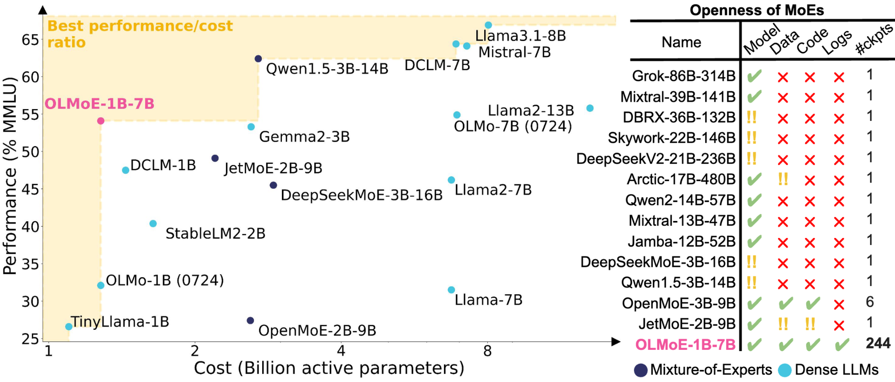
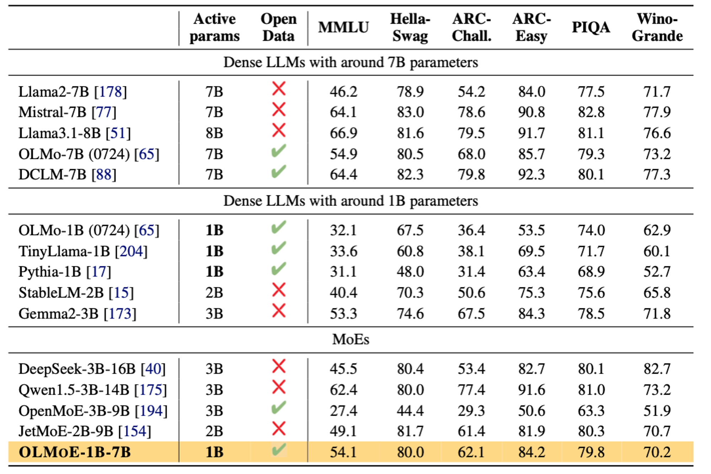
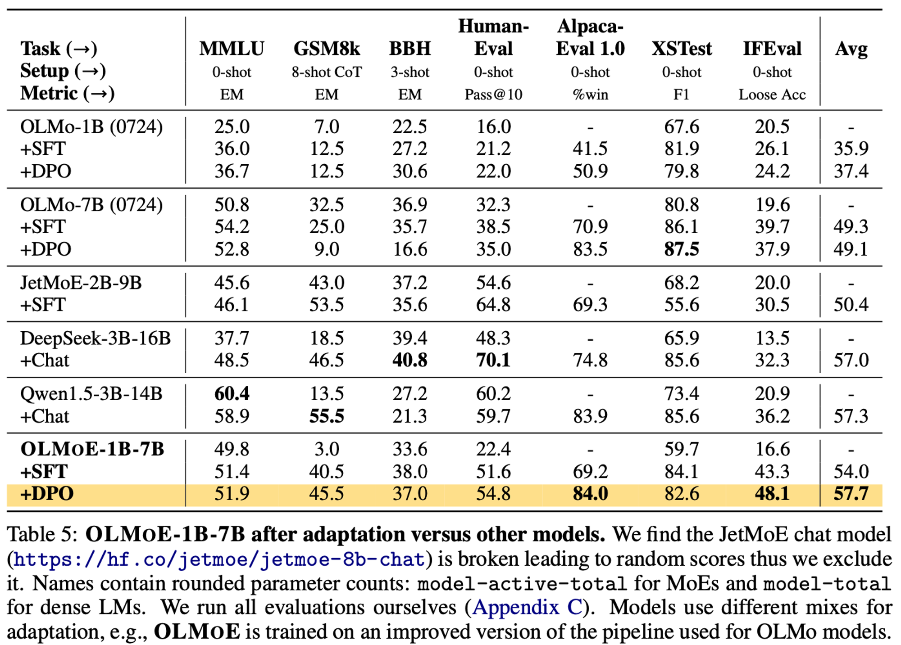
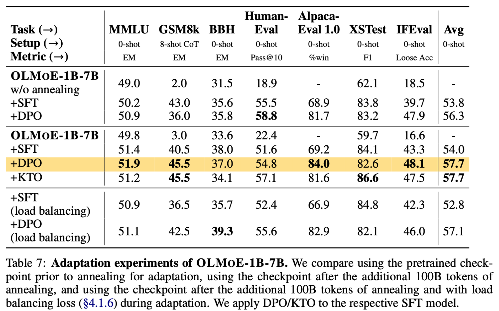
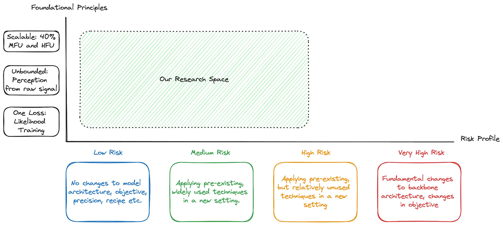
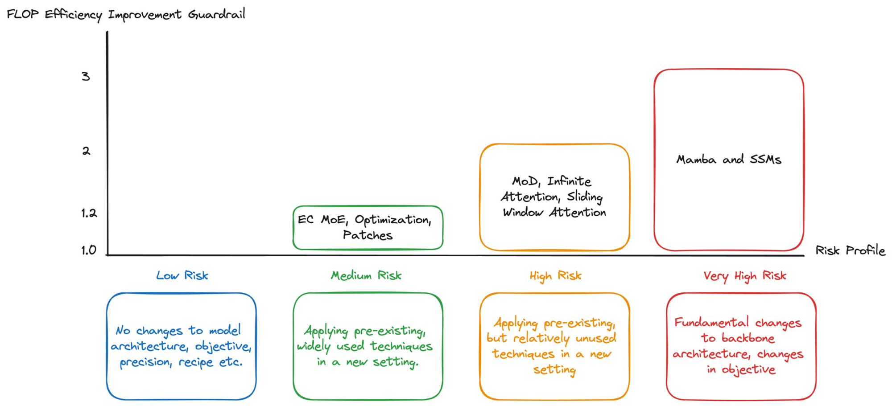
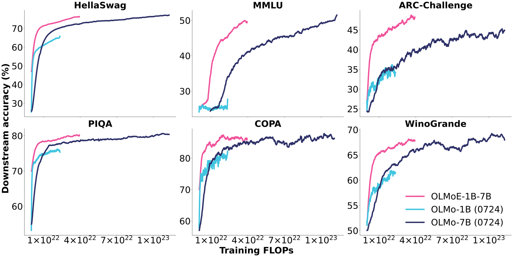

Today we're releasing our best open-source language model to date, [OLMoE](https://huggingface.co/allenai/OLMoE-1B-7B-0924), a Mixture-of-Experts (MoE) model with 1.3 billion active parameters and 6.9 billion total parameters. It was trained on [5 trillion tokens](https://www.notion.so/OLMoE-and-the-hidden-simplicity-in-training-better-foundation-models-7b1d237cbdb640d09a1dd82cba145d66?pvs=21), largely composed of the [DCLM baseline mix](https://arxiv.org/abs/2406.11794), comes with many intermediate training checkpoints, the Apache 2.0 license for all model variants, and improved [post-training mix](https://huggingface.co/datasets/allenai/tulu-v3.1-mix-preview-4096-OLMoE), [code](https://github.com/allenai/OLMoE), and training logs.

I'll detail the high-level takeaways from the model quickly, but most of this post is an update on my worldview around "how frontier model organizations work" and what the not-so-secret sauces are. Since we started the [Open Language Models (OLMos)](https://www.interconnects.ai/p/olmo) project, we've been following the same trials and tribulations that the leading labs started a few years earlier. The secret is that there are no quick tricks to get a better model, all small wins.

First, some details on OLMoE because it's a pretty impressive model! Here's our take on one of those convex hulls that have made the Twitter meme rounds many times. OLMoE is on the frontier with Qwen's 3 billion active parameter MoE and the Llama 3.1 8B model.

OLMoE outperforms all the open models in its active parameter range and is very similar to some popular MoE models with about twice the parameters.

Here, you can see that the post-training recipe makes the comparison to slightly bigger models even more favorable.

Given how close the KTO and DPO numbers are, I suspect we can push the post-training recipes even further for this model. It\'s crossing the rubicon I've been excited for --- when small language models start to *really* respond to fine-tuning. For the last few years, we've only seen minor jumps.

The [OLMoE paper](https://arxiv.org/abs/2409.02060) has a ton of details on design decisions for MoE models --- load balancing of experts, number of experts, regularization, and everything in between. You can find the rest of the artifacts in the HuggingFace [collection](https://huggingface.co/collections/allenai/olmoe-66cf678c047657a30c8cd3da).

------------------------------------------------------------------------

# On frontier model organizations

This release is the right time to reflect on what I have been learning about running a successful foundation model training group. I cover compute allocations, de-risking training, organizational complexity, and compounding improvements below.

### Team compute allocations

I've heard from many friends who have gone to top language model lives that their work can be seen as somewhat routine, with simple tasks, yet with incredible pace. There are a lot of people who are just grinding on making datasets all the time and a smaller percentage who are launching the biggest training runs. There are many, many pieces that go into making a Pareto expanding model, so this is a noisy sample. Some high-level rules have emerged beyond this.

All of the top labs have undergone substantial internal politics over compute allocations. The biggest allocation goes to the fewest people --- pretraining researchers. This ends up being about 60%, or some number greater than half. The full distribution is something like pretraining --- 60%, post-training --- 25%, data --- 10%, and other --- 5%. We'll use these numbers as a ballpark for the rest of the post --- specifics vary. It's well-known what the pretraining mix goes to --- figuring out the best architectures and data mixes for scalable state-of-the-art models. The post-training and data allotments are evolving fast.

Post-training at 25% is very high relative to the original landscape of ChatGPT. With the [modern RLHF workflow](https://www.interconnects.ai/p/frontier-model-post-training), a ton of compute is spent on the generation and filtering of fine-tuning data. For example, at a small scale, it takes an order of a day or two to train a 7 billion parameter model on about 500 thousand instruction samples on 1-2 Nvidia 8xH100 nodes (on a not-that-optimized cluster).

When doing something like rejection sampling or another online method, it is normal to generate 10 to 30 or more samplers per prompt. Using a bigger model, such as Llama 405B for those generations to "distill" into your candidate model, will take substantially longer than training on the filtered outputs. Filtering takes time too.

On the same 8 Nvidia H100s, using VLLM (also not perfectly optimized, but solid to start with), you will generate about 1 completion per second. This is based on experiments run recently at Ai2 and assumes about 1 turn per prompt and no long context data. This means it'll take 5 days to generate one instance (500k / 60 seconds / 60 minutes / 24 hours). Scale this to 30 completions per prompt, and you quickly need a disproportionate amount of compute.

The work we're doing at Ai2 isn't truly "frontier model" territory, but the same principles scale linearly, depending on quantization.

Data work is largely similar to post-training, where more compute is spent on filtering by matching documents to high-quality sources with classifiers or re-writing documents. Pretraining data has much lower quality standards than post-training, so compute demand is decreased in proportion to the model size.

### De-risking training complexity

[Armen Aghajanyan](https://x.com/ArmenAgha/status/1800403222332657713), lead of the early-fusion multi-modal models [Chameleon](https://arxiv.org/abs/2405.09818) at Meta GenAI, posted a wonderful thread on how compute allocation decisions are made on top pretraining teams. Meta stated clearly in their [Llama 3 paper](https://arxiv.org/abs/2407.21783) that efficiency and simplicity were their core principles. This also is what we would expect from large companies bound to shareholders, rather than startups (and Ai2, for example) that should be taking more risk.

> **Managing complexity**. We make design choices that seek to maximize our ability to scale the model development process. For example, we opt for a standard dense Transformer model architecture (Vaswani et al., 2017) with minor adaptations, rather than for a mixture-of-experts model (Shazeer et al., 2017) to maximize training stability. Similarly, we adopt a relatively simple post-training procedure based on supervised finetuning (SFT), rejection sampling (RS), and direct preference optimization (DPO; Rafailov et al. (2023)) as opposed to more complex reinforcement learning algorithms (Ouyang et al., 2022; Schulman et al., 2017) that tend to be less stable and harder to scale.

Armen's explanation of this relies on three principles.

> 1.  Scalable: 40% MFU and HFU.
>
> 2.  Unbounded: Perception from raw signal.
>
> 3.  One Loss: Likelihood training.

The first point is something most people not deeply in the ML training space don't even know how to reckon with --- it is a balance of Model FLOP Utilization (MFU) and Hardware FLOP Utilization (HF), which is finding the ride model architectures that efficiently result in the best model for a given training cluster. Reminder --- FLOPs are Floating Point OPerations, and are the basic measure of how much compute is spent in training a model. The goal is to lower FLOPs with better downstream metrics.

This risk profile and constraints on efficiency result in an expected value calculation between training efficiency gains (often discussed in effective FLOPs), and implementation risk. Aghajanayn here details a profile for the multiple in performance relative to his risk levels.

A simple way to see a technique that has more FLOP-efficient training is with Mixture-of-Experts models. Here's a figure from the OLMoE release, where a dense and sparse MoE model is trained in a roughly equal setting. The training efficiency of an MoE model here results in a substantial FLOP reduction.

Operating in a logical, FLOPs maximization mindset matches with Meta AI's mindset. They want to build simple AI solutions that scale. Other organizations can have different compute allocations.

The 60-25-10-5 breakdown assumes very little research not related to language models similar to those used today. We are still fairly early in hill climbing on the transformer architecture.

### On organizational complexity

The reason that most language model organizations seem to be publishing the same exact types of models is that there's an incremental learning curve. Each organization is unlocking the next capacity in order. Largely, there's a path dependency to these.

In order to scale your training up to a GPT-4 level you need very stable training at the GPT-3.5 level.

In order to train really cheap, really small models like Gemini Flash, Claude Haiku, and GPT-4o-mini, you need a larger model to distill from.

In order to train a solid vision model, you need a base text model to fuse it with.

The operating strategies of these labs are unique and different from both how technology has proceeded in the past and how people may expect by observing hiring patterns. OpenAI's headcount is ballooning, but this is allowing them to accomplish more things that can be parallelized while some core teams remain largely unchanged to maintain compute density.

The scaling of Gemini or ChatGPT language model organizations comes by adding more data streams --- acquiring and cleaning a new source of data --- or integrations --- building infrastructure for executing code or web search. At OpenAI, this mirrors my personal experience. Lots of friends from Berkeley who used to also work on RL joined John Schulman's post-training team and were hustling hard tracking down data or working on a narrow topic. [Mark Chen's](https://x.com/markchen90?lang=en) Frontiers team at OpenAI is behind integrations like [Code Interpreter](https://platform.openai.com/docs/assistants/tools/code-interpreter). Even more people support products and engineering.

When you strip away the bells and whistles, the story of foundation model training is similar across organizations big and small. The advantage of being at a small training laboratory is that the dynamics are transparent, making any sort of political action hard. Fights over compute allocations somewhere like Gen AI have been extreme. They operate at multiple levels of the leadership chain and are out of the hands of most individuals.

As the list of models that the top organizations support grows beyond text, video, audio, sizes, and modes of access, the groups behind them will not shrink. The advantage for smaller organizations, as language model development practices solidify, is to target a narrower niche, either by model size or by domain. [DeepSeek](https://github.com/deepseek-ai/DeepSeek-Math) is a good example of a small organization breaking through --- they're training most of the best MoE and math models.

The likes of Mistral and Cohere, who were stuck in the middle in organization size, have begun to shift their strategy. At least they're experimenting. Cohere has been focusing on [multilinguality](https://cohere.com/research/aya), [tool-use, and RAG](https://docs.cohere.com/docs/command-r-plus), with some level of open-weights participation. Mistral needs to find its own direction. Ai2 for now excels by being the most open, which is crucial for many policy discussions, but that may not be sustainable forever.

### Compounding improvements --- the key to building better language models

All big successes in training a large machine-learning model come from compounding small improvements across the entire stack of the model. Looking at the 7B models Ai2 has released in the last year, many people likely wouldn't expect us to be releasing a "best in its size range" model --- whether or not the competition is truly open-source.

OLMoE is the result of largely the same team (bar [Niklas](https://x.com/Muennighoff), the temporary researcher before he starts his Ph.D.) and the same processes. This model shows that our current data and training infrastructure was more suited to this architecture than some of the previous models we trained. The noise profile on the final performance of models across the entire industry, not just at Ai2, is still very large. It can often be a coin flip between a state-of-the-art model and a failed training run.

For example, the OLMoE model has a preview of our Tulu 3 training mix. We've been [approaching it from a more data-centric point of view](https://x.com/natolambert/status/1820896730616881529), but a lot of the improvements in post-training relative to the OLMo models from July can also come from the final pretraining checkpoint being better suited to our fine-tuning mix. We'll take the luck when we can get it and keep trying to make sense of sparse connections. Still, at the operational level, none of the improvements feel like luck.

Following this we'll be releasing more models that integrate improvements we found in OLMoE (e.g. the data) along with other training efficiency and stability improvements. Once the flywheel of language model progress kicks in, and your models get better in small ways every week, the hardest decision can be "Which big training run should we spend time on," rather than questions of "Will this work."

------------------------------------------------------------------------

**Housekeeping**

-   Audio of this post is available (soon) in [podcast](https://podcast.interconnects.ai/) form (and sometimes on [YouTube](https://www.youtube.com/@interconnects)).

-   My real podcast is at [retortai.com](http://retortai.com).

-   *Paid subscriber Discord access in email footer.*

-   Referrals → paid sub: Use the [Interconnects Leaderboard](https://www.interconnects.ai/leaderboard).

-   Student discounts in [About page](https://www.interconnects.ai/about).
