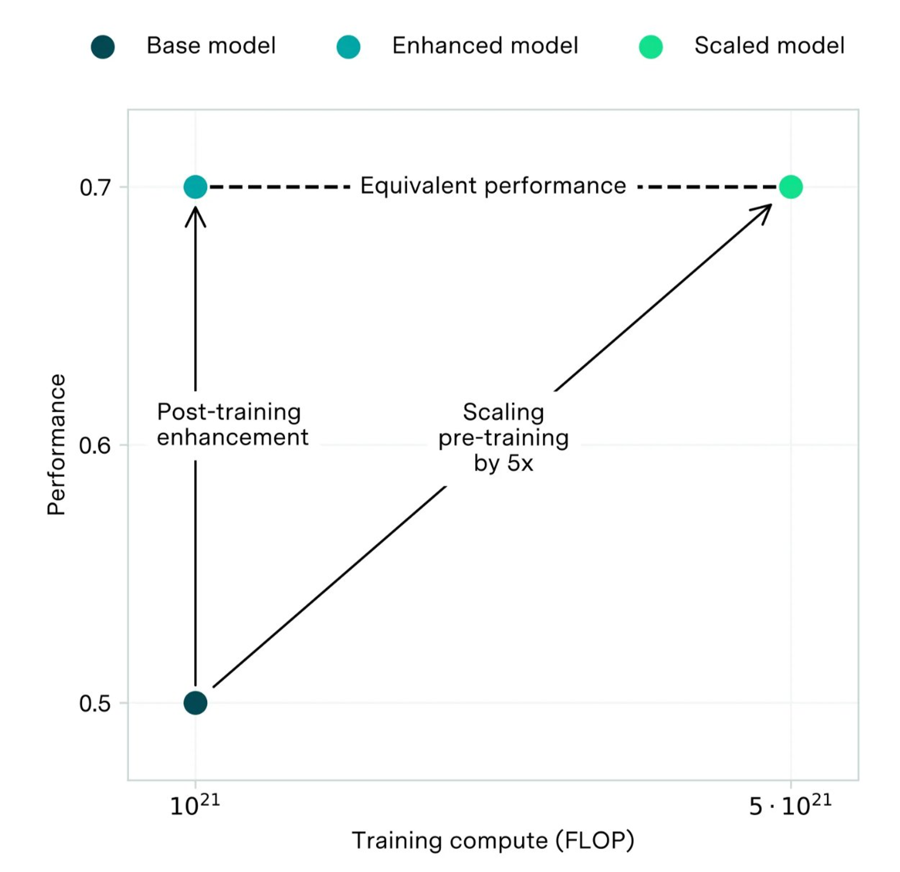
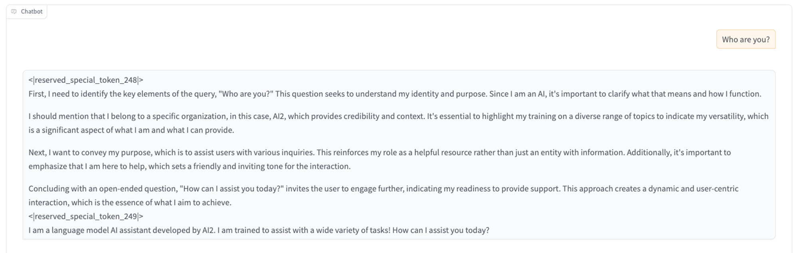
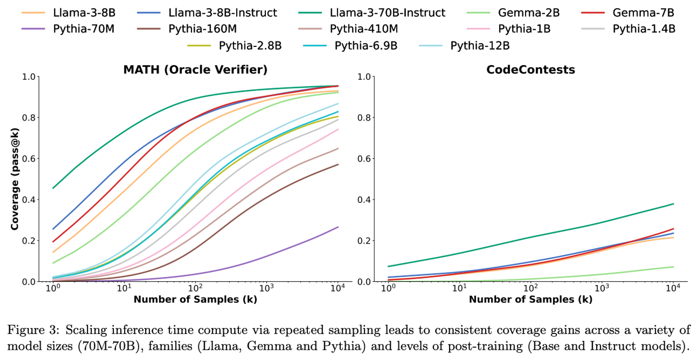

Language model generation is a naive form of search. It is sampling from a distribution of potential tokens in order to select the next output. There are many ways we can spend more compute to better refine this distribution, most of which are not being taken seriously enough.

Inference spend per token represents a standalone scaling law independent of underlying model size. Inference spend has been demonstrated to more clearly improve capabilities than any fancy fine-tuning.

Many of of the most important moments in the history of AI have come from inference-heavy algorithms. AlphaGo solved Go much like DeepBlue won at Chess. To simplify some things, they scaled up compute when searching over a reasonable representation of the world.

We should have basic rules of thumb for each model version about how much more inference time compute it takes to match the performance of the next base model version. For only 10 times the inference budget, can GPT 3.5 match GPT 4? [Epoch AI has an illustration](https://epochai.org/blog/ai-capabilities-can-be-significantly-improved-without-expensive-retraining) like this for post-training, showing how improvements in post-training since ChatGPT can be comparable to improvements in scaling pretraining. Where does inference fit in?

This makes architectural changes like GPT-4o make way more sense --- on a fixed inference budget, GPT-4o definitely outperforms GPT-4. GPT-4o has a tokenizer improvement that makes it cover more text with fewer tokens (a bigger vocabulary), effectively lowering cost. The user in most modern use cases of AI, is just not exposed to these costs or given the opportunity to shift them. What if you could lower your usage limit on ChatGPT or Claude, in exchange for every answer being a higher quality? This seems like a great paid feature to me.

For a thought experiment, what if any of the model providers decided to pay the small price of running a best-of-N sampling or Monte Carlo Tree Search version of their model in ChatBotArena? How many Elo points would a 2x spend on inference compute to? While not targeting ChatBotArena, OpenAI's Strawberry (and Q\* before it) are methods designed to leverage this.

### OpenAI's Strawberry

A lot has been said on OpenAI's new Strawberry "method" which results in their new model "Orion" without including anything substantive. Strawberry is slowly transforming from a rumor to a prototype. The long-rumored product, model, or system has been reported to have "advanced reasoning" abilities. Most recently, [The Information reported on its most recent demo](https://www.theinformation.com/articles/openai-races-to-launch-strawberry-reasoning-ai-to-boost-chatbot-business):

> **As OpenAI looks** to raise more capital, its researchers are trying to launch a new artificial intelligence product they believe can reason through tough problems much better than its existing AI.
>
> Researchers have aimed to launch the new AI, code-named Strawberry (previously called Q\*, pronounced Q Star), as part of a chatbot---possibly within ChatGPT---as soon as this fall, said two people who have been involved in the effort. Strawberry can solve math problems it hasn\'t seen before---something today's chatbots cannot reliably do---and also has been trained to solve problems involving programming. But it's not limited to answering technical questions.

The Information is far from the only outlet to report something similar to this --- it was [originally reported by Reuters](https://www.reuters.com/technology/artificial-intelligence/openai-working-new-reasoning-technology-under-code-name-strawberry-2024-07-12/). We are continuing to get more examples on what Strawberry is like to interact with. From The Information:

> When given additional time to "think," the Strawberry model can also answer customers' questions about more subjective topics, such as product marketing strategies. To demonstrate Strawberry's prowess with language-related tasks, OpenAI employees have shown their co-workers how Strawberry can, for example, solve New York Times Connections, a complex word puzzle.

The information also reported that "[Strawberry is used to develop Orion](https://www.theinformation.com/articles/openai-shows-strawberry-ai-to-the-feds-and-uses-it-to-develop-orion)," a new model from OpenAI. While we don't know much about any of Q\*, Strawberry, and Orion, there is an [Occam's Razor](https://en.wikipedia.org/wiki/Occam%27s_razor) explanation. Strawberry is a rebrand of Q\* because the hype got too high, and codenames are now needed to keep things secret inside OpenAI, and then Orion is a model trained on the outputs of Strawberry.

Given that [Q\* is likely to be a search-heavy generation and/or post-training process](https://www.interconnects.ai/p/q-star), it makes sense that it alone is unlikely to be served as a product to the masses, at least not yet. Q\*-branded approaches allow better exploration of complex reasoning stacks, and hopefully training on them. In order to package this into something it can afford, OpenAI likely trained on the outputs to make a more efficient model, Orion.

All of Q\*, Strawberry, and Orion are built on the same GPT-4 or GPT-4o infrastructure that OpenAI has been leveraging for years. As the stack became stable and cheaper, more innovation in methods and deployments can be considered. It's all right in line with the trend that labs are getting more mileage out of post-training improvements in 2024 than anything else as they build large amounts of physical infrastructure to prepare for the next scale of models (GPT-5, Claude Opus+, etc.).

### Self-talk in language models

The defining feature of Strawberry (and Q\*) from the reports linked above is that the models have a behavior where they "**appear to talk to themselves**." Self-talk behavior in language models is already a tool used by many to get the model to spend a little more on inference and get a better downstream result.

The naive implementation of spending more on inference is through prompting. Productionized models are already generating tokens, so the model can "think," before generating text that is piped to the user. Claude has a variety of "I'm thinking" or "Thinking deeply" texts that can show up before first token (some people have seen more details of how this works [via glitches in the UX](https://www.reddit.com/r/ChatGPT/comments/1dx6025/claude_has_a_moral_crisis_when_jailbreak_leaks/)). Sorry for the mediocre screenshot.

One of my collaborators at Ai2 (thanks [Jacob](https://jacobmorrison.com/)) has implemented a crude demo version of this just by modifying the chat template to tell the model to think before answering the user (and some minor fine-tuning). This simple change boosts math and reasoning vibes-tests.

There are even user side implementations of this. Simply replying "[make it better](https://x.com/natolambert/status/1804223528881000726)" to a text output from a language model (e.g. if they made a demo), is a simple way to spend more compute linearly. Both this and the hidden tokens likely won't transform performance because they're not adding in more information to the search space than token probabilities.

These simple implementations come very nicely as model serving gets cheaper. Model are APIs getting extremely cheap. This applies to both open and closed models. See the summary of the situation from Swyx's [AI News](https://buttondown.com/ainews/archive/ainews-too-cheap-to-meter-ai-prices-cut-50-70-in/):

> A simple list of **all the price cuts in the last 30 days in AI** (measured in \"mtok\" aka \"per million tokens\" - the bulk of the cost is usually input), by LMsys Elo/Rank:
>
> -   **Elo 1286 Rank 2**: [GPT-4o cut \~50%](https://buttondown.com/ainews/archive/ainews-gpt4o-august-100-structured-outputs-for/?utm_source=ainews&utm_medium=email&utm_campaign=ainews-too-cheap-to-meter-ai-prices-cut-50-70-in) from May to Aug (**\$2.50/mtok**)
>
> -   **Elo 1277 Rank 3**: [GPT-4o mini](https://buttondown.com/ainews/archive/ainews-lskjd/?utm_source=ainews&utm_medium=email&utm_campaign=ainews-too-cheap-to-meter-ai-prices-cut-50-70-in) effectively **cut prices between 70-98.5%** depending if you compare with GPT3.5T or GPT4T (**\$0.15/mtok**)
>
> -   **Elo 1264 Rank 4**: [Llama 3.1 405b](https://buttondown.email/ainews/archive/ainews-llama-31-the-synthetic-data-model/) was initially offered at \$5/15 by Together AI - within 48 hours this was [cut 46% to \$2.7/mtok](https://x.com/openrouterai/status/1816234833896694270?s=46&utm_source=ainews&utm_medium=email&utm_campaign=ainews-too-cheap-to-meter-ai-prices-cut-50-70-in) by DeepInfra with [Lepton not far behind](https://x.com/jiayq/status/1816246934925107393?s=46&utm_source=ainews&utm_medium=email&utm_campaign=ainews-too-cheap-to-meter-ai-prices-cut-50-70-in) (**\$2.7/mtok**)
>
> -   **Elo 1249 Rank 8**: [Mistral Large 2](https://buttondown.email/ainews/archive/ainews-mistral-large-2/) cut prices vs [Feb\'s Large v1](https://x.com/gblazex/status/1762127672673468566?utm_source=ainews&utm_medium=email&utm_campaign=ainews-too-cheap-to-meter-ai-prices-cut-50-70-in) by 62% (**\$3/mtok**)
>
> -   **Elo 1228 Rank 17**: [Gemini 1.5 Flash cut \~70%](https://x.com/OfficialLoganK/status/1821601298195878323?utm_source=ainews&utm_medium=email&utm_campaign=ainews-too-cheap-to-meter-ai-prices-cut-50-70-in) - on top of their existing [1 million tokens per minute free tier](https://reddit.com//r/LocalLLaMA/comments/1em9545/best_summarizing_llms_for_average_pcs/?utm_source=ainews&utm_medium=email&utm_campaign=ainews-too-cheap-to-meter-ai-prices-cut-50-70-in) (**\$0.075/mtok**)
>
> -   **Elo 1213 Rank 17**: [Deepseek v2 beats Gemini to a GA release of context caching](https://x.com/rohanpaul_ai/status/1820833952149487898?utm_source=ainews&utm_medium=email&utm_campaign=ainews-too-cheap-to-meter-ai-prices-cut-50-70-in), reducing cache hit input token price by a maximum 90% (**\$0.014/mtok** (not a typo)). This is after their [original \$0.14/mtok pricing which may have set off the price war in the last month](https://x.com/EMostaque/status/1813991810823340521?utm_source=ainews&utm_medium=email&utm_campaign=ainews-too-cheap-to-meter-ai-prices-cut-50-70-in)

**What makes Strawberry seem different is the ability to trigger self-talk reasoning steps multiple times throughout a response displayed to the user**. Talking to people who have seen outputs from Q\*, the behavior is described as the model "talking to itself."

This links closely to the leaks when Q\* first came out that it was some sort of self-play for language models. The boundary between self-talk and self-play for nearly identical language models in negligible. The only difference is how the models are prompted. For dual-model self-talk, the models are pinned "against" eachother in a ChatGPT like interface. For a single-model to do self-talk, all it needs is a system prompt, and maybe special tokens, that tell the model to respond to the previous step in the chain. I had a recent research project, [Self-Directed Synthetic Dialogues](https://arxiv.org/abs/2407.18421), that showed this was possible even with somewhat outdated open-weight language models.

Where OpenAI could be doing something differently is by enabling this in general answers. Strawberry at its best would be a model that generates a special token that tells it to "reflect on its recent reasoning steps" while trying to accomplish a multi-turn, challenging reasoning problem. This is ideologically similar to a "[backspace token](https://arxiv.org/abs/2306.05426)," but solving a bigger problem in language models --- how to get back onto a correct reasoning solution after an incorrect forward step was made. Getting this sort of wild research idea to work at scale fits right in line with OpenAI's biggest advantage in the last few years.

A method to reliably train this type of reasoning is far from clear-cut. I would guess human seed examples plus some sort of RL with a verifier (e.g. reward model), as we have seen for most post-training behaviors.

### Inference scaling laws

"We need to spend more on inference" is a mantra that's been front of mind for some time. The simple idea that we can build upon for how more inference spend translates to performance is [best of N sampling](https://rlhfbook.com/c/rejection-sampling.html#related-best-of-n-sampling). The idea is to sample more than one completion and then use another model, usch as a reward model used in RLHF, to choose the best response. These method has been heavily involved with RLHF research since the beginning. Some of OpenAI's papers use it as the only method to leverage a reward model for downstream performance, such as *[Let's Verify Step by Step](https://arxiv.org/abs/2305.20050)* or [WebGPT](https://arxiv.org/abs/2112.09332), instead of doing a full RLHF pipeline. There are far more derivative and related methods to best of N sampling than I can include in this post.

I've wanted to write this post for months. In that time, we've gotten a large uptick in research output in inference-time optimization. We're still early.

Some other papers to note here:

1.  *[Scaling LLM Test-Time Compute Optimally can be More Effective than Scaling Model Parameters](https://arxiv.org/abs/2408.03314),*

2.  *[An Empirical Analysis of Compute-Optimal Inference for Problem-Solving with Language Models](https://arxiv.org/abs/2408.00724),*

3.  *[Are More LLM Calls All You Need? Towards Scaling Laws of Compound Inference Systems](https://arxiv.org/abs/2403.02419),* and

4.  *[Large Language Monkeys: Scaling Inference Compute with Repeated Sampling](https://arxiv.org/abs/2407.21787).*

I wanted to highlight a result from the last paper, Large Language Monkeys, as to why inference time compute is feasible. That paper focuses on repeated sampling from a variety of language models to understand the distribution of answers in a model. They show that with an Oracle answer extractor (more on this later), even models as surprising as Pythia-70M have the true answer inside.

Remember, the domain of math answers is infinite. This shows that underlying distribution of the models has the right answer, we need to figure out how to extract the right ones. We need strong verifiers to make answer selection easy. The Snell et al. paper above (1.) calls this the "Proposer and Verifier" perspective.

Today we draw inference scaling laws assuming single pass per token (a recent change as llm applications emerge, called "overtraining"). This could change again if it turns out it's easier to get intelligence at inference time than by scaling pre training compute. The continued evolution of "scaling laws" is inevitable as we understand how to maximize models with test time compute.

Inference-time compute is one of the under-explored areas of research I recommend many people to start on if they're feeling crowded out in the language models space. If you're looking to work on this, some resources to be aware of are the following:

-   We used a bunch of [value models](https://huggingface.co/allenai/tulu-v2.5-ppo-13b-uf-mean-70b-uf-rm-mixed-prompts-value) with our [Tulu 2.5 paper](https://arxiv.org/abs/2406.09279) comparing PPO to DPO. These are the output of learning a value function for RL updates, but they can be used at inference time to search over tokens.

-   Similar to how Direct Preference Optimization revealed that alignment researcher's don't explicitly need to train a reward model, some of the same authors showed that the [log probabilities outputted by a language model can be used as a value function](https://arxiv.org/abs/2404.12358).

Inference time compute is going to be a close peer to the science of AI agents, which is another topic I'm hoping to learn and write more about come 2025. As the AI economic cycle runs its course, eventually inference will be viewed as free (for now, [inference compute only drives 40% of Nvidia's sales](https://x.com/youjiacheng/status/1829021962489999393?s=46) --- we have a long way to go). When that is the case, it will be impossible to ignore different configurations of inference than single-token streams.

------------------------------------------------------------------------

**Housekeeping**

-   Audio of this post is available (soon) in [podcast](https://podcast.interconnects.ai/) form (and sometimes on [YouTube](https://www.youtube.com/@interconnects)).

-   My real podcast is at [retortai.com](http://retortai.com).

-   *Paid subscriber Discord access in email footer.*

-   Referrals → paid sub: Use the [Interconnects Leaderboard](https://www.interconnects.ai/leaderboard).

-   Student discounts in [About page](https://www.interconnects.ai/about).
