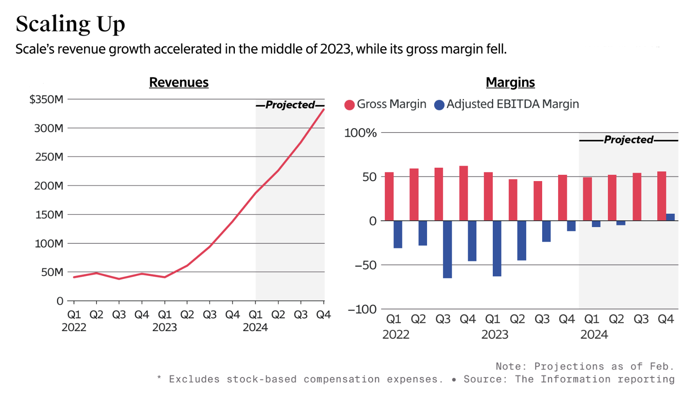
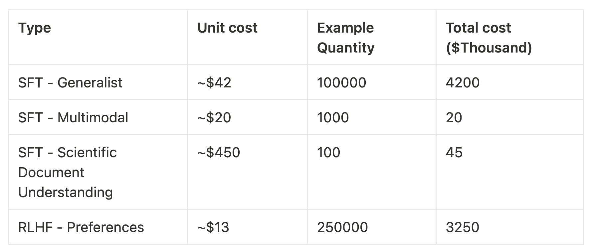
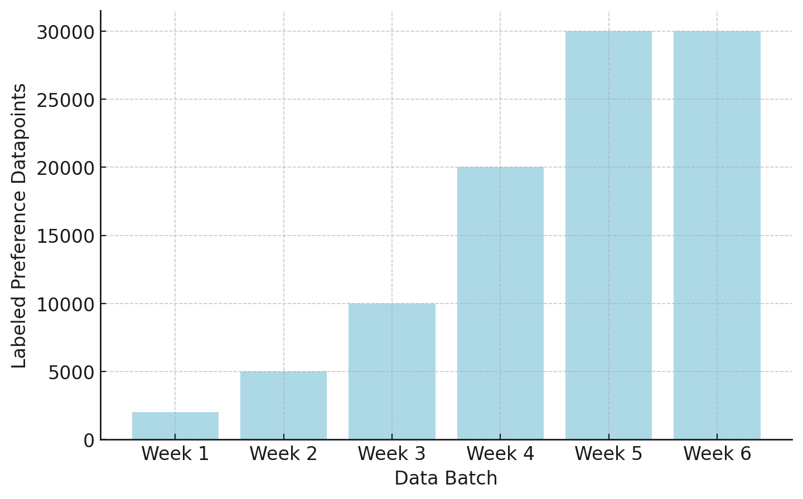

Scale AI's business of selling human data to foundation model labs for fine-tuning is balancing two factors:

1.  **[RLHF](https://en.wikipedia.org/wiki/Reinforcement_learning_from_human_feedback)'s scale is increasing**. More labs are trying to train language models and those who are are using RLHF to a larger extent.

2.  **Synthetic data is becoming more popular in RLHF training**. As language models get better, humans play a smaller role in the training process.

[Llama 3's recipe](https://www.interconnects.ai/p/frontier-model-post-training) is one example of both of these trends. From any basic business analysis, it seems like the latter would eat the former, but we don't know when. It is much easier to fine-tune models today because there are other models as starting points. This will only compound the advantage of synthetic data.

Eventually, state-of-the-art RLHF methods that are locked behind closed doors today will be replicated in open source. Beyond Scale AI there are so many data foundry businesses. No need to give them free marketing here, given they largely feel undifferentiated in my experience, but many reach out on a regular basis.

When [raising their series F round](https://scale.com/blog/scale-ai-series-f), Scale AI marketed itself as the "Data Foundry for AI" next to Nvidia/TSMC's role on the hardware side. They are arguing that sourcing data is as important as compute for the future of AI. For more on this perspective, Ben Thompson interviewed Alex Wang, the CEO, on their strategy ([paywalled](https://stratechery.com/2024/an-interview-with-scale-ai-ceo-alex-wang-about-the-data-pillar-for-ai/)). This clever marketing largely dodges the fact that most data used to train AI is acquired for free, even if by questionable means.

Around the time of Scale's series F, [The Information released some internal financials](https://www.theinformation.com/articles/why-a-14-billion-startup-is-now-hiring-phds-to-train-ai-from-their-living-rooms?shared=168f685a864ca709) and details on operations. It certainly looks good for now.

An important line item for Scale and related companies is the proportion of data types provided to language model providers. Humans are involved in three major buckets: instructions, preferences, and evaluations. With Llama 3.1, it's clear that the instruction market is already shrinking for frontier model providers --- the best models are more reliable on all but the most niche topics than humans. Preference data and evaluation are still required.

This aligns with a post-training lead, Thomas Scialom, [saying he would spend "100%" of his data budget on preferences and RLHF](https://www.interconnects.ai/i/147349899/scaling-rlhf) rather than instructions. This is a huge departure from the expected wisdom just a year ago. This is a generalization that does not capture the list of tasks that human instructions are still crucial for --- adding capabilities in totally new and challenging domains.

Consider this quote from Scale AI that I have sourced and slightly modified to maintain anonymity. It shows the unit price per example. Basic instructions are fairly cheap, which is getting replaced, but a scientific report is extremely costly per example. There's some wiggle room in here as to whether the unit cost is an entire conversation or just one response, so I will collect more examples to build a better price model (please get in touch if you have information).

This is all extremely expensive and where the \$10 million-plus data acquisition costs for fine-tuning come to. My question is, [even given a ton of interest in competing with Scale AI from new startups in the data space](https://www.interconnects.ai/p/alignment-as-a-service?utm_source=publication-search), where is the long-term growth story? To better understand the cases for and against, I will first recap the intense process of procuring data from one of these vendors. There are many, many details to keep track of.

### What it is like to work with data vendors

Getting the most out of human data involves iterative training of models, evolving and highly detailed data instructions, translating through data foundry businesses, and other challenges that add up. The process is difficult for new organizations trying to add human data to their pipelines. Given the sensitivity, processes that work and improve the models are extracted until the performance runs out.

The first step is sourcing. Much like acquiring access to cutting-edge Nvidia GPUs, getting access to data providers is also a who-you-know game. If you have credibility in the AI ecosystem, the best data companies will want you on our books for public image and long-term growth options. Discounts are often also given on the first batches of data to get training teams hooked.

If you're a new entrant in the space, you may have a hard time getting the data you need quickly. Getting the tail of interested buying parties that Scale AI had to turn away is an option for the new data startups. It's likely their primary playbook to bootstrap revenue.

On multiple occasions, I've heard of data companies not delivering their data contracted to them without threatening legal or financial action. Others have listed companies I work with as customers for PR even though we never worked with them, saying they "didn't know how that happened" when reaching out. There are plenty of potential bureaucratic or administrative snags through the process. For example, the default terms on the contracts often prohibit the open sourcing of artifacts after acquisition in some fine print.

Once a contract is settled the data buyer and data provider agree upon instructions for the task(s) purchased. There are intricate documents with extensive details, corner cases, and priorities for the data. A popular example of data instructions is the one that OpenAI [released for InstructGPT](https://docs.google.com/document/d/1MJCqDNjzD04UbcnVZ-LmeXJ04-TKEICDAepXyMCBUb8/edit#heading=h.21o5xkowgmpj).

Depending on the domains of interest in the data, timelines for when the data can be labeled or curated vary. High-demand areas like mathematical reasoning or coding must be locked into a schedule weeks out. Simple delays of data collection don't always work --- Scale AI et al. are managing their workforces like AI research labs manage the compute-intensive jobs on their clusters.

Once everything is agreed upon, the actual collection process is a high-stakes time for post-training teams. All the infrastructure, evaluation tools, and plans for how to use the data and make downstream decisions must be in place.

The data is delivered in weekly batches with more data coming later in the contract. For example, when we bought preference data for on-policy models we were training at HuggingFace, we had a 6 week delivery period. The first weeks were for further calibration and the later weeks were when we hoped to most improve our model.

The *goal* is that by week 4 or 5 we can see the data improving our model. This is something some frontier models have mentioned, such as the [14 stages in the Llama 2 data collection](https://www.interconnects.ai/i/135162926/reward-modeling), but it doesn't always go well. At HuggingFace, trying to do this for the first time with human preferences, we didn't have the RLHF preparedness to get meaningful bumps on our evaluations. The last weeks came and we were forced to continue to collect preference data generating from endpoints we weren't confident in.[1](#footnote-1){#footnote-anchor-1 .footnote-anchor component-name="FootnoteAnchorToDOM" target="_self"}

After the data is all in, there is plenty of time for learning and improving the model. Data acquisition through these vendors works best when viewed as an ongoing process of achieving a set goal. It requires iterative experimentation, high effort, and focus. It's likely that millions of the dollars spent on these datasets are "wasted" and not used in the final models, but that is just the cost of doing business. Not many organizations have the bandwidth and expertise to make full use of human data of this style.

This experience, especially relative to the simplicity of synthetic data, makes me wonder how well these companies will be doing in the next decade.

------------------------------------------------------------------------

## Data foundries: Risks

**Synthetic data (and model capabilities)**

Many industry leaders are documenting how completions for language models are better than humans for most easy instruction-following tasks. [Frontiers in synthetic data](https://www.interconnects.ai/p/frontiers-in-synthetic-data) will enable humans to be removed from more tasks.

Due to financial barriers to entry, the academic community is extensively studying how to use language models to replace humans for labeling preference data due to its speed and cost-effectiveness. Labeling preferences, evaluating model outputs, and everything included under LLM-as-a-Judge went from barely functional to stable with the change from GPT-3.5 to GPT-4. As we move to the next generation of model capabilities, it seems likely that models will get increasingly capable of reasoning about their own outputs.

If companies can buy more GPUs instead of paying for data, they will do that.

**Market consolidation**

While the data annotation companies claim to not re-use data across multiple contracts, they're the biggest beneficiary (along with Nvidia) of so many independent players existing in the training space. How do cost structures adjust when demand plummets? Data contracts from these organizations can be like GPU allocations --- the better the reputation your company is, the more likely it is that you can get a data contract. These dynamics drive prices higher, in an area with already small margins, human labor.

**Bringing annotators in-house**

As companies invest more in training AI models and realize their frontier model teams are a large part of their long-term roadmap, there will be pressures to bring annotators in-house to save money and increase control. Google, for example, is already doing this, which is not a surprise (but they'll be [worried about more articles like this](https://www.theverge.com/2023/11/7/23950392/google-contractors-accenture-obscene-bard-prompts-unionizing), given the regulatory environment). This will be the trade-off we have seen many times throughout the technology industry --- whether or not to build from scratch or to integrate outside vendors. The benefits of bringing data in-house are smaller than the deep integration benefits of building your own microprocessors, but there are still benefits that can be found.

**Waning data quality through AI slop**

It is increasingly hard to guarantee that data obtained from a data vendor is not already partially or fully coming from a language model. With this uncertainty, some may turn to just using the language model in the first place --- for both effectiveness and legal reasons.

**Potential chip abundance via market correction**

In the event of a market correction, data foundries are increasingly exposed because synthetic data will get even cheaper with abundant, idle GPUs. These organizations seem tied to Nvidia's fate when the bubble pops a bit, but they don't have nearly the same margins to protect their long-term business.

## Data foundries: Growth vectors

**Scaling RLHF is in its early days**

RLHF has been touted as the leading contributor to model improvements since the original launches of Claude 3, Gemini, and GPT-4. We have no indications that this is slowing down. Post-training teams are [spending](https://www.interconnects.ai/p/frontier-model-post-training) *[heavily](https://www.interconnects.ai/p/frontier-model-post-training)* [on synthetic data for techniques like rejection sampling](https://www.interconnects.ai/p/frontier-model-post-training) or [self-talk (A.K.A. Strawberry)](https://www.interconnects.ai/p/openai-strawberry-and-inference-scaling-laws). Compared to GPU costs, human data could still be viewed as a cheap bottom-line item. Until RLHF data is remotely on the same price scale as pretraining compute, it may be the case that it is worth it for the labs to spend. This only will last so long as the bubble is still *accelerating*.

**Human preference data is special (and getting more expensive)**

In the case where access to the humans labeling data is the bottleneck, Scale AI is positioned to win. The drive for more specialized data is forcing them to hire more labelers in the U.S. and other Western nations, which helps mitigate their reputational challenges with large portions of their workforce being abroad in poor working conditions. As demand grows, aggregating this supply would allow Scale AI to raise margins. In reality, the contractors cannot be locked in, more of the revenue would trickle down to them rather than margins growing to Nvidia's 50-plus percent.

**Challenging tasks drive price increases**

By aggregating experts and the data increasingly moving to more challenging domains the data foundries could increase their prices and eventually margins. So long as there is an expanding suite of tasks that human experts can do reliably, but language models can only attempt, frontier model labs will be turning to data foundries to enable a continuation of their training pipelines. Access to this type of niche data will also stop companies from bringing their data sourcing in-house.

------------------------------------------------------------------------

## Realistic expectations

Scale AI itself shows similar signs of frothiness to the rest of the AI ecosystem. [From The Information again](https://www.theinformation.com/articles/why-a-14-billion-startup-is-now-hiring-phds-to-train-ai-from-their-living-rooms):

> The company has tried to create some camaraderie among its temporary workforce by flying contractors to writing workshops of sorts for AI companies. It flew dozens of top Scale contractors to Austin, Texas, and Jacksonville, Fla., for dayslong sessions of rating responses and writing essays based on questions made to the AI systems. One contractor who went to the Austin retreat said about 50 Scale contractors worked on a project they learned was for Alphabet's Bard chatbot. They reviewed the responses each person wrote for different prompts, and sang karaoke together at night.

Scale AI, and other providers like Surge AI, are running multi-tier organizations. They're operating subsidiaries that handle data collection, such as Scale's subsidiary for language, [outlier.ai](http://outlier.ai), Scale's subsidiary for vision, [remotasks](https://www.remotasks.com/en), Surge's subsidiary [dataannotation](https://www.dataannotation.tech/), and others.

[Labelbox's](https://labelbox.com/services/labeling/) tool [Alignerr](https://www.alignerr.com/) makes it clear they're operating it. I've had experience working with [Prolific](https://prolific.com/) (at Ai2) and [Toloka AI](https://toloka.ai/) (at Huggingface), neither of which I knew of subsidiaries for. Others exist too.

No one is sure that building the data for AI can be separated from the core task of training the models. In the meantime, we'll see these businesses mature and converge to known quantities. To the extent that the workflows are separated, the data could potentially be further specialized. In order to capitalize on huge potential markets, data annotation companies need to have less in common with product marketing companies with many subsidiaries to protect their intentions and true roles.

Many mirrors of Scale AI's business model are emerging because everyone in AI knows that data is important and revenue is flowing to curate new pieces of training data. In the near term, it will be clear that the best-case outcomes for data foundries are similar to the likes of Uber and Airbnb in valuation --- not like Apple, Google, Facebook, or Meta --- they're aggregating another physical product or service. They are not building it from scratch themselves.

------------------------------------------------------------------------

**Housekeeping**

-   Audio of this post is available (soon) in [podcast](https://podcast.interconnects.ai/) form (and sometimes on [YouTube](https://www.youtube.com/@interconnects)).

-   My real podcast is at [retortai.com](http://retortai.com).

-   *Paid subscriber Discord access in email footer.*

-   Referrals → paid sub: Use the [Interconnects Leaderboard](https://www.interconnects.ai/leaderboard).

-   Student discounts in [About page](https://www.interconnects.ai/about).

:::: {.footnote component-name="FootnoteToDOM"}
[1](#footnote-anchor-1){#footnote-1 .footnote-number contenteditable="false" target="_self"}

::: footnote-content
The instruction data was fine, it became [No Robots](https://huggingface.co/datasets/HuggingFaceH4/no_robots).
:::
::::
